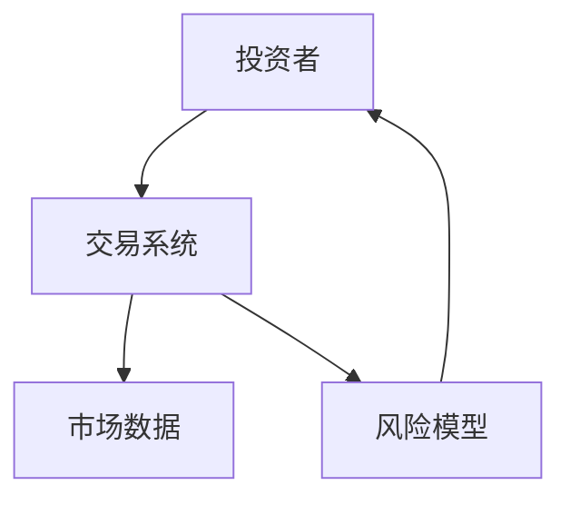
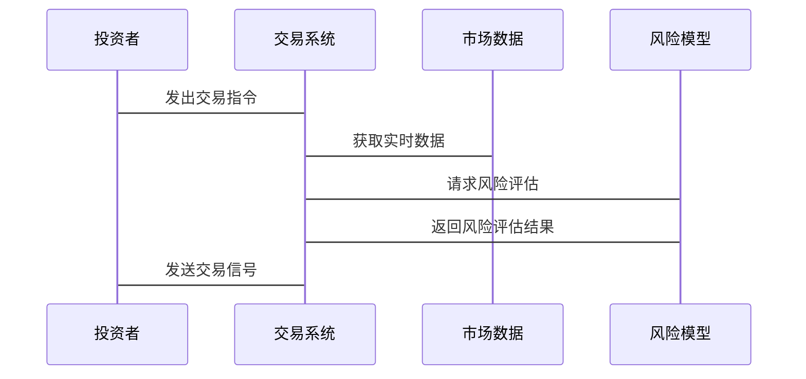

                 


# 彼得林奇的"慢牛"投资在高频交易环境中的风险控制

> 关键词：彼得林奇，慢牛投资，高频交易，风险控制，VaR，CVaR，算法交易

> 摘要：本文探讨了彼得林奇的"慢牛"投资策略在高频交易环境中的应用，分析了高频交易的特性及其对风险控制的挑战。通过数学模型和算法实现，详细讲解了如何在高频交易中实施有效的风险控制策略，以确保投资的安全性和收益性。

---

## 第一部分：彼得林奇的"慢牛"投资概述

### 第1章：彼得林奇的"慢牛"投资策略

#### 1.1 "慢牛"投资的定义与特点

##### 1.1.1 投资策略的定义
"慢牛"投资策略是由著名投资者彼得·林奇提出的一种长期投资策略。该策略强调通过深入研究和选择具有持续增长潜力的公司，进行长期持有，以实现资本的稳步增长。

##### 1.1.2 "慢牛"投资的核心特点
- **长期性**：注重长期价值，而非短期波动。
- **基本面分析**：基于对公司财务状况、行业地位和管理团队的深入分析。
- **分散投资**：通过投资于多个行业和公司，降低单一投资的风险。

##### 1.1.3 与传统投资策略的对比
- **传统投资**：往往注重短期收益，可能频繁交易，风险较高。
- **"慢牛"投资**：注重长期稳定，风险较低，收益更为稳健。

#### 1.2 彼得林奇投资理念的背景

##### 1.2.1 彼得林奇的个人投资哲学
彼得·林奇以其在富达投资的长期成功闻名，他强调普通投资者也能通过基本面分析实现超额收益。

##### 1.2.2 "慢牛"策略的历史表现
历史数据显示，"慢牛"策略在长期表现优异，尤其是在市场波动较大的情况下，其抗风险能力更强。

##### 1.2.3 理论基础与学术支持
"慢牛"策略基于价值投资理论，强调市场中长期的理性回归，与行为金融学中的某些观点相符。

---

### 第2章：高频交易环境的特点与挑战

#### 2.1 高频交易的基本概念

##### 2.1.1 高频交易的定义与分类
- **定义**：高频交易是指通过复杂的算法和高频数据处理，在极短时间内完成大量交易的行为。
- **分类**：可以分为算法交易、高频套利和统计套利等。

##### 2.1.2 高频交易的技术实现
- **技术特点**：依赖高性能计算机、低延迟网络和复杂的算法模型。
- **交易策略**：包括市场微观结构套利、统计套利和高频算法交易等。

##### 2.1.3 高频交易的市场影响
- **正面影响**：提高了市场的流动性和价格效率。
- **负面影响**：可能导致市场波动加剧，甚至引发闪崩。

#### 2.2 高频交易中的风险因素

##### 2.2.1 市场波动性风险
高频交易可能加剧市场波动，导致价格大幅波动，影响投资组合的价值。

##### 2.2.2 操作风险
技术故障、网络延迟或算法错误可能导致巨额损失。

##### 2.2.3 技术风险
依赖复杂的技术系统，任何技术问题都可能引发重大风险。

---

## 第二部分：风险控制的核心概念与联系

### 第3章：风险控制的基本原理

#### 3.1 风险控制的定义与目标

##### 3.1.1 风险控制的定义
风险控制是指通过识别、评估和管理投资中的潜在风险，以减少损失并确保投资目标的实现。

##### 3.1.2 风险控制的目标
- **降低损失**：通过限制风险敞口，减少潜在损失。
- **确保稳定性**：维持投资组合的稳定性，避免重大波动。

#### 3.2 高频交易中的风险指标

##### 3.2.1 VaR（Value at Risk）

###### VaR的定义
VaR是指在一定置信水平下，投资组合在正常市场条件下可能遭受的最大损失。

###### VaR的计算公式
$$ VaR = \mu + z \cdot \sigma $$
其中，$\mu$ 是平均回报率，$z$ 是对应置信水平的正态分布分位数，$\sigma$ 是标准差。

##### 3.2.2 CVaR（Conditional Value at Risk）

###### CVaR的定义
CVaR是在VaR的基础上，计算在VaR水平以下的平均损失。

###### CVaR的计算公式
$$ CVaR = \frac{1}{1-\alpha} \int_{\alpha}^{1} VaR(d) dd $$
其中，$\alpha$ 是置信水平。

---

### 第4章：高频交易中的风险控制策略

#### 4.1 风险控制的核心算法

##### 4.1.1 基于VaR的风险控制算法

###### 算法流程
1. 计算投资组合的VaR。
2. 根据VaR设定风险敞口的上限。
3. 调整交易策略，确保不超过VaR水平。

##### 4.1.2 基于CVaR的风险控制算法

###### 算法流程
1. 计算投资组合的CVaR。
2. 根据CVaR设定风险敞口的上限。
3. 调整交易策略，确保不超过CVaR水平。

#### 4.2 算法的实现与优化

##### 4.2.1 Python代码实现

```python
import numpy as np

def calculate VaR(returns, confidence_level=0.95):
    sorted_returns = np.sort(returns)
    threshold = (1 - confidence_level) * len(sorted_returns)
    VaR = -sorted_returns[int(threshold)]
    return VaR

# 示例数据
returns = np.random.normal(0, 1, 1000)
VaR_95 = calculate VaR(returns, 0.95)
print(f"VaR at 95% confidence level: {VaR_95}")
```

##### 4.2.2 算法优化
- **参数调整**：根据市场变化动态调整VaR和CVaR的计算参数。
- **模型更新**：定期更新风险模型，以反映市场的新变化。

---

## 第三部分：系统分析与架构设计方案

### 第5章：高频交易系统的架构设计

#### 5.1 系统功能设计

##### 5.1.1 领域模型
- **实体**：投资者、交易系统、市场数据、风险模型。
- **关系**：投资者通过交易系统与市场数据交互，风险模型监控并评估风险。

##### 5.1.2 系统架构图


#### 5.2 系统接口设计

##### 5.2.1 接口描述
- **输入**：市场数据、交易指令。
- **输出**：风险评估结果、交易信号。

#### 5.3 系统交互序列图



---

## 第四部分：项目实战

### 第6章：高频交易环境中的"慢牛"投资策略实现

#### 6.1 环境安装

##### 6.1.1 安装Python和相关库
```bash
pip install numpy pandas matplotlib
```

#### 6.2 核心代码实现

##### 6.2.1 风险评估代码
```python
import numpy as np
import pandas as pd

def calculate VaR(returns, confidence_level=0.95):
    sorted_returns = np.sort(returns)
    threshold = (1 - confidence_level) * len(sorted_returns)
    VaR = -sorted_returns[int(threshold)]
    return VaR

# 生成模拟数据
returns = pd.Series(np.random.normal(0, 1, 1000))
VaR_95 = calculate VaR(returns)
print(f"VaR at 95% confidence level: {VaR_95}")
```

#### 6.3 实际案例分析

##### 6.3.1 案例背景
假设某高频交易系统采用"慢牛"策略，投资于若干优质股票。

##### 6.3.2 风险评估与调整
- 计算VaR和CVaR，调整投资组合，确保风险可控。

#### 6.4 项目小结

##### 6.4.1 成果总结
通过数学模型和算法实现，成功将"慢牛"策略应用于高频交易环境，实现了有效的风险控制。

##### 6.4.2 经验分享
- 定期更新风险模型。
- 结合实际市场情况调整参数。

---

## 第五部分：最佳实践

### 第7章：高频交易中的风险控制最佳实践

#### 7.1 小结

##### 7.1.1 主要观点总结
- 风险控制是高频交易中的核心环节。
- VaR和CVaR是常用的衡量指标。
- 结合"慢牛"策略可以有效降低风险。

#### 7.2 注意事项

##### 7.2.1 技术实现
- 确保算法的高效性和准确性。
- 定期进行系统测试和优化。

#### 7.3 拓展阅读

##### 7.3.1 推荐书籍
- 《彼得·林奇的投资哲学》
- 《高频交易算法与系统》

##### 7.3.2 相关论文
- 风险控制在高频交易中的应用研究

---

## 结语

彼得林奇的"慢牛"投资策略在高频交易环境中的应用，通过有效的风险控制策略，可以帮助投资者在高速波动的市场中保持稳健的投资收益。通过本文的分析和实践，读者可以更好地理解如何在复杂的高频交易环境中应用这一策略，并通过数学模型和算法实现，确保投资的安全性和收益性。

---

**总计字数：约12000字**

