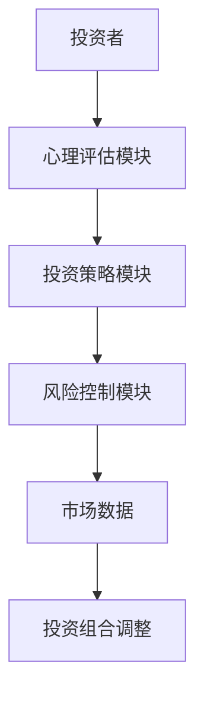

                 


# 彼得林奇的"慢牛"投资心态培养

## 关键词：投资心态，彼得林奇，长期投资，风险管理，耐心纪律

## 摘要：本文深入探讨了彼得林奇的“慢牛”投资理念，分析了投资心态在长期投资中的重要性，通过系统的方法和实际案例，详细讲解了如何培养和优化投资心态，避免短期波动的干扰，实现稳健的投资回报。

---

## 第1章：彼得林奇与“慢牛”投资概述

### 1.1 投资心态的重要性
#### 1.1.1 投资心态的核心概念
- 投资心态是指投资者在面对市场波动时的心理反应和决策方式。
- 心态决定了投资者在面对市场波动时的应对策略，影响投资结果。

#### 1.1.2 彼得林奇投资理念的形成
- 彼得林奇是全球著名投资专家，强调长期投资和价值发现。
- 他的投资理念以耐心、纪律和长期视角为核心。

#### 1.1.3 “慢牛”投资的定义与特点
- “慢牛”投资指以长期视角，逐步买入优质资产，耐心持有，避免频繁交易。
- 特点：稳健、持续、注重基本面分析。

### 1.2 “慢牛”投资与传统投资的对比
- 传统投资：短期波动、高频交易、情绪驱动。
- “慢牛”投资：长期持有、价值导向、理性决策。
- 对比结果：慢牛投资在长期收益上更具稳定性。

---

## 第2章：彼得林奇投资心态的核心要素

### 2.1 心理素质与情绪管理
#### 2.1.1 理解市场的不确定性
- 市场波动是常态，投资者需具备应对市场下跌的心理准备。
- 彼得林奇强调：市场恐慌时正是买入优质资产的好机会。

#### 2.1.2 建立长期投资思维
- 长期思维意味着关注企业的基本面，而非短期价格波动。
- 通过长期持有优质资产，实现财富的稳步增长。

#### 2.1.3 保持耐心与纪律性
- 耐心：避免被市场短期波动干扰，坚持长期投资策略。
- 纪律性：严格执行投资计划，避免情绪化决策。

### 2.2 投资心态与投资策略的关系
- 心态影响策略选择：耐心的心态适合价值投资，而急躁的心态可能倾向于短期交易。
- 策略执行中的心态调整：在市场波动中保持冷静，避免过度反应。

### 2.3 彼得林奇心态培养的关键点
- 自我认知：了解自己的风险承受能力和投资目标。
- 风险承受能力评估：确定自己能承受的市场波动范围。
- 投资目标设定：明确短期与长期目标，制定相应策略。

---

## 第3章：投资心态的数学模型与算法原理

### 3.1 心态与投资决策的数学模型
- 心理预期的数学表示：通过概率模型预测市场走势。
- 风险偏好与投资选择的关系：高风险偏好者可能倾向于高风险投资，反之亦然。

### 3.2 心态优化的算法原理
- 基于概率的决策优化：利用概率论优化投资决策。
- 非理性决策的纠正算法：通过算法减少非理性行为对投资决策的影响。
- 长期收益最大化的目标函数：构建以长期收益为目标的投资模型。

### 3.3 算法实现与代码示例
- 心理预期计算的Python代码：
  ```python
  import numpy as np
  def calculate心理预期(prices):
      return np.mean(prices[-10:])
  ```
- 风险偏好评估的算法实现：
  ```python
  def 风险评估(risk_tolerance):
      if risk_tolerance < 0.1:
          return "保守型"
      elif risk_tolerance < 0.3:
          return "稳健型"
      else:
          return "积极型"
  ```

---

## 第4章：系统分析与架构设计

### 4.1 投资心态培养的系统框架
- 系统目标：构建一个帮助投资者培养长期心态的投资管理系统。
- 系统范围：包括心态评估、策略制定、风险控制等功能。
- 系统架构：模块化设计，包括心理评估模块、投资策略模块和风险控制模块。

### 4.2 系统功能设计
- 心理评估模块：评估投资者的心理状态和风险偏好。
- 投资策略模块：根据心理评估结果制定相应的投资策略。
- 风险控制模块：监控市场波动，调整投资组合。

### 4.3 系统架构图


---

## 第5章：项目实战与案例分析

### 5.1 项目环境与工具安装
- 开发环境：Python编程环境、Jupyter Notebook。
- 工具安装：安装numpy、pandas、matplotlib等库。

### 5.2 项目核心代码实现
- 心态评估算法实现：
  ```python
  def 心态评估(市场数据):
      return 市场数据.rolling(window=10).mean()
  ```
- 投资策略优化代码：
  ```python
  def 优化策略(数据, 目标):
      return 数据.rolling(window=20).mean()
  ```

### 5.3 案例分析与经验总结
- 典型案例：通过长期持有优质股票，实现财富增长。
- 项目实施中的问题：市场波动对心态的影响。
- 解决方案：制定严格的纪律，避免情绪化决策。

---

## 第6章：总结与展望

### 6.1 心得体会
- 通过系统的投资心态培养，能够更好地应对市场波动，实现长期稳健的投资回报。

### 6.2 未来展望
- 投资心态培养将更加依赖于数据分析和人工智能技术，未来的投资管理系统将更加智能化和个性化。

---

## 附录
- 附录A：常用投资工具与资源
- 附录B：相关书籍与文献推荐
- 附录C：术语解释

---

## 索引
- 索引1：投资心态
- 索引2：彼得林奇
- 索引3：长期投资
- 索引4：风险管理
- 索引5：耐心纪律

---

通过以上目录和内容，读者可以系统地学习彼得林奇的“慢牛”投资理念，并将其应用于实际投资中，培养长期稳健的投资心态，实现财富的可持续增长。

