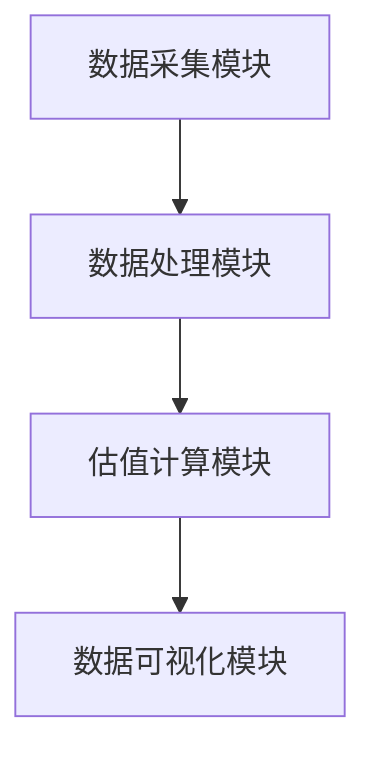

                 


# 彼得林奇的"成长型价值股"估值方法

> 关键词：彼得林奇，成长型价值股，估值方法，股票分析，投资策略

> 摘要：本文深入探讨了彼得林奇的成长型价值股估值方法，从定义、核心概念、算法原理到系统架构和项目实战，全面分析了这一方法在投资中的应用。通过详细讲解，帮助读者理解如何利用这一方法进行股票估值，做出明智的投资决策。

---

## 第一部分: 成长型价值股的定义与背景

### 第1章: 成长型价值股的定义与背景

#### 1.1 成长型价值股的定义
成长型价值股是指那些具有较高成长潜力，并且其内在价值低于市场价值的股票。彼得林奇在其投资策略中强调，成长型价值股不仅要有较高的成长性，还要具备一定的安全边际，即其市场价格低于其内在价值。

- **成长型股票**：这类股票通常具有较高的增长率，但市盈率可能较高。
- **价值股**：这类股票通常市盈率较低，被认为被市场低估。
- **成长型价值股**：结合了成长性和价值性的股票，既有较高的成长潜力，又具有一定的安全边际。

#### 1.2 彼得林奇的投资理念
彼得林奇是美国著名的投资经理人，以其在成长型价值股投资上的成功而闻名。他的投资理念主要包括以下几点：

- **长期投资**：彼得林奇主张长期持有优质股票，而不是频繁交易。
- **基本面分析**：他强调对公司的基本面进行深入分析，包括财务状况、行业地位、管理团队等。
- **安全边际**：他认为在投资时，应确保股票的市场价格低于其内在价值，以降低风险。

#### 1.3 成长型价值股的市场背景
成长型价值股的投资策略在不同市场环境下表现各异。在经济增长较快的时期，成长型股票往往表现较好；而在经济衰退时期，价值股可能更具吸引力。彼得林奇的成长型价值股策略在80年代和90年代初期表现尤为出色，尤其是在科技股和成长股盛行的时期。

---

## 第二部分: 成长型价值股估值方法的核心概念

### 第2章: 成长型价值股估值方法的核心概念

#### 2.1 估值方法的背景与目标
彼得林奇的估值方法旨在通过分析公司的基本面，估算其内在价值，并与市场价格进行比较，以判断是否为投资机会。其核心目标是找到那些市场价格低于内在价值的公司。

#### 2.2 成长型价值股的估值模型
彼得林奇的估值模型主要包括以下几个步骤：

1. **计算公司的内在价值**：通过分析公司的财务状况、成长潜力和行业地位，估算其内在价值。
2. **比较市场价格与内在价值**：如果市场价格低于内在价值，且公司具有较高的成长潜力，则该股票可能为成长型价值股。
3. **评估公司的竞争优势**：分析公司在行业中的竞争优势，以确保其成长潜力的可持续性。

#### 2.3 核心概念与联系
在彼得林奇的估值方法中，核心概念包括公司基本面、财务指标、行业地位、成长潜力和竞争优势。这些因素相互关联，共同决定了公司的内在价值。

---

## 第三部分: 成长型价值股估值方法的算法原理

### 第3章: 成长型价值股估值方法的算法原理

#### 3.1 基于市盈率的估值方法
市盈率（P/E）是衡量股票价值的重要指标之一。彼得林奇认为，市盈率可以用来评估股票的相对价值。一般来说，市盈率低于行业平均水平的股票可能具有较高的投资价值。

公式如下：
$$ P/E = \frac{股票价格}{每股收益} $$

#### 3.2 基于市净率的估值方法
市净率（P/B）是另一个常用的估值指标，尤其适用于金融和制造业公司。彼得林奇认为，市净率低于1的股票可能具有较高的投资价值。

公式如下：
$$ P/B = \frac{股票价格}{每股净资产} $$

#### 3.3 基于PEG的估值方法
PEG（Price/Earnings to Growth）是彼得林奇常用的一种估值指标，结合了市盈率和公司增长率。PEG值小于1的股票通常被认为是低估的。

公式如下：
$$ PEG = \frac{P/E}{净利润增长率} $$

---

## 第四部分: 成长型价值股估值方法的数学模型

### 第4章: 成长型价值股估值方法的数学模型

#### 4.1 基于PEG的数学模型
彼得林奇的PEG模型可以通过以下步骤进行计算：

1. 计算股票的市盈率（P/E）。
2. 计算公司的净利润增长率。
3. 将市盈率除以净利润增长率，得到PEG值。
4. 如果PEG值小于1，则该股票可能为成长型价值股。

公式如下：
$$ PEG = \frac{P/E}{\text{净利润增长率}} $$

#### 4.2 基于DCF的数学模型
 discounted cash flow (DCF) 模型是一种常用的估值方法，彼得林奇也常用此方法来估算公司的内在价值。

公式如下：
$$ V = \sum_{t=1}^{n} \frac{\text{自由现金流}}{(1 + r)^t} + \frac{\text{终值}}{(1 + r)^n} $$

其中，$r$ 是折现率，$n$ 是估计的年数。

---

## 第五部分: 成长型价值股估值方法的系统架构

### 第5章: 成长型价值股估值方法的系统架构

#### 5.1 系统功能设计
一个完整的成长型价值股估值系统应包括以下功能模块：

- 数据采集：获取公司的财务数据、行业信息等。
- 估值计算：基于上述算法，计算股票的内在价值。
- 数据可视化：将结果以图表形式展示，便于分析。

#### 5.2 系统架构设计
系统的架构设计如下：



---

## 第六部分: 成长型价值股估值方法的项目实战

### 第6章: 成长型价值股估值方法的项目实战

#### 6.1 环境安装
为了实现成长型价值股的估值系统，需要安装以下环境：

- Python 3.8+
- Pandas、NumPy、Matplotlib等Python库。

#### 6.2 核心代码实现
以下是一个基于PEG模型的Python代码示例：

```python
import pandas as pd

# 假设我们有一个包含股票数据的DataFrame df
df = pd.DataFrame({
    '股票代码': ['A', 'B', 'C'],
    '股票名称': ['股票A', '股票B', '股票C'],
    '市盈率': [15, 20, 18],
    '净利润增长率': [0.2, 0.15, 0.18]
})

# 计算PEG
df['PEG'] = df['市盈率'] / df['净利润增长率']

# 输出结果
print(df)
```

#### 6.3 代码解读与分析
上述代码首先读取股票数据，然后计算每个股票的PEG值。如果PEG值小于1，则该股票可能为成长型价值股。

#### 6.4 案例分析
以某科技公司为例，计算其PEG值：

- 市盈率：30
- 净利润增长率：0.2

PEG = 30 / 0.2 = 15

由于PEG值大于1，该股票可能不是成长型价值股。

---

## 第七部分: 成长型价值股估值方法的小结

### 第7章: 成长型价值股估值方法的小结

#### 7.1 总结
彼得林奇的成长型价值股估值方法通过结合公司基本面和市场估值，帮助投资者找到那些具有较高成长潜力且价格被低估的股票。这种方法在实践中得到了广泛的应用，并取得了显著的成果。

#### 7.2 最佳实践 tips
- 在使用PEG模型时，应结合其他估值指标进行综合分析。
- 定期更新公司的财务数据，以确保估值结果的准确性。

#### 7.3 拓展阅读
- 彼得林奇的《彼得林奇的投资之道》
- 其他成长股投资的经典书籍

---

通过本文的详细讲解，读者可以全面了解彼得林奇的成长型价值股估值方法，并能够在实际投资中加以应用。

