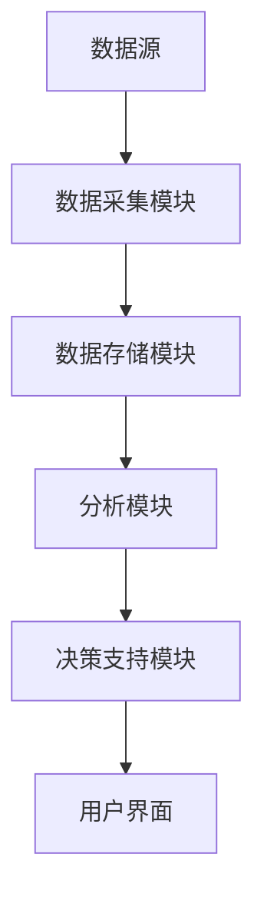
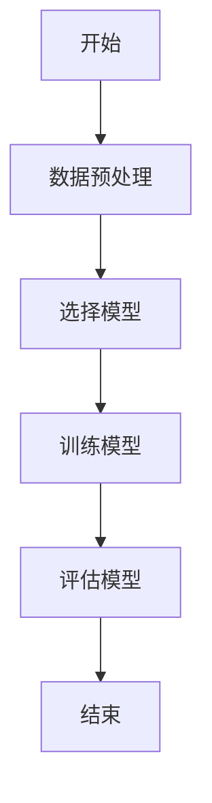

                 


# 彼得林奇的"成长型价值股"在不同经济周期的表现

## 关键词：彼得林奇，成长型价值股，经济周期，投资策略，股票分析

## 摘要：本文探讨了彼得林奇的成长型价值股投资理念在不同经济周期中的表现。通过分析经济周期对股市的影响，以及成长型价值股在各阶段的特征和策略，为投资者提供理论和实践指导。

---

## 第一部分：彼得林奇投资理念的背景与基础

### 第1章：彼得林奇与成长型价值股概述

#### 1.1 彼得林奇的背景与投资理念

彼得·林奇是美国著名投资专家，曾任富达麦哲伦基金的经理。他的投资理念强调长期成长和基本面分析，认为市场波动为投资提供了机会。成长型价值股是指那些具备持续增长潜力、估值合理的公司。

#### 1.2 成长型价值股的定义与特点

成长型价值股结合了成长股和价值股的特点，具有高ROE、持续增长的收入和利润，以及竞争优势。与纯粹成长股相比，其估值更合理，风险更低。

#### 1.3 经济周期与股市的关系

经济周期包括衰退、复苏、过热和滞胀四个阶段。每个阶段对股市的影响不同，成长型价值股的表现也随周期变化。

---

## 第二部分：成长型价值股的核心分析框架

### 第2章：成长型价值股的财务分析指标

#### 2.1 财务指标分析

| 指标 | 定义 | 重要性 |
|------|------|--------|
| 营业收入增长率 | 收入增长速度 | 反映企业扩张能力 |
| 净利润增长率 | 利润增长速度 | 反映盈利能力提升 |
| ROE | 净利润/平均股东权益 | 评估收益能力 |
| 毛利率 | 毛利/营业收入 | 衡量成本控制 |
| 净利率 | 净利润/营业收入 | 评估盈利效率 |

#### 2.2 企业竞争优势分析

- **核心竞争力**：产品差异化、技术优势等。
- **市场地位**：行业龙头、品牌影响力。
- **行业壁垒**：高进入门槛减少竞争。

#### 2.3 行业分析与企业生命周期

- **行业趋势**：朝阳行业或成熟行业。
- **企业生命周期**：导入期、成长期、成熟期、衰退期。

---

## 第三部分：经济周期对成长型价值股的影响

### 第3章：经济周期对股市的影响

#### 3.1 经济周期的基本类型

- **衰退期**：GDP下降，企业盈利减少，股市下跌。
- **复苏期**：经济逐渐恢复，股市上涨。
- **过热期**：经济过热，股市波动大。
- **滞胀期**：高通胀，低增长，股市表现不佳。

#### 3.2 不同经济周期下股市的表现

- **衰退期**：投资者抛售股票，股市大幅下跌。
- **复苏期**：企业盈利回升，股市反弹。
- **过热期**：股市波动剧烈，可能泡沫。
- **滞胀期**：企业盈利下降，股市表现不佳。

#### 3.3 经济周期对成长型价值股的影响

- **衰退期**：成长型价值股面临压力，但具备竞争优势的企业可能脱颖而出。
- **复苏期**：成长型价值股表现较好，具备增长潜力。
- **过热期**：股市波动大，成长型价值股可能被高估。
- **滞胀期**：成长型价值股受压，但具备强大竞争优势的企业可能表现较好。

---

## 第四部分：彼得林奇的成长型价值股投资策略

### 第4章：成长型价值股的投资策略

#### 4.1 投资策略概述

彼得林奇强调长期投资，避免短期波动。在不同经济周期下，投资策略需调整。

#### 4.2 不同经济周期下的投资策略

- **衰退期**：选择具备强大竞争优势和估值合理的成长型价值股。
- **复苏期**：积极配置成长型价值股，抓住增长机会。
- **过热期**：谨慎选择，避免高估股票，关注基本面。
- **滞胀期**：注重防御，选择低估值、高分红的成长型价值股。

#### 4.3 投资组合管理

- 定期评估持仓，调整权重。
- 保持分散投资，降低风险。
- 通过复利效应，长期增长。

---

## 第五部分：系统架构与数学建模

### 第5章：系统架构与数学建模

#### 5.1 系统架构设计

- **项目介绍**：构建一个分析成长型价值股的系统。
- **系统功能设计**：数据采集、分析模块、决策支持。
- **系统架构图**



#### 5.2 数学建模

- **时间序列分析模型**

  $$ ARIMA(p, d, q) $$

- **回归模型**

  $$ Y = \beta_0 + \beta_1 X + \epsilon $$

#### 5.3 算法流程图



---

## 第六部分：项目实战与案例分析

### 第6章：项目实战与案例分析

#### 6.1 环境安装

安装必要的数据处理库，如Pandas、NumPy、Scikit-learn。

#### 6.2 核心代码实现

```python
import pandas as pd
from sklearn.linear_model import LinearRegression
from sklearn.metrics import mean_squared_error

# 数据加载
data = pd.read_csv('stock_data.csv')

# 数据预处理
data = data.dropna()

# 特征和目标变量
X = data[['revenue_growth', 'net_profit_growth', 'roe']]
y = data['stock_price']

# 模型训练
model = LinearRegression()
model.fit(X, y)

# 预测
y_pred = model.predict(X)

# 评估
mse = mean_squared_error(y, y_pred)
print(f'MSE: {mse}')
```

#### 6.3 案例分析

以互联网行业为例，分析成长型价值股的表现。选取亚马逊作为案例，分析其在不同经济周期的表现。

#### 6.4 实践总结

总结分析过程，强调模型的有效性和投资策略的灵活性。

---

## 第七部分：总结与展望

### 7.1 总结

彼得林奇的成长型价值股投资理念在不同经济周期下表现各异。通过系统分析和数学建模，投资者可以更好地把握投资机会，降低风险。

### 7.2 展望

未来，随着技术进步和数据丰富，成长型价值股的分析将更加精准。投资者应持续学习，优化策略。

---

通过以上分析，本文为投资者提供了在不同经济周期下投资成长型价值股的理论和实践指导，帮助他们在复杂市场中做出明智决策。

