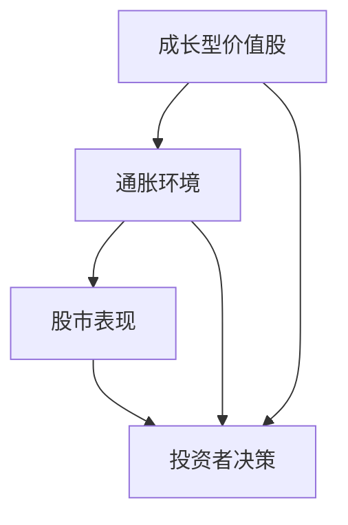

                 

# 彼得林奇的"成长型价值股"在不同通胀环境下的表现分析

> 关键词：彼得·林奇，成长型价值股，通胀环境，股票表现，投资策略

> 摘要：本文通过分析彼得·林奇的成长型价值股投资理念，探讨其在不同通胀环境下的表现差异。文章详细解释了成长型和价值型股票的核心概念，分析了通胀对股市的直接影响和间接影响，并结合具体案例，展示了彼得·林奇的投资策略在不同通胀阶段的适用性和调整方法。

---

# 第一部分: 引言

## 第1章: 彼得·林奇与成长型价值股概述

### 1.1 彼得·林奇的背景与投资理念

#### 1.1.1 彼得·林奇的生平简介
彼得·林奇（Peter Lynch）是美国著名的投资经理和作家，以其在富达投资管理公司的长期任职期间的卓越表现而闻名。他以成长型股票投资策略著称，强调选择那些收入和利润持续增长的公司。

#### 1.1.2 成长型价值股的核心理念
成长型价值股是指那些具有较高增长潜力，同时价格又合理的股票。林奇认为，成长型股票的核心在于公司的盈利能力和未来增长潜力，而非仅仅依靠市场波动赚取差价。

#### 1.1.3 彼得·林奇的投资策略特点
林奇的投资策略注重长期增长，强调对公司基本面的深入分析，包括财务状况、行业地位和竞争优势。他主张分散投资，避免过度集中，并根据市场环境调整投资组合。

### 1.2 成长型价值股的定义与特点

#### 1.2.1 成长型股票的定义
成长型股票是指那些预期收益和收入能够持续增长的公司股票。这类股票通常具有较高的市盈率，反映了市场对其未来增长的预期。

#### 1.2.2 成长型股票的核心特征
- **高增长潜力**：公司收入和利润持续增长。
- **较高的市盈率**：反映了市场对其未来增长的乐观预期。
- **行业地位**：通常处于高增长行业，具有竞争优势。

#### 1.2.3 价值股与成长股的对比分析
| 特性         | 成长股             | 价值股             |
|--------------|--------------------|--------------------|
| 定价方式     | 高市盈率           | 低市盈率           |
| 市场预期     | 高增长预期         | 稳定或低增长预期   |
| 适用环境     | 高增长行业         | 价值低估行业       |

### 1.3 通胀环境的定义与分类

#### 1.3.1 通胀的基本概念
通货膨胀是指物价总水平在一段时间内持续上涨，导致货币购买力下降的经济现象。通胀对经济和股市的影响复杂，需要结合具体经济环境进行分析。

#### 1.3.2 不同类型的通胀环境
- **温和通胀**：通胀率在2-3%之间，属于正常经济增长范围。
- **高通胀**：通胀率超过5%，可能导致经济不稳定。
- **滞胀**：高通胀与低经济增长并存，通常导致市场恐慌。

#### 1.3.3 通胀对经济和股市的影响
通胀直接影响企业成本和利润，间接影响市场情绪和投资者信心。高通胀可能导致利率上升，增加企业的财务负担，进而影响股票估值。

---

## 第2章: 成长型价值股在不同通胀环境下的表现分析

### 2.1 通胀环境对股票市场的影响机制

#### 2.1.1 通胀对股市的直接影响
高通胀可能导致企业成本上升，利润减少，进而影响股票估值。此外，通胀可能导致货币政策收紧，如加息，增加企业的融资成本。

#### 2.1.2 通胀对股市的间接影响
通胀影响消费者信心和市场情绪，可能导致股市波动。此外，通胀可能影响企业的盈利能力和未来增长预期。

#### 2.1.3 不同通胀阶段的股市表现
- **高通胀阶段**：股市可能下跌，成长型股票受挫。
- **低通胀阶段**：股市表现稳定，成长型股票有较好的增长空间。
- **稳定通胀阶段**：股市表现良好，成长型股票表现优异。

### 2.2 成长型价值股在通胀环境下的表现特征

#### 2.2.1 高通胀环境下的成长型股票表现
高通胀环境下，企业成本上升，利润减少，成长型股票的高增长预期可能无法实现，导致股票估值下降。

#### 2.2.2 低通胀环境下的成长型股票表现
低通胀环境下，企业成本控制良好，利润增长稳定，成长型股票表现优异。

#### 2.2.3 稳定通胀环境下的成长型股票表现
稳定通胀环境下，企业盈利能力稳定，成长型股票表现良好，投资者信心增强。

### 2.3 彼得·林奇投资策略在不同通胀环境下的适用性

#### 2.3.1 高通胀环境下的策略调整
高通胀环境下，林奇建议调整投资组合，减少成长型股票的比重，增加防御性股票的投资，如公用事业和消费品行业。

#### 2.3.2 低通胀环境下的策略优化
低通胀环境下，林奇的策略保持不变，继续关注具有高增长潜力的成长型股票。

#### 2.3.3 稳定通胀环境下的策略一致性
稳定通胀环境下，林奇的策略保持一致，继续投资于具有高增长潜力的成长型股票。

---

## 第3章: 成长型价值股与通胀环境的核心概念对比

### 3.1 成长型价值股的核心概念

#### 3.1.1 成长型股票的定义与属性
成长型股票是指那些具有高增长潜力的公司股票，通常具有较高的市盈率和较高的市场预期。

#### 3.1.2 价值股的定义与属性
价值股是指那些价格被低估，具有较高的股息收益率的公司股票，通常具有较低的市盈率。

#### 3.1.3 成长型价值股的综合特征
成长型价值股结合了成长型和价值型股票的特点，具有较高的增长潜力和合理的估值。

### 3.2 通胀环境的核心概念

#### 3.2.1 通胀的基本定义与分类
通货膨胀是指物价总水平在一段时间内持续上涨，导致货币购买力下降的经济现象。

#### 3.2.2 不同通胀阶段的经济特征
高通胀阶段通常伴随着经济不稳定和高利率，低通胀阶段通常伴随着稳定的经济增长。

#### 3.2.3 通胀对股市的周期性影响
通胀对股市的影响具有周期性，高通胀可能导致股市下跌，低通胀环境下股市表现稳定。

### 3.3 成长型价值股与通胀环境的对比分析

#### 3.3.1 成长型股票在高通胀环境下的表现对比
高通胀环境下，成长型股票的表现受到抑制，企业成本上升，利润减少。

#### 3.3.2 成长型股票在低通胀环境下的表现对比
低通胀环境下，成长型股票的表现优异，企业成本控制良好，利润增长稳定。

#### 3.3.3 成长型股票在稳定通胀环境下的表现对比
稳定通胀环境下，成长型股票的表现稳定，企业盈利能力稳定，投资者信心增强。

---

## 第4章: 成长型价值股与通胀环境的实体关系图

### 4.1 成长型价值股与通胀环境的实体关系图

---

## 第5章: 成长型价值股与通胀环境的数学模型

### 5.1 成长型价值股的表现模型
$$ P = \frac{E}{r - g} $$
其中，P为股票价格，E为预期收益，r为折现率，g为成长率。

### 5.2 通胀对股票估值的影响
$$ P = \frac{E(1 + i)}{r(1 + i) - g(1 + i)} $$
其中，i为通胀率，E为预期收益，r为折现率，g为成长率。

---

## 第6章: 成长型价值股在不同通胀环境下的投资策略

### 6.1 高通胀环境下的投资策略
- 减少成长型股票的投资比例。
- 增加防御性股票的投资，如公用事业和消费品行业。
- 关注具有抗通胀能力的行业，如能源和原材料。

### 6.2 低通胀环境下的投资策略
- 保持成长型股票的投资比例。
- 关注具有高增长潜力的行业，如科技和医疗。
- 优化投资组合，分散风险。

### 6.3 稳定通胀环境下的投资策略
- 保持成长型股票的投资策略。
- 关注具有稳定增长的行业，如消费和金融。
- 优化投资组合，平衡风险和收益。

---

## 第7章: 案例分析

### 7.1 高通胀环境下的案例分析
以20世纪70年代的滞胀时期为例，分析成长型股票的表现和彼得·林奇的策略调整。

### 7.2 低通胀环境下的案例分析
以2000年代初期的低通胀环境为例，分析成长型股票的表现和彼得·林奇的策略优化。

### 7.3 稳定通胀环境下的案例分析
以近年来的稳定通胀环境为例，分析成长型股票的表现和彼得·林奇的策略一致性。

---

## 第8章: 总结与展望

### 8.1 总结
本文通过分析彼得·林奇的成长型价值股投资理念，探讨了其在不同通胀环境下的表现差异。研究表明，成长型股票在低通胀和稳定通胀环境下表现优异，而在高通胀环境下表现受到抑制。

### 8.2 展望
未来的研究可以进一步探讨通胀环境下成长型股票的风险管理策略，以及如何通过多元化投资降低通胀风险。

---

通过以上分析，我们可以看到，彼得·林奇的成长型价值股投资策略在不同通胀环境下的表现具有明显的差异。投资者需要根据具体的经济环境和市场变化，灵活调整投资策略，以实现长期稳定的收益。

