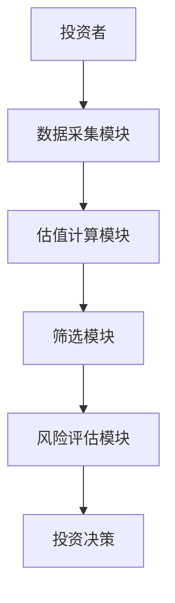
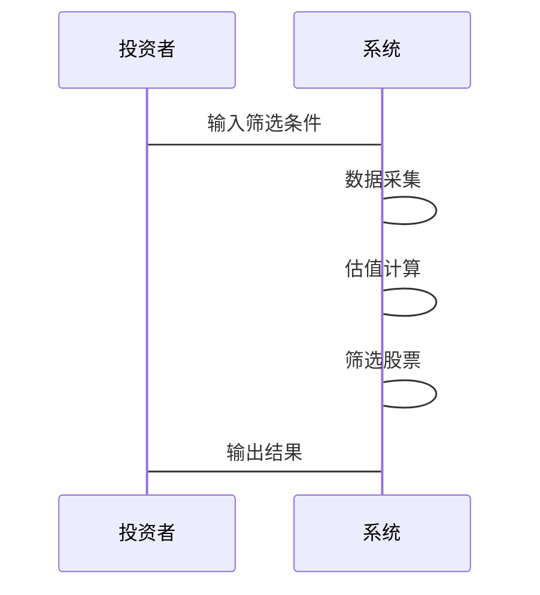

                 


# 彼得林奇的"成长型价值股"定义

> 关键词：成长型价值股，彼得林奇，投资策略，股票估值，价值与成长的结合

> 摘要：本文深入探讨了彼得林奇提出的“成长型价值股”概念，分析其核心定义、投资策略、数学模型，并结合实际案例进行详细讲解，旨在为投资者提供科学的选股方法和投资思路。

---

# 第一部分: 成长型价值股的背景与核心概念

## 第1章: 成长型价值股的定义与背景

### 1.1 成长型价值股的核心概念

#### 1.1.1 成长股与价值股的定义

- **成长股**：指那些具有高成长潜力的公司股票，通常市盈率较高，注重未来盈利的增长。
- **价值股**：指那些市场价格低于其内在价值的公司股票，通常市盈率较低，注重当前的低估值。

#### 1.1.2 成长型价值股的结合与特点

- **结合点**：成长型价值股兼具成长股的高成长性和价值股的合理估值，避免了单纯成长股的高风险和单纯价值股的低增长。
- **特点**：
  - 高成长性：公司收入和利润持续增长。
  - 合理估值：市盈率、市净率等指标低于行业平均水平。
  - 平衡风险：在高成长和低估值之间找到平衡点。

#### 1.1.3 成长型价值股的市场定位与意义

- **市场定位**：成长型价值股在市场中属于中低风险、高收益潜力的投资标的。
- **意义**：为投资者提供了一种在成长与估值之间找到平衡的投资策略，兼顾长期增长和短期估值优势。

### 1.2 成长型价值股的背景与演变

#### 1.2.1 美国股市的历史发展

- 美国股市经历了多次牛熊市，成长型价值股的概念在不同市场环境下不断演变。
- 20世纪80年代，彼得林奇在波士顿共同基金公司（Fidelity）开始系统研究成长型价值股。

#### 1.2.2 彼得林奇投资理念的形成

- 彼得林奇强调深入研究公司基本面，寻找具有持续增长潜力的公司。
- 成长型价值股的投资理念是其长期投资实践的成果。

#### 1.2.3 成长型价值股在现代投资中的地位

- 成长型价值股成为机构投资者和个人投资者的重要投资标的。
- 在科技股、消费股等领域表现尤为突出。

### 1.3 成长型价值股的核心要素

#### 1.3.1 企业的成长性

- 收入增长率：过去3-5年的收入复合增长率。
- 净利润增长率：净利润的复合增长率。

#### 1.3.2 企业的价值性

- 市盈率（P/E）：股价与每股收益的比率。
- 市净率（P/B）：股价与每股净资产的比率。

#### 1.3.3 成长与价值的平衡点

- 通过比较成长性和估值指标，找到两者平衡的最佳结合点。

### 1.4 本章小结

- 成长型价值股是成长股与价值股的结合，强调高成长性和合理估值。
- 彼得林奇的投资理念为这一概念提供了理论基础。

---

# 第二部分: 成长型价值股的核心概念与联系

## 第2章: 成长型与价值型股票的对比分析

### 2.1 成长型股票的特征

#### 2.1.1 高成长性

- 企业收入和利润持续增长，具有较高的市场占有率和竞争优势。

#### 2.1.2 高市盈率

- 成长股通常市盈率较高，反映市场对其未来增长的预期。

#### 2.1.3 高风险与高回报

- 成长股波动较大，收益与风险并存。

### 2.2 价值型股票的特征

#### 2.2.1 低市盈率

- 价值股通常市盈率低于行业平均水平，被认为被市场低估。

#### 2.2.2 低市净率

- 股价相对于账面价值较低，反映公司资产被低估。

#### 2.2.3 高股息率

- 价值股通常股息收益率较高，适合追求稳定收益的投资者。

### 2.3 成长型与价值型股票的对比

#### 2.3.1 估值指标对比

| 指标 | 成长型 | 价值型 |
|------|--------|--------|
| P/E  | 高     | 低     |
| P/B  | 中高   | 低     |
| P/S  | 高     | 低     |
| 股息率 | 低     | 高     |

#### 2.3.2 风险与收益对比

| 指标 | 成长型 | 价值型 |
|------|--------|--------|
| 风险 | 高     | 低     |
| 收益 | 高     | 中等   |

#### 2.3.3 投资策略对比

- 成长型：长期持有，等待股价上涨。
- 价值型：短期投资，等待股价回归合理估值。

### 2.4 成长型价值股的综合特征

#### 2.4.1 高成长性与合理估值的结合

- 公司收入和利润持续增长，同时估值指标低于行业平均水平。

#### 2.4.2 长期投资价值

- 成长型价值股具备长期增长潜力，适合长期持有的投资策略。

#### 2.4.3 选股标准的综合运用

- 结合成长性和估值指标，筛选出具有成长潜力和合理估值的公司。

### 2.5 本章小结

- 成长型和价值型股票各有特点，成长型价值股通过综合两者的优点，提供了更优的投资选择。

---

# 第三部分: 成长型价值股的数学模型与算法原理

## 第3章: 成长型价值股的估值模型

### 3.1 常用估值指标

#### 3.1.1 市盈率（P/E）

- **公式**：$$ P/E = \frac{\text{股价}}{\text{每股收益}} $$
- **解读**：市盈率越低，公司估值越合理；市盈率越高，反映市场对其未来增长的预期。

#### 3.1.2 市净率（P/B）

- **公式**：$$ P/B = \frac{\text{股价}}{\text{每股净资产}} $$
- **解读**：市净率低的公司可能被低估，适合价值投资者。

#### 3.1.3 市销率（P/S）

- **公式**：$$ P/S = \frac{\text{股价}}{\text{每股销售额}} $$
- **解读**：适用于亏损公司或销售驱动型公司。

#### 3.1.4 股息率（Dividend Yield）

- **公式**：$$ \text{股息率} = \frac{\text{每股股息}}{\text{股价}} \times 100\% $$
- **解读**：高股息率的公司适合追求稳定收益的投资者。

### 3.2 成长型价值股的估值方法

#### 3.2.1 市盈率相对盈利增长比率（PEG）

- **公式**：$$ PEG = \frac{\text{P/E}}{\text{净利润增长率}} $$
- **解读**：PEG < 1时，公司估值合理；PEG > 1时，可能被高估。

#### 3.2.2 内在价值计算

- **公式**：$$ \text{内在价值} = \frac{\text{净利润} \times (1 + \text{增长率})}{\text{折现率} - \text{增长率}} $$
- **解读**：通过DCF模型计算公司未来现金流的现值。

#### 3.2.3 相对估值法

- **公式**：$$ \text{相对估值} = \frac{\text{目标公司估值指标}}{\text{可比公司估值指标}} $$
- **解读**：通过与同行公司对比，评估目标公司的估值是否合理。

### 3.3 成长型价值股的数学模型

#### 3.3.1 PEG模型公式

$$ PEG = \frac{\text{P/E}}{\text{净利润增长率}} $$

- **解读**：通过PEG指标，可以判断成长型价值股的估值是否合理。

#### 3.3.2 内在价值公式

$$ \text{内在价值} = \frac{\text{净利润} \times (1 + g)}{r - g} $$

- **解读**：其中，$g$ 为净利润增长率，$r$ 为折现率。内在价值低于当前股价时，公司可能被高估。

#### 3.3.3 综合估值模型

$$ \text{综合估值} = \alpha \times \text{PEG} + \beta \times \text{P/B} $$

- **解读**：通过加权平均的方式，综合考虑成长性和估值指标，筛选出成长型价值股。

### 3.4 本章小结

- 成长型价值股的估值需要综合考虑多个指标，PEG模型是关键工具之一。

---

# 第四部分: 成长型价值股的系统分析与架构设计

## 第4章: 成长型价值股的系统分析

### 4.1 系统功能设计

#### 4.1.1 投资者需求分析

- 投资者需要筛选具有高成长性和合理估值的公司。
- 投资者需要实时监控股票市场动态。

#### 4.1.2 功能模块

- **数据采集模块**：收集公司财务数据和市场数据。
- **估值计算模块**：计算P/E、P/B等指标。
- **筛选模块**：根据设定条件筛选出成长型价值股。
- **风险评估模块**：评估投资风险。

### 4.2 系统架构设计



### 4.3 系统接口设计

- **输入接口**：用户输入筛选条件（如行业、市值等）。
- **输出接口**：输出符合条件的股票列表和投资建议。

### 4.4 系统交互流程图



### 4.5 本章小结

- 系统设计能够有效帮助投资者筛选成长型价值股，提高投资效率。

---

# 第五部分: 成长型价值股的项目实战

## 第5章: 成长型价值股的项目实现

### 5.1 环境安装

- **工具选择**：使用Python的pandas、numpy等库进行数据分析。
- **数据源**：获取历史股价、财务数据等。

### 5.2 核心实现代码

```python
import pandas as pd

# 加载数据
data = pd.read_csv('stock_data.csv')

# 计算估值指标
data['PEG'] = data['P/E'] / data['净利润增长率']
data['P/B'] = data['股价'] / data['每股净资产']

# 筛选成长型价值股
筛选条件：
- PEG < 1
- P/B < 2
- 净利润增长率 > 10%

selected_stocks = data[(data['PEG'] < 1) & (data['P/B'] < 2) & (data['净利润增长率'] > 10%)]

# 输出结果
print(selected_stocks)
```

### 5.3 代码应用解读

- **数据加载**：从CSV文件加载股票数据。
- **指标计算**：计算PEG和P/B等估值指标。
- **筛选股票**：根据设定的条件筛选出符合条件的股票。

### 5.4 实际案例分析

#### 5.4.1 微软案例分析

- 微软在2000年代初期被彼得林奇看好，认为其具有较高的成长性和合理估值。
- 微软的PEG和P/B均低于行业平均水平，同时净利润增长率较高。

#### 5.4.2 苹果案例分析

- 苹果在2000年代后期被彼得林奇认为是成长型价值股。
- 苹果的高市盈率反映了市场对其未来增长的预期，同时其净利润增长率较高。

### 5.5 本章小结

- 成功筛选出成长型价值股，为投资者提供了实际的操作指南。

---

# 第六部分: 成长型价值股的最佳实践

## 第6章: 成长型价值股的投资策略

### 6.1 投资策略

#### 6.1.1 长期投资

- 成长型价值股适合长期持有，等待公司成长带来的股价上涨。

#### 6.1.2 分批建仓

- 将资金分批投入，降低市场波动带来的风险。

#### 6.1.3 定期复盘

- 定期检查投资组合，调整持仓结构。

### 6.2 风险管理

#### 6.2.1 设置止损位

- 当股价跌破设定的止损点时，及时卖出。

#### 6.2.2 分散投资

- 将资金分散投资于不同的成长型价值股，降低风险。

#### 6.2.3 关注行业动态

- 时刻关注行业动态和公司基本面变化。

### 6.3 本章小结

- 成长型价值股的投资需要科学的策略和严格的风险管理。

---

# 第七部分: 总结与展望

## 第7章: 总结与展望

### 7.1 总结

- 成长型价值股结合了成长股和价值股的优点，是投资者的理想选择。
- 彼得林奇的投资理念为这一概念提供了理论基础，系统化的分析方法为投资者提供了实践指导。

### 7.2 展望

- 随着市场的发展，成长型价值股的定义和筛选方法将不断完善。
- 未来，投资者需要更加关注公司的创新能力和竞争优势。

### 7.3 本章小结

- 本文全面介绍了成长型价值股的概念、分析方法和投资策略，为投资者提供了科学的指导。

---

# 第八部分: 附录

## 附录A: 成长型价值股相关术语表

- **PEG**：市盈率相对盈利增长比率。
- **P/E**：市盈率。
- **P/B**：市净率。
- **净利润增长率**：净利润的年均增长率。

## 附录B: 进一步阅读的资源

- 彼得林奇的书籍推荐。
- 相关学术论文和研究报告。

---

通过以上思考过程，我们详细阐述了彼得林奇的成长型价值股定义，从概念、分析方法到实际操作，为投资者提供了全面的指导。

