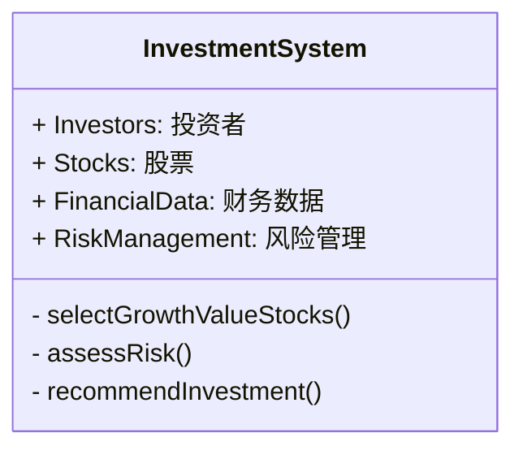
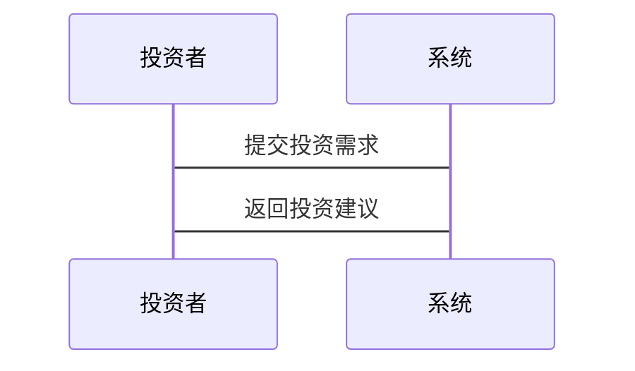

                 


# 彼得林奇的"成长型价值股"筛选方法

> 关键词：彼得林奇，成长型价值股，投资策略，筛选方法，风险管理，系统设计

> 摘要：本文系统地介绍和分析了彼得·林奇的“成长型价值股”筛选方法，从基本概念、核心筛选标准、具体筛选步骤、风险管理策略，到实际案例分析和系统架构设计，逐一进行了详细探讨。通过本文的学习，读者可以掌握彼得·林奇的投资理念，并将其应用到实际投资中，从而提高投资成功的可能性。

---

# 第一部分: 成长型价值股的基本概念

## 第1章: 成长型价值股的定义

### 1.1 成长型股票的定义

成长型股票是指那些在行业中具有较高的增长率，且预期未来收入和利润将显著增长的公司股票。这些公司通常处于扩张期，注重研发和市场扩展，具有较高的成长潜力。

### 1.2 价值股的定义

价值股是指那些市场价格低于其内在价值的股票。通常，这些股票的市盈率、市净率等估值指标低于行业平均水平，具有较高的投资价值。

### 1.3 成长型价值股的核心特征

成长型价值股结合了成长股和价值股的特点，具有以下核心特征：
1. **高增长率**：公司收入和利润持续增长。
2. **低估值**：市场价格低于内在价值。
3. **竞争优势**：公司在行业内具有竞争优势，能够持续增长。
4. **管理团队**：公司管理层能力强，管理团队稳定。

---

## 第2章: 彼得林奇的投资理念

### 2.1 彼得林奇的生平简介

彼得·林奇（Peter Lynch）是美国著名的投资专家，曾担任富达麦哲伦基金的经理，管理该基金20多年，创造了年均29%的收益率，被誉为“最传奇的基金经理”。

### 2.2 彼得林奇的投资哲学

彼得林奇的投资哲学可以总结为：
1. **长期投资**：关注公司长期的成长潜力，而不是短期市场波动。
2. **深入研究**：通过深入研究公司基本面，选择具有竞争优势的公司。
3. **分散投资**：避免过度集中投资，分散投资以降低风险。

### 2.3 成长型价值股在彼得林奇投资策略中的地位

在彼得林奇的投资策略中，成长型价值股是核心，他认为，投资于具有强大成长潜力的公司，能够实现长期稳定的收益。

---

# 第二部分: 成长型价值股的筛选标准

## 第3章: 成长型价值股的核心筛选标准

### 3.1 财务状况分析

#### 3.1.1 净利润增长率

净利润增长率是衡量公司盈利能力增长的重要指标。彼得林奇通常选择净利润增长率超过行业平均水平的公司。

#### 3.1.2 营业收入增长率

营业收入增长率反映了公司收入的增长情况。通常，成长型公司营业收入增长率应高于行业平均水平。

#### 3.1.3 净利润率和毛利率

净利润率和毛利率是衡量公司盈利能力的重要指标。高毛利率和高净利润率表明公司具有较强的盈利能力。

#### 3.1.4 负债率和杠杆比率

合理的负债率和杠杆比率是公司财务健康的重要指标。过高的负债率可能导致公司财务风险增加。

---

### 3.2 行业地位分析

#### 3.2.1 行业周期分析

行业周期分析是判断公司成长潜力的重要因素。成长型公司通常处于行业上升周期。

#### 3.2.2 市场占有率

市场占有率高或有潜力提高的公司具有更强的竞争优势。

#### 3.2.3 行业竞争结构

行业竞争结构分析有助于判断公司的竞争优势。彼得林奇倾向于选择那些在行业中具有竞争优势的公司。

---

### 3.3 管理团队评估

#### 3.3.1 管理层的稳定性

管理层的稳定性是公司长期发展的关键因素。彼得林奇倾向于选择管理团队稳定、有长期发展规划的公司。

#### 3.3.2 管理层的决策能力

管理层的决策能力直接影响公司的成长潜力。彼得林奇注重选择那些能够做出明智决策的管理层。

#### 3.3.3 管理层的道德和诚信

管理层的道德和诚信是公司长期发展的基石。彼得林奇认为，管理层的道德问题可能导致公司重大风险。

---

### 3.4 企业成长性评估

#### 3.4.1 未来增长潜力

未来增长潜力是衡量公司成长性的重要指标。彼得林奇通常选择那些具有明确未来增长潜力的公司。

#### 3.4.2 行业发展趋势

行业发展趋势分析是判断公司成长潜力的重要因素。彼得林奇倾向于选择那些处于上升趋势的行业。

#### 3.4.3 企业创新能力和研发投入

企业的创新能力和研发投入是公司长期成长的重要保障。彼得林奇注重选择那些注重研发投入、具有创新能力的公司。

---

### 3.5 估值指标分析

#### 3.5.1 市盈率（P/E）

市盈率是衡量股票估值的重要指标。彼得林奇通常选择市盈率低于行业平均水平的公司。

#### 3.5.2 市净率（P/B）

市净率是衡量股票估值的另一个重要指标。彼得林奇倾向于选择市净率低于行业平均水平的公司。

#### 3.5.3 市销率（P/S）

市销率是衡量股票估值的指标之一。彼得林奇通常选择市销率低于行业平均水平的公司。

#### 3.5.4 股息率和股息支付率

股息率和股息支付率是衡量公司分红能力的指标。彼得林奇倾向于选择股息支付率稳定的公司。

---

## 第4章: 彼得林奇的选股步骤

### 4.1 确定投资目标

#### 4.1.1 确定投资期限

彼得林奇强调长期投资，通常选择投资期限在3年以上。

#### 4.1.2 确定风险承受能力

根据投资者的风险承受能力，选择合适的风险等级的投资。

#### 4.1.3 确定投资规模

根据投资者的财务状况，确定投资规模。

---

### 4.2 初步筛选

#### 4.2.1 通过行业筛选

选择处于上升周期的行业。

#### 4.2.2 通过财务指标初步筛选

筛选财务指标表现优异的公司。

#### 4.2.3 通过估值指标初步筛选

选择估值低于行业平均水平的公司。

---

### 4.3 深入分析

#### 4.3.1 财务报表分析

通过财务报表分析公司的财务健康状况。

#### 4.3.2 管理层访谈

通过与管理层访谈，了解公司的发展规划和竞争优势。

---

# 第三部分: 风险管理与实际案例分析

## 第5章: 风险管理策略

### 5.1 投资组合分散化

通过分散投资降低风险。

### 5.2 定期监控和调整

定期监控投资组合，根据市场变化进行调整。

### 5.3 风险预警机制

建立风险预警机制，及时发现潜在风险。

---

## 第6章: 实际案例分析

### 6.1 成功案例

#### 6.1.1 案例背景

#### 6.1.2 筛选过程

#### 6.1.3 投资结果

### 6.2 失败案例

#### 6.2.1 案例背景

#### 6.2.2 筛选过程

#### 6.2.3 投资结果

---

# 第四部分: 系统分析与架构设计

## 第7章: 系统分析与架构设计

### 7.1 问题场景介绍

描述投资决策系统的需求和目标。

### 7.2 系统功能设计

设计基于彼得林奇方法的投资决策系统功能模块。

#### 7.2.1 领域模型 mermaid 类图



### 7.3 系统架构设计

设计系统的架构图。


### 7.4 系统接口设计

设计系统接口。

### 7.5 系统交互 mermaid 序列图



---

## 第8章: 项目实战

### 8.1 环境安装

安装必要的软件和工具。

### 8.2 系统核心实现源代码

实现基于彼得林奇方法的筛选算法。

#### 8.2.1 代码实现

```python
def select_growth_value_stocks(stocks, industry_avg_pe, industry_avg_pb):
    selected_stocks = []
    for stock in stocks:
        if stock.net_profit_growth > industry_avg_pe and \
           stock.revenue_growth > industry_avg_pb and \
           stock.p_e < industry_avg_pe and \
           stock.p_b < industry_avg_pb:
            selected_stocks.append(stock)
    return selected_stocks
```

#### 8.2.2 代码解读

解释代码实现和原理。

---

## 第9章: 总结与展望

### 9.1 总结

总结彼得林奇的筛选方法及其在投资中的应用。

### 9.2 展望

展望未来投资趋势和策略优化。

---

## 第10章: 最佳实践 Tips

### 10.1 投资策略 Tips

提供投资策略的建议。

### 10.2 风险管理 Tips

提供风险管理的建议。

### 10.3 系统设计 Tips

提供系统设计的建议。

---

## 第11章: 项目小结

总结整个项目的实施过程和成果。

---

## 第12章: 注意事项

提醒读者在实际操作中需要注意的事项。

---

## 第13章: 拓展阅读

推荐相关的书籍和资源，供读者进一步学习。

---

通过以上详细的章节划分和内容安排，您可以逐步撰写一篇关于彼得林奇的“成长型价值股”筛选方法的高质量技术博客文章。

