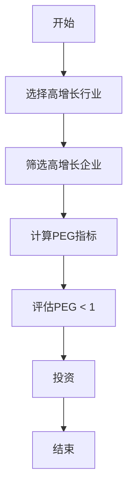
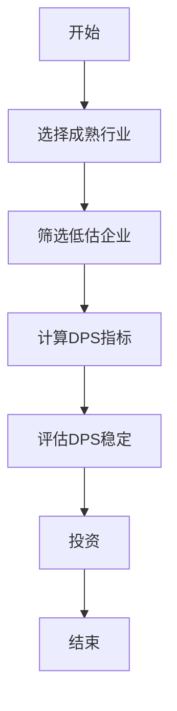
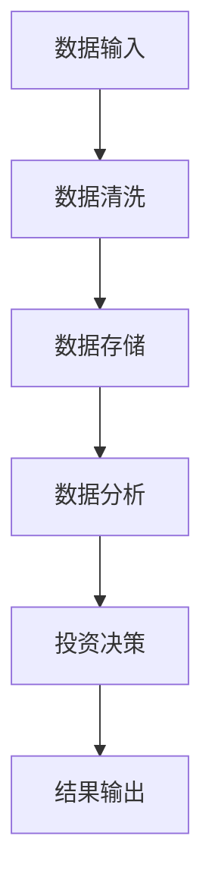
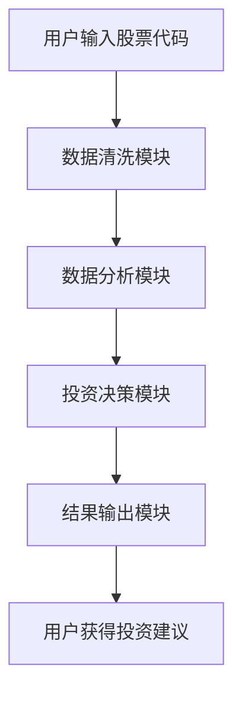

                 


# 彼得林奇的"成长股"vs"价值股"选择策略

> 关键词：成长股、价值股、彼得林奇、投资策略、股票分析

> 摘要：本文深入分析了彼得林奇的成长股与价值股投资策略，通过对比两者的定义、核心概念、评估指标和实际案例，探讨了如何选择适合自己的投资策略。文章结合数学模型、系统架构和项目实战，为读者提供了全面而深入的指导。

---

## 第一部分：成长股与价值股的核心概念

### 第1章：成长股与价值股的定义与区别

#### 1.1 成长股的定义与特征
成长股是指那些预期收益能够持续快速增长，且市盈率相对较高的股票。这类股票通常属于新兴产业或高增长行业，具有较高的成长潜力。彼得林奇认为，成长股的关键在于其未来的增长能力，而非当前的盈利能力。

| 特征 | 成长股 |
|------|--------|
| 收益增长 | 快速增长 |
| 市盈率 | 高于行业平均水平 |
| 市净率 | 高 |
| 股息率 | 低或无 |

#### 1.2 价值股的定义与特征
价值股是指市场价格低于其内在价值，通常市盈率或市净率较低，但具有稳定的盈利能力的股票。这类股票通常属于成熟行业或周期性行业，彼得林奇认为，价值股的核心在于其被市场低估的可能性。

| 特征 | 价值股 |
|------|--------|
| 收益增长 | 稳定或缓慢增长 |
| 市盈率 | 低于行业平均水平 |
| 市净率 | 低 |
| 股息率 | 高 |

#### 1.3 成长股与价值股的主要区别对比表
| 对比维度 | 成长股 | 价值股 |
|----------|--------|--------|
| 收益增长 | 快速   | 稳定   |
| 市盈率   | 高     | 低     |
| 风险     | 高     | 中等   |
| 适用场景 | 高成长行业 | 成熟行业 |

#### 1.4 成长股与价值股的ER实体关系图（Mermaid）
```mermaid
erDiagram
    actor 投资者 {
        <属性> 投资目标
        <属性> 风险承受能力
    }
    class 成长股 {
        <属性> 快速增长
        <属性> 高市盈率
    }
    class 价值股 {
        <属性> 稳定增长
        <属性> 低市盈率
    }
    投资者 -> 成长股 : 投资于高增长股票
    投资者 -> 价值股 : 投资于低估股票
```

---

### 第2章：彼得林奇的成长股投资策略

#### 2.1 成长股投资的核心思想
彼得林奇认为，成长股的投资关键在于找到那些能够持续增长的企业。他强调，投资者应该关注企业的基本面，包括收入增长率、利润率和市场地位。

#### 2.2 成长股投资的选股标准
- 收入增长率：年收入增长率高于行业平均水平。
- 利润率：净利润率稳定且增长。
- 市场地位：企业在市场中具有竞争优势。
- 管理团队：管理团队具有良好的往绩和战略眼光。

#### 2.3 成长股投资的成功案例分析
以苹果公司为例，苹果在iPhone推出后，收入和利润快速增长，符合成长股的选股标准，成为彼得林奇成长股投资的成功案例。

#### 2.4 成长股投资的数学模型与公式
使用PEG指标（市盈率相对盈利增长比率）来评估成长股的估值是否合理：
$$PEG = \frac{市盈率}{预期增长率}$$

如果PEG < 1，说明股票可能被低估；如果PEG > 1，说明股票可能被高估。

#### 2.5 成长股投资的算法流程图（Mermaid）


---

### 第3章：彼得林奇的价值股投资策略

#### 3.1 价值股投资的核心思想
彼得林奇认为，价值股的投资关键在于找到那些市场价格低于其内在价值的企业。他强调，投资者应该关注企业的内在价值，包括资产、盈利能力和现金流。

#### 3.2 价值股投资的选股标准
- 市盈率：市盈率低于行业平均水平。
- 市净率：市净率低于行业平均水平。
- 股息率：股息率高且稳定。
- 财务状况：企业具有较强的财务健康状况。

#### 3.3 价值股投资的成功案例分析
以可口可乐为例，该公司具有稳定的盈利能力和较高的股息率，符合价值股的选股标准，成为彼得林奇价值股投资的成功案例。

#### 3.4 价值股投资的数学模型与公式
使用DPS指标（股息支付率）来评估价值股的股息支付能力：
$$DPS = \frac{股息}{股价}$$

如果DPS稳定且股息增长，说明企业具有较高的股息支付能力。

#### 3.5 价值股投资的算法流程图（Mermaid）


---

### 第4章：成长股与价值股投资策略的对比分析

#### 4.1 成长股与价值股的核心区别
- 投资目标：成长股追求高收益增长，价值股追求低估价格。
- 投资周期：成长股适合长期投资，价值股适合中短期投资。
- 风险与收益：成长股风险高、收益高，价值股风险中等、收益稳定。

#### 4.2 成长股与价值股的优劣势对比表
| 对比维度 | 成长股 | 价值股 |
|----------|--------|--------|
| 优势     | 高增长潜力 | 低估值风险 |
| 劣势     | 高风险 | 收益有限 |

#### 4.3 不同市场环境下的策略选择
- 在经济繁荣期，成长股表现优于价值股。
- 在经济衰退期，价值股表现优于成长股。

---

## 第二部分：成长股与价值股投资策略的系统分析与架构设计

### 第5章：成长股与价值股投资策略的系统分析

#### 5.1 投资分析系统的功能设计
- 数据收集模块：收集股票的基本数据，包括市盈率、市净率、收入增长率等。
- 数据分析模块：计算成长股和价值股的指标，包括PEG、DPS等。
- 决策模块：根据指标评估股票的投资价值。

#### 5.2 投资分析系统的架构设计


#### 5.3 投资分析系统的接口设计
- 输入接口：接收股票数据和指标。
- 输出接口：输出股票的投资价值评估结果。

#### 5.4 投资分析系统的交互流程图（Mermaid）


---

### 第6章：成长股与价值股投资策略的项目实战

#### 6.1 环境安装
- 安装Python和必要的库（如Pandas、Matplotlib）。
- 安装投资分析系统。

#### 6.2 核心实现源代码
```python
import pandas as pd

def calculate_peg(pe, growth_rate):
    return pe / growth_rate

def calculate_dps(dividend, price):
    return dividend / price

# 示例数据
data = {
    '股票代码': ['AAPL', 'KO', 'MSFT'],
    '市盈率': [15, 18, 12],
    '收入增长率': [20, 10, 5],
    '股息': [1.5, 0.8, 2.0],
    '股价': [300, 25, 100]
}

df = pd.DataFrame(data)

# 计算PEG和DPS
df['PEG'] = df.apply(lambda x: calculate_peg(x['市盈率'], x['收入增长率']), axis=1)
df['DPS'] = df.apply(lambda x: calculate_dps(x['股息'], x['股价']), axis=1)

print(df)
```

#### 6.3 案例分析
以苹果、可口可乐和微软为例，分析它们的成长股和价值股属性。

#### 6.4 结果解读
- 苹果的PEG为0.75，低于1，适合成长股投资。
- 可口可乐的DPS为0.032，适合价值股投资。
- 微软的PEG为2.4，高于1，不适合成长股投资。

---

## 第三部分：成长股与价值股投资策略的最佳实践

### 第7章：最佳实践与注意事项

#### 7.1 投资策略的选择
- 根据市场环境选择适合的策略。
- 根据个人风险承受能力选择适合的策略。

#### 7.2 风险管理
- 设置止损点。
- 分散投资组合。

#### 7.3 长期投资的重要性
- 成长股适合长期持有。
- 价值股适合长期持有。

#### 7.4 持续学习
- 关注行业动态。
- 更新投资策略。

### 第8章：总结与展望

#### 8.1 总结
彼得林奇的成长股和价值股投资策略为投资者提供了两种不同的选择。成长股适合追求高增长的投资者，价值股适合追求稳定收益的投资者。投资者应根据市场环境和自身需求选择适合的策略。

#### 8.2 展望
未来，随着市场的变化和技术的进步，成长股和价值股的投资策略将不断优化。投资者应持续学习和适应市场的变化，以获得更好的投资回报。

---

## 结语
通过本文的分析，读者可以全面了解彼得林奇的成长股和价值股投资策略，并能够根据实际情况选择适合自己的投资策略。希望本文对读者的投资决策有所帮助。

