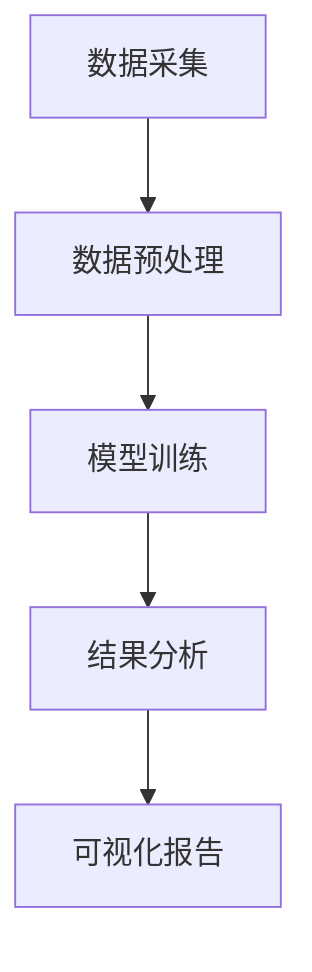
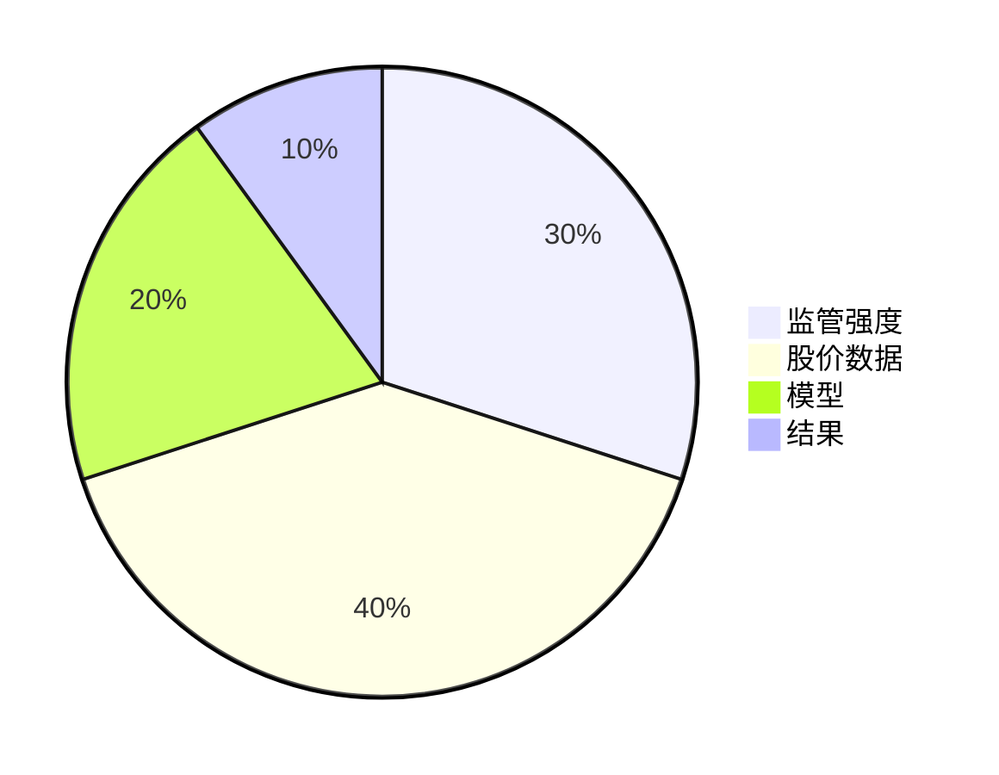

                 


# 彼得林奇的"成长股"在不同监管环境下的表现研究

---

## 关键词：  
彼得林奇、成长股、监管环境、投资策略、股票分析、风险管理

---

## 摘要：  
本文研究了彼得林奇的成长股投资理念在不同监管环境下的表现。通过分析成长股的核心特征、监管环境的多样性以及两者之间的相互影响，结合数学模型和系统架构设计，深入探讨了监管政策对成长股投资决策的影响。文章最后结合实际案例，提出了在不同监管环境下优化成长股投资策略的建议。

---

## 第一部分：引言

### 第1章：彼得林奇与成长股投资概述

#### 1.1 彼得林奇的成长股投资理念

彼得·林奇是美国著名的共同基金经理人，以其在富达麦哲伦基金的投资成绩闻名。他的成长股投资理念基于以下核心观点：

- **低市盈率与合理估值**：彼得林奇偏好市盈率低于行业平均水平的公司，同时关注市盈率与预期收益的匹配程度。
- **持续增长的财务表现**：他倾向于投资那些收入和利润持续增长的企业，尤其是那些能够维持较高ROE（净资产收益率）的公司。
- **管理层的质量与稳定性**：彼得林奇认为管理层的决策能力和稳定性是企业长期增长的关键因素。

**示例分析：**

假设某科技公司在2010年的市盈率为20，而行业平均市盈率为25，且其收入增长率连续三年保持在15%以上，这可能是一个符合彼得林奇选股标准的成长股。

#### 1.2 成长股的定义与特征

- **定义**：成长股是指那些收入和利润持续增长，且增长速度超过行业平均水平的股票。
- **特征**：
  - 高增长潜力
  - 低市盈率或合理估值
  - 稳定的管理层和公司治理
  - 行业地位稳固或具有创新性

#### 1.3 成长股投资的核心思想

彼得林奇强调，成长股投资需要结合对公司基本面的深入分析和对市场趋势的准确判断。他主张通过长期持有优质成长股，实现资本增值。

---

### 第2章：监管环境的多样性与复杂性

#### 2.1 不同国家的监管体系

- **美国市场**：以SEC（美国证券交易委员会）监管最为严格，强调信息公开和合规性。
- **欧洲市场**：注重投资者保护和公司治理，如《偿付能力与或有负债指令》（Solvency II）。
- **亚洲市场**：以中国为例，监管政策受宏观经济影响较大，且行业监管差异明显。

#### 2.2 监管政策对市场的具体影响

- **行业监管**：例如科技行业的数据隐私监管，可能对成长股产生重大影响。
- **宏观政策**：如财政政策、货币政策等，会影响整体市场的流动性。
- **微观监管**：如会计准则的变化，会影响公司的财务表现。

---

## 第二部分：成长股与监管环境的核心概念与联系

### 第3章：成长股与监管环境的关系

#### 3.1 监管政策对成长股的影响

- **正面影响**：监管政策的透明化和严格化可能提升市场信任度，推动成长股表现。
- **负面影响**：严格的监管可能增加企业的合规成本，限制其增长潜力。

#### 3.2 实例分析：科技行业的监管变化

- **背景**：近年来，全球科技行业面临越来越严格的反垄断监管。
- **影响**：监管可能导致科技公司拆分或限制其业务扩展，进而影响其成长股的估值。

---

## 第三部分：数学模型与算法

### 第4章：成长股与监管环境的数学模型

#### 4.1 回归分析模型

- **模型目的**：量化监管政策对成长股的影响。
- **公式**：  
  $$ \text{股价变化} = \beta \times \text{监管强度} + \epsilon $$  
  其中，$\beta$ 表示监管强度对股价的影响系数，$\epsilon$ 为误差项。

- **实现步骤**：
  1. 收集监管强度数据（如政策变动频率）。
  2. 获取对应的成长股股价数据。
  3. 运行回归分析，计算 $\beta$ 的值。
  4. 分析结果以判断监管强度对股价的影响。

#### 4.2 Python代码实现

```python
import numpy as np
import statsmodels.api as sm

# 假设我们有监管强度数据和股价变化数据
regulation_strength = np.array([1, 2, 3, 4, 5])
stock_price_changes = np.array([10, 15, 20, 25, 30])

# 添加截距项
X = sm.add_constant(regulation_strength)

# 运行线性回归
model = sm.OLS(stock_price_changes, X)
results = model.fit()

# 输出结果
print(results.summary())
```

---

## 第四部分：系统分析与架构设计

### 第5章：系统架构设计

#### 5.1 系统功能模块图



#### 5.2 系统架构图



---

## 第五部分：项目实战

### 第6章：项目实战与案例分析

#### 6.1 环境安装与数据准备

- **工具**：Python、Pandas、NumPy、Scikit-learn。
- **数据来源**：收集过去10年的监管政策变化和对应的成长股数据。

#### 6.2 系统核心实现源代码

```python
import pandas as pd
import numpy as np

# 数据加载
df = pd.read_csv('growth_stocks.csv')

# 数据预处理
df['监管强度'] = df['监管强度'].fillna(df['监管强度'].mean())

# 模型训练
from sklearn.linear_model import LinearRegression
model = LinearRegression()
model.fit(df[['监管强度']], df['股价变化'])

# 预测与评估
predictions = model.predict(df[['监管强度']])
print('预测准确率:', model.score(df[['监管强度']], df['股价变化']))
```

#### 6.3 案例分析：科技公司监管下的股价表现

- **背景**：假设某科技公司面临数据隐私监管加强。
- **分析**：通过模型预测，监管强度增加可能导致股价下降5%。
- **结论**：投资者需谨慎评估监管政策对公司长期发展的潜在影响。

---

## 第六部分：最佳实践与总结

### 第7章：最佳实践与小结

#### 7.1 投资建议

- **分散投资**：避免过度集中在单一行业或公司。
- **持续关注监管变化**：及时调整投资组合。
- **长期持有**：基于基本面分析，选择优质成长股。

#### 7.2 风险管理

- **设定止损点**：控制投资风险。
- **定期复盘**：评估投资策略的有效性。

---

## 第七部分：拓展阅读

### 第8章：拓展阅读与深入学习

- **推荐书籍**：
  - 《彼得·林奇的成功投资》
  - 《监管经济学》
- **相关文献**：研究监管政策对不同类型股票的影响。

---

## 结语

通过本文的分析，读者可以深入了解彼得林奇的成长股投资理念，并学会在不同监管环境下优化投资策略。监管环境的复杂性要求投资者具备全局视角和动态调整能力，以应对不断变化的市场挑战。

