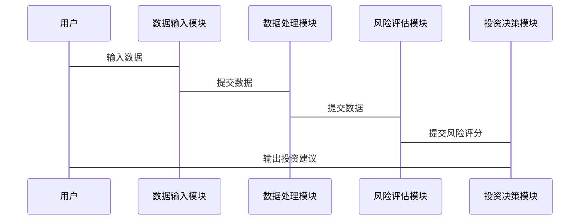

                 


# 彼得林奇的"成长股"在不同监管环境下的风险评估

## 关键词：彼得·林奇，成长股，监管环境，风险评估，投资策略

## 摘要

本文深入分析了彼得·林奇的成长股投资理念，并结合不同监管环境下的风险因素，提出了系统化的风险评估模型。通过理论分析、算法构建、案例研究和系统设计，全面探讨了成长股投资在不同监管环境下的风险特征及应对策略。

---

# 第一部分：彼得林奇的成长股投资理念

## 第1章：彼得·林奇与成长股投资概述

### 1.1 彼得·林奇与成长股投资理念

#### 1.1.1 彼得·林奇的生平简介

彼得·林奇（Peter Lynch）是美国著名的职业基金经理人，被誉为“成长股投资之父”。他在富达投资管理公司（Fidelity Investments）的麦哲伦基金（Magellan Fund）任职期间，创造了辉煌的投资业绩，年化回报率超过29%，为投资者创造了巨额财富。

#### 1.1.2 成长股投资的核心理念

彼得·林奇的成长股投资理念强调选择那些收入和利润快速增长的公司。他提出，成长股的核心特征是公司收入增长率和利润增长率高于行业平均水平，并且公司具有良好的管理团队和强大的竞争优势。

#### 1.1.3 成长股投资的哲学与方法

彼得·林奇认为，投资成长股的关键在于选择那些能够持续增长的公司，并且这些公司的管理层能够合理利用资金，实现股东价值的最大化。他强调，投资者需要深入研究公司的基本面，关注公司的财务数据和行业地位。

### 1.2 成长股的定义与特征

#### 1.2.1 成长股的定义

成长股是指那些收入和利润快速增长，且预期未来能够继续保持增长的公司股票。这些公司通常处于高速发展的行业，具有较大的市场潜力。

#### 1.2.2 成长股的核心特征

- **收入增长率高**：成长股公司的收入增长率通常高于行业平均水平。
- **利润增长率高**：成长股公司的净利润增长率通常高于行业平均水平。
- **行业地位稳固**：成长股公司通常在行业内具有较强的竞争力和市场份额。
- **管理团队优秀**：成长股公司的管理层通常具有丰富的行业经验和良好的管理能力。

#### 1.2.3 成长股与价值股的对比

| 特性       | 成长股                          | 价值股                          |
|------------|---------------------------------|---------------------------------|
| 估值       | 高估值                         | 低估值                         |
| 收益       | 高增长                         | 稳定增长                       |
| 行业       | 高增长行业                     | 成熟行业                       |
| 风险       | 高风险                         | 中低风险                       |

### 1.3 成长股投资的优劣势分析

#### 1.3.1 成长股投资的优势

- **高增长潜力**：成长股公司具有较高的收入和利润增长率，未来可能实现更高的股价涨幅。
- **市场关注度高**：成长股公司通常受到投资者的高度关注，市场流动性较高。
- **行业领先地位**：成长股公司往往处于行业领先地位，具有较强的竞争优势。

#### 1.3.2 成长股投资的劣势

- **高波动性**：成长股公司股票价格波动较大，容易受到市场情绪的影响。
- **高估值风险**：成长股公司通常估值较高，容易受到市场调整的影响。
- **政策风险**：成长股公司往往处于高增长行业，容易受到政策变化的影响。

#### 1.3.3 成长股投资的适用场景

- **长期投资**：适合长期投资者，能够耐心等待成长股公司的价值兑现。
- **高风险承受能力**：适合风险承受能力强的投资者。
- **行业选择**：适合选择处于高速发展阶段行业的投资者。

---

## 第2章：监管环境对投资的影响

### 2.1 监管环境的定义与分类

#### 2.1.1 监管环境的定义

监管环境是指政府或其他监管机构对市场、行业和企业的监管政策和法规的总和。监管环境的强度和方向会影响企业的经营环境和投资风险。

#### 2.1.2 不同类型的监管环境

- **弱监管环境**：监管力度较小，企业经营自由度较高，但市场可能存在较大的无序竞争。
- **强监管环境**：监管力度较大，企业需要遵守更多的法规和政策，市场秩序较为规范。

#### 2.1.3 监管环境对企业的影响

监管环境直接影响企业的经营成本、市场准入、竞争格局和利润空间。在强监管环境下，企业需要投入更多的资源应对监管要求，而在弱监管环境下，企业可以更加灵活地经营。

---

## 第3章：成长股在不同监管环境下的风险特征

### 3.1 成长股在弱监管环境下的风险

#### 3.1.1 市场波动性风险

在弱监管环境下，市场波动性较大，成长股公司股票价格容易受到市场情绪的影响，导致股价波动较大。

#### 3.1.2 企业经营风险

在弱监管环境下，企业可能面临较高的经营风险。由于监管力度较小，企业可能在经营过程中出现违规行为，导致企业声誉受损或面临法律风险。

#### 3.1.3 法律合规风险

在弱监管环境下，企业可能面临较高的法律合规风险。由于监管力度较小，企业可能在经营过程中忽视法律法规，导致法律风险。

### 3.2 成长股在强监管环境下的风险

#### 3.2.1 政策变化风险

在强监管环境下，政策变化风险较高。政府可能会出台新的监管政策，影响企业的经营环境和利润空间。

#### 3.2.2 监管罚款风险

在强监管环境下，企业需要遵守更多的法规和政策，否则可能面临监管罚款的风险。

#### 3.2.3 行业竞争加剧风险

在强监管环境下，行业竞争可能加剧。政府可能会限制市场准入，导致行业竞争加剧，企业利润空间受到压缩。

### 3.3 不同行业监管环境对成长股的影响

#### 3.3.1 高科技行业监管的影响

在高科技行业，监管环境的影响较大。政府可能会出台新的监管政策，影响企业的技术创新和市场准入。

#### 3.3.2 金融行业监管的影响

在金融行业，监管环境的影响更为直接。政府可能会出台新的金融监管政策，影响金融企业的经营环境和利润空间。

#### 3.3.3 消费行业监管的影响

在消费行业，监管环境的影响主要体现在产品质量和消费者保护方面。政府可能会出台新的产品质量监管政策，影响企业的经营环境。

---

## 第4章：成长股风险评估模型的构建

### 4.1 风险评估模型的定义与分类

#### 4.1.1 风险评估模型的定义

风险评估模型是指通过数学方法和模型，对投资标的的风险进行量化和评估的工具。成长股风险评估模型旨在通过分析成长股公司面临的各种风险因素，量化其风险水平。

#### 4.1.2 风险评估模型的分类

- **定量模型**：通过数学公式和数据进行风险评估。
- **定性模型**：通过定性分析和主观判断进行风险评估。
- **混合模型**：结合定量和定性分析进行风险评估。

### 4.2 成长股风险评估模型的构建步骤

#### 4.2.1 确定风险因素

成长股公司面临的风险因素包括市场风险、政策风险、行业风险、财务风险等。

#### 4.2.2 数据收集与处理

收集成长股公司的历史数据和行业数据，进行数据清洗和预处理。

#### 4.2.3 模型构建与验证

通过数学公式和算法，构建成长股风险评估模型，并通过历史数据验证模型的准确性。

---

## 第5章：成长股风险评估的系统设计

### 5.1 系统功能设计

#### 5.1.1 风险评估模块

- **数据输入**：输入成长股公司的财务数据和行业数据。
- **风险因子分析**：分析成长股公司面临的各种风险因素。
- **风险评分**：根据风险因子，计算成长股公司的风险评分。

#### 5.1.2 投资决策模块

- **投资建议**：根据风险评分，给出投资建议。
- **风险预警**：设置风险预警机制，及时提醒投资者潜在风险。

### 5.2 系统架构设计

#### 5.2.1 系统架构图


#### 5.2.2 系统接口设计

- **数据输入接口**：用于输入成长股公司的财务数据和行业数据。
- **数据处理接口**：用于对输入数据进行清洗和预处理。
- **风险评估接口**：用于计算成长股公司的风险评分。
- **投资决策接口**：用于根据风险评分给出投资建议。

### 5.3 系统交互流程

#### 5.3.1 系统交互序列图



---

## 第6章：项目实战与案例分析

### 6.1 环境安装与配置

#### 6.1.1 安装Python

```bash
# 安装Python
# 适用于MacOS
brew install python
# 适用于Linux
sudo apt-get install python3
# 适用于Windows
# 下载并安装Python安装包
```

#### 6.1.2 安装必要的库

```bash
pip install numpy pandas scikit-learn matplotlib
```

### 6.2 系统核心实现

#### 6.2.1 数据预处理代码

```python
import pandas as pd

# 读取数据
data = pd.read_csv('growth_stock_data.csv')

# 数据清洗
data.dropna(inplace=True)
data = data[~data.duplicated()]
```

#### 6.2.2 风险评估模型实现

```python
from sklearn.ensemble import RandomForestClassifier
from sklearn.model_selection import train_test_split

# 划分数据集
X = data.drop('risk_score', axis=1)
y = data['risk_score']

X_train, X_test, y_train, y_test = train_test_split(X, y, test_size=0.2)

# 训练模型
model = RandomForestClassifier()
model.fit(X_train, y_train)

# 预测结果
y_pred = model.predict(X_test)
```

#### 6.2.3 投资决策模块实现

```python
import numpy as np

# 风险评分计算
def calculate_risk_score(factors):
    # 假设factors是一个包含多个风险因子的数组
    # 使用简单的加权方法计算风险评分
    risk_score = np.dot(factors, [0.4, 0.3, 0.2, 0.1])
    return risk_score

# 投资建议
def investment_recommendation(risk_score):
    if risk_score < 0.3:
        return "买入"
    elif 0.3 <= risk_score < 0.6:
        return "观望"
    else:
        return "卖出"
```

### 6.3 案例分析

#### 6.3.1 案例背景

假设我们选择了一家高科技成长股公司，该公司处于高速发展的行业，收入和利润增长率均高于行业平均水平。

#### 6.3.2 数据分析

- 收入增长率：30%
- 利润增长率：25%
- 行业地位：行业前三
- 管理团队：优秀

#### 6.3.3 风险评估

- 市场波动性风险：中高
- 政策风险：中
- 企业经营风险：低
- 财务风险：低

#### 6.3.4 投资建议

根据风险评估模型，该公司的风险评分为0.5，属于观望区域。建议投资者保持观望，等待市场进一步明朗。

---

## 第7章：最佳实践与注意事项

### 7.1 最佳实践

#### 7.1.1 深入研究公司基本面

在投资成长股之前，投资者需要深入研究公司的基本面，包括财务数据、行业地位和管理团队。

#### 7.1.2 关注政策变化

投资者需要密切关注政策变化，尤其是在强监管环境下，政策变化可能对成长股公司产生重大影响。

#### 7.1.3 分散投资风险

为了分散投资风险，投资者可以考虑分散投资于多个成长股公司，避免过度集中。

### 7.2 小结

本文通过分析彼得·林奇的成长股投资理念，结合不同监管环境下的风险因素，提出了系统化的风险评估模型。通过理论分析、算法构建、案例研究和系统设计，全面探讨了成长股投资在不同监管环境下的风险特征及应对策略。

### 7.3 注意事项

- **数据质量**：数据预处理是模型构建的关键步骤，数据质量直接影响模型的准确性。
- **模型选择**：选择合适的模型和算法，能够提高风险评估的准确性。
- **模型验证**：通过历史数据验证模型的准确性，确保模型的有效性。

### 7.4 拓展阅读

- 彼得·林奇的《彼得·林奇的成功投资》
- 《投资学》（格理格曼著）
- 《风险管理与金融创新》（罗斯著）

---

## 关键词标签

#投资 #风险管理 #成长股 #彼得林奇 #监管环境

