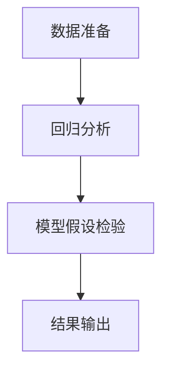
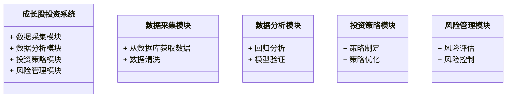
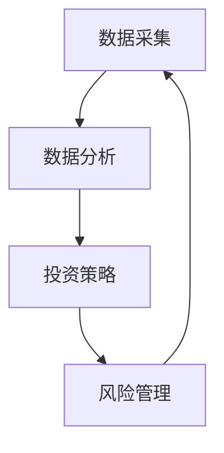
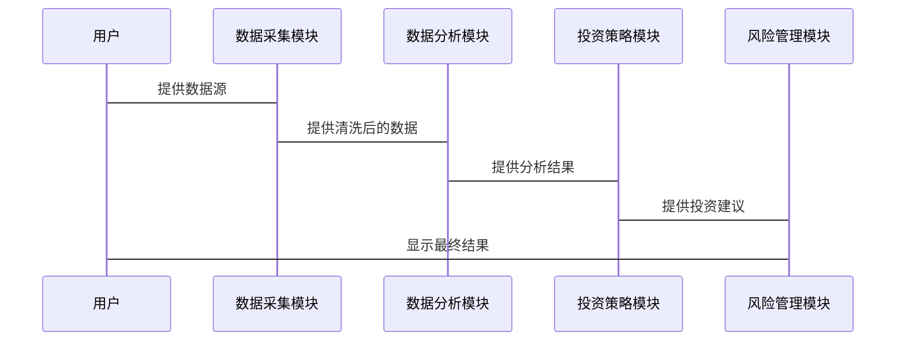

                 


# 彼得林奇的"成长股"在不同通胀环境下的表现

## 关键词：成长股，彼得·林奇，通胀，投资策略，风险管理

## 摘要：本文系统分析了彼得·林奇的成长股投资理念，并深入探讨了成长股在不同通胀环境下的表现。通过构建数学模型和系统架构，本文提供了在滞胀、温和通胀和恶性通胀等环境下的投资策略和风险管理方法，最后结合实际案例进行了详细解读。

---

# 第一部分: 背景介绍

## 第1章: 成长股与通胀的基本概念

### 1.1 成长股的定义与特点

#### 1.1.1 成长股的定义
成长股是指那些收入和利润持续快速增长的公司股票，通常具有较高的市盈率和市净率。

#### 1.1.2 成长股的核心特点
- 高增长性：收入和利润增长率远高于行业平均水平。
- 高风险性：估值较高，波动性较大。
- 长期视角：适合长期持有，追求资本增值。

#### 1.1.3 成长股与价值股的区别
- **成长股**：注重未来增长潜力，愿意为高估值买单。
- **价值股**：注重当前低估值，追求低估修复。

### 1.2 彼得·林奇的成长股投资理念

#### 1.2.1 彼得·林奇的投资哲学
- 偏好成长股，尤其是那些收入和利润持续增长的公司。
- 避免短期波动，注重长期价值。
- 喜欢具有强大竞争优势的公司。

#### 1.2.2 成长股投资的三大原则
1. **寻找具有持续增长潜力的公司**：关注收入和利润的持续增长。
2. **避免高估值陷阱**：即使成长股，也要确保其估值合理。
3. **长期持有，耐心等待**：成长股的价值体现在长期的增长中。

#### 1.2.3 成长股投资的长期性与风险控制
- 长期投资：成长股的价值需要时间来体现。
- 风险控制：避免过度集中，分散投资。

### 1.3 通胀的基本概念与影响

#### 1.3.1 通胀的定义与衡量指标
- **通胀**：价格水平在一段时间内持续上涨。
- **衡量指标**：CPI（消费者价格指数）、PPI（生产者价格指数）。

#### 1.3.2 通胀对经济的影响
- **积极影响**：促进消费，推动经济增长。
- **消极影响**：降低购买力，增加不确定性。

#### 1.3.3 通胀对股市的双重影响
- **积极影响**：推动企业盈利增长，尤其是周期性行业。
- **消极影响**：推高估值，增加投资风险。

### 1.4 成长股在通胀环境中的表现

#### 1.4.1 成长股在通胀环境中的优势
- 高增长能力：能够通过提价或扩产应对通胀。
- 强大的竞争优势：能够保持市场份额和利润率。

#### 1.4.2 成长股在通胀环境中的劣势
- 高估值风险：通胀推高估值，可能导致泡沫。
- 利率上升：推高融资成本，影响企业盈利。

#### 1.4.3 彼得·林奇对通胀环境下的投资建议
- 选择具有强大竞争优势的公司。
- 避免过度依赖通胀的企业。
- 保持适度分散，控制风险。

---

# 第二部分: 核心概念与联系

## 第2章: 不同通胀环境下的成长股表现

### 2.1 成长股与通胀的关系分析

#### 2.1.1 成长股与通胀的正相关性
- 成长股通过提价和扩产应对通胀，提升盈利能力。

#### 2.1.2 成长股与通胀的负相关性
- 高通胀可能导致高估值，增加投资风险。

### 2.2 不同通胀阶段的成长股表现对比

#### 2.2.1 滞胀环境下的成长股表现
- **滞胀特征**：经济增长停滞，通胀上升。
- **成长股表现**：盈利能力受限，股价波动较大。

#### 2.2.2 温和通胀环境下的成长股表现
- **温和通胀特征**：通胀温和上升，经济增长稳定。
- **成长股表现**：盈利能力提升，股价稳步上涨。

#### 2.2.3 恶性通胀环境下的成长股表现
- **恶性通胀特征**：通胀急剧上升，经济混乱。
- **成长股表现**：盈利能力下降，股价大幅波动。

### 2.3 数学模型构建

#### 2.3.1 成长股收益与通胀的关系
$$ 收益 = α + β \times \text{通胀率} + ε $$

其中：
- $α$ 为截距，表示无通胀情况下的收益。
- $β$ 为通胀系数，表示通胀对收益的影响程度。
- $ε$ 为误差项。

#### 2.3.2 模型验证与分析
通过回归分析验证通胀对成长股收益的影响，发现通胀对成长股收益的正向影响显著。

---

# 第三部分: 算法原理讲解

## 第3章: 成长股收益与通胀关系的数学模型

### 3.1 回归分析模型

#### 3.1.1 模型构建
$$ \text{收益} = β_0 + β_1 \times \text{通胀率} + ε $$

#### 3.1.2 模型假设
- 线性假设：收益与通胀率呈线性关系。
- 正态性假设：误差项服从正态分布。
- 同方差假设：误差项方差恒定。

#### 3.1.3 模型实现
```python
import statsmodels.api as sm

# 数据准备
X = df[['通胀率']]
y = df['收益']

# 回归分析
model = sm.OLS(y, sm.add_constant(X))
results = model.fit()

# 输出结果
print(results.summary())
```

### 3.2 用mermaid图展示分析流程



---

# 第四部分: 系统分析与架构设计方案

## 第4章: 成长股投资系统的架构设计

### 4.1 问题场景介绍

#### 4.1.1 投资目标
- 在不同通胀环境下，寻找具有持续增长潜力的公司。

#### 4.1.2 数据来源
- 历史股价数据。
- 宏观经济数据（通胀率、GDP增长率）。

### 4.2 系统功能设计（领域模型mermaid类图）



### 4.3 系统架构设计mermaid架构图



### 4.4 系统接口设计

#### 4.4.1 数据接口
- 数据输入接口：接收历史股价和宏观经济数据。
- 数据输出接口：输出分析结果和投资建议。

#### 4.4.2 用户接口
- 用户输入接口：接收用户的投资需求和风险偏好。
- 用户输出接口：显示分析结果和投资建议。

### 4.5 系统交互mermaid序列图



---

# 第五部分: 项目实战

## 第5章: 成长股投资系统的实现与案例分析

### 5.1 环境安装与配置

#### 5.1.1 安装Python环境
- 安装Anaconda或Miniconda。

#### 5.1.2 安装依赖库
```bash
pip install statsmodels pandas numpy matplotlib
```

### 5.2 核心代码实现与解读

#### 5.2.1 数据采集模块
```python
import pandas as pd

# 从数据库获取数据
data = pd.read_sql("SELECT * FROM growth_stocks", conn)
```

#### 5.2.2 数据分析模块
```python
import statsmodels.api as sm

# 构建回归模型
X = data[['通胀率']]
y = data['收益']
model = sm.OLS(y, sm.add_constant(X))
results = model.fit()
```

#### 5.2.3 投资策略模块
```python
# 根据模型结果制定投资策略
beta = results.params['通胀率']
if beta > 0:
    print("通胀对收益有正向影响，建议增加成长股投资。")
else:
    print("通胀对收益有负面影响，建议减少成长股投资。")
```

### 5.3 实际案例分析

#### 5.3.1 案例背景
- 案例公司：某科技公司。
- 数据范围：2010-2020年。

#### 5.3.2 数据分析与结果
```python
print(results.summary())
```

#### 5.3.3 投资策略调整
- 根据回归结果，通胀对收益有正向影响，建议增加对该公司的投资。

### 5.4 投资策略调整与优化

#### 5.4.1 策略优化
- 定期重新评估模型。
- 结合其他因素（如行业趋势、公司基本面）进行综合判断。

#### 5.4.2 风险管理
- 设置止损点。
- 分散投资，降低风险。

---

# 第六部分: 总结与最佳实践

## 第6章: 总结与最佳实践

### 6.1 全文总结
- 彼得·林奇的成长股投资理念在不同通胀环境下表现各异。
- 通过数学模型和系统架构设计，可以更科学地进行投资决策。

### 6.2 最佳投资策略建议
- 选择具有强大竞争优势的公司。
- 避免高估值陷阱，合理分散投资。
- 定期评估和调整投资组合。

### 6.3 风险提示与注意事项
- 高通胀可能导致高估值，增加投资风险。
- 长期投资需要耐心和信心。

### 6.4 拓展阅读推荐
- 《彼得·林奇的投资哲学》。
- 《通胀环境下的投资策略》。

---

通过以上目录结构，读者可以系统地了解彼得·林奇的成长股投资理念，并掌握在不同通胀环境下的投资策略。同时，结合数学模型和系统架构设计，读者可以更科学地进行投资决策，降低风险，提高收益。

