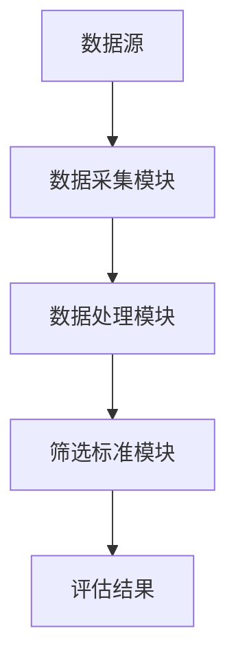
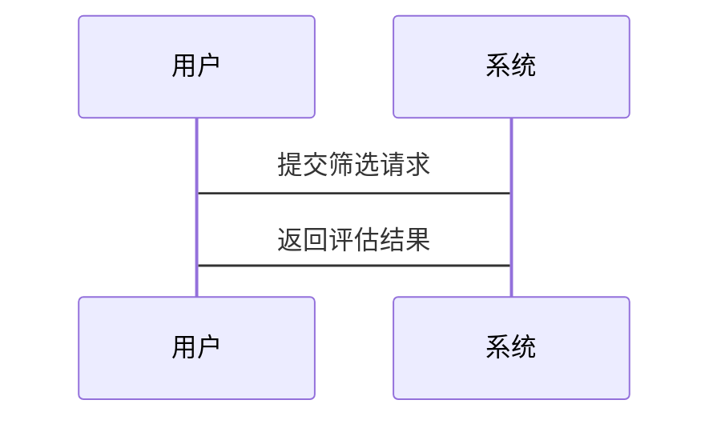

                 


# 彼得林奇的"成长股"筛选标准

## 关键词：
- 彼得·林奇
- 成长股
- 筛选标准
- 财务指标
- 投资策略

## 摘要：
彼得·林奇是全球著名投资专家，其成长股筛选标准为投资者提供了系统化的投资方法。本文将详细解析彼得·林奇的成长股筛选标准，包括财务指标分析、行业地位评估、竞争优势分析等方面，并通过实际案例展示其应用。通过系统化的筛选流程，投资者可以更有效地识别具有长期增长潜力的优质成长股。

## 第一部分: 成长股投资概述

### 第1章: 成长股的基本概念

#### 1.1 成长股的定义与特点
成长股是指那些具有持续增长潜力的公司股票，其核心特征包括：
- 高营收增长率
- 净利润持续增长
- 良好的财务健康状况

#### 1.2 彼得·林奇的成长股投资理念
彼得·林奇强调长期投资，关注公司基本面和成长潜力，认为成长股是投资组合中的重要组成部分。

#### 1.3 成长股筛选标准的背景与意义
通过系统化的筛选标准，投资者可以有效识别具备长期增长潜力的公司，降低投资风险。

## 第二部分: 成长股筛选的核心标准

### 第2章: 财务指标分析

#### 2.1 营收与利润增长
- 营收增长率计算公式：
  $$(\text{本年营收} - \text{上年营收}) / \text{上年营收} \times 100\%$$
- 净利润增长率：
  $$\text{净利润增长率} = (\text{本年净利润} - \text{上年净利润}) / \text{上年净利润} \times 100\%$$

#### 2.2 资产负债结构
- 资产负债率计算公式：
  $$\text{资产负债率} = \text{总负债} / \text{总资产} \times 100\%$$

#### 2.3 现金流状况
- 自由现金流计算公式：
  $$\text{自由现金流} = \text{净利润} + \text{折旧} + \text{摊销} - \text{资本支出}$$

### 第3章: 行业地位与竞争优势

#### 3.1 行业分析与选择
- 行业生命周期分析
- 竞争结构评估

#### 3.2 核心竞争力分析
- 技术壁垒
- 市场份额
- 创新能力

### 第4章: 管理团队与治理结构

#### 4.1 管理层素质评估
- 经验与能力
- 诚信与决策

#### 4.2 公司治理结构
- 股权结构
- 治理透明度

## 第三部分: 成长股筛选标准的系统化应用

### 第5章: 成长股筛选的系统架构

#### 5.1 系统功能设计
- 数据采集模块：收集公司财务数据、行业信息等。
- 标准筛选模块：应用彼得·林奇的标准进行评估。
- 综合评估模块：结合多因素进行综合评分。

#### 5.2 系统架构设计
使用Mermaid绘制系统架构图：



#### 5.3 系统接口设计
- 数据接口：API接口用于数据获取。
- 输出接口：生成评估报告。

#### 5.4 系统交互设计
使用Mermaid绘制交互流程图：



## 第四部分: 项目实战

### 第6章: 成长股筛选系统实现

#### 6.1 环境安装
- 安装Python、Pandas、Matplotlib等工具。

#### 6.2 核心实现代码
```python
import pandas as pd

def calculate_growth_rate(data):
    return (data['current'] - data['previous']) / data['previous'] * 100

def is_profitable(data, threshold=10):
    return calculate_growth_rate(data) > threshold

def main():
    data = {'revenue': [100, 150, 200],
            'net_profit': [20, 30, 40]}
    df = pd.DataFrame(data)
    growth_rates = df.apply(calculate_growth_rate)
    profitable = is_profitable(growth_rates)
    print("Profitable:", profitable)

if __name__ == "__main__":
    main()
```

#### 6.3 案例分析
以科技行业为例，筛选具有高营收增长率和良好现金流的公司。

## 第五部分: 总结与展望

### 第7章: 总结与注意事项

#### 7.1 最佳实践
- 定期复盘和调整筛选标准
- 结合市场环境动态优化

#### 7.2 小结
彼得·林奇的成长股筛选标准为投资者提供了科学的指导，但需要结合实际市场情况灵活运用。

## 结束语
通过系统化的方法和实践，投资者可以更有效地识别和投资成长股，实现长期收益。

---

以上是《彼得林奇的"成长股"筛选标准》的完整目录和内容框架，涵盖了从理论到实践的各个方面，帮助投资者全面理解和应用成长股的筛选标准。

