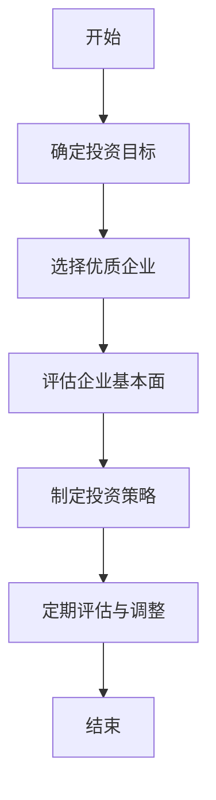
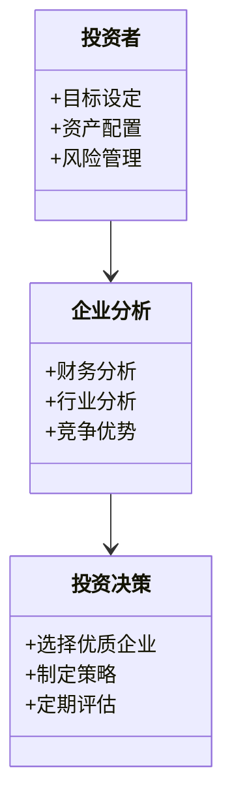

                 


# 彼得林奇的投资纪律

> 关键词：投资纪律，彼得林奇，价值投资，风险管理，投资策略

> 摘要：彼得林奇作为投资界的传奇人物，他的投资纪律和策略为无数投资者提供了宝贵的借鉴。本文将深入分析彼得林奇的投资纪律，探讨其核心原则、风险管理方法以及如何在实际投资中应用这些纪律。通过系统的分析和实际案例，我们将揭示彼得林奇投资成功背后的秘密，并为读者提供实用的指导。

---

## 第1章：彼得林奇的投资理念

### 1.1 彼得林奇的投资哲学

#### 1.1.1 价值投资的定义与核心理念

价值投资是一种投资策略，强调以低于内在价值的价格购买优质资产。彼得林奇是价值投资的坚定拥护者，他认为市场的短期波动并不影响企业的长期价值。以下是价值投资的核心理念：

- **内在价值**：资产的真正价值是其未来现金流的现值。
- **安全边际**：购买价格应低于内在价值，以降低风险。
- **长期视角**：关注企业的长期增长潜力，而非短期市场波动。

#### 1.1.2 彼得林奇的投资风格与特点

彼得林奇以其独特的投资风格闻名，他的投资纪律体现在以下几个方面：

- **分散投资**：避免将所有资金投入到单一资产或行业，降低风险。
- **注重基本面**：深入分析企业的财务状况、管理层能力和行业地位。
- **逆向投资**：在市场恐慌时寻找被低估的资产，在市场繁荣时保持警惕。

#### 1.1.3 投资纪律在彼得林奇策略中的重要性

投资纪律是彼得林奇成功的关键。他强调，即使市场情绪高涨或低落，投资者也必须坚持自己的纪律，避免被短期市场波动干扰。

---

### 1.2 投资纪律的背景与意义

#### 1.2.1 投资纪律的定义

投资纪律是指投资者在投资过程中遵循的一套系统化的原则、规则和流程，以确保投资决策的科学性和一致性。

#### 1.2.2 投资纪律的核心要素

- **目标设定**：明确投资目标和风险承受能力。
- **策略执行**：严格按照既定策略选择和管理资产。
- **纪律执行**：在市场波动中坚持策略，避免情绪化决策。

#### 1.2.3 投资纪律在彼得林奇投资策略中的应用

彼得林奇的投资纪律体现在他的选股标准和投资组合管理中。他始终坚持以下原则：

- **选择具有竞争优势的企业**：投资那些在行业中具有竞争优势的企业。
- **关注管理层**：管理层的能力和决策对企业价值至关重要。
- **长期持有**：避免频繁交易，降低交易成本和税收负担。

---

### 1.3 投资纪律的重要性

#### 1.3.1 投资纪律对投资决策的影响

投资纪律能够帮助投资者避免情绪化决策，确保在市场波动中保持冷静。

#### 1.3.2 投资纪律在风险管理中的作用

通过严格的纪律，投资者可以有效控制风险，避免过度杠杆和盲目投资。

#### 1.3.3 投资纪律对长期投资收益的贡献

长期坚持投资纪律能够帮助投资者实现稳定收益，避免短期亏损。

---

## 第2章：彼得林奇的投资纪律体系

### 2.1 投资纪律的核心原则

#### 2.1.1 长期投资与价值发现

彼得林奇强调长期投资的重要性，他认为短期市场波动无法决定资产的长期价值。

#### 2.1.2 风险控制与资产配置

合理的资产配置是控制风险的关键。彼得林奇建议投资者根据自身的风险承受能力和投资目标进行资产配置。

#### 2.1.3 股票选择与市场时机

彼得林奇认为，市场时机难以预测，因此应选择具有长期增长潜力的优质股票。

---

### 2.2 投资纪律的关键要素

#### 2.2.1 资产评估与定价模型

彼得林奇使用多种方法评估企业的内在价值，包括现金流折现法和市盈率分析。

#### 2.2.2 财务分析与公司基本面

深入分析企业的财务报表，关注利润、负债和现金流等关键指标。

#### 2.2.3 行业分析与竞争环境

研究企业的行业地位和竞争优势，选择具有长期增长潜力的行业。

---

### 2.3 投资纪律的实施步骤

#### 2.3.1 确定投资目标与策略

明确投资目标和策略，制定详细的行动计划。

#### 2.3.2 选择优质企业与管理层

选择具有竞争优势和优秀管理层的优质企业。

#### 2.3.3 定期评估与调整投资组合

定期评估投资组合的表现，根据市场变化和企业情况调整投资策略。

---

## 第3章：投资纪律与风险管理

### 3.1 风险管理的核心原则

#### 3.1.1 风险的定义与分类

风险是投资中不可忽视的因素，通常分为市场风险、流动性风险和信用风险等。

#### 3.1.2 投资纪律在风险管理中的作用

通过严格的纪律，投资者可以有效控制风险，避免过度杠杆和盲目投资。

#### 3.1.3 风险控制的具体措施

- **分散投资**：避免将所有资金投入到单一资产或行业。
- **设定止损**：在市场波动较大时，设定止损点以限制损失。
- **定期复盘**：定期评估投资组合的表现，及时调整策略。

---

## 第4章：彼得林奇投资纪律的数学模型与算法

### 4.1 投资纪律的数学模型

彼得林奇的投资纪律可以通过数学模型进行分析。以下是他的核心模型：

$$
\text{内在价值} = \sum_{t=1}^{n} \frac{\text{现金流}_t}{(1 + r)^t}
$$

其中，$r$ 是折现率，$\text{现金流}_t$ 是第$t$年的现金流。

### 4.2 投资纪律的算法流程

以下是彼得林奇投资纪律的算法流程图：



---

## 第5章：彼得林奇投资纪律的系统架构设计

### 5.1 系统功能设计

以下是彼得林奇投资纪律的系统功能设计类图：



---

## 第6章：彼得林奇投资纪律的项目实战

### 6.1 环境安装

以下是一个简单的Python环境安装步骤：

1. 安装Python：可以从官网下载并安装最新版本的Python。
2. 安装Jupyter Notebook：使用pip安装`jupyter notebook`。
3. 安装必要的库：安装`pandas`、`numpy`、`matplotlib`等库。

### 6.2 核心代码实现

以下是彼得林奇投资纪律的Python实现示例：

```python
import pandas as pd
import numpy as np

# 示例数据：假设我们分析一家企业的财务数据
data = {
    '收入': [100, 200, 300],
    '利润': [20, 30, 40],
    '现金流': [50, 60, 70]
}
df = pd.DataFrame(data)

# 计算现金流折现
def calculate_intrinsic_value(df, discount_rate):
    return df['现金流'].sum() / (1 + discount_rate)

# 示例计算
discount_rate = 0.05
intrinsic_value = calculate_intrinsic_value(df, discount_rate)
print(f"内在价值为：{intrinsic_value}")
```

### 6.3 案例分析

假设我们分析一家企业，以下是具体的案例分析：

1. **目标设定**：明确投资目标为长期资本增值。
2. **企业分析**：分析企业的财务报表，发现其现金流稳定，具有竞争优势。
3. **投资决策**：决定投资该企业，并制定长期持有策略。
4. **定期评估**：每季度评估企业表现，根据市场变化调整投资组合。

---

## 第7章：总结与建议

### 7.1 最佳实践

- **坚持长期投资**：避免短期市场波动的干扰。
- **深入分析企业基本面**：选择具有竞争优势和优秀管理层的企业。
- **定期评估与调整**：根据市场变化和企业情况调整投资策略。

### 7.2 小结

彼得林奇的投资纪律为投资者提供了宝贵的借鉴。通过严格的纪律和科学的分析，投资者可以实现长期稳定的收益。

### 7.3 注意事项

- **避免情绪化决策**：市场波动时要保持冷静。
- **分散投资**：避免将所有资金投入到单一资产或行业。
- **持续学习**：关注市场变化和企业动态，不断提升自己的投资能力。

### 7.4 拓展阅读

- 《彼得林奇选股术》：深入探讨彼得林奇的选股方法。
- 《投资之道》：介绍投资大师的策略和经验。

---

通过本文的详细分析，我们可以看到彼得林奇的投资纪律不仅是一种策略，更是一种科学的投资方法。希望本文能够为投资者提供实用的指导，并帮助他们在复杂的市场环境中实现长期稳定的收益。

