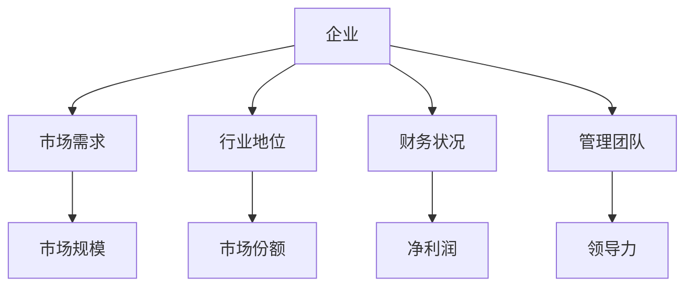
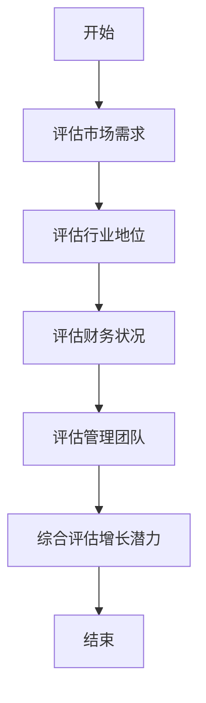
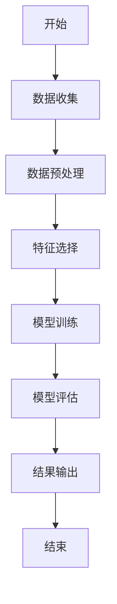
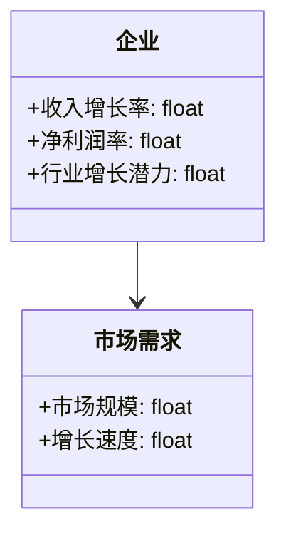
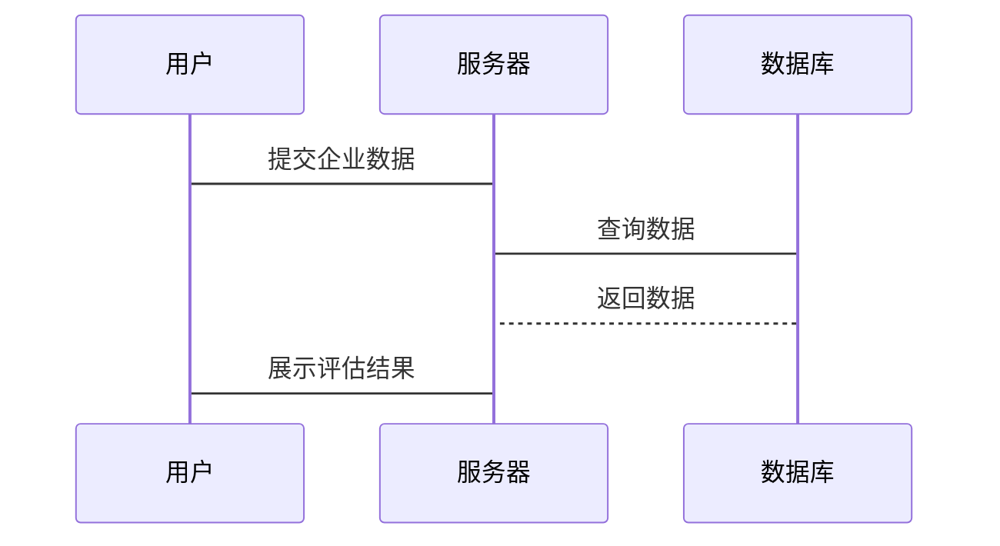

                 


# 彼得林奇的"未来增长潜力"分析法

## 关键词
彼得林奇、未来增长潜力、投资分析、算法原理、系统设计、案例分析

## 摘要
彼得·林奇作为投资界的传奇人物，以其独特的分析法闻名。本文深入探讨了“未来增长潜力”这一核心概念，从定义、评估维度、算法原理到实际应用，全面解析了林奇分析法的精髓。通过系统设计和实际案例，展示了如何运用该方法进行投资决策，帮助读者掌握这一经典投资策略。

---

## 第1章：引言

### 1.1 本书的目的与意义
#### 1.1.1 为什么研究未来增长潜力
- 企业的未来增长潜力是投资者评估公司价值的关键因素。
- 通过分析增长潜力，投资者可以识别高成长性企业，做出更明智的投资决策。

#### 1.1.2 彼得·林奇分析法的核心价值
- 林奇分析法以其独特的视角和方法，帮助投资者发现具有长期增长潜力的企业。
- 该方法结合了定量分析和定性判断，提供了全面的投资评估框架。

#### 1.1.3 本书的结构与学习方法
- 本书从理论到实践，逐步引导读者掌握林奇分析法。
- 通过案例分析和实际操作，帮助读者将理论应用于实践。

### 1.2 彼得·林奇与他的投资哲学
#### 1.2.1 彼得·林奇的生平简介
- 彼得·林奇是美国著名投资经理人，曾任富达投资的经理，管理着麦哲伦基金，取得了卓越的投资业绩。
- 他的投资哲学以深入的基本面分析和对企业的长期关注为特点。

#### 1.2.2 林奇投资法的核心理念
- 买入并持有：林奇主张长期投资，避免频繁交易。
- 基于基本面分析：通过分析企业的财务状况、行业地位和竞争优势来评估其增长潜力。

#### 1.2.3 林奇分析法的适用范围
- 适用于企业成长阶段的评估。
- 适合长期投资者和机构投资者。

---

## 第2章：未来增长潜力的背景与重要性

### 2.1 什么是未来增长潜力
#### 2.1.1 增长潜力的定义
- 企业在未来一定时期内实现收入和利润增长的可能性。
- 包括内部因素（如管理能力、技术创新）和外部因素（如市场需求、行业趋势）。

#### 2.1.2 增长潜力的核心要素
- 市场需求：企业的市场规模和增长空间。
- 行业地位：企业在行业中的竞争地位。
- 财务状况：企业的盈利能力、现金流和资产负债情况。
- 管理团队：领导层的战略规划和执行能力。

#### 2.1.3 增长潜力的边界与外延
- 边界：增长潜力不能无限放大，需结合市场容量和企业资源。
- 外延：增长潜力不仅限于财务指标，还包括品牌影响力、客户忠诚度等因素。

### 2.2 未来增长潜力的重要性
#### 2.2.1 增长潜力对企业战略的意义
- 企业可以通过评估增长潜力制定长期战略规划。
- 增长潜力高的企业更容易吸引投资者和人才。

#### 2.2.2 增长潜力对投资决策的影响
- 投资者通过评估增长潜力选择具有长期增值潜力的企业。
- 增长潜力高的企业通常具有更高的股价表现。

#### 2.2.3 增长潜力与可持续发展的关系
- 可持续发展是企业长期增长的重要组成部分。
- 增长潜力高的企业通常在环保、社会责任等方面表现良好。

---

## 第3章：未来增长潜力的核心概念与联系

### 3.1 核心概念原理
#### 3.1.1 增长潜力的构成要素
- 市场需求：包括市场规模、增长速度和竞争格局。
- 行业地位：包括市场份额、竞争优势和行业壁垒。
- 财务状况：包括收入增长、利润率和现金流。
- 管理团队：包括战略规划能力、执行力和领导力。

#### 3.1.2 增长潜力的关键属性
- 可持续性：增长是否能够长期维持。
- 可实现性：增长目标是否可以通过现有资源实现。
- 风险承受能力：企业在面对市场波动和挑战时的应对能力。

#### 3.1.3 增长潜力的评估维度
- 宏观经济环境：包括经济周期、政策环境和国际贸易状况。
- 企业内部因素：包括技术创新、产品竞争力和成本优势。
- 行业趋势：包括行业发展方向和技术进步。

### 3.2 核心概念属性对比表格
| 评估维度 | 宏观经济环境 | 企业内部因素 | 行业趋势 |
|----------|--------------|---------------|----------|
| 定义     | 经济整体运行状况 | 企业的财务状况、管理能力 | 行业发展方向 |
| 影响     | 影响企业的外部环境 | 决定企业的内部竞争力 | 影响企业的市场机会 |
| 示例     | 经济增长、通货膨胀 | 资产负债率、研发投入 | 数字化转型、绿色能源 |

### 3.3 ER实体关系图与Mermaid流程图
#### 3.3.1 实体关系图（ER图）


#### 3.3.2 流程图（Mermaid）


---

## 第4章：未来增长潜力的算法原理

### 4.1 算法原理概述
#### 4.1.1 数据收集与预处理
- 数据来源：财务报表、行业报告、市场数据。
- 数据清洗：处理缺失值、异常值和重复数据。

#### 4.1.2 模型构建与训练
- 使用回归分析或机器学习模型预测增长潜力。
- 特征选择：选取关键的财务和市场指标。

#### 4.1.3 模型评估与优化
- 采用交叉验证评估模型性能。
- 调参优化提升预测准确性。

### 4.2 算法流程图


### 4.3 算法数学模型与公式
#### 4.3.1 增长潜力评估的数学模型
$$ \text{增长潜力} = \beta_1 x_1 + \beta_2 x_2 + \cdots + \beta_n x_n + \epsilon $$
其中，$x_i$是各个特征变量，$\beta_i$是对应的回归系数，$\epsilon$是误差项。

#### 4.3.2 举例说明与应用
假设我们有三个特征变量：收入增长率（$x_1$）、净利润率（$x_2$）、行业增长潜力（$x_3$）。
$$ \text{增长潜力} = 0.5x_1 + 0.3x_2 + 0.2x_3 + \epsilon $$

---

## 第5章：系统分析与架构设计方案

### 5.1 问题场景介绍
#### 5.1.1 未来增长潜力分析的典型场景
- 投资者需要评估某科技企业的增长潜力。
- 企业需要制定长期发展战略。

### 5.2 系统功能设计
#### 5.2.1 领域模型（Mermaid类图）


#### 5.2.2 系统功能模块划分
- 数据采集模块：收集企业数据。
- 数据处理模块：清洗和预处理数据。
- 模型训练模块：构建和训练预测模型。
- 结果展示模块：输出评估结果。

#### 5.2.3 用户角色与权限设计
- 管理员：管理用户和数据。
- 普通用户：提交企业数据并查看评估结果。

### 5.3 系统架构设计
#### 5.3.1 架构图（Mermaid架构图）
```mermaid
client --> 服务器
服务器 --> 数据库
```

#### 5.3.2 系统分层设计
- 表现层：用户界面。
- 业务逻辑层：处理用户请求。
- 数据访问层：与数据库交互。

#### 5.3.3 系统接口设计
- API接口：提供RESTful API供其他系统调用。

### 5.4 系统交互设计
#### 5.4.1 序列图（Mermaid序列图）


---

## 第6章：项目实战

### 6.1 环境安装
- 安装Python和相关库（如Pandas、Scikit-learn）。
- 安装Mermaid和系统设计工具。

### 6.2 系统核心实现源代码
```python
import pandas as pd
from sklearn.linear_model import LinearRegression

# 数据加载
data = pd.read_csv('growth_potential.csv')

# 特征选择
X = data[['收入增长率', '净利润率', '行业增长潜力']]
y = data['增长潜力']

# 模型训练
model = LinearRegression()
model.fit(X, y)

# 模型预测
predicted = model.predict(X)
```

### 6.3 代码应用解读与分析
- 数据加载：读取CSV文件中的企业数据。
- 特征选择：选取关键的财务指标。
- 模型训练：使用线性回归模型训练数据。
- 模型预测：对测试数据进行预测并输出结果。

### 6.4 实际案例分析
- 案例：评估某科技企业的增长潜力。
- 步骤：数据收集、预处理、模型训练、结果分析。

### 6.5 项目小结
- 项目目标：实现企业增长潜力的自动化评估。
- 项目成果：开发了一个基于林奇分析法的评估系统。

---

## 第7章：总结与展望

### 7.1 总结
- 彼得·林奇的未来增长潜力分析法是一种高效的投资评估工具。
- 本文从理论到实践，详细介绍了该方法的应用。

### 7.2 未来展望
- 结合人工智能技术，进一步优化增长潜力评估模型。
- 研究更多因素对增长潜力的影响，提升评估的准确性。

---

## 附录

### 附录A：工具指南
- 数据分析工具：Pandas、NumPy。
- 可视化工具：Matplotlib、Seaborn。
- 系统设计工具：Mermaid、PlantUML。

### 附录B：参考文献
- 彼得·林奇的著作《彼得·林奇的投资哲学》。
- 相关学术论文和研究报告。

---

通过以上结构和内容，您可以根据需要进一步扩展和撰写具体的章节内容。

