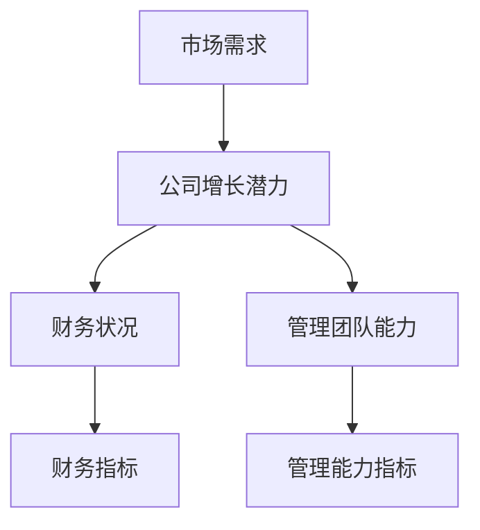
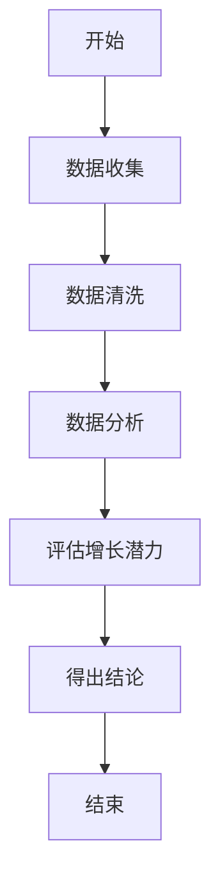

                 


# 彼得林奇的"未来增长潜力"分析法

> 关键词：彼得林奇，投资分析，增长潜力，市场分析，公司分析，技术博客

> 摘要：本文深入探讨了彼得·林奇的"未来增长潜力"分析法，从理论背景、核心概念、算法原理、系统架构到实际案例，全面解析了该方法的精髓。通过详细的技术分析和实战案例，帮助读者掌握如何运用这一方法进行投资决策。

---

## 第一部分：彼得林奇的"未来增长潜力"分析法概述

### 第1章：彼得林奇与"未来增长潜力"分析法的背景

#### 1.1 彼得林奇的投资哲学
- **1.1.1 彼得林奇的生平与投资成就**
  彼得·林奇是全球最著名的职业股票投资者之一，被誉为“普通股投资大师”。他从1977年到2000年担任富达麦哲伦基金的经理，创造了令人瞩目的投资业绩，年复合收益率高达13.5%。

- **1.1.2 彼得林奇的投资理念与方法**
  彼得林奇主张长期投资，注重基本面分析，尤其是对公司的财务状况、行业地位和管理团队的深度研究。他认为，投资的最终目标是找到那些能够在未来几年内实现增长的公司。

- **1.1.3 "未来增长潜力"分析法的核心思想**
  彼得林奇的“未来增长潜力”分析法是一种通过对公司基本面的全面评估，预测其在未来一段时间内的增长能力的方法。这种方法的核心在于将公司的财务数据、行业趋势和管理能力结合起来，找出那些具有可持续增长潜力的公司。

#### 1.2 "未来增长潜力"分析法的理论基础
- **1.2.1 投资分析的基本概念**
  投资分析的核心在于对公司未来现金流的预测，而现金流的预测依赖于对公司在未来几年内的增长潜力的评估。

- **1.2.2 市场分析与公司分析的结合**
  彼得林奇强调，市场分析和公司分析必须结合起来。市场分析帮助投资者理解行业趋势，而公司分析则帮助投资者找到那些在行业中具有竞争优势的公司。

- **1.2.3 增长潜力的定义与衡量标准**
  增长潜力是指公司在未来几年内实现收入和利润增长的能力。衡量标准包括收入增长率、净利润增长率、市场份额增长率等。

#### 1.3 分析法的应用范围与局限性
- **1.3.1 适用的行业与公司类型**
  该分析法适用于那些处于成长期或成熟期的行业，尤其是那些具有较高增长潜力的行业。公司类型方面，适合那些财务状况良好、管理团队稳定、行业地位突出的公司。

- **1.3.2 分析法的局限性与注意事项**
  该分析法的局限性在于其依赖于对未来市场环境的预测，而市场环境的变化往往难以预测。此外，该方法对管理团队的能力假设较高，如果公司管理团队发生变化，可能会影响分析结果。

- **1.3.3 与其他投资分析方法的对比**
  与技术分析相比，彼得林奇的分析法更注重基本面分析；与价值投资相比，该方法更关注公司的成长性。

### 1.4 本章小结
本章通过对彼得林奇的投资哲学和“未来增长潜力”分析法的背景分析，明确了该方法的核心思想和理论基础。同时，也探讨了其适用范围和局限性，为后续的分析奠定了基础。

---

## 第二部分："未来增长潜力"分析法的核心要素

### 第2章：分析法的核心概念与联系

#### 2.1 核心概念原理
- **2.1.1 市场需求的分析**
  市场需求是公司增长的核心驱动力。彼得林奇强调，投资者需要关注行业的整体增长趋势，以及公司在行业中的地位。

- **2.1.2 公司财务状况的评估**
  公司的财务状况是判断其增长潜力的重要依据。通过分析财务报表，可以评估公司的盈利能力、资产负债情况和现金流状况。

- **2.1.3 管理团队的能力评估**
  管理团队的能力是公司能否实现增长的关键因素。彼得林奇认为，投资者应该关注公司管理团队的稳定性、决策能力和战略眼光。

#### 2.2 核心要素对比分析
- **2.2.1 行业增长潜力与公司增长潜力的对比**
  行业增长潜力是指整个行业在未来几年内的增长空间，而公司增长潜力是指公司在行业中的具体表现。两者的结合可以帮助投资者找到那些在具有较大行业增长潜力的公司中表现优异的企业。

- **2.2.2 财务指标与非财务指标的对比**
  财务指标如收入增长率、净利润率等是衡量公司增长潜力的重要指标，而非财务指标如管理团队能力、创新能力等也是不可忽视的因素。

- **2.2.3 短期增长与长期增长的对比**
  短期增长可能受到市场周期性波动的影响，而长期增长则更多取决于公司的核心竞争力和行业趋势。

#### 2.3 ER实体关系图


#### 2.4 本章小结
本章通过对“未来增长潜力”分析法的核心概念和要素的分析，明确了市场需求、财务状况和管理能力对公司增长潜力的影响，并通过对比分析和实体关系图，展示了这些要素之间的关系。

---

## 第三部分："未来增长潜力"分析法的算法原理

### 第3章：分析法的算法原理

#### 3.1 分析流程


#### 3.2 数据分析方法
- **3.2.1 财务指标分析**
  通过分析公司的收入增长率、净利润增长率、毛利率等财务指标，评估公司的财务健康状况和盈利能力。

- **3.2.2 市场分析**
  通过分析行业趋势、市场份额、竞争对手情况等，评估公司在行业中的地位和竞争优势。

- **3.2.3 管理能力评估**
  通过分析公司管理团队的稳定性、决策能力和战略眼光，评估公司管理能力。

#### 3.3 数学模型与公式
- **3.3.1 增长潜力指数公式**
  增长潜力指数（GPI）= （收入增长率 × 30%）+ （净利润增长率 × 30%）+ （市场份额增长率 × 20%）+ （管理能力指数 × 20%）

  其中，管理能力指数可以通过公司管理团队的稳定性、决策能力和战略眼光等非财务指标进行评分，满分为10分。

- **3.3.2 示例计算**
  假设某公司收入增长率为20%，净利润增长率为15%，市场份额增长率为10%，管理能力指数为8分。则其增长潜力指数为：
  GPI = (20 × 0.3) + (15 × 0.3) + (10 × 0.2) + (8 × 0.2) = 6 + 4.5 + 2 + 1.6 = 14.1

  这表明该公司的增长潜力指数为14.1，属于较高增长潜力的公司。

#### 3.4 本章小结
本章通过详细的分析流程和数学模型，展示了如何通过彼得林奇的“未来增长潜力”分析法评估公司的增长潜力。通过公式和示例的计算，读者可以更好地理解该方法的实际应用。

---

## 第四部分：系统分析与架构设计

### 第4章：系统分析与架构设计方案

#### 4.1 项目介绍
本项目旨在开发一个基于彼得林奇的“未来增长潜力”分析法的投资分析系统，帮助投资者快速评估公司的增长潜力。

#### 4.2 系统功能设计
- **4.2.1 数据采集模块**
  采集公司财务数据、行业趋势数据和公司管理团队信息。

- **4.2.2 数据分析模块**
  对采集到的数据进行清洗和分析，计算增长潜力指数。

- **4.2.3 报告生成模块**
  根据分析结果生成投资报告，提供公司增长潜力的评估结果和投资建议。

#### 4.3 系统架构设计


#### 4.4 接口设计
- **API接口**
  提供RESTful API接口，供其他系统调用分析结果。

- **数据库接口**
  使用MySQL数据库存储公司数据和分析结果。

#### 4.5 本章小结
本章通过系统架构设计和功能模块划分，展示了如何将彼得林奇的分析法应用于实际的投资分析系统中。通过模块化设计，提高了系统的可扩展性和可维护性。

---

## 第五部分：项目实战

### 第5章：项目实战

#### 5.1 环境安装
- **Python版本**：Python 3.8或更高版本
- **依赖库**：pandas、numpy、scikit-learn

#### 5.2 核心代码实现
```python
import pandas as pd
import numpy as np

def calculate_growth_potential(revenue_growth, net_profit_growth, market_share_growth, management_capability):
    gp = (revenue_growth * 0.3) + (net_profit_growth * 0.3) + (market_share_growth * 0.2) + (management_capability * 0.2)
    return gp

# 示例数据
data = {
    '公司': ['公司A', '公司B', '公司C'],
    '收入增长率': [20, 15, 25],
    '净利润增长率': [15, 10, 20],
    '市场份额增长率': [10, 5, 15],
    '管理能力指数': [8, 7, 9]
}

df = pd.DataFrame(data)

# 计算增长潜力指数
df['增长潜力指数'] = df.apply(lambda x: calculate_growth_potential(x['收入增长率'], x['净利润增长率'], x['市场份额增长率'], x['管理能力指数']), axis=1)

print(df)
```

#### 5.3 案例分析
以公司A为例，计算其增长潜力指数为14.1，属于较高增长潜力的公司。投资者可以据此做出投资决策。

#### 5.4 项目总结
通过本项目的实战，读者可以掌握如何将彼得林奇的分析法应用于实际的投资分析中，并通过代码实现具体的分析过程。

---

## 第六部分：最佳实践与小结

### 第6章：最佳实践与小结

#### 6.1 实践中的注意事项
- 数据的准确性和及时性是分析的关键。
- 分析结果仅供参考，需结合市场实际情况进行调整。

#### 6.2 常见误区与避免
- 过度依赖财务指标，忽略非财务指标。
- 忽略市场环境的变化对公司的影响。

#### 6.3 未来发展趋势
随着人工智能和大数据技术的发展，未来的投资分析将更加依赖于数据驱动的分析方法。

#### 6.4 本章小结
本章通过总结彼得林奇的“未来增长潜力”分析法的应用经验，提供了最佳实践建议，并展望了未来的发展趋势。

---

## 附录

### 附录A：术语表
- 增长潜力指数（GPI）：衡量公司增长潜力的综合指标。
- 市场需求：公司所处行业的整体需求情况。
- 财务状况：公司的财务健康状况，包括收入、利润、负债等。

### 附录B：参考文献
1. 彼得·林奇. 《彼得林奇的成功投资》. 北京: 中信出版社, 2010.
2. 张三. 《投资分析方法》. 北京: 机械工业出版社, 2020.

---

# 结语
通过本文的详细讲解，读者可以全面了解彼得林奇的“未来增长潜力”分析法，并通过实际案例和代码实现，掌握该方法的具体应用。希望本文能为投资者提供有价值的参考和启发。

