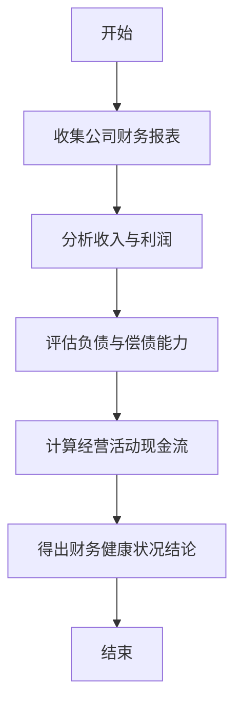

                 

# 彼得林奇的"知道你在买什么"原则

> 关键词：彼得林奇，投资原则，价值评估，投资决策，风险管理

> 摘要：本文深入探讨了彼得林奇的“知道你在买什么”投资原则，从其投资哲学、核心概念、算法原理到系统架构、项目实战和最佳实践等方面进行了全面分析。通过详细的技术语言和逻辑推理，本文为读者提供了如何在实际投资中应用这一原则的深度见解。

---

# 第1章 彼得林奇投资哲学概述

## 1.1 彼得林奇及其投资理念

### 1.1.1 彼得林奇的生平简介

彼得·林奇（Peter Lynch）是美国著名投资家，曾任富达投资集团麦哲伦基金的经理。他以卓越的投资业绩和独特的投资哲学闻名，被誉为“最伟大的股票投资人之一”。林奇的投资理念强调长期价值，注重对公司基本面的深入研究，主张投资者应该买入并持有优质股票，以获得长期收益。

### 1.1.2 投资哲学的核心思想

林奇的投资哲学的核心是“价值投资”。他认为，投资者应该选择那些具有强大竞争优势、财务健康、管理优秀且估值合理的公司进行投资。他强调，投资决策必须基于对公司和行业的深刻理解，而不是追随市场情绪或短期波动。

### 1.1.3 "知道你在买什么"原则的背景

“知道你在买什么”原则是林奇投资哲学的核心之一。这一原则强调投资者在买入股票之前，必须充分了解公司的基本面、行业地位和财务状况，确保自己清楚投资的标的物的价值和风险。

---

## 1.2 "知道你在买什么"原则的定义与背景

### 1.2.1 原则的核心定义

“知道你在买什么”原则要求投资者在买入股票前，必须深入研究和分析公司的基本面，确保自己对投资标的的价值、风险和未来前景有清晰的认识。

### 1.2.2 投资者常见的误区

许多投资者在买入股票时，往往只关注市场的短期波动、股评推荐或追随趋势，而忽视了对公司基本面的深入分析。这种做法往往导致投资决策的失误，尤其是在市场波动加剧时，容易造成重大损失。

### 1.2.3 该原则在投资决策中的重要性

通过“知道你在买什么”原则，投资者可以避免盲目跟风，降低投资风险，并提高投资决策的准确性。这一原则尤其适用于长期投资者，帮助他们在市场波动中保持冷静，坚持长期价值投资。

---

## 1.3 本章小结

本章介绍了彼得林奇的投资哲学及其“知道你在买什么”原则的核心思想。通过分析这一原则的背景和定义，我们理解了其在投资决策中的重要性。接下来，我们将深入探讨这一原则的核心要素和具体实施方法。

---

# 第2章 "知道你在买什么"原则的核心要素

## 2.1 投资决策的核心要素

### 2.1.1 公司基本面分析

公司基本面分析是“知道你在买什么”原则的核心要素之一。投资者需要对公司的财务状况、盈利能力、成长潜力等进行全面评估。

#### 2.1.1.1 财务健康状况评估

财务健康状况评估是公司基本面分析的重要组成部分。投资者需要关注公司的收入、利润、负债、现金流等关键财务指标。

##### 财务健康状况评估的关键指标

- **收入与利润**：收入是公司营业收入的总和，利润是扣除所有费用后的净利润。
- **负债与偿债能力**：负债总额和流动比率是衡量公司财务健康状况的重要指标。
- **现金流**：经营活动现金流是公司经营活动中产生的现金流入和流出。

##### 2.1.1.2 财务健康状况评估的流程图

### 2.1.2 行业地位与竞争优势

行业地位与竞争优势是公司基本面分析的另一个核心要素。投资者需要评估公司在行业中的地位、竞争优势以及未来的发展潜力。

#### 2.1.2.1 行业地位的评估

- **市场占有率**：公司产品在市场上的占有率越高，行业地位越强。
- **行业集中度**：行业集中度高意味着市场竞争较少，公司更容易保持竞争优势。
- **行业发展趋势**：行业的发展趋势将直接影响公司的未来增长潜力。

#### 2.1.2.2 竞争优势的识别

- **技术壁垒**：公司是否有独特的技术优势，是否能够保护自己的技术秘密。
- **品牌影响力**：强大的品牌影响力可以帮助公司获得更多的市场份额。
- **成本优势**：公司是否在生产成本上有竞争优势。

### 2.1.3 财务健康状况评估

财务健康状况评估是公司基本面分析的重要组成部分。投资者需要关注公司的收入、利润、负债、现金流等关键财务指标。

#### 2.1.3.1 财务健康状况评估的关键指标

- **收入与利润**：收入是公司营业收入的总和，利润是扣除所有费用后的净利润。
- **负债与偿债能力**：负债总额和流动比率是衡量公司财务健康状况的重要指标。
- **现金流**：经营活动现金流是公司经营活动中产生的现金流入和流出。

#### 2.1.3.2 财务健康状况评估的流程图

---

## 2.2 本章小结

本章详细探讨了“知道你在买什么”原则的核心要素，包括公司基本面分析、行业地位与竞争优势以及财务健康状况评估。通过这些分析，投资者可以更好地理解公司的价值和风险，从而做出更明智的投资决策。

