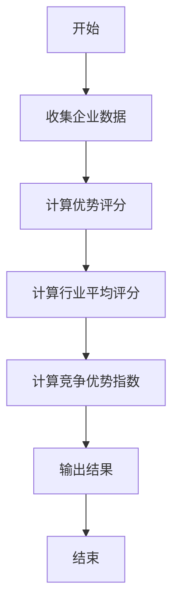
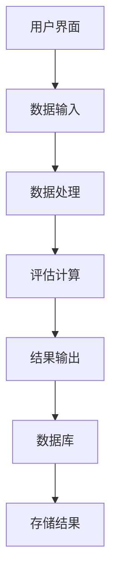
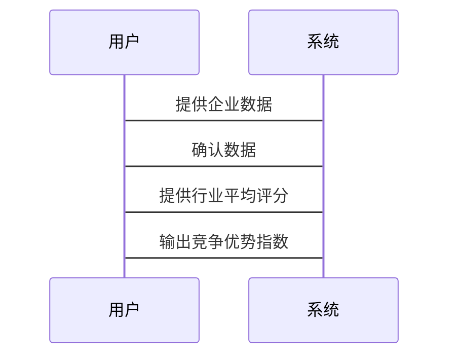

                 


# 彼得林奇的"竞争优势"评估体系

> 关键词：彼得·林奇，竞争优势，投资评估，企业分析，数学模型，Python实现

> 摘要：本文系统地介绍彼得·林奇的竞争优势评估体系，从其核心理念到实际应用，结合数学模型和Python代码，详细讲解如何评估企业的竞争优势，帮助投资者和企业管理者做出更明智的决策。

---

## 第一部分: 引言

### 第1章: 彼得·林奇及其投资理念

#### 1.1 彼得·林奇的背景与成就
彼得·林奇是美国著名投资家，曾任富达麦哲伦基金的经理，以其卓越的投资业绩闻名。他强调长期投资和深入分析企业基本面，认为竞争优势是企业长期成功的关键。

#### 1.2 投资的核心理念
林奇的投资理念基于企业的竞争优势，认为投资者应选择那些具有强大竞争优势的企业进行投资。

#### 1.3 竞争优势在投资中的重要性
竞争优势决定了企业的盈利能力和发展潜力，是评估企业投资价值的核心因素。

---

## 第二部分: 核心概念与竞争优势分析

### 第2章: 竞争优势的定义与分类

#### 2.1 竞争优势的定义
竞争优势是企业在市场中相对于竞争对手的独特优势，包括资源、技术、品牌、成本等方面。

#### 2.2 竞争优势的类型
- **成本优势**：企业生产成本低于竞争对手。
- **技术优势**：拥有独特的技术或专利。
- **品牌优势**：强大的品牌影响力。
- **市场优势**：占据主要市场份额。

#### 2.3 竞争优势的核心要素
- 资源：企业的资金、技术、人才等。
- 品牌：品牌的知名度和信誉。
- 管理：高效的管理团队。
- 财务：健康的财务状况。

### 第3章: 企业竞争优势的评估维度

#### 3.1 企业的资源与能力
评估企业的资源是否充足，技术是否领先。

#### 3.2 品牌影响力
分析品牌在市场中的地位和影响力。

#### 3.3 管理团队
考察管理团队的经验和能力。

#### 3.4 财务状况
分析企业的财务健康状况，包括利润、负债等。

### 第4章: 竞争优势的动态变化

#### 4.1 行业环境的影响
行业变化会影响企业的竞争优势。

#### 4.2 技术进步与竞争优势
技术进步会改变企业的竞争优势。

#### 4.3 竞争对手的分析
持续分析竞争对手的变化，调整评估策略。

---

## 第三部分: 竞争优势评估体系的算法原理

### 第5章: 竞争优势评估的数学模型

#### 5.1 竞争优势指数的定义
竞争优势指数衡量企业在行业中的竞争力。

#### 5.2 竞争优势指数的计算公式
$$ C = \frac{S}{T} $$
其中，C为竞争优势指数，S为企业的优势评分，T为行业平均评分。

#### 5.3 示例计算
假设企业优势评分为85，行业平均评分为70：
$$ C = \frac{85}{70} \approx 1.214 $$

### 第6章: 竞争优势评估的算法实现

#### 6.1 竞争优势评估的流程图


#### 6.2 竞争优势评估的Python代码实现
```python
def calculate_competitive_advantage(enterprise_data, industry_avg):
    return enterprise_data / industry_avg

# 示例数据
enterprise_data = 85
industry_avg = 70
result = calculate_competitive_advantage(enterprise_data, industry_avg)
print(f"竞争优势指数为: {result}")
```

---

## 第四部分: 系统分析与架构设计

### 第7章: 竞争优势评估系统的架构设计

#### 7.1 系统功能模块
- 数据输入模块：收集企业数据。
- 数据处理模块：计算优势评分。
- 评估计算模块：计算竞争优势指数。
- 结果输出模块：输出评估结果。

#### 7.2 系统架构图


#### 7.3 系统接口设计
- 输入接口：接收企业数据和行业平均评分。
- 输出接口：返回竞争优势指数。

#### 7.4 系统交互流程图


---

## 第五部分: 项目实战

### 第8章: 竞争优势评估体系的实战应用

#### 8.1 环境安装
- 安装Python和必要的库（如numpy、pandas）。

#### 8.2 系统核心实现源代码
```python
import numpy as np
import pandas as pd

def calculate_competitive_advantage(enterprise_data, industry_avg):
    return enterprise_data / industry_avg

# 示例数据
enterprise_data = pd.Series([85, 90, 75, 80])
industry_avg = 70

# 计算竞争优势指数
result = enterprise_data.apply(lambda x: x / industry_avg)
print("竞争优势指数为: \n", result)
```

#### 8.3 代码应用解读与分析
- 使用pandas处理多企业数据，计算每个企业的竞争优势指数。

#### 8.4 实际案例分析
以具体企业为例，分析其竞争优势指数，并解释结果的意义。

#### 8.5 项目小结
总结项目实施过程，强调竞争优势评估的实际应用价值。

---

## 第六部分: 总结

### 第9章: 最佳实践与小结

#### 9.1 最佳实践 tips
- 定期更新企业数据和行业平均值。
- 结合多种评估指标进行综合分析。

#### 9.2 注意事项
- 数据的准确性和及时性至关重要。
- 竞争优势评估只是投资决策的一部分，需结合其他因素。

#### 9.3 拓展阅读
推荐相关书籍和资源，供读者深入学习。

---

通过本文的详细讲解，读者可以全面理解彼得·林奇的竞争优势评估体系，并将其应用于实际投资和企业管理中，做出更明智的决策。

