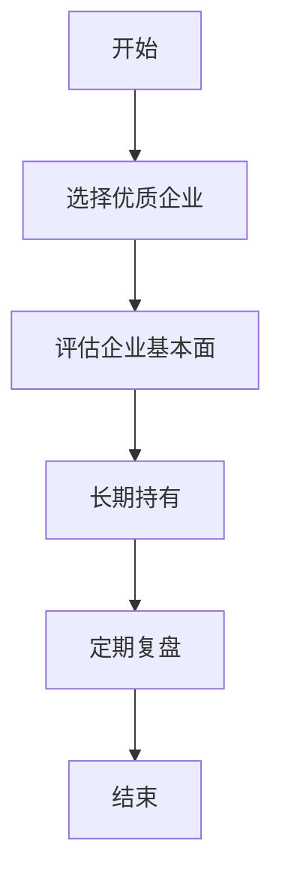
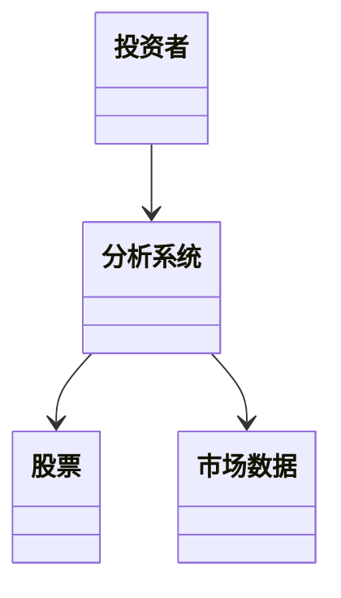

                 


# 彼得林奇的"耐心投资"在市场短期主义盛行时的价值

## 关键词：耐心投资、彼得林奇、短期主义、投资策略、长期价值

## 摘要：  
在当前金融市场中，短期主义盛行，许多投资者追求快速交易和短期收益，忽视了长期投资的价值。本文通过分析彼得·林奇的耐心投资理念，探讨其在市场短期主义盛行时的独特价值。文章从耐心投资的核心概念、算法原理、系统架构到实际案例，全面剖析了耐心投资的策略和优势，为投资者提供了深刻的见解和实用的指导。

---

## 第1章：耐心投资的背景与现状

### 1.1 投资市场的短期主义现象

#### 1.1.1 短期主义的定义与表现  
短期主义是指投资者仅关注短期市场波动，追求快速交易收益的投资行为。这种行为常见于高频交易、短期炒作者和市场投机者中。  

#### 1.1.2 短期主义对投资者的影响  
短期主义可能导致投资者频繁买卖，增加交易成本和税务负担，同时忽视企业的长期价值。  

#### 1.1.3 短期主义与长期投资的冲突  
短期主义关注市场波动，而长期投资关注企业的内在价值。两者的冲突在于，短期主义追求快速收益，而长期投资注重稳健增值。

### 1.2 彼得·林奇与耐心投资理念

#### 1.2.1 彼得·林奇的生平简介  
彼得·林奇是美国著名的投资专家，以其长期投资和价值发现策略闻名。

#### 1.2.2 耐心投资的核心理念  
耐心投资强调长期持有优质股票，关注企业的基本面和长期增长潜力。

#### 1.2.3 林奇投资策略的成功案例  
通过长期持有优质股票，彼得·林奇实现了显著的长期收益。

---

## 第2章：耐心投资的核心概念与联系

### 2.1 耐心投资与短期主义的对比

#### 2.1.1 核心概念对比表格  
| 概念         | 短期主义       | 耐心投资       |
|--------------|----------------|----------------|
| 时间框架     | 短期（数天/数周） | 长期（数年）     |
| 投资目标     | 短期收益       | 长期价值       |
| 风险承受     | 高             | 中等           |

#### 2.1.2 ER实体关系图架构  
```mermaid
erd
    企业 -- 投资者
    投资者 -- 股票
    股票 -- 市场波动
```

### 2.2 耐心投资的原理与机制

#### 2.2.1 投资者心理与行为分析  
耐心投资需要克服短期波动的干扰，坚持长期持有优质资产。

#### 2.2.2 市场波动与长期价值的关系  
市场波动是短期现象，而长期价值取决于企业的基本面。

#### 2.2.3 耐心投资的数学模型  
耐心投资的回报可以用以下公式计算：
$$
\text{总回报} = \prod_{i=1}^{n} (1 + r_i)
$$  
其中，$r_i$ 是每期的回报率。

---

## 第3章：耐心投资的算法原理

### 3.1 耐心投资的分析流程

#### 3.1.1 Mermaid流程图展示  


### 3.2 投资决策的数学模型

#### 3.2.1 Python代码实现  
```python
def calculate_roi(revenue, cost):
    roi = (revenue - cost) / cost
    return roi

# 示例计算
revenue = 1000000
cost = 800000
roi = calculate_roi(revenue, cost)
print(f"ROI: {roi}")
```

#### 3.2.2 价值评估公式  
$$
\text{内在价值} = \frac{\text{现金流}}{\text{折现率}}
$$

---

## 第4章：系统分析与架构设计

### 4.1 投资分析系统的功能设计

#### 4.1.1 Mermaid类图展示  


### 4.2 系统架构设计

#### 4.2.1 Mermaid架构图展示  


---

## 第5章：项目实战与案例分析

### 5.1 环境安装与数据准备

#### 5.1.1 工具安装与数据收集  
安装Python和相关库，收集目标公司的财务数据和市场数据。

### 5.2 系统核心实现源代码

#### 5.2.1 代码实现  
```python
import pandas as pd

# 数据收集
data = pd.read_csv('stock_data.csv')
```

#### 5.2.2 代码应用解读  
通过数据收集和分析，识别优质企业并进行长期投资。

### 5.3 实际案例分析

#### 5.3.1 案例分析  
以苹果公司为例，分析其长期投资价值。

---

## 第6章：总结与展望

### 6.1 总结  
耐心投资在短期主义盛行时具有重要价值，强调长期价值和优质企业的重要性。

### 6.2 展望  
随着市场波动加剧，耐心投资策略将为企业和个人投资者提供稳健的回报。

---

## 最佳实践 Tips

1. **保持耐心**：避免短期波动的干扰，坚持长期投资。
2. **选择优质企业**：关注企业的基本面和长期增长潜力。
3. **定期复盘**：评估投资组合的表现并进行调整。

---

通过本文的详细分析，读者可以深入了解彼得·林奇的耐心投资理念及其在当前市场环境下的价值。耐心投资不仅是一种投资策略，更是一种长期稳健的财富管理方式。

