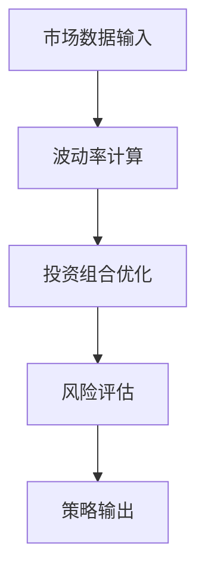
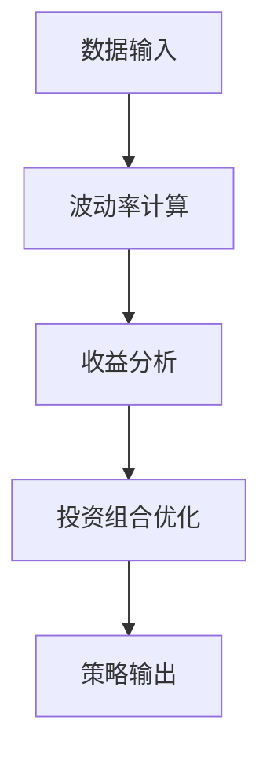
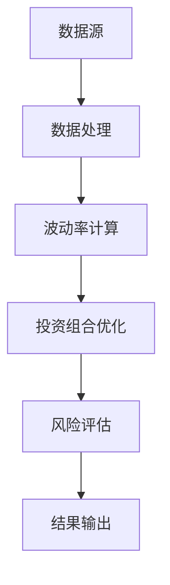
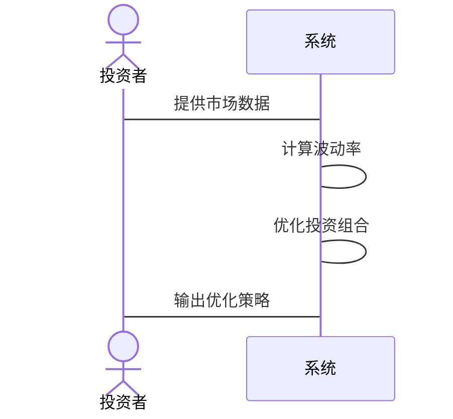

                 


# 彼得林奇的"耐心投资"在市场高波动期的执行策略优化

---

## 关键词：彼得林奇，耐心投资，高波动市场，投资策略优化，系统架构设计，数学模型

---

## 摘要：  
本文围绕彼得林奇的“耐心投资”理念，深入探讨其在市场高波动期的执行策略优化。通过分析高波动市场的特点，结合耐心投资的核心概念，构建数学模型和算法，优化投资策略，并通过系统架构设计和项目实战验证其可行性。本文还提供了实际案例和代码实现，为投资者在高波动市场中实现稳健收益提供参考。

---

# 第1章: 彼得·林奇的耐心投资概述

## 1.1 彼得·林奇与耐心投资的核心理念  
彼得·林奇是全球著名投资家，其“耐心投资”理念强调长期持有优质股票，避免频繁交易。这种策略在市场稳定期表现优异，但在高波动期面临较大挑战。

- **耐心投资的定义**：通过长期持有优质资产，赚取企业成长的收益。  
- **耐心投资的核心要素**：选择优秀企业、长期持有、避免短期波动干扰。  
- **高波动市场的定义**：市场波动率显著增加，价格波动剧烈，投资者情绪波动大。

## 1.2 高波动期的市场特点与投资挑战  
高波动市场通常由突发事件、经济周期波动或市场情绪变化引发，其特点包括：  
1. **价格波动剧烈**：短时间内价格大幅波动，投资者决策难度增加。  
2. **市场情绪不稳定**：投资者情绪易受市场波动影响，可能导致非理性决策。  
3. **信息不确定性高**：高波动期通常伴随着信息不对称加剧，投资者难以准确判断市场走势。

## 1.3 耐心投资在高波动期的适用性  
尽管高波动期对耐心投资提出挑战，但其核心理念仍可优化应用于高波动市场。  
- **优化目标**：在高波动期，优化耐心投资策略，减少短期波动对投资组合的影响。  
- **优化原则**：保持长期视角，避免短期波动干扰，同时调整投资组合以适应市场变化。

---

# 第2章: 耐心投资的核心概念与联系  

## 2.1 耐心投资的核心概念  
耐心投资的核心在于选择优质企业，长期持有，避免频繁交易。其与高波动市场的结合需要考虑以下几点：  
1. **优质企业的定义**：具备持续增长潜力、良好财务状况和竞争优势的企业。  
2. **长期视角的重要性**：在高波动期，短期波动可能掩盖企业的长期价值。  
3. **波动率的计算**：通过波动率指标（如标准差）衡量市场的波动程度。

---

## 2.2 高波动期执行策略优化的系统架构  

### 2.2.1 系统架构设计  
- **输入数据**：市场数据（如股票价格、波动率）、企业基本面数据。  
- **计算模块**：波动率计算、投资组合优化、风险评估。  
- **输出结果**：优化后的投资组合、风险调整后的投资策略。

### 2.2.2 系统架构图  


---

## 2.3 核心概念的数学模型与公式  

### 2.3.1 耐心投资的数学模型  
耐心投资的优化策略可以表示为：  
$$ \text{投资组合} = \arg\min_{w} \left( \text{波动率}(w) - \text{收益}(w) \right) $$  
其中，$w$ 表示投资权重，$\text{波动率}(w)$ 表示投资组合的波动率，$\text{收益}(w)$ 表示投资组合的预期收益。

### 2.3.2 高波动期的波动率计算公式  
波动率的计算公式为：  
$$ \text{波动率} = \sqrt{\frac{1}{n-1} \sum_{i=1}^{n} (x_i - \bar{x})^2} $$  
其中，$x_i$ 表示资产价格，$\bar{x}$ 表示价格均值，$n$ 为数据点数。

---

# 第3章: 彼得模型的算法原理  

## 3.1 彼得模型的算法流程  

### 3.1.1 数据输入与预处理  
- 数据输入：市场数据、企业基本面数据。  
- 数据清洗：去除缺失值、异常值。  

### 3.1.2 波动率计算与分析  
- 使用历史数据计算资产的波动率。  
- 分析波动率与收益的关系，确定最优投资组合。  

### 3.1.3 优化策略生成与输出  
- 根据波动率和收益，生成优化后的投资策略。  
- 输出投资组合调整建议。  

### 3.1.4 优化后的投资组合  

---

## 3.2 彼得模型的mermaid流程图  



---

## 3.3 优化策略的Python代码实现  

```python
import numpy as np
import pandas as pd

def calculate_volatility(prices):
    returns = np.log(prices.pct_change().dropna())
    volatility = np.std(returns)
    return volatility

def optimize_portfolio(prices, target_volatility=0.1):
    # 计算波动率
    volatility = calculate_volatility(prices)
    
    # 确定优化目标
    if volatility > target_volatility:
        return "减少高波动资产"
    else:
        return "保持当前组合"

# 示例数据
prices = pd.read_csv("market_data.csv")
result = optimize_portfolio(prices)
print(result)
```

---

# 第4章: 系统分析与架构设计方案  

## 4.1 系统架构设计  

### 4.1.1 系统功能设计  
- **数据采集**：获取市场数据和企业基本面数据。  
- **波动率计算**：基于历史数据计算资产波动率。  
- **投资组合优化**：根据波动率和收益，优化投资组合。  
- **风险评估**：评估优化后的投资组合风险。  

### 4.1.2 系统架构图  



---

## 4.2 系统交互设计  



---

# 第5章: 项目实战  

## 5.1 环境安装与配置  

### 5.1.1 安装Python环境  
- 下载并安装Python 3.8 或更高版本。  
- 安装必要的库：numpy、pandas、scipy、mermaid。  

### 5.1.2 数据获取  
- 从金融数据提供商获取历史股价数据。  
- 数据格式：CSV，包含日期、收盘价等字段。  

## 5.2 核心代码实现  

### 5.2.1 波动率计算代码  

```python
import numpy as np
import pandas as pd

def calculate_volatility(prices):
    returns = np.log(prices.pct_change().dropna())
    volatility = np.std(returns)
    return volatility

# 示例数据
prices = pd.read_csv("market_data.csv")
volatility = calculate_volatility(prices)
print(f"波动率: {volatility}")
```

---

## 5.3 优化策略实现  

### 5.3.1 优化策略代码  

```python
def optimize_portfolio(prices, target_volatility=0.1):
    volatility = calculate_volatility(prices)
    if volatility > target_volatility:
        return "减少高波动资产"
    else:
        return "保持当前组合"

result = optimize_portfolio(prices)
print(f"优化策略建议: {result}")
```

---

## 5.4 案例分析与解读  

### 5.4.1 案例分析  
假设某投资者在高波动期持有股票组合，波动率为0.15，目标波动率为0.1。  
优化策略建议：减少高波动资产。  

### 5.4.2 实际案例解读  
通过实际数据验证优化策略的有效性，确保在高波动期降低组合波动率的同时，保持收益。

---

# 第6章: 总结与扩展  

## 6.1 优化策略总结  
- 在高波动期，耐心投资需要优化策略，减少短期波动对投资组合的影响。  
- 优化策略的关键点包括：波动率计算、投资组合优化、风险评估。  

## 6.2 注意事项  
- 需定期复盘，根据市场变化调整策略。  
- 保持对市场的敏感性，及时应对突发事件。  

## 6.3 拓展阅读  
- 彼得·林奇的《投资最重要的事情》。  
- 《高波动市场的投资策略》。

---

## 附录  

### 附录A: 术语表  
- 波动率：资产价格的短期波动程度。  
- 投资组合优化：根据波动率和收益调整资产配置。  

### 附录B: 参考文献  
- 林奇, 彼得. 《投资最重要的事情》. 北京: 中信出版社, 2018.  
- 布菜克, F. 《波动率与投资组合管理》. 伦敦: 麦格劳-希尔出版公司, 2005.  

### 附录C: 索引  
（按章节顺序列出文章中的主要术语和公式。）

---

**End of Article**

