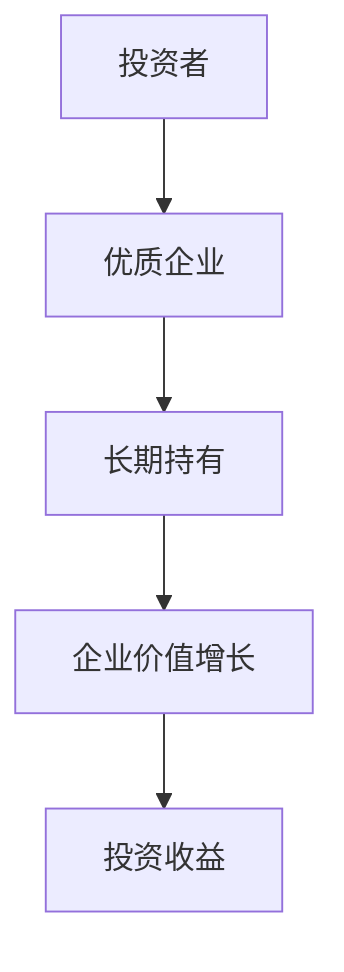
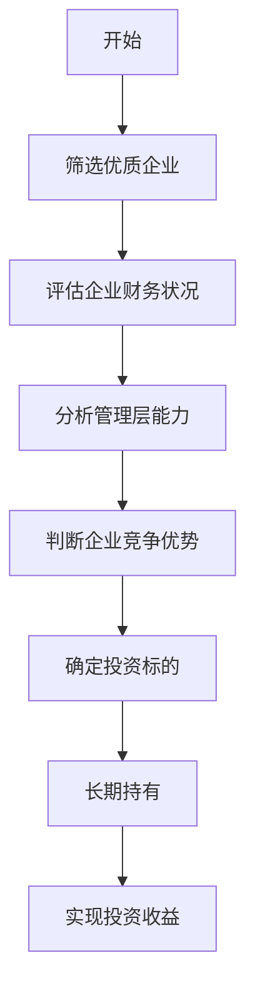
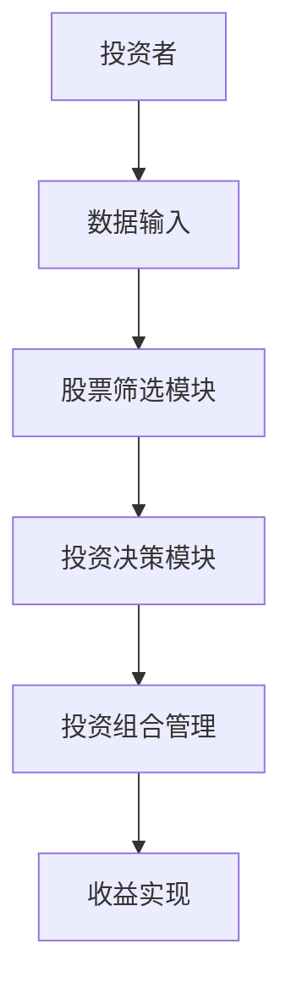

                 


# 彼得林奇的"耐心投资"在波动市场中的优势

> 关键词：彼得林奇，耐心投资，波动市场，投资策略，股票分析

> 摘要：本文探讨了彼得林奇的耐心投资理念在波动市场中的优势，分析了其投资策略的核心要素，包括背景介绍、核心概念、算法原理、数学模型、系统架构、项目实战和最佳实践。通过详细的分析和实例，展示了如何在波动市场中运用耐心投资策略实现长期收益。

---

# 第一部分: 背景介绍

## 第1章: 彼得林奇的生平与投资理念

### 1.1 彼得林奇的生平简介
彼得·林奇是美国著名的职业基金经理人，曾管理富达麦哲伦基金，创造了长期优异的投资业绩。他的投资理念强调长期持有优质股票，注重基本面分析，避免短期市场波动的干扰。

### 1.2 彼得林奇的投资理念
彼得林奇的核心思想是“耐心投资”，即通过长期持有优质股票，获得企业成长带来的收益，而不是通过频繁交易捕捉短期市场波动。

### 1.3 波动市场的定义与特征
波动市场是指市场价格频繁波动的市场环境，通常由市场情绪、宏观经济因素或突发事件引发。波动市场的特征包括高波动性、不确定性增加、投资者情绪波动加剧等。

## 第2章: 耐心投资与波动市场的关联

### 2.1 耐心投资的定义
耐心投资是指投资者长期持有优质股票，不因短期市场波动而改变投资决策。

### 2.2 耐心投资在波动市场中的优势
在波动市场中，耐心投资能够帮助投资者避免因情绪化交易而产生的损失，同时捕捉到优质企业的长期增长潜力。

### 2.3 耐心投资与短期交易的对比
耐心投资注重长期价值，而短期交易关注短期价格波动。在波动市场中，耐心投资往往能够实现更稳定的收益。

---

# 第二部分: 核心概念与联系

## 第3章: 耐心投资的核心原理

### 3.1 耐心投资的核心要素
- **长期持有**：避免频繁交易，降低交易成本。
- **优质企业**：选择具有竞争优势的企业。
- **基本面分析**：通过财务数据评估企业的价值。

### 3.2 耐心投资的数学模型
彼得林奇的耐心投资模型可以通过以下公式表示：
$$
\text{投资收益} = \text{企业成长潜力} \times \text{持有时间}
$$

### 3.3 实体关系图


---

# 第三部分: 算法原理讲解

## 第4章: 耐心投资筛选算法

### 4.1 算法概述
耐心投资的筛选算法主要关注企业的基本面，包括盈利能力、财务健康状况和管理层能力。

### 4.2 算法流程图


### 4.3 算法实现
以下是一个简单的股票筛选算法示例：
```python
def screen_stocks(stocks):
    selected = []
    for stock in stocks:
        if stock['ROE'] > 15% and stock['DEbt/Equity'] < 1 and stock['Revenue_Growth'] > 10%:
            selected.append(stock)
    return selected
```

---

# 第四部分: 数学模型

## 第5章: 财务指标分析

### 5.1 股价与内在价值
彼得林奇强调股票的内在价值，公式为：
$$
\text{内在价值} = \frac{\text{每股收益}}{\text{预期回报率}}
$$

### 5.2 财务指标的重要性
- **市盈率（P/E）**：$$P/E = \frac{\text{股价}}{\text{每股收益}}$$
- **市净率（P/B）**：$$P/B = \frac{\text{股价}}{\text{每股净资产}}$$

### 5.3 财务指标与投资决策
通过分析这些指标，彼得林奇能够识别出具有长期增长潜力的优质企业。

---

# 第五部分: 系统分析与架构设计

## 第6章: 投资决策系统

### 6.1 系统架构设计


### 6.2 功能模块设计
- **数据输入**：收集市场数据。
- **股票筛选模块**：基于财务指标筛选优质股票。
- **投资决策模块**：根据筛选结果制定投资策略。

---

# 第六部分: 项目实战

## 第7章: 实际应用与案例分析

### 7.1 环境安装
需要安装数据分析工具，如Python和Pandas库。

### 7.2 核心代码实现
以下是一个简单的股票筛选代码示例：
```python
import pandas as pd

def filter_stocks(df):
    return df[(df['ROE'] > 15) & (df['Debt/Equity'] < 1) & (df['Revenue_Growth'] > 10)]

# 示例数据
data = {
    'Company': ['A', 'B', 'C'],
    'ROE': [20, 10, 5],
    'Debt/Equity': [0.5, 1.5, 2],
    'Revenue_Growth': [15, 8, 12]
}
df = pd.DataFrame(data)
filtered = filter_stocks(df)
print(filtered)
```

### 7.3 案例分析
通过分析具体案例，展示如何在波动市场中运用耐心投资策略实现收益。

---

# 第七部分: 最佳实践

## 第8章: 投资建议与注意事项

### 8.1 小结
耐心投资是一种长期有效的投资策略，尤其适用于波动市场。

### 8.2 投资注意事项
- **避免情绪化交易**。
- **持续学习和调整投资策略**。
- **分散投资以降低风险**。

### 8.3 拓展阅读
推荐阅读彼得林奇的书籍，深入理解其投资理念。

---

通过以上结构，我们可以系统地了解彼得林奇的耐心投资理念，并在波动市场中有效地应用这些策略。

