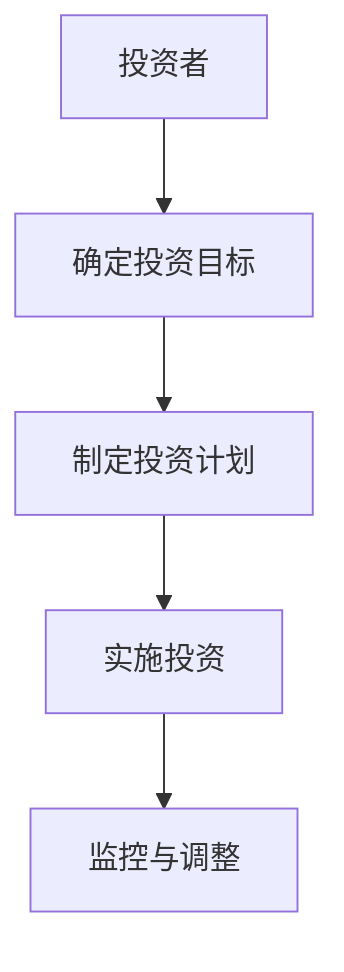
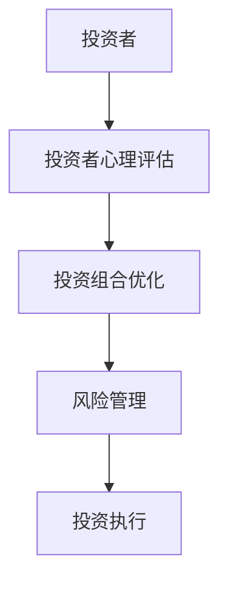
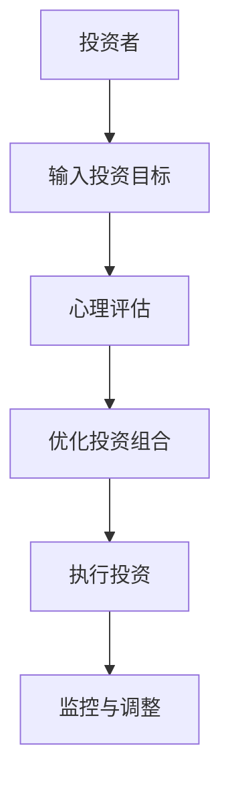

                 


# 彼得林奇的"耐心投资"心理建设

## 关键词：耐心投资，彼得林奇，投资心理学，风险管理，长期持有

## 摘要：本文通过分析彼得林奇的耐心投资策略，深入探讨其心理建设的核心要素，包括长期思维、风险管理、分散投资和投资者心理。结合技术语言，从数学模型、算法原理到系统架构，全面解析耐心投资的实现过程，并通过实际案例验证其有效性。

---

# 第一部分: 耐心投资的背景与核心概念

## 第1章: 耐心投资的背景与定义

### 1.1 耐心投资的背景

#### 1.1.1 投资市场的波动性与不确定性
投资市场本质上是一个充满波动性和不确定性的环境。股票价格受多种因素影响，包括经济指标、公司业绩、政策变化和市场情绪等。投资者在面对市场波动时，往往容易受到贪婪和恐惧的驱使，导致短期行为的出现。然而，这种行为往往与长期投资目标相悖，最终可能导致投资损失。

#### 1.1.2 短期投资行为的局限性
短期投资行为的核心问题在于其不确定性。频繁的买卖操作不仅增加了交易成本，还可能导致投资者错失长期增长的机会。例如，短期投资者可能会因为市场的短期波动而卖出股票，从而错过后续的长期增值。

#### 1.1.3 长期投资的价值与意义
长期投资的核心价值在于其稳定性。通过长期持有优质资产，投资者可以规避市场的短期波动，同时享受复利效应带来的收益。长期投资的意义在于通过时间的积累，实现财富的稳步增长。

### 1.2 耐心投资的定义与核心要素

#### 1.2.1 耐心投资的定义
耐心投资是一种以长期持有优质资产为核心的投资策略。其核心在于通过持续持有优质资产，规避市场的短期波动，实现长期稳健的收益。

#### 1.2.2 核心要素：价值投资、长期持有、分散投资
耐心投资的三个核心要素是价值投资、长期持有和分散投资。价值投资强调选择具有长期增长潜力的公司；长期持有则是通过持续持有这些资产，避免频繁交易；分散投资则是通过投资于多个资产类别或行业，降低风险。

#### 1.2.3 耐心投资与投机行为的区别
耐心投资与投机行为的本质区别在于时间跨度和目标。耐心投资注重长期价值，而投机行为则追求短期收益。前者强调风险控制和稳健增长，后者则注重快速获利和市场炒作。

### 1.3 耐心投资的边界与外延

#### 1.3.1 投资的边界：风险与收益的平衡
耐心投资需要在风险与收益之间找到平衡点。投资者需要明确自己的风险承受能力，并在此基础上选择合适的投资标的。通过合理分散投资，降低整体风险，同时追求长期收益。

#### 1.3.2 耐心投资的外延：投资策略与心理建设的结合
耐心投资不仅仅是投资策略的选择，更是心理建设的过程。投资者需要具备长期思维，克服短期情绪的干扰，坚持既定的投资策略。这种心理建设是耐心投资成功的关键。

## 第2章: 耐心投资的核心概念与联系

### 2.1 耐心投资的心理机制

#### 2.1.1 投资者心理：贪婪与恐惧的平衡
投资者心理是耐心投资的核心要素之一。贪婪和恐惧是人性的两大驱动力，容易导致投资者做出非理性的决策。耐心投资要求投资者在贪婪和恐惧之间找到平衡，避免过度交易。

#### 2.1.2 耐心与决策的关系
耐心与决策是密切相关的。耐心投资强调的是在市场波动中保持冷静，避免做出冲动决策。通过长期持有，投资者可以减少决策的频率，降低错误决策的概率。

#### 2.1.3 长期思维与短期行为的冲突
长期思维与短期行为的冲突是耐心投资面临的最大挑战之一。短期行为往往追求快速收益，而长期思维则注重稳健增长。投资者需要通过心理建设，克服短期行为的诱惑，坚持长期投资策略。

### 2.2 核心概念对比分析

#### 2.2.1 行为金融学视角下的耐心投资
行为金融学从心理学角度研究投资者行为。耐心投资强调的是投资者在市场波动中的心理稳定性，避免情绪化决策。行为金融学为耐心投资提供了理论支持，帮助投资者更好地理解自身心理。

#### 2.2.2 传统投资理论与耐心投资的对比
传统投资理论通常强调短期交易和市场预测，而耐心投资则注重长期持有和价值发现。两者的核心区别在于时间跨度和投资策略。

#### 2.2.3 不同市场周期中的耐心投资策略
在不同的市场周期中，耐心投资策略需要进行适当的调整。例如，在市场低迷时期，耐心投资需要保持信心，继续持有优质资产；在市场繁荣时期，则需要警惕泡沫风险，避免过度投资。

### 2.3 实体关系图（ER图）与流程图

#### 2.3.1 投资者心理与决策的ER实体关系图
```mermaid
entity Investor 心理特征
entity 投资决策
entity 市场环境
```

#### 2.3.2 耐心投资流程的Mermaid流程图


---

# 第二部分: 耐心投资的算法原理

## 第3章: 耐心投资的算法原理

### 3.1 耐心投资的数学模型

#### 3.1.1 预期收益与风险的数学表达
预期收益可以用期望值表示：
$$ E[r] = \mu $$
风险可以用方差或标准差表示：
$$ Var(r) = \sigma^2 $$

#### 3.1.2 风险价值（VaR）模型
风险价值（VaR）是衡量投资风险的重要指标：
$$ VaR = \text{损失的极限值} $$

### 3.2 投资组合优化的算法

#### 3.2.1 马科维茨投资组合理论
马科维茨投资组合理论是现代投资组合理论的基础，目标函数为：
$$ \text{目标函数：} \min_w \frac{1}{2} w^T \Sigma w $$
约束条件为：
$$ \text{约束条件：} w^T \mu = T, w^T 1 = 1 $$

### 3.3 耐心投资的风险管理算法

#### 3.3.1 风险管理的核心原则
风险管理是耐心投资的重要组成部分。投资者需要通过合理分散投资、设定止损点和定期评估投资组合，来降低整体风险。

#### 3.3.2 风险管理的实现步骤
1. 评估投资组合的风险敞口
2. 设定合理的止损点
3. 定期监控和调整投资组合

---

## 第4章: 投资组合优化与风险管理

### 4.1 投资组合优化的实现

#### 4.1.1 投资组合优化的数学模型
$$ \text{目标函数：} \min_w \frac{1}{2} w^T \Sigma w $$
$$ \text{约束条件：} w^T \mu = T, w^T 1 = 1 $$

#### 4.1.2 优化算法的实现步骤
1. 收集投资标的的历史数据
2. 计算资产的预期收益和协方差矩阵
3. 使用优化算法求解最优权重
4. 验证和调整投资组合

### 4.2 风险管理的实现

#### 4.2.1 风险管理的核心原则
1. 分散投资，降低特定风险
2. 设定止损点，控制最大损失
3. 定期评估，动态调整

#### 4.2.2 风险管理的实现步骤
1. 确定投资组合的风险承受能力
2. 设定止损点和止盈点
3. 定期监控市场波动
4. 根据市场变化调整投资组合

---

## 第5章: 系统分析与架构设计

### 5.1 系统功能设计

#### 5.1.1 投资者心理评估模块
投资者心理评估模块用于评估投资者的心理特征，包括风险承受能力和投资偏好。

#### 5.1.2 投资组合优化模块
投资组合优化模块用于根据投资者的评估结果，优化投资组合，实现最优配置。

### 5.2 系统架构设计

#### 5.2.1 系统架构图


### 5.3 系统接口设计

#### 5.3.1 投资者输入接口
投资者输入接口用于收集投资者的基本信息和投资目标。

#### 5.3.2 投资组合优化接口
投资组合优化接口用于接收投资者评估结果，输出优化后的投资组合。

### 5.4 系统交互流程图

#### 5.4.1 投资者与系统的交互流程


---

## 第6章: 项目实战

### 6.1 环境安装

#### 6.1.1 系统环境要求
- 操作系统：Windows/Mac/Linux
- Python版本：3.6以上
- 需要安装的库：numpy, pandas, matplotlib, scikit-learn

### 6.2 核心实现代码

#### 6.2.1 投资组合优化代码
```python
import numpy as np
import pandas as pd
from sklearn.datasets import make_sparesparse
import matplotlib.pyplot as plt

# 生成模拟数据
n_samples, n_features = 100, 10
X, y = make_sparesparse(n_samples, n_features, density=0.1)
data = pd.DataFrame(X, columns=['feature{}'.format(i) for i in range(n_features)])

# 计算协方差矩阵
cov_matrix = data.cov()

# 定义目标函数
def objective(weights):
    return np.dot(weights.T, np.dot(cov_matrix, weights))

# 定义约束条件
def constraint(weights):
    return np.sum(weights) - 1

# 使用 scipy.optimize 进行优化
from scipy.optimize import minimize

# 初始化权重
initial_weights = np.array([1.0/n_features] * n_features)

# 约束条件
cons = {'type': 'eq', 'fun': constraint}

# 边界条件
bounds = [(0, None) for _ in range(n_features)]

# 最优化问题
result = minimize(objective, initial_weights, method='SLSQP', constraints=cons, bounds=bounds)

# 输出结果
print('优化后的权重：', result.x)
print('最小方差：', result.fun)
```

#### 6.2.2 风险管理代码
```python
import numpy as np
import pandas as pd
import matplotlib.pyplot as plt

# 生成模拟数据
np.random.seed(42)
returns = np.random.normal(0.05, 0.1, 100)

# 计算VaR
def calculate_VaR(returns, confidence_level=0.95):
    sorted_returns = np.sort(returns)
    VaR = sorted_returns[int(len(returns) * (1 - confidence_level))]
    return VaR

VaR = calculate_VaR(returns)
print('VaR at 95% confidence level:', VaR)
```

### 6.3 案例分析与解读

#### 6.3.1 案例分析
以彼得林奇的经典投资案例为例，分析其耐心投资策略的实现过程。例如，投资于具有长期增长潜力的公司，通过分散投资降低风险。

#### 6.3.2 实际案例分析
通过具体的投资组合优化和风险管理，验证耐心投资策略的有效性。

### 6.4 项目小结

#### 6.4.1 项目总结
总结项目实现的关键点，包括投资组合优化、风险管理、系统架构设计等。

#### 6.4.2 项目成果
通过项目实现，验证了耐心投资策略的有效性，为投资者提供了实证支持。

---

## 第7章: 最佳实践与小结

### 7.1 最佳实践 tips

#### 7.1.1 投资者心理建设
投资者需要具备长期思维，克服短期情绪的干扰，坚持既定的投资策略。

#### 7.1.2 风险管理
通过合理分散投资、设定止损点和定期评估投资组合，降低整体风险。

### 7.2 小结

耐心投资是一种以长期持有优质资产为核心的投资策略。通过心理建设和风险管理，投资者可以实现稳健的长期收益。

### 7.3 注意事项

#### 7.3.1 投资者需具备长期思维
耐心投资需要投资者具备长期思维，避免短期行为的干扰。

#### 7.3.2 风险管理的重要性
风险管理是耐心投资的重要组成部分，投资者需要通过合理分散投资、设定止损点和定期评估投资组合，降低整体风险。

### 7.4 拓展阅读

#### 7.4.1 推荐书籍
1. 《彼得林奇的投资哲学》
2. 《投资学原理》

#### 7.4.2 推荐博客与文章
1. 罗辑思维：投资与心理学
2. 投资者之家：耐心投资的实现

---

通过以上内容，我们可以看到，耐心投资不仅仅是投资策略的选择，更是心理建设的过程。投资者需要具备长期思维，克服短期情绪的干扰，坚持既定的投资策略。通过合理分散投资、设定止损点和定期评估投资组合，降低整体风险。耐心投资的核心在于长期持有优质资产，通过时间的积累，实现财富的稳步增长。

