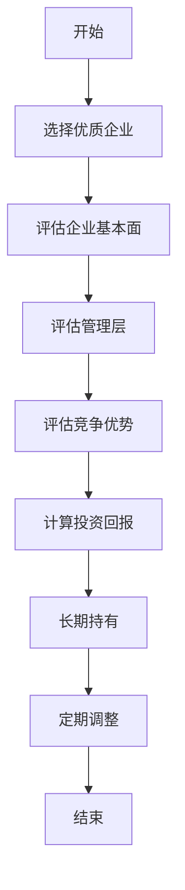
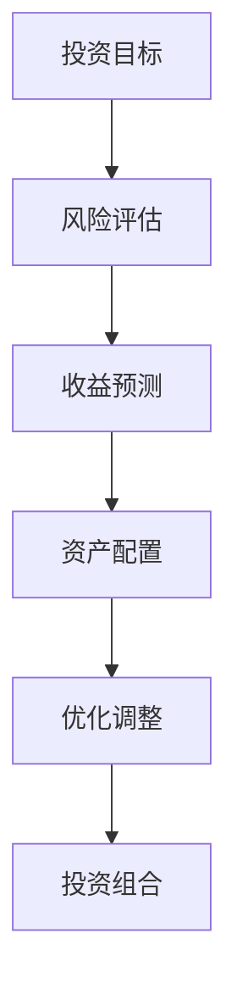

                 

# 彼得林奇的"耐心投资"理念探讨

## 关键词：彼得林奇、耐心投资、长期投资、价值投资、投资策略、投资模型、风险管理

## 摘要：本文探讨了彼得林奇的耐心投资理念，从其核心概念、数学模型到系统架构，再到实际案例分析，全面解析了如何通过长期、系统化的方法实现稳健投资回报。文章结合技术语言，使用Mermaid图表和数学公式，为读者提供深度分析和实践指导。

---

## 第1章：彼得林奇与耐心投资的背景介绍

### 1.1 彼得·林奇及其投资理念

- **1.1.1 彼得·林奇的生平与投资经历**
  - 彼得·林奇是全球著名投资专家，管理过麦哲伦基金，创造了辉煌的投资业绩。
  - 他强调长期投资和价值投资，反对短期波动干扰。

- **1.1.2 耐心投资的核心概念**
  - 耐心投资：买入优质企业股票，长期持有，避免频繁交易。
  - 强调企业基本面分析和管理层评估。

- **1.1.3 耐心投资与短期投资的对比**
  - 短期投资：频繁交易，依赖市场波动，风险高。
  - 耐心投资：长期持有，注重企业内在价值，风险较低。

### 1.2 耐心投资的背景与问题背景

- **1.2.1 当前投资市场的短期化问题**
  - 投资者追逐短期收益，忽视长期价值。
  - 短期波动影响投资者决策，增加市场风险。

- **1.2.2 短期投资与长期投资的对比**
  - 短期投资：高风险、高波动、低回报稳定性。
  - 长期投资：低风险、低波动、高回报稳定性。

- **1.2.3 耐心投资的必要性与可行性**
  - 必要性：市场波动中，长期投资更具稳定性。
  - 可行性：通过基本面分析，选择优质企业，长期持有。

---

## 第2章：耐心投资的核心概念与联系

### 2.1 耐心投资的核心原理

- **2.1.1 耐心投资的定义**
  - 耐心投资：买入优质企业股票，长期持有，获取企业成长收益。

- **2.1.2 耐心投资的核心要素**
  - 优质企业：具备持续盈利能力、良好管理层、竞争优势。
  - 长期持有：避免频繁交易，减少费用和税务负担。

- **2.1.3 耐心投资的数学模型**
  - 复利公式：\( A = P(1 + r)^n \)，其中 \( P \) 为本金，\( r \) 为年收益率，\( n \) 为年数。
  - 耐心投资通过复利效应，实现资产长期增长。

### 2.2 核心概念对比与联系

- **2.2.1 耐心投资与价值投资的对比**
  - 价值投资：寻找被市场低估的股票，长期持有。
  - 耐心投资：买入优质企业，长期持有，更注重企业内在价值。

- **2.2.2 耐心投资与成长投资的对比**
  - 成长投资：投资于高成长企业，追求高收益。
  - 耐心投资：注重企业长期盈利能力，兼顾成长与价值。

- **2.2.3 耐心投资与趋势投资的对比**
  - 趋势投资：跟随市场趋势，顺势而为。
  - 耐心投资：逆市场短期波动，坚持长期价值。

---

## 第3章：耐心投资的数学模型与算法原理

### 3.1 耐心投资的数学模型

- **3.1.1 耐心投资的复利计算公式**
  - 复利公式：\( A = P(1 + r)^n \)
  - 示例：投资10万元，年收益率8%，10年后变为 \( 100,000 \times (1 + 0.08)^{10} \approx 215,892.50 \) 元。

- **3.1.2 耐心投资的风险评估模型**
  - 风险调整后收益（RAROC）：\( RAROC = \frac{\text{净利润}}{\text{风险资本}} \times 100\% \)
  - 用于评估企业在承担风险后的收益能力。

- **3.1.3 耐心投资的收益预测公式**
  - 投资收益预测：\( \text{收益} = P \times (1 + r)^n - P \)

### 3.2 算法原理与流程图

---

## 第4章：系统分析与架构设计

### 4.1 投资策略的系统分析

- **4.1.1 投资目标的确定**
  - 明确投资目标：财富增长、风险承受能力、投资期限。
  - 示例：目标是通过长期投资实现财富翻倍。

- **4.1.2 投资风险的评估**
  - 使用标准差衡量投资组合风险。
  - 风险承受能力：根据投资者风险偏好调整投资组合。

- **4.1.3 投资收益的预测**
  - 使用历史数据和模型预测未来收益。

### 4.2 投资系统的架构设计

- **4.2.1 投资组合的构建**
  - 分散投资：降低风险，避免单一股票风险。
  - 示例：投资组合包含多个行业优质企业。

- **4.2.2 投资策略的优化**
  - 定期评估投资组合表现，调整持仓。
  - 使用现代投资组合理论优化投资组合。

- **4.2.3 投资系统的监控与调整**
  - 定期审查投资组合，根据市场变化调整。
  - 使用技术指标和基本面分析相结合。

---

## 第5章：项目实战与案例分析

### 5.1 耐心投资的实战环境

- **5.1.1 投资环境的搭建**
  - 收集优质企业数据：如苹果、谷歌等。
  - 分析企业基本面：收入、利润、毛利率。

- **5.1.2 投资工具的选择**
  - 使用财务报表分析工具：Excel、Python（Pandas库）。
  - 示例：使用Python分析苹果公司财务数据。

### 5.2 核心投资策略的实现

- **5.2.1 长期投资组合的构建**
  - 选择具有持续盈利能力和良好管理的公司。
  - 示例：投资组合包括苹果、微软、亚马逊。

- **5.2.2 投资组合的优化与调整**
  - 定期重新平衡投资组合，保持目标比例。
  - 根据市场变化调整持仓。

- **5.2.3 投资组合的收益与风险分析**
  - 计算投资组合的历史收益和波动率。
  - 示例：投资组合年化收益8%，波动率10%。

---

## 第6章：最佳实践与小结

### 6.1 投资策略的注意事项

- **6.1.1 风险管理的重要性**
  - 设置止损点，避免重大损失。
  - 示例：投资组合中设置个股止损线。

- **6.1.2 投资纪律的坚持**
  - 避免情绪化交易，坚持长期持有。
  - 定期审查投资策略，避免盲目跟随市场。

- **6.1.3 投资心态的调整**
  - 保持耐心，避免频繁交易。
  - 面对市场波动，保持冷静。

### 6.2 投资理念的拓展阅读

- **6.2.1 耐心投资的哲学思考**
  - 投资不仅是金钱游戏，更是对企业价值的理解。
  - 长期投资需要对企业管理、行业趋势有深刻理解。

- **6.2.2 耐心投资与个人财务规划**
  - 将耐心投资纳入整体财务规划，实现财富稳步增长。
  - 示例：通过耐心投资实现退休计划。

- **6.2.3 耐心投资的未来发展趋势**
  - 随着技术进步，投资分析工具日益智能化。
  - 人工智能辅助投资决策，优化投资策略。

---

## 第7章：总结与展望

### 7.1 本书的核心内容回顾

- 耐心投资理念强调长期持有优质企业，避免短期波动干扰。
- 通过基本面分析和长期持有，实现稳健投资回报。
- 结合数学模型和系统设计，优化投资策略，降低风险。

### 7.2 投资理念的未来展望

- 随着科技发展，投资分析将更加智能化和数据化。
- 耐心投资理念将继续指导投资者，在长期市场中稳步增长。
- 通过不断学习和实践，投资者能够更好地应用耐心投资理念，实现财富目标。

---

## 图表说明

### 耐心投资算法流程图

### 投资组合优化的数学模型

---

通过以上结构，文章系统地介绍了彼得林奇的耐心投资理念，从理论到实践，结合技术工具，为读者提供了全面的指导。希望读者能通过本文，更好地理解和应用这一投资理念，实现长期稳健的投资回报。

