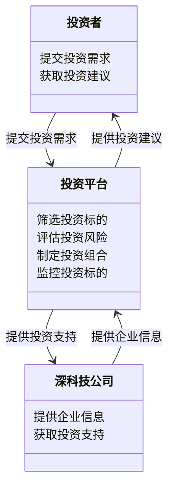

                 


# 彼得林奇的"耐心资本"在深科技公司早期投资中的重要性

> **关键词**: 耐心资本, 深科技公司, 早期投资, 投资策略, 风险评估, 投资回报, 数学模型

> **摘要**: 本文探讨了彼得林奇提出的“耐心资本”理念在深科技公司早期投资中的应用及其重要性。通过分析耐心资本的核心概念、深科技公司的特点、两者结合的数学模型以及实际投资案例，本文详细阐述了耐心资本在深科技公司早期投资中的战略意义和实际应用。文章还通过数学公式和系统架构图，深入解析了耐心资本如何通过长期视角和风险管理实现投资回报最大化。

---

# 第一部分: 背景介绍与核心概念

## 第1章: 耐心资本与深科技公司早期投资的背景

### 1.1 耐心资本的定义与特点

#### 1.1.1 耐心资本的定义

耐心资本（Patient Capital）是一种长期投资理念，强调投资者需要在较长的时间内持有投资标的，不因短期市场波动而频繁调整投资组合。彼得林奇在其投资哲学中强调，耐心资本的核心在于“买入并长期持有优质资产”，通过时间的积累实现价值增长。

#### 1.1.2 耐心资本的核心特点

耐心资本与传统短期投资相比，具有以下核心特点：

1. **长期持有**：投资者在较长的时间内持有资产，避免频繁交易。
2. **价值驱动**：关注企业的基本面和长期发展潜力，而非短期市场波动。
3. **风险承受能力**：能够容忍短期波动，注重长期回报。
4. **低交易成本**：长期持有降低了交易频率，从而降低了交易成本。

#### 1.1.3 耐心资本与传统投资的区别

传统投资往往关注短期收益和市场波动，而耐心资本则更注重长期价值和企业基本面。以下是两者的对比：

| **对比维度** | **传统投资** | **耐心资本** |
|--------------|--------------|--------------|
| 投资期限     | 短期（1-3年）| 长期（5年以上）|
| 投资策略     | 短期套利     | 长期价值投资 |
| 风险承受     | 高           | 中等         |
| 交易频率     | 高           | 低           |

### 1.2 深科技公司的定义与特点

#### 1.2.1 深科技公司的定义

深科技公司是指那些在技术领域具有深厚积累和创新潜力的企业，通常涉及人工智能、量子计算、生物技术等领域。这类企业往往具有较高的技术壁垒和长期发展潜力。

#### 1.2.2 深科技公司的核心特征

深科技公司的核心特征包括：

1. **技术壁垒高**：拥有独特的技术专利或创新模式。
2. **研发投入大**：需要大量资金和时间进行技术研发。
3. **成长周期长**：从研发到商业化需要较长的时间。
4. **市场潜力大**：一旦成功商业化，市场空间广阔。

#### 1.2.3 深科技公司与传统科技公司的对比

| **对比维度** | **深科技公司**          | **传统科技公司**        |
|--------------|-------------------------|--------------------------|
| 技术特点     | 高技术壁垒，创新性强   | 技术相对成熟，应用广泛   |
| 发展阶段     | 早期研发阶段           | 成熟应用阶段             |
| 市场潜力     | 巨大，未来可扩展性高     | 较稳定，增长潜力有限     |

### 1.3 耐心资本在深科技公司早期投资中的重要性

#### 1.3.1 耐心资本在早期投资中的作用

耐心资本在深科技公司早期投资中的作用主要体现在以下方面：

1. **支持技术研发**：提供长期资金支持，帮助企业完成技术研发和产品开发。
2. **降低投资风险**：通过长期持有，分散短期市场波动带来的风险。
3. **增强投资者信心**：稳定的资金支持有助于企业专注于长期发展目标。

#### 1.3.2 深科技公司早期投资的特点

深科技公司早期投资具有以下特点：

1. **高风险**：技术不成熟，市场不确定性大。
2. **高回报潜力**：一旦成功，回报巨大。
3. **长周期**：从研发到商业化需要较长时间。

#### 1.3.3 耐心资本与深科技公司早期投资的结合

耐心资本与深科技公司早期投资的结合，能够充分发挥两者的优势，实现共赢。以下是结合的具体体现：

1. **长期支持**：耐心资本的长期持有特性，能够为深科技公司提供稳定的资金支持。
2. **价值发现**：耐心资本注重长期价值，能够发现并投资具有潜力的深科技公司。
3. **风险分担**：通过长期投资，投资者能够分担深科技公司早期发展的风险。

---

## 第2章: 耐心资本与深科技公司早期投资的核心概念

### 2.1 耐心资本的核心概念

#### 2.1.1 投资理念的核心要素

耐心资本的投资理念主要包括以下核心要素：

1. **长期视角**：关注企业的长期发展潜力。
2. **价值投资**：寻找具有核心竞争力的企业。
3. **风险管理**：通过分散投资和长期持有降低风险。

#### 2.1.2 耐心资本的长期视角

耐心资本的长期视角要求投资者在选择投资标的时，不仅要考虑当前的财务状况，还要关注企业的未来发展前景。这种视角能够帮助投资者在市场波动中保持稳定，避免短期决策的失误。

#### 2.1.3 耐心资本的风险管理

耐心资本的风险管理主要体现在以下方面：

1. **分散投资**：通过投资多个项目降低风险。
2. **长期持有**：避免短期波动带来的损失。
3. **基本面分析**：通过对企业基本面的深入研究，选择具有稳定增长潜力的企业。

### 2.2 深科技公司的核心概念

#### 2.2.1 深科技公司的技术壁垒

深科技公司的技术壁垒是指企业在技术领域拥有的独特优势，这种优势能够保护企业免受竞争对手的侵蚀。技术壁垒越高，企业的市场竞争力越强。

#### 2.2.2 深科技公司的市场定位

深科技公司的市场定位是指企业在市场中的位置和目标客户群体。明确的市场定位能够帮助企业更好地制定发展战略，吸引目标客户。

#### 2.2.3 深科技公司与传统科技公司的对比

如前所述，深科技公司与传统科技公司在技术特点、发展阶段和市场潜力等方面存在显著差异。

### 2.3 耐心资本与深科技公司早期投资的核心联系

#### 2.3.1 耐心资本在深科技公司早期投资中的战略意义

耐心资本在深科技公司早期投资中的战略意义主要体现在以下方面：

1. **支持技术研发**：提供长期资金支持，帮助企业完成技术研发和产品开发。
2. **降低投资风险**：通过长期持有，分散短期市场波动带来的风险。
3. **增强投资者信心**：稳定的资金支持有助于企业专注于长期发展目标。

#### 2.3.2 深科技公司早期投资中的耐心资本需求

深科技公司早期投资中的耐心资本需求主要体现在以下方面：

1. **资金需求**：企业需要大量资金支持技术研发和产品开发。
2. **时间需求**：企业需要较长的时间完成技术研发和商业化。

#### 2.3.3 耐心资本与深科技公司长期发展的匹配性

耐心资本与深科技公司长期发展的匹配性主要体现在以下方面：

1. **长期支持**：耐心资本的长期持有特性，能够为深科技公司提供稳定的资金支持。
2. **价值发现**：耐心资本注重长期价值，能够发现并投资具有潜力的深科技公司。
3. **风险分担**：通过长期投资，投资者能够分担深科技公司早期发展的风险。

---

## 第3章: 耐心资本在深科技公司早期投资中的数学模型与公式

### 3.1 耐心资本的数学模型

#### 3.1.1 投资回报率的计算公式

投资回报率（ROI）的计算公式如下：

$$ ROI = \frac{最终价值 - 初始投资}{初始投资} $$

其中，最终价值是指投资到期时的本金加收益，初始投资是指投资者投入的本金。

#### 3.1.2 风险评估的数学模型

风险评估的数学模型可以表示为：

$$ 风险系数 = \frac{波动率}{平均回报率} $$

其中，波动率是指投资回报的波动程度，平均回报率是指投资的平均回报率。

### 3.2 深科技公司早期投资的数学模型

#### 3.2.1 投资价值的评估公式

投资价值的评估公式如下：

$$ 投资价值 = 初始投资 × (1 + ROI)^{投资期限} $$

其中，ROI是投资回报率，投资期限是指投资的时间长度。

#### 3.2.2 投资风险的量化模型

投资风险的量化模型可以表示为：

$$ 风险指数 = \frac{行业风险 + 公司风险}{2} $$

其中，行业风险是指整个行业面临的市场风险，公司风险是指公司自身面临的经营风险。

### 3.3 耐心资本与深科技公司早期投资的数学关系

#### 3.3.1 耐心资本对投资回报的影响

耐心资本对投资回报的影响可以表示为：

$$ 长期回报 = 初始回报 × (1 + 年增长率)^{投资年数} $$

其中，年增长率是指投资的年均增长率，投资年数是指投资的总年数。

#### 3.3.2 深科技公司早期投资中的时间价值

深科技公司早期投资中的时间价值可以表示为：

$$ 时间价值 = 初始投资 × r × t $$

其中，r是投资的年利率，t是投资的时间长度。

---

## 第4章: 耐心资本与深科技公司早期投资的系统架构设计

### 4.1 投资系统的需求分析

#### 4.1.1 系统目标

系统的目标是为投资者提供一个长期投资的平台，支持深科技公司早期投资的需求。

#### 4.1.2 系统功能需求

系统需要实现以下功能：

1. **投资标的筛选**：根据企业的技术壁垒和市场潜力，筛选出具有投资价值的深科技公司。
2. **风险评估**：通过数学模型评估投资风险，帮助投资者做出决策。
3. **投资组合管理**：根据投资者的风险承受能力和收益目标，制定投资组合。
4. **长期监控**：对投资标的进行长期监控，及时发现潜在风险。

#### 4.1.3 系统边界与外延

系统的边界是指投资者和深科技公司，外延是指投资平台的其他参与者，如金融机构和监管机构。

---

### 4.2 系统功能设计

#### 4.2.1 领域模型（mermaid 类图）



#### 4.2.2 系统架构设计（mermaid 架构图）


---

## 第5章: 项目实战

### 5.1 环境安装

#### 5.1.1 投资平台的安装

投资者需要安装投资平台的客户端，如Python环境和相关库。

### 5.1.2 核心代码实现

以下是投资平台的核心代码实现：

```python
import numpy as np
import pandas as pd

def calculate_ro

