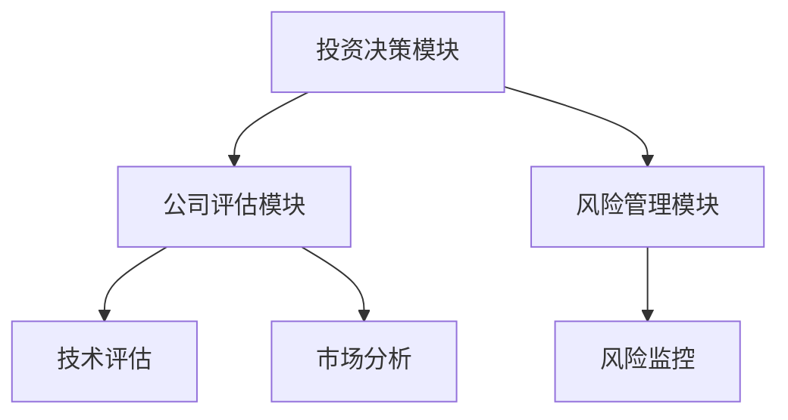

                 


# 彼得林奇的"耐心资本"在深科技初创公司中的角色

> 关键词：耐心资本，深科技，初创公司，投资策略，长期投资

> 摘要：本文探讨了彼得·林奇的耐心资本理念在深科技初创公司中的应用。通过分析耐心资本的核心概念、深科技的特点，以及如何在实际操作中应用这些理念，本文旨在为投资者和初创公司提供有价值的见解。

---

# 第一部分：耐心资本的核心概念

## 第1章：耐心资本的定义与背景

### 1.1 耐心资本的定义与背景

耐心资本（Patient Capital）是由著名投资家彼得·林奇提出的一种投资策略，强调长期投资和对被投公司价值的深度理解。与短期投机不同，耐心资本关注的是企业的长期成长潜力，愿意在较长的时间内持有投资，以实现更高的回报。

- **长期投资策略**：耐心资本的核心在于“耐心”，即投资者在面对市场波动时，能够保持冷静，避免短期决策带来的损失。
- **价值发现**：彼得·林奇认为，投资的成功在于发现那些具有长期增长潜力的企业，并在其价值被低估时买入，耐心等待其价值回升。
- **风险管理**：耐心资本注重控制风险，通过分散投资和深入研究来降低投资组合的整体风险。

### 1.2 深科技初创公司的特点

深科技（Deep Technology）指的是基于前沿技术（如人工智能、量子计算、生物技术等）的创新企业。深科技初创公司通常具有以下特点：

- **技术深度**：依赖于复杂的科学和技术，研发投入大，技术壁垒高。
- **高风险高回报**：由于技术复杂性和市场的不确定性，深科技初创公司的失败率较高，但成功后回报也巨大。
- **长期需求**：这些技术往往需要较长时间才能商业化，因此需要长期的资金支持和耐心资本。

---

## 第2章：耐心资本与深科技初创公司的匹配

### 2.1 深科技初创公司的融资挑战

深科技初创公司在融资过程中面临以下挑战：

- **高风险**：由于技术复杂性和市场不确定性，投资者通常要求更高的回报，但公司早期可能难以提供足够的抵押或现金流。
- **长期资金需求**：深科技公司的研发周期长，需要持续的资金支持，而传统的风险投资往往注重短期回报。

### 2.2 耐心资本的优势

耐心资本的特点使其非常适合深科技初创公司的融资需求：

- **长期支持**：耐心资本允许投资者在较长的时间内持有股权，适合深科技公司漫长的研发周期。
- **价值发现**：通过深入研究和长期持有，投资者能够更好地理解公司的价值，减少短期波动的干扰。
- **风险分担**：耐心资本通常与公司建立更紧密的合作关系，共同承担风险，为公司提供更稳定的支持。

---

# 第二部分：耐心资本在深科技中的应用

## 第3章：耐心资本的核心原理

### 3.1 耐心资本的运作机制

耐心资本的运作机制包括以下几个关键步骤：

1. **价值发现**：通过深入研究和市场分析，识别具有长期增长潜力的公司。
2. **长期投资**：在公司价值被低估时进行投资，并保持长期持有。
3. **风险管理**：通过分散投资和持续监控，降低投资组合的整体风险。
4. **价值实现**：通过公司价值的逐步增长，实现投资回报。

### 3.2 深科技初创公司的价值评估

评估深科技初创公司的价值需要考虑以下几个因素：

- **技术深度**：公司技术的核心竞争力、专利情况、技术团队的能力等。
- **市场潜力**：目标市场的规模、增长潜力以及公司的商业模式。
- **团队能力**：创始团队的经验、能力和执行能力。

---

## 第4章：耐心资本与深科技初创公司的匹配

### 4.1 深科技初创公司的资金需求

深科技初创公司通常需要以下类型的资金支持：

- **种子资金**：用于初期的研发和市场验证。
- **发展资金**：支持产品的开发和商业化。
- **扩展资金**：用于市场扩展和业务扩张。

### 4.2 耐心资本的长期支持策略

耐心资本通过以下方式为深科技初创公司提供长期支持：

- **长期资金支持**：提供持续的资金支持，帮助公司度过研发和市场验证阶段。
- **价值创造**：通过与公司管理层的合作，帮助公司优化管理和战略，提升公司价值。
- **资本退出策略**：在公司价值达到一定水平后，通过并购、上市等方式退出，实现投资回报。

---

## 第5章：耐心资本的数学模型与算法

### 5.1 深科技初创公司的评估模型

为了量化评估深科技初创公司的潜力，可以构建一个基于多项指标的评估模型。以下是一个简化的评估模型：

$$
\text{公司潜力} = w_1 \times \text{技术深度} + w_2 \times \text{市场潜力} + w_3 \times \text{团队能力}
$$

其中，\(w_1, w_2, w_3\) 是各项指标的权重，通常根据具体情况进行调整。

### 5.2 评估模型的实现

以下是用Python实现的评估模型：

```python
def evaluate_company(company):
    # 权重设置
    weights = {'技术深度': 0.4, '市场潜力': 0.3, '团队能力': 0.3}
    # 计算潜力评分
    potential = (company['技术深度'] * weights['技术深度'] +
                 company['市场潜力'] * weights['市场潜力'] +
                 company['团队能力'] * weights['团队能力'])
    return potential

# 示例公司数据
company = {
    '技术深度': 0.8,
    '市场潜力': 0.7,
    '团队能力': 0.6
}

# 评估公司潜力
potential_score = evaluate_company(company)
print(f"公司潜力评分为：{potential_score}")
```

---

## 第6章：系统分析与架构设计

### 6.1 问题场景介绍

深科技初创公司需要一个能够持续评估和优化的系统，以支持长期的投资决策。

### 6.2 系统功能设计

系统功能设计包括以下几个模块：

- **公司评估模块**：定期评估公司的技术、市场和团队情况。
- **投资决策模块**：根据评估结果，制定长期投资策略。
- **风险管理模块**：监控投资组合的风险，并制定应对策略。

### 6.3 系统架构设计

以下是系统的架构设计：



---

## 第7章：项目实战

### 7.1 环境安装

为了实现评估模型，需要安装以下Python库：

```bash
pip install numpy pandas matplotlib
```

### 7.2 核心代码实现

以下是评估模型的实现代码：

```python
import numpy as np
import pandas as pd

# 示例数据
companies = pd.DataFrame({
    '公司名称': ['公司A', '公司B', '公司C'],
    '技术深度': [0.8, 0.6, 0.7],
    '市场潜力': [0.7, 0.8, 0.6],
    '团队能力': [0.6, 0.7, 0.5]
})

# 定义评估函数
def compute_potential(row):
    return row['技术深度'] * 0.4 + row['市场潜力'] * 0.3 + row['团队能力'] * 0.3

# 计算潜力评分
companies['潜力评分'] = companies.apply(compute_potential, axis=1)

# 输出结果
print(companies)
```

---

## 第8章：最佳实践与小结

### 8.1 最佳实践

- **长期视角**：投资者应以长期视角看待深科技初创公司的投资，避免短期波动的干扰。
- **深入研究**：通过深入研究和技术评估，识别具有长期增长潜力的公司。
- **风险控制**：通过分散投资和持续监控，降低投资组合的整体风险。

### 8.2 小结

耐心资本的理念非常适合深科技初创公司的融资需求。通过长期投资和深入研究，投资者能够更好地支持这些公司的发展，并在长期实现更高的回报。未来，随着技术的进步和市场的变化，耐心资本在深科技领域中的应用将会更加广泛和重要。

---

## 第9章：注意事项与拓展阅读

### 9.1 注意事项

- **市场变化**：深科技市场变化快，投资者需要保持敏锐的市场洞察力。
- **技术风险**：技术失败的风险较高，投资者需做好充分的心理准备。
- **团队稳定性**：团队的稳定性和执行力是公司成功的关键，投资者需重点关注。

### 9.2 拓展阅读

- 《彼得·林奇的投资之道》：深入理解耐心资本的理论基础。
- 《深科技创业指南》：了解深科技创业的实务操作。
- 《投资学基础》：掌握投资的基本理论和方法。

---

通过以上分析，我们可以看到，耐心资本在深科技初创公司中的应用不仅需要理论上的理解，更需要实际操作中的策略和方法。希望本文能够为投资者和初创公司提供有价值的参考和启示。

