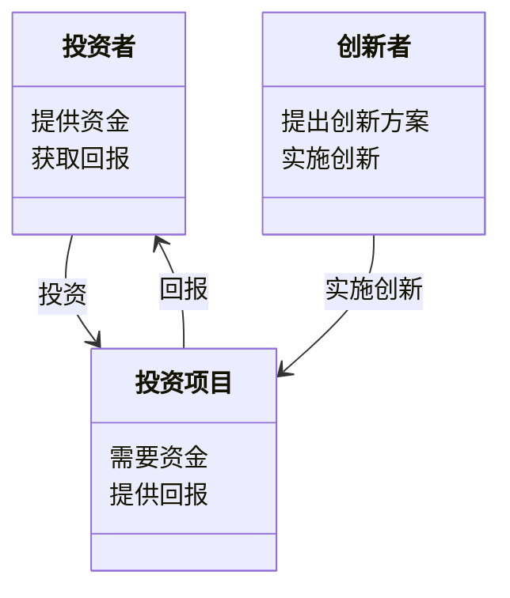

                 


# 彼得林奇的"耐心资本"在颠覆性创新中的角色

> **关键词**：彼得林奇，耐心资本，颠覆性创新，投资策略，系统架构  
> **摘要**：本文探讨了彼得林奇的“耐心资本”理论在颠覆性创新中的角色，分析了耐心资本与颠覆性创新之间的关系，结合数学模型、系统架构设计和实际案例，详细阐述了耐心资本如何促进颠覆性创新的发展。

---

## 第1章: 颠覆性创新与耐心资本概述

### 1.1 颠覆性创新的定义与特征

#### 1.1.1 颠覆性创新的定义
颠覆性创新是指通过引入新技术、新商业模式或新方法，彻底改变现有市场格局或行业规则的创新行为。与渐进式创新不同，颠覆性创新通常会对现有市场产生革命性影响。

#### 1.1.2 颠覆性创新的核心特征
- **技术驱动性**：依赖于新技术的突破。
- **市场颠覆性**：改变市场的竞争规则或客户偏好。
- **商业模式创新性**：通过新的商业模式实现价值创造。

#### 1.1.3 颠覆性创新与渐进式创新的对比
| 特征 | 颠覆性创新 | 渐进式创新 |
|------|-------------|-------------|
| 影响 | 革命性      | 渐进性      |
| 技术 | 突破性      | 优化性      |
| 市场 | 重新定义    | 细微改进    |

---

### 1.2 耐心资本的定义与特点

#### 1.2.1 耐心资本的定义
耐心资本是指投资者在较长的时间内持有投资，不追求短期收益，而是关注长期价值增长的资金。

#### 1.2.2 耐心资本的核心特点
- **长期性**：投资周期长，通常超过5年。
- **稳定性**：在市场波动中保持投资稳定性。
- **低流动性**：资本流动性低，适合长期项目。

#### 1.2.3 耐心资本与传统资本的对比
| 特征 | 耐心资本 | 传统资本 |
|------|-----------|-----------|
| 投资周期 | 长期      | 短期      |
| 风险承受 | 高        | 低        |
| 退出策略 | 耐心退出   | 快速退出   |

---

### 1.3 颠覆性创新与耐心资本的关系

#### 1.3.1 颠覆性创新中耐心资本的作用
耐心资本为颠覆性创新提供了长期的资金支持，使其能够在不确定性和高风险的环境中持续发展。

#### 1.3.2 耐心资本对颠覆性创新的影响
- 提供稳定的资金支持。
- 减少短期压力，允许创新者专注于长期目标。
- 降低因短期压力导致的决策失误风险。

#### 1.3.3 颠覆性创新与耐心资本的协同效应
颠覆性创新需要耐心资本的长期支持，而耐心资本通过颠覆性创新实现更高的投资回报。

---

## 第2章: 彼得林奇的耐心资本理论

### 2.1 彼得林奇与耐心资本

#### 2.1.1 彼得林奇的背景与投资理念
彼得·林奇是富达投资的传奇经理人，他强调长期投资和深入研究，认为市场的短期波动不应影响长期投资决策。

#### 2.1.2 彼得林奇对耐心资本的定义
耐心资本是指投资者在长期持有股票的过程中，能够承受短期波动并坚持长期持有的资本。

#### 2.1.3 彼得林奇耐心资本的核心要素
- **长期视角**：关注企业的长期价值。
- **深入研究**：对企业基本面进行详细分析。
- **风险管理**：分散投资以降低风险。

---

### 2.2 耐心资本在投资中的应用

#### 2.2.1 耐心资本在长期投资中的作用
耐心资本能够帮助投资者在市场低迷时坚持持有，避免因短期波动而损失长期收益。

#### 2.2.2 耐心资本在风险投资中的应用
在风险投资中，耐心资本允许投资者在高风险的初创企业中长期持有，等待企业的成长和成功。

#### 2.2.3 耐心资本在创业中的重要性
耐心资本为创业者提供了持续的资金支持，使其能够专注于产品的开发和市场的拓展。

---

## 第3章: 颠覆性创新的特征与阶段

### 3.1 颠覆性创新的特征

#### 3.1.1 技术驱动性
颠覆性创新通常由新技术的出现引发，例如人工智能、区块链等。

#### 3.1.2 市场颠覆性
颠覆性创新会改变市场的竞争规则，例如互联网对传统零售业的颠覆。

#### 3.1.3 商业模式创新性
颠覆性创新往往伴随着商业模式的创新，例如订阅制、免费增值模式等。

---

### 3.2 颠覆性创新的阶段

#### 3.2.1 初始阶段
在颠覆性创新的初始阶段，创新者需要验证其想法的可行性，并吸引初步的资金支持。

#### 3.2.2 成长阶段
在成长阶段，创新者需要扩大市场份额，并进一步优化产品或服务。

#### 3.2.3 成熟阶段
在成熟阶段，创新者需要巩固其市场地位，并探索新的创新方向。

---

## 第4章: 耐心资本的数学模型与公式

### 4.1 耐心资本的数学模型

#### 4.1.1 投资回报模型
投资回报率（ROI）的计算公式为：
$$ ROI = \frac{\text{净利润}}{\text{初始投资}} \times 100\% $$

#### 4.1.2 风险评估模型
风险评估可以通过标准差来衡量：
$$ \text{标准差} = \sqrt{\frac{1}{n}\sum_{i=1}^{n}(x_i - \bar{x})^2} $$

#### 4.1.3 时间价值模型
资金的时间价值可以通过复利公式计算：
$$ A = P(1 + r)^n $$

---

### 4.2 颠覆性创新的数学模型

#### 4.2.1 创新扩散模型
创新扩散模型可以用以下公式表示：
$$ I(t) = \frac{K}{1 + e^{-rt}} $$
其中，$I(t)$ 表示创新的扩散程度，$K$ 是最大扩散值，$r$ 是增长率，$t$ 是时间。

#### 4.2.2 创新成功率模型
创新成功率可以通过以下公式计算：
$$ S = \frac{\text{成功案例数}}{\text{总案例数}} \times 100\% $$

#### 4.2.3 创新影响模型
创新的影响可以通过以下公式衡量：
$$ I = a \times T + b \times C $$
其中，$T$ 是技术影响，$C$ 是市场影响，$a$ 和 $b$ 是权重系数。

---

### 4.3 耐心资本与颠覆性创新的关联公式

#### 4.3.1 投资回报与创新周期的关系
$$ \text{回报率} = \frac{\text{创新周期}}{\text{投资周期}} \times \text{创新成功概率} $$

#### 4.3.2 风险与创新成功的概率
$$ \text{风险} = \frac{1}{\text{创新成功概率}} \times \text{创新成本} $$

#### 4.3.3 时间与创新价值的关联
$$ \text{创新价值} = \text{时间} \times \text{创新影响} $$

---

## 第5章: 耐心资本与颠覆性创新的系统架构设计

### 5.1 系统分析与架构设计方案

#### 5.1.1 颠覆性创新的系统模型
颠覆性创新的系统模型包括以下几个部分：
- 输入：新技术、市场需求。
- 处理：创新过程、资本支持。
- 输出：市场颠覆、价值创造。

#### 5.1.2 耐心资本的系统架构
耐心资本的系统架构包括以下几个部分：
- 输入：长期资金、投资策略。
- 处理：资本分配、风险管理。
- 输出：投资回报、市场影响。

#### 5.1.3 系统功能设计
- **投资决策模块**：负责评估投资项目的风险和收益。
- **资本分配模块**：负责分配资金到不同的创新项目。
- **风险管理模块**：负责监控和管理投资风险。

---

### 5.2 领域模型类图



---

## 第6章: 项目实战

### 6.1 环境安装

#### 6.1.1 安装Python
安装Python 3.x版本，确保环境满足以下依赖：
- NumPy
- Pandas
- Matplotlib

---

### 6.2 系统核心实现源代码

#### 6.2.1 耐心资本投资模型的实现

```python
import numpy as np
import matplotlib.pyplot as plt

def calculate_ROI(initial Investment, final Value):
    return (final Value - initial Investment) / initial Investment * 100

def calculate_risk(returns):
    mean_return = np.mean(returns)
    deviations = returns - mean_return
    var = np.mean(deviations ** 2)
    std_dev = np.sqrt(var)
    return std_dev

# 示例数据
initial_Investment = 1000
final_Value = 2000
returns = [0.1, 0.05, -0.03, 0.08, 0.02]

ROI = calculate_ROI(initial_Investment, final_Value)
risk = calculate_risk(returns)

print(f"ROI: {ROI}%")
print(f"Risk: {risk}")
```

---

### 6.3 案例分析

#### 6.3.1 案例背景
某科技公司开发了一种颠覆性的人工智能解决方案，需要长期资金支持。

#### 6.3.2 代码实现与分析
运行上述代码，计算投资回报率和风险。

---

## 第7章: 总结与展望

### 7.1 最佳实践 tips

- **长期视角**：耐心资本需要长期投资，避免短期波动的影响。
- **风险管理**：在颠覆性创新中，风险是不可避免的，但可以通过分散投资和严格的风险评估来降低风险。

### 7.2 小结
本文通过分析彼得林奇的耐心资本理论，探讨了其在颠覆性创新中的作用。通过数学模型和系统架构设计，详细阐述了耐心资本如何支持颠覆性创新。

### 7.3 注意事项
- 颠覆性创新具有高风险，需要谨慎评估。
- 耐心资本需要长期支持，投资者需具备耐心和信心。

### 7.4 拓展阅读
- 《彼得·林奇的成功投资法则》
- 《创新者的窘境》

---

## 附录

### 附录A: 术语表

- **耐心资本**：长期持有的资本，支持颠覆性创新。
- **颠覆性创新**：通过新技术或新模式改变市场的创新行为。

### 附录B: 参考文献

- 林奇，P. (1987). 《彼得·林奇的成功投资法则》。
- 克拉克，J. (1997). 《创新者的窘境》。

---

通过本文的详细分析，我们可以看到，耐心资本在颠覆性创新中扮演着至关重要的角色。彼得林奇的理论为我们提供了宝贵的指导，帮助我们在高风险和高回报的创新环境中做出明智的投资决策。

