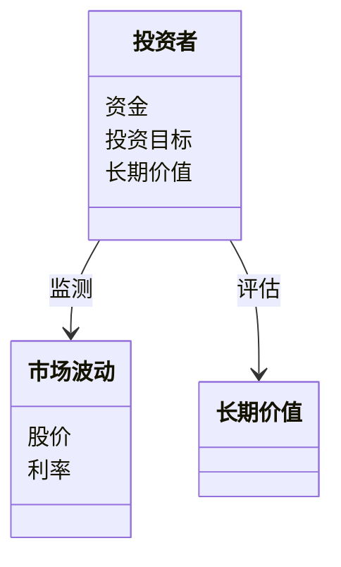
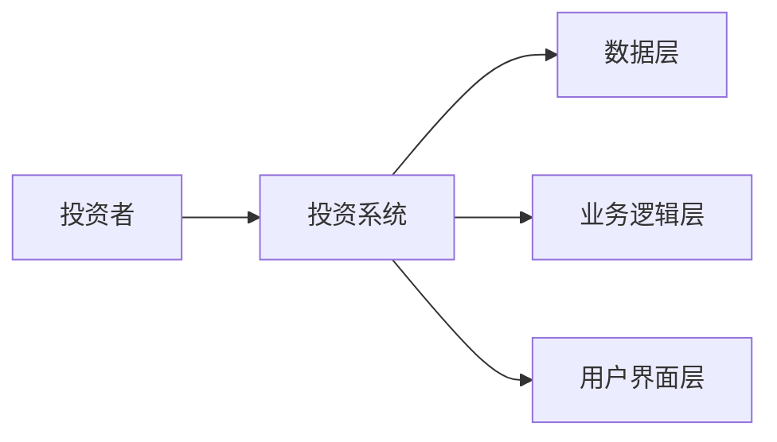
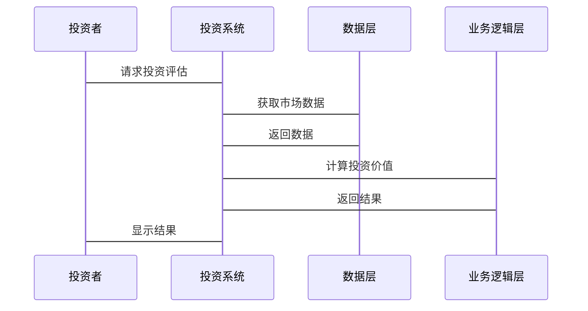

                 


# 彼得林奇的"耐心资本"投资理念

## 关键词：
- 耐心资本
- 长期投资
- 价值投资
- 投资理念
- 投资策略

## 摘要：
彼得·林奇的“耐心资本”投资理念强调长期投资和价值投资的重要性。本文通过详细分析耐心资本的定义、核心概念、算法原理、系统架构以及实际案例，帮助读者理解并掌握这一投资理念。文章结合理论与实践，提供丰富的数学模型、流程图和代码示例，帮助读者在实际投资中应用耐心资本策略。

---

## 目录

### 第一部分：耐心资本概述

#### 第1章：背景介绍

##### 1.1 耐心资本的定义与核心概念
- 1.1.1 耐心资本的定义
  - 耐心资本是指投资者在长期持有优质资产时所展现出的资本形态。
- 1.1.2 耐心资本的核心要素
  - 长期持有、价值发现、风险管理。
- 1.1.3 耐心资本与传统投资的区别
  - 传统投资注重短期收益，而耐心资本强调长期价值。

##### 1.2 投资理念的背景与问题背景
- 1.2.1 投资者常见的投资误区
  - 过度关注短期波动，忽视长期价值。
- 1.2.2 短期投资与长期投资的对比
  - 短期投资风险高，长期投资回报稳定。
- 1.2.3 耐心资本在投资中的作用
  - 通过长期持有优质资产，实现财富稳步增长。

##### 1.3 耐心资本的核心目标
- 1.3.1 长期价值创造的核心理念
  - 通过投资优质企业，实现长期价值增长。
- 1.3.2 投资者心态的调整与优化
  - 减少短期波动的干扰，保持长期投资信心。
- 1.3.3 耐心资本与市场波动的关系
  - 市场波动是投资机会，耐心资本能够抓住这些机会。

#### 第2章：耐心资本的核心概念与联系

##### 2.1 耐心资本的原理分析
- 2.1.1 耐心资本的哲学基础
  - 长期投资需要耐心和信心。
- 2.1.2 投资者心理与耐心资本的关系
  - 心理因素影响投资决策，耐心资本需要克服短期诱惑。
- 2.1.3 耐心资本的数学模型
  - 使用现金流折现法评估长期价值。

##### 2.2 核心概念的属性特征对比
- 2.2.1 耐心资本与风险的关系
  - 长期持有优质资产可以降低投资风险。
- 2.2.2 耐心资本与收益的关系
  - 长期投资带来复利效应，收益稳定且可持续。
- 2.2.3 耐心资本与时间的关系
  - 时间是耐心资本的最佳伙伴，长期持有实现价值增长。

##### 2.3 ER实体关系图


#### 第3章：耐心资本的算法原理

##### 3.1 耐心资本的数学模型
- 价值评估公式：
$$ V = \frac{CF}{(r - g)} $$
其中，V为投资价值，CF为现金流，r为折现率，g为增长率。

##### 3.2 耐心资本的算法流程


##### 3.3 算法实现的Python代码
```python
def calculate_value(cash_flow, discount_rate, growth_rate):
    return cash_flow / (discount_rate - growth_rate)

# 示例
cash_flow = 1000000
discount_rate = 0.08
growth_rate = 0.05
value = calculate_value(cash_flow, discount_rate, growth_rate)
print(f"投资价值为: {value}")
```

#### 第4章：系统分析与架构设计

##### 4.1 问题场景介绍
- 4.1.1 投资者面临的挑战
  - 短期波动干扰，难以坚持长期投资。
- 4.1.2 耐心资本在投资系统中的应用
  - 构建长期投资模型，帮助投资者实现耐心资本策略。

##### 4.2 系统功能设计
- 4.2.1 领域模型Mermaid类图


- 4.2.2 系统架构设计Mermaid架构图


- 4.2.3 系统接口设计
  - API接口：获取市场数据，计算投资价值。

- 4.2.4 系统交互Mermaid序列图


#### 第5章：项目实战

##### 5.1 环境安装
- 安装Python和必要的库，如Pandas、NumPy。

##### 5.2 系统核心实现源代码
```python
import pandas as pd
import numpy as np

def calculate_value(cash_flow, discount_rate, growth_rate):
    return cash_flow / (discount_rate - growth_rate)

# 示例数据
cash_flow_data = pd.DataFrame({
    '现金流': [1000000, 2000000, 3000000],
    '折现率': [0.08, 0.08, 0.08],
    '增长率': [0.05, 0.06, 0.07]
})

# 计算投资价值
values = []
for i in range(len(cash_flow_data)):
    cf = cash_flow_data.iloc[i]['现金流']
    dr = cash_flow_data.iloc[i]['折现率']
    gr = cash_flow_data.iloc[i]['增长率']
    values.append(calculate_value(cf, dr, gr))

print("投资价值为：", values)
```

##### 5.3 代码应用解读与分析
- 代码实现耐心资本的价值评估模型，通过数据框处理多个投资案例，计算每个案例的投资价值。

##### 5.4 实际案例分析和详细讲解剖析
- 案例分析：假设投资目标是某家成长型企业，现金流稳定，折现率8%，增长率5%，计算其投资价值。

##### 5.5 项目小结
- 通过实际案例，验证耐心资本理念的有效性，帮助投资者理解如何在实际操作中应用这一理念。

#### 第6章：最佳实践

##### 6.1 小结
- 耐心资本强调长期投资，通过价值评估模型和系统设计，帮助投资者实现长期财富增长。

##### 6.2 注意事项
- 选择优质资产，避免短期波动干扰，保持长期投资信心。

##### 6.3 拓展阅读
- 推荐阅读彼得·林奇的其他著作，深入理解耐心资本理念。

---

## 总结
通过以上章节的详细分析，读者可以全面理解彼得·林奇的耐心资本投资理念，并掌握其在实际投资中的应用方法。结合理论与实践，耐心资本理念能够帮助投资者在长期投资中实现价值增长。

