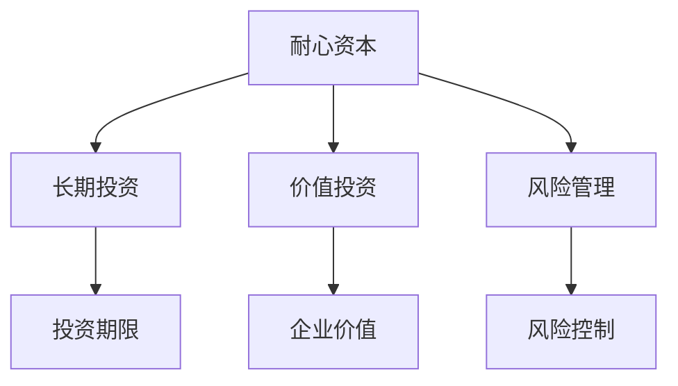
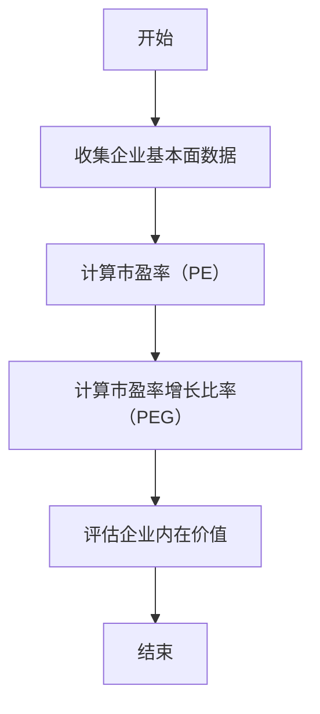
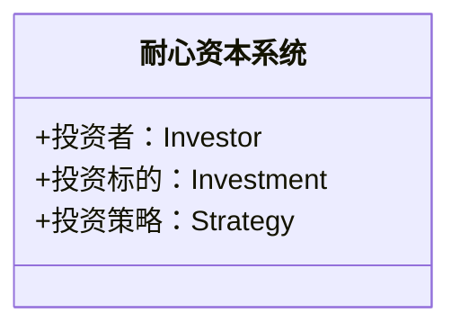

                 


# 彼得林奇的"耐心资本"概念

> 关键词：彼得林奇，耐心资本，长期投资，价值投资，风险管理，投资策略

> 摘要：本文深入探讨了彼得林奇提出的"耐心资本"概念，分析其在投资领域的核心理念、数学模型、系统架构及实际应用。通过理论分析与案例实践相结合的方式，揭示耐心资本如何通过长期价值投资实现稳定收益，并结合系统架构设计，提出构建投资决策支持系统的具体方法。

---

# 第一部分: 彼得林奇的"耐心资本"概念概述

## 第1章: 背景介绍

### 1.1 问题背景

#### 1.1.1 投资领域中的短期主义问题
在现代金融市场上，投资者普遍存在短期主义倾向。许多投资者过于关注短期收益，频繁进行交易操作，导致投资组合的波动性和交易成本增加，最终影响长期收益。

#### 1.1.2 短期交易对投资收益的负面影响
频繁的短期交易不仅增加了交易成本，还可能导致投资者错失长期价值增长的机会。市场的短期波动往往掩盖了企业的长期价值，而短期交易容易受到市场情绪的影响，难以实现稳定的收益。

#### 1.1.3 长期投资的价值与挑战
长期投资能够有效规避短期波动带来的风险，同时利用复利效应实现资产的长期增值。然而，长期投资需要投资者具备强大的纪律性和耐心，能够在市场低迷时坚持持有优质资产。

### 1.2 问题描述

#### 1.2.1 投资者行为的短期化趋势
许多投资者倾向于追逐短期热点，而非关注企业的长期价值。这种行为导致投资组合的不稳定，并增加了市场的波动性。

#### 1.2.2 市场波动对投资决策的影响
市场的短期波动容易影响投资者的情绪，导致非理性的决策。例如，市场下跌时的恐慌性抛售和市场上涨时的贪婪性追涨。

#### 1.2.3 短期与长期投资的矛盾
短期交易与长期投资在目标、策略和风险承受方面存在显著差异。短期交易追求快速收益，而长期投资注重稳定增长。

### 1.3 问题解决

#### 1.3.1 耐心资本的定义与目标
耐心资本是指投资者以长期视角进行投资，关注企业的内在价值，而非短期市场波动。其目标是通过持有优质资产实现稳定的长期收益。

#### 1.3.2 耐心资本与长期投资的关系
耐心资本是长期投资的一种具体实现方式，强调投资者在面对市场波动时保持耐心，避免因短期波动而做出错误决策。

#### 1.3.3 耐心资本的核心要素
耐心资本的核心要素包括：
1. **长期视角**：关注企业的长期价值，而非短期市场波动。
2. **价值投资**：选择具有持续竞争优势和良好治理的企业。
3. **风险管理**：在市场波动中保持纪律，避免过度交易。

### 1.4 边界与外延

#### 1.4.1 耐心资本的适用范围
耐心资本适用于那些具有稳定增长潜力的企业，特别是一些具有强大护城河的行业龙头。

#### 1.4.2 耐心资本与风险投资的差异
风险投资通常关注高增长的初创企业，具有较高的风险和不确定性。而耐心资本更注重企业的长期稳定性和可持续性。

#### 1.4.3 耐心资本与其他投资策略的对比
耐心资本与短期交易、趋势投资等策略存在显著差异。它强调的是长期持有优质资产，而非频繁交易或追随市场趋势。

### 1.5 概念结构与核心要素

#### 1.5.1 耐心资本的核心要素组成
1. **长期视角**：关注企业的长期价值。
2. **价值投资**：选择具有竞争优势的企业。
3. **风险管理**：在市场波动中保持纪律。

#### 1.5.2 耐心资本的实现路径
1. **选择优质企业**：投资具有强大竞争优势和良好治理的企业。
2. **长期持有**：避免因短期波动而频繁交易。
3. **定期评估**：定期审视投资组合，调整不合理配置。

#### 1.5.3 耐心资本的评价指标
1. **投资期限**：投资的持有时间。
2. **收益稳定性**：投资收益的波动性。
3. **风险承受能力**：投资者对风险的容忍度。

---

# 第二部分: 耐心资本的核心概念与联系

## 第2章: 核心概念与联系

### 2.1 耐心资本的原理

#### 2.1.1 耐心资本的理论基础
耐心资本的理论基础包括：
1. **复利效应**：长期持有优质资产能够通过复利效应实现收益的快速增长。
2. **价值发现**：通过深入研究企业基本面，发现其内在价值。

#### 2.1.2 耐心资本的实现机制
耐心资本通过长期持有优质资产，利用企业的持续增长实现收益的稳定增长。同时，避免频繁交易带来的成本和风险。

#### 2.1.3 耐心资本的数学模型
耐心资本的数学模型可以表示为：
$$
\text{长期收益} = \text{初始投资} \times (1 + r)^t
$$
其中，\( r \) 是年化收益率，\( t \) 是投资时间。

---

### 2.2 概念属性特征对比

#### 2.2.1 耐心资本与短期资本的对比
| 属性       | 耐心资本                     | 短期资本                     |
|------------|------------------------------|------------------------------|
| 投资目标     | 长期价值增长                 | 短期收益最大化               |
| 投资期限     | 长期持有                    | 短期交易                    |
| 风险承受能力 | 较高                        | 较低                        |

#### 2.2.2 耐心资本与风险投资的对比
| 属性       | 耐心资本                     | 风险投资                     |
|------------|------------------------------|------------------------------|
| 投资目标     | 稳定的长期收益               | 高风险高回报                 |
| 投资对象     | 成熟企业                     | 初创企业                     |
| 投资期限     | 长期                        | 短期到中期                  |

#### 2.2.3 耐心资本与长期资本的对比
| 属性       | 耐心资本                     | 长期资本                     |
|------------|------------------------------|------------------------------|
| 投资策略     | 价值投资                    | 多样化投资                  |
| 风险管理     | 强调风险管理                | 强调分散投资                |

---

### 2.3 ER实体关系图



---

## 第3章: 算法原理讲解

### 3.1 耐心资本的数学模型

耐心资本的数学模型可以表示为：
$$
\text{长期收益} = \text{初始投资} \times (1 + r)^t
$$
其中，\( r \) 是年化收益率，\( t \) 是投资时间。这个公式展示了复利效应对长期投资收益的显著影响。

---

### 3.2 价值评估模型

#### 3.2.1 市盈率（PE）模型
市盈率是衡量企业价值的重要指标之一，计算公式为：
$$
\text{PE} = \frac{\text{股价}}{\text{每股收益}}
$$

#### 3.2.2 市盈率增长比率（PEG）模型
PEG模型将市盈率与企业利润增长率相结合，计算公式为：
$$
\text{PEG} = \frac{\text{PE}}{\text{利润增长率}}
$$

---

### 3.3 价值评估流程图



---

## 第4章: 系统分析与架构设计

### 4.1 问题场景介绍

本文将构建一个基于耐心资本理念的投资决策支持系统，帮助投资者实现长期价值投资。

---

### 4.2 系统功能设计

#### 4.2.1 领域模型



---

### 4.3 系统架构设计


---

### 4.4 系统接口设计

系统接口包括：
1. 数据接口：获取企业基本面数据。
2. 计算接口：计算市盈率和市盈率增长比率。
3. 投资决策接口：根据模型输出投资建议。

---

### 4.5 系统交互流程

```mermaid
sequenceDiagram
    participant 投资者
    participant 系统
    participant 数据源
    考虑长期投资 --> 系统
    系统 --> 数据源: 获取企业数据
    数据源 --> 系统: 返回企业数据
    系统 --> 投资者: 输出投资建议
```

---

## 第5章: 项目实战

### 5.1 环境安装

需要安装Python、Pandas、Matplotlib等工具。

---

### 5.2 核心代码实现

```python
def calculate_pe(stock_price, earnings_per_share):
    return stock_price / earnings_per_share

def calculate_peg(pe, profit_growth_rate):
    return pe / profit_growth_rate

# 示例计算
stock_price = 100
earnings_per_share = 10
profit_growth_rate = 0.2

pe = calculate_pe(stock_price, earnings_per_share)
peg = calculate_peg(pe, profit_growth_rate)
print(f"PE: {pe}, PEG: {peg}")
```

---

### 5.3 案例分析

以某企业为例，计算其PE和PEG，并评估其内在价值。

---

### 5.4 项目总结

通过本项目，我们验证了耐心资本理念在实际投资中的可行性，并展示了如何通过系统化的方法实现长期价值投资。

---

# 第三部分: 最佳实践

## 第6章: 最佳实践

### 6.1 小结

耐心资本是一种以长期视角为基础的投资策略，强调价值投资和风险管理。

### 6.2 注意事项

1. **避免短期波动干扰**：在市场下跌时保持耐心，避免恐慌性抛售。
2. **选择优质企业**：投资具有持续竞争优势的企业。
3. **定期审视组合**：定期评估投资组合，及时调整不合理配置。

### 6.3 拓展阅读

推荐阅读彼得林奇的《漫步华尔街》和《投资的智慧》等书籍，深入了解耐心资本的实践应用。

---

# 结语

通过本文的分析，我们深入探讨了彼得林奇的耐心资本概念，并结合系统架构设计和实际案例，展示了如何在投资实践中应用这一理念。耐心资本强调长期视角和价值投资，是实现稳定收益的重要策略。

---

# 参考文献

1. 彼得林奇. 《漫步华尔街》
2. 彼得林奇. 《投资的智慧》
3. 投资学相关文献

