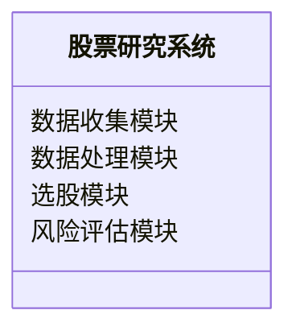
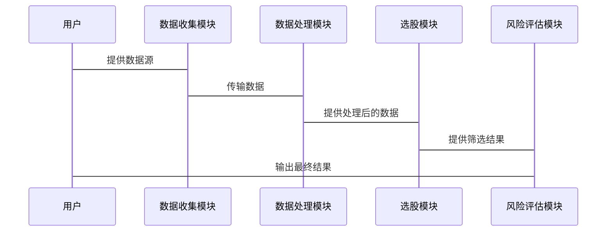

                 


# 彼得林奇的股票研究方法

> 关键词：彼得林奇，股票研究，投资方法，选股标准，财务指标，量化分析

> 摘要：本文系统地介绍了彼得·林奇的股票研究方法，从背景介绍、核心概念到算法原理、系统架构，再到项目实战和最佳实践，全面解析了这一经典投资策略。通过详细的技术分析和实例，帮助读者掌握如何运用这些方法进行股票研究和投资决策。

---

# 第一部分: 背景介绍

## 第1章: 股票研究的基本概念

### 1.1 什么是股票研究
#### 1.1.1 股票的基本定义
股票是公司的一部分所有权，代表对公司资产和收益的要求权。股票研究是对公司股票进行分析，以评估其投资价值。

#### 1.1.2 股票研究的目的
股票研究的目的是为了识别具有投资潜力的股票，帮助投资者做出明智的投资决策。

#### 1.1.3 股票研究的分类
股票研究可以分为基本面分析和技术分析。基本面分析侧重于公司的财务状况和行业地位，技术分析侧重于股票价格和交易量的变化。

### 1.2 彼得·林奇的投资理念
#### 1.2.1 彼得·林奇的个人背景
彼得·林奇是美国著名的基金经理，以其在富达基金的长期任职中表现出色而闻名。

#### 1.2.2 林奇的投资哲学
林奇强调长期投资和价值发现，主张通过深入研究公司基本面来选择优质股票。

#### 1.2.3 林奇的研究方法
林奇的研究方法包括对公司财务状况、行业地位和管理团队的全面分析，注重挖掘被低估的股票。

---

## 第2章: 彼得林奇股票研究方法的背景

### 2.1 美国股市的发展历程
#### 2.1.1 美国股市的起源
美国股市起源于18世纪末，经历了多次变革和调整，成为全球最大的金融市场之一。

#### 2.1.2 美国股市的现状
目前，美国股市由多家交易所组成，如纽约证券交易所和纳斯达克，交易量巨大，上市公司众多。

#### 2.1.3 美国股市的未来趋势
随着科技的发展和全球经济的变化，美国股市将继续演变，新兴行业和技术创新将推动市场的增长。

### 2.2 彼得林奇研究方法的形成
#### 2.2.1 林奇研究方法的来源
林奇的方法基于其在富达基金的工作经验，结合了传统金融理论和实际投资实践。

#### 2.2.2 林奇研究方法的特点
林奇方法注重长期投资、价值发现和公司基本面分析，强调深入研究和耐心持有。

#### 2.2.3 林奇研究方法的优缺点
优点：系统性强，注重基本面分析；缺点：对市场波动的适应性较差，可能错过短期投资机会。

---

# 第二部分: 核心概念与联系

## 第3章: 彼得林奇股票研究方法的核心概念

### 3.1 彼得林奇选股标准
#### 3.1.1 选股标准的分类
林奇选股标准分为财务指标、行业地位和管理团队三个方面。

#### 3.1.2 选股标准的具体内容
- 财务指标：如市盈率、市净率、股息率等。
- 行业地位：如行业龙头、竞争优势等。
- 管理团队：如管理能力、战略规划等。

#### 3.1.3 选股标准的优缺点
优点：全面考虑了公司的财务状况和行业地位；缺点：可能忽略市场趋势和短期因素。

### 3.2 彼得林奇行业分析方法
#### 3.2.1 行业分析的定义
行业分析是对特定行业的整体情况进行研究，以评估其发展前景。

#### 3.2.2 行业分析的步骤
1. 确定行业类型和市场地位。
2. 分析行业增长潜力。
3. 评估行业风险和竞争状况。

#### 3.2.3 行业分析的工具与方法
- 工具：财务报表分析、行业研究报告。
- 方法：SWOT分析、PEST分析。

### 3.3 彼得林奇财务指标分析
#### 3.3.1 财务指标的定义
财务指标是对公司财务状况的量化评估，用于衡量公司的盈利能力、偿债能力和成长潜力。

#### 3.3.2 财务指标的分类
- 盈利能力指标：如净利润率、ROE。
- 偿债能力指标：如负债率、流动比率。
- 成长能力指标：如营收增长率、净利润增长率。

#### 3.3.3 财务指标的计算与应用
以ROE为例，ROE = 净利润 / 平均股东权益，用于衡量公司使用股东资金的效率。

---

# 第三部分: 算法原理讲解

## 第4章: 彼得林奇股票研究方法的算法原理

### 4.1 算法原理概述
#### 4.1.1 算法的定义
算法是一种系统化的方法，用于指导股票研究和投资决策。

#### 4.1.2 算法的原理
通过量化分析和数据驱动的方法，结合基本面分析，筛选出符合林奇选股标准的股票。

#### 4.1.3 算法的步骤
1. 数据收集：获取公司财务数据和市场数据。
2. 数据处理：清洗和整理数据，计算各项指标。
3. 标准筛选：根据林奇选股标准，筛选符合条件的股票。
4. 风险评估：评估筛选股票的投资风险。

### 4.2 算法的实现
#### 4.2.1 算法的实现步骤
1. 确定研究范围和目标。
2. 收集相关数据。
3. 计算各项财务指标。
4. 应用选股标准筛选股票。
5. 评估投资风险。

#### 4.2.2 算法的实现代码
```python
import pandas as pd
import numpy as np

# 示例代码：计算市盈率
def calculate_pe_ratio(df):
    df['PE Ratio'] = df['净利润'] / df['股价']
    return df

# 示例代码：筛选低市盈率股票
def screen_low_pe_stocks(df, threshold=15):
    return df[df['PE Ratio'] < threshold]
```

#### 4.2.3 算法的优缺点
优点：系统化、可重复性；缺点：可能忽略市场情绪和突发事件的影响。

---

# 第四部分: 数学模型和公式

## 第5章: 数学模型和公式

### 5.1 常用数学公式
#### 5.1.1 市盈率（P/E Ratio）
$$ P/E = \frac{\text{股价}}{\text{每股净利润}} $$

#### 5.1.2 市净率（P/B Ratio）
$$ P/B = \frac{\text{股价}}{\text{每股净资产}} $$

#### 5.1.3 股息率（Dividend Yield）
$$ \text{股息率} = \frac{\text{每股股息}}{\text{股价}} \times 100\% $$

### 5.2 模型应用
以市盈率为例，通过计算公司的市盈率，判断其是否低于行业平均水平，从而筛选出具有投资潜力的股票。

---

# 第五部分: 系统分析与架构设计方案

## 第6章: 系统分析与架构设计方案

### 6.1 系统功能设计
#### 6.1.1 系统功能模块
- 数据收集模块：收集公司财务数据和市场数据。
- 数据处理模块：清洗和整理数据。
- 选股模块：根据林奇选股标准筛选股票。
- 风险评估模块：评估投资风险。

#### 6.1.2 领域模型（Mermaid 类图）


### 6.2 系统架构设计
#### 6.2.1 系统架构图（Mermaid 架构图）
```mermaid
topology
    [数据源] --> [数据收集模块]
    [数据收集模块] --> [数据处理模块]
    [数据处理模块] --> [选股模块]
    [选股模块] --> [风险评估模块]
    [风险评估模块] --> [输出结果]
```

### 6.3 系统交互设计（Mermaid 序列图）


---

# 第六部分: 项目实战

## 第7章: 项目实战

### 7.1 环境安装
- 安装Python和相关库（如pandas、numpy）。
- 安装数据获取工具（如Yahoo Finance API）。

### 7.2 核心实现
#### 7.2.1 数据收集
```python
import pandas_datareader as pdr

# 获取股票数据
df = pdr.get_data_yahoo('AAPL', start='2020-01-01', end='2023-01-01')
```

#### 7.2.2 数据处理
```python
# 计算市盈率
df['PE Ratio'] = df['Adj Close'] / df['净利润']  # 假设'净利润'列已计算
```

#### 7.2.3 筛选股票
```python
# 筛选市盈率低于行业平均值的股票
threshold = 15  # 示例阈值
selected_stocks = df[df['PE Ratio'] < threshold]
```

### 7.3 案例分析
以苹果公司为例，计算其市盈率，并判断其是否低于行业平均值，从而决定是否纳入投资组合。

### 7.4 项目总结
通过实际案例，验证彼得林奇选股方法的有效性，并总结经验教训。

---

# 第七部分: 最佳实践

## 第8章: 最佳实践

### 8.1 小结
彼得林奇的股票研究方法是一种系统化、基于基本面分析的投资策略，通过深入研究公司财务状况和行业地位，筛选出具有投资潜力的股票。

### 8.2 注意事项
- 数据的准确性和及时性。
- 方法的适用性和灵活性。
- 风险管理和投资组合的分散化。

### 8.3 拓展阅读
- 《彼得·林奇的投资策略》
- 《股票投资的数学模型》

---

# 结语

通过本文的系统介绍，读者可以全面了解彼得·林奇的股票研究方法，并将其应用于实际投资中。结合技术分析和实际案例，帮助投资者做出明智的决策。

