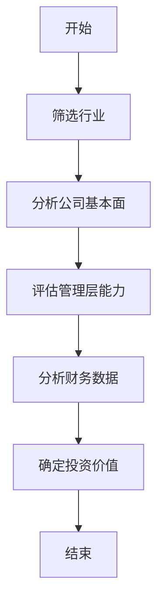

                 


# 彼得林奇的"自下而上"选股方法

> 关键词：彼得林奇，自下而上选股法，股票投资，基本面分析，内在价值

> 摘要：彼得林奇的“自下而上”选股方法是一种以公司基本面分析为核心的选股策略，强调从具体个股出发，通过深入研究公司的财务数据、竞争优势和管理层能力，挖掘出具有投资价值的股票。本文将详细介绍这种方法的核心概念、算法原理、系统架构以及实际应用。

---

## 第一部分：自下而上选股法的背景与核心概念

### 第1章：自下而上选股法的背景与核心概念

#### 1.1 自下而上选股法的定义与特点

自下而上选股法是一种以个股为核心的投资策略，与自上而下选股法相对。自上而下通常是从宏观经济、行业趋势等宏观因素入手，而自下而上则是从具体公司的基本面分析出发，挑选出具有投资价值的股票。

- **定义**：自下而上选股法是指投资者通过分析单个公司的财务数据、行业地位、竞争优势和管理层能力等因素，筛选出具有潜在增值能力的股票进行投资。
- **特点**：
  1. **个股驱动**：关注具体公司的基本面，而非整体市场或行业趋势。
  2. **长期投资**：注重公司长期的盈利能力，而非短期市场波动。
  3. **风险可控**：通过深入分析公司，降低投资风险。

#### 1.2 彼得·林奇选股法的背景

彼得·林奇是美国著名的基金经理，曾管理富达麦哲伦基金，取得了卓越的投资业绩。他的选股方法以自下而上为主，强调对公司基本面的深入研究。

- **生平简介**：彼得·林奇是美国著名投资者，以管理富达麦哲伦基金而闻名，基金规模从1977年的2000万美元增长到1990年的140亿美元。
- **选股法的形成背景**：在20世纪80年代，美国股市经历了多次波动，彼得·林奇通过深入研究公司基本面，成功筛选出优质股票，实现基金的长期增长。
- **理论基础**：自下而上选股法的理论基础是价值投资，强调通过分析公司的内在价值来决定投资。

---

### 第2章：自下而上选股法的核心概念与联系

#### 2.1 自下而上选股模型的核心要素

自下而上选股法的核心在于对公司基本面的深入分析，主要包括以下几个方面：

- **公司基本面**：包括收入、利润、资产负债表等财务数据。
- **行业地位**：公司在行业中的市场份额和竞争优势。
- **管理层能力**：公司管理层的素质和战略能力。
- **财务健康状况**：公司的偿债能力、盈利能力和发展潜力。

#### 2.2 自下而上选股法的ER实体关系图

以下是一个简化的ER实体关系图，展示了自下而上选股法的核心要素：

```mermaid
erd
    投资者 (投资者ID, 投资策略, 投资目标)
    股票 (股票ID, 股票名称, 行业)
    财务数据 (股票ID, 收入, 利润, 资产, 负债)
    竞争优势 (股票ID, 市场份额, 技术创新, 核心竞争力)
    管理层能力 (股票ID, CEO能力, 管理团队稳定性)
    市场环境 (股票ID, 宏观经济, 行业趋势)
```

#### 2.3 自下而上选股法的流程图

以下是一个简化的流程图，展示了自下而上选股法的步骤：



---

## 第二部分：自下而上选股法的算法原理

### 第3章：自下而上选股法的数学模型

#### 3.1 股票内在价值计算公式

彼得·林奇的选股方法中，内在价值是一个重要的概念。内在价值可以通过以下公式计算：

$$ V = \frac{E}{k} $$

其中：
- \( V \) 是股票的内在价值
- \( E \) 是公司的预期收益
- \( k \) 是折现率

#### 3.2 市盈率计算公式

市盈率（P/E）是衡量股票价值的重要指标之一，公式为：

$$ P/E = \frac{P}{E} $$

其中：
- \( P \) 是股票价格
- \( E \) 是公司每股收益

---

## 第三部分：系统分析与架构设计方案

### 第4章：系统分析与架构设计方案

#### 4.1 问题场景介绍

- **投资者需求**：投资者希望通过自下而上选股法筛选出具有投资价值的股票。
- **适用场景**：适用于长期价值投资，尤其是对个股基本面分析有需求的投资者。

#### 4.2 系统功能设计

- **领域模型**：
  ```mermaid
  classDiagram
      class 投资者 {
          基金经理
          投资组合
      }
      class 股票 {
          股票ID
          股票名称
          行业
      }
      class 财务数据 {
          收入
          利润
          资产
          负债
      }
      class 竞争优势 {
          市场份额
          技术创新
          核心竞争力
      }
      class 管理层能力 {
          CEO能力
          管理团队稳定性
      }
      class 市场环境 {
          宏观经济
          行业趋势
      }
  ```

#### 4.3 系统架构设计

- **系统架构图**：
  ```mermaid
  graph TD
      A[投资者] --> B[选股标准]
      B --> C[公司基本面]
      C --> D[财务数据]
      C --> E[竞争优势]
      C --> F[管理层能力]
      G[市场环境] --> C
  ```

---

## 第四部分：项目实战与案例分析

### 第5章：项目实战与案例分析

#### 5.1 环境安装

为了进行自下而上选股法的分析，我们需要以下工具：

- **数据源**：股票数据（财务报表、行业数据等）。
- **分析工具**：Excel、Python（Pandas、NumPy等库）。
- **可视化工具**：Matplotlib、Tableau等。

#### 5.2 核心实现源代码

以下是一个简单的Python代码示例，用于计算股票的内在价值和市盈率：

```python
import pandas as pd

# 假设我们有一个股票的数据框
df = pd.DataFrame({
    '股票ID': ['A', 'B', 'C'],
    '收入': [100, 200, 150],
    '利润': [20, 30, 25],
    '股价': [50, 60, 40]
})

# 计算内在价值（简化模型）
df['内在价值'] = df['收入'] / 0.1  # 假设折现率为10%

# 计算市盈率
df['市盈率'] = df['股价'] / df['利润']

print(df)
```

#### 5.3 案例分析

以一家科技公司为例，假设公司财务数据如下：

- 收入：1000万美元
- 利润：200万美元
- 股价：50美元

计算其内在价值和市盈率：

$$ V = \frac{1000}{0.1} = 10 \text{美元} $$

$$ P/E = \frac{50}{2} = 25 $$

---

## 第五部分：最佳实践与总结

### 第6章：最佳实践与总结

#### 6.1 最佳实践

- **持续学习**：市场变化迅速，投资者需要不断更新知识。
- **分散投资**：避免过度集中，降低风险。
- **长期持有**：耐心持有优质股票，避免频繁交易。

#### 6.2 总结

彼得·林奇的自下而上选股方法是一种以公司基本面分析为核心的选股策略，通过深入研究公司的财务数据、行业地位和管理层能力，筛选出具有投资价值的股票。这种方法注重长期价值，适合那些愿意花时间研究个股的投资者。

---

## 第六部分：注意事项与拓展阅读

### 第7章：注意事项与拓展阅读

#### 7.1 注意事项

- **市场波动**：自下而上选股法无法完全避免市场波动的影响。
- **数据质量**：财务数据的准确性和完整性对分析结果至关重要。
- **行业差异**：不同行业的分析指标有所不同，需要灵活调整。

#### 7.2 拓展阅读

- **书籍推荐**：
  - 《彼得·林奇的成功投资》
  - 《投资学原理》
- **在线资源**：
  - 网站：Yahoo Finance、Morningstar
  - 论文：关于价值投资的经典文献

---

## 第七部分：结束语

彼得·林奇的自下而上选股方法为投资者提供了一种系统化的方法，通过深入分析公司的基本面，筛选出具有投资价值的股票。这种方法不仅适用于专业投资者，也适合那些愿意花时间学习和研究的个人投资者。希望本文能为您提供有价值的投资思路，祝您投资成功！

