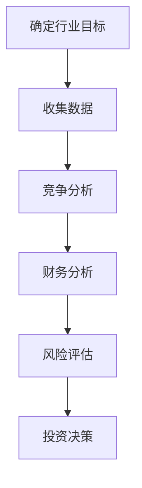
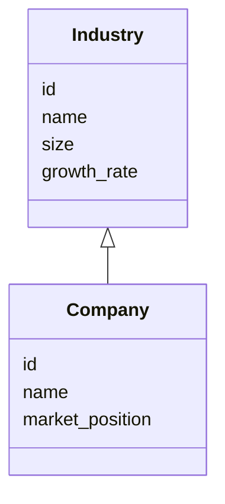
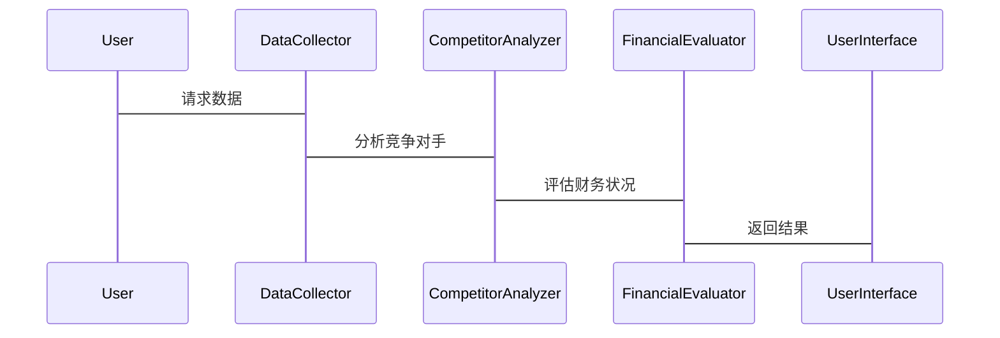

                 


# 彼得林奇的"行业分析"在混合现实产业中的调整

> **关键词**：彼得林奇、行业分析、混合现实、投资分析、产业调整
> 
> **摘要**：本文探讨了彼得林奇的行业分析方法在混合现实产业中的应用，通过详细分析混合现实产业的特点，调整传统行业分析框架，以适应新兴科技产业的需求。文章从理论到实践，结合实例，为投资者和从业者提供新的视角和方法。

---

## 第一部分：背景介绍

### 第1章：彼得林奇的行业分析方法概述

#### 1.1 彼得林奇的行业分析方法
- **行业分析的基本概念**：行业分析是研究特定产业的市场结构、竞争状况、增长潜力和风险因素，以帮助投资者做出更明智的决策。
- **彼得林奇的分析框架**：彼得林奇强调深入研究行业，关注市场规模、竞争格局、商业模式和财务状况。
- **核心要素**：行业分析包括行业生命周期、市场容量、竞争优势、潜在风险和投资机会。

#### 1.2 混合现实产业的基本情况
- **定义与技术基础**：混合现实（MR）结合了增强现实（AR）和虚拟现实（VR），在物理世界中叠加数字信息。
- **应用领域**：教育、医疗、娱乐、制造业和房地产等领域。
- **市场规模与发展趋势**：预计到2030年，MR市场规模将超过1000亿美元，增长迅速。

### 1.3 本章小结
本章介绍了彼得林奇的行业分析方法，并分析了混合现实产业的基本情况，为后续调整奠定基础。

---

## 第二部分：核心概念与联系

### 第2章：彼得林奇行业分析方法的核心概念与联系

#### 2.1 行业分析的核心概念
- **核心原理**：分析行业内的竞争结构、市场进入壁垒和长期增长趋势。
- **关键特征对比**：
  | 特征 | 传统行业 | 混合现实产业 |
  |------|----------|--------------|
  | 技术依赖 | 较低     | 高           |
  | 市场增长率 | 稳定     | 高           |
  | 进入壁垒 | 中等     | 高           |
- **ER实体关系图**：
```mermaid
er
  %% 行业分析核心概念的ER图
  class Industry {
    id
    name
    size
    growth_rate
  }
  class Company {
    id
    name
    market_position
  }
  class Technology {
    id
    name
    impact
  }
  Industry --> Company: 包含
  Industry --> Technology: 使用
```

#### 2.2 混合现实产业的核心要素
- **实体关系分析**：混合现实产业涉及设备、软件、内容和服务。
- **成功因素**：技术创新、用户体验和生态系统构建。
- **市场结构**：寡头垄断，主要玩家包括科技巨头和初创公司。

### 2.3 本章小结
本章通过对比分析，明确了彼得林奇方法在混合现实产业中的适用性和调整方向。

---

## 第三部分：算法原理

### 第3章：彼得林奇行业分析方法的算法原理

#### 3.1 分析步骤
- **目标确定**：识别关键行业指标。
- **数据收集**：市场数据、财务报表和竞争分析。
- **竞争分析**：评估市场份额和竞争优势。
- **财务分析**：计算盈利能力、增长潜力和估值。
- **风险评估**：考虑技术、市场和政策风险。
- **投资决策**：基于分析结果做出投资决策。

#### 3.2 流程图实现


#### 3.3 数学模型与公式
- **投资回报率（ROI）**：
  $$ ROI = \frac{净利润}{投资成本} \times 100\% $$
- **市场增长率（CAGR）**：
  $$ CAGR = \frac{P_{final}}{P_{initial}}^{1/n} - 1 $$
  其中，$P_{final}$为最终价格，$P_{initial}$为初始价格，$n$为年数。

#### 3.4 示例
假设某混合现实公司投资回报率为20%，市场增长率为15%，其投资价值潜力大。

### 3.5 本章小结
本章详细讲解了彼得林奇方法的步骤，并通过公式和图表展示了其在混合现实产业中的应用。

---

## 第四部分：系统分析与架构设计

### 第4章：系统分析与架构设计

#### 4.1 系统分析
- **问题场景**：如何利用彼得林奇方法进行混合现实产业分析。
- **领域模型类图**：


#### 4.2 系统架构设计


#### 4.3 接口设计
- **数据接口**：API获取市场数据。
- **用户交互**：可视化界面展示分析结果。

#### 4.4 交互设计


### 4.5 本章小结
本章通过系统分析和架构设计，展示了如何将彼得林奇方法应用于混合现实产业。

---

## 第五部分：项目实战

### 第5章：项目实战

#### 5.1 环境安装
- **工具**：Python、Jupyter Notebook、数据分析库（Pandas、Matplotlib）。

#### 5.2 核心代码实现
```python
import pandas as pd
import matplotlib.pyplot as plt

# 数据处理
data = pd.read_csv('market_data.csv')
data['growth_rate'] = data['revenue'].pct_change()

# 可视化
plt.plot(data['year'], data['growth_rate'])
plt.title('Market Growth Rate')
plt.show()
```

#### 5.3 案例分析
分析某混合现实公司，计算投资回报率和市场增长率，评估其投资价值。

#### 5.4 项目总结
项目展示了如何将彼得林奇方法应用于混合现实产业分析，强调了数据和模型的重要性。

### 5.5 本章小结
本章通过实战项目，详细讲解了分析方法的实现和应用。

---

## 第六部分：最佳实践与小结

### 第6章：最佳实践与小结

#### 6.1 投资建议
- 关注技术创新和用户体验。
- 评估市场规模和增长潜力。

#### 6.2 注意事项
- 风险提示：技术风险和政策风险。
- 数据质量：确保数据准确性和全面性。

#### 6.3 拓展阅读
推荐书籍：《彼得·林奇的成功投资》、《混合现实技术与应用》。

#### 6.4 本章小结
调整彼得林奇方法，结合混合现实产业特点，为投资者和从业者提供新的视角和方法。

---

**结语**：通过本文的分析，彼得林奇的行业分析方法在混合现实产业中得到了有效的调整和应用，为投资者和从业者提供了新的思路和工具。

