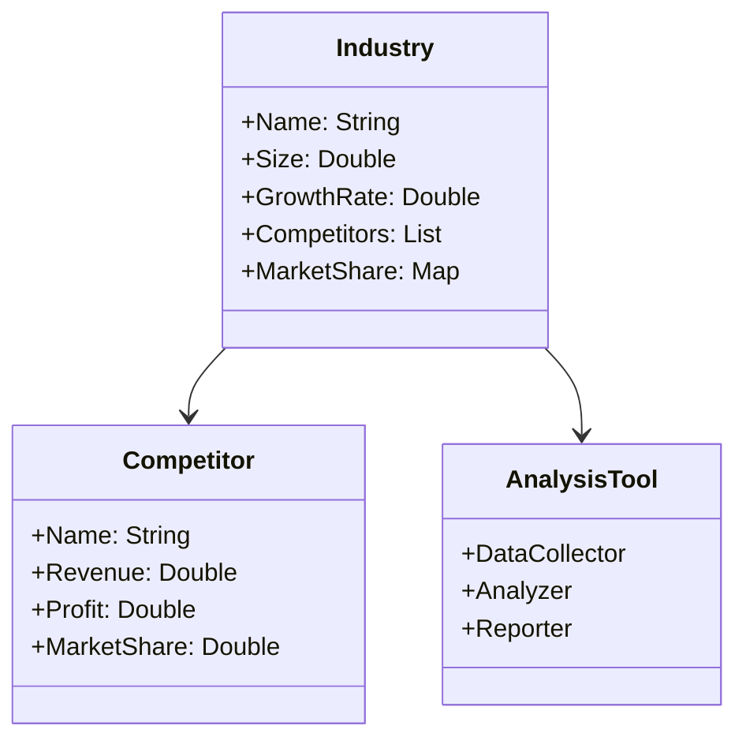
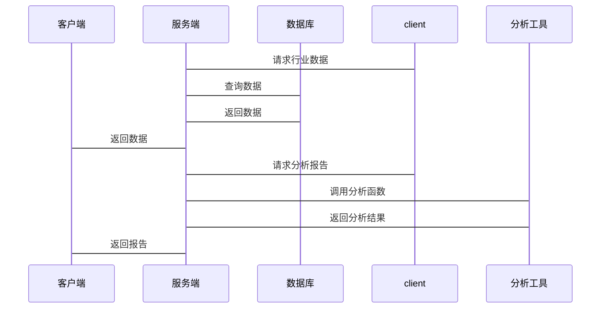

                 


# 彼得林奇的"行业分析"方法论

## 关键词：
- 彼得林奇
- 行业分析
- 投资方法
- 股票分析
- 市场趋势

## 摘要：
本文深入探讨了彼得·林奇的行业分析方法论，分析其核心概念、工具、步骤及其在投资决策中的应用。通过实际案例和系统架构设计，展示了如何将这些方法应用于实际投资中，帮助投资者做出明智决策。

---

# 引言

## 1. 彼得林奇及其投资理念

### 1.1 彼得林奇的生平简介
- **早年经历**：彼得·林奇出生于1940年，毕业于宾夕法尼亚大学。他的投资生涯始于1977年，管理着麦哲伦基金，使其规模从1800万美元增长至140亿美元。
- **投资哲学**：他强调长期投资、价值发现和深入的行业研究，认为市场预测不如深入分析行业和公司基本面。
- **成功案例**：他通过投资可口可乐、Home Depot等公司取得了巨大成功，展示了其方法的有效性。

### 1.2 彼得林奇投资理念的核心思想
- **长期视角**：避免短期市场波动干扰，关注企业的长期增长。
- **价值投资**：寻找被市场低估的公司，分析其竞争优势和增长潜力。
- **行业研究**：通过深入研究行业，发现优质企业，避免行业风险。

### 1.3 行业分析的重要性
- **行业分析**：是评估企业投资价值的关键，帮助识别行业趋势和潜在风险。
- **彼得林奇的独特视角**：强调行业结构、竞争格局和市场趋势，寻找具有持续增长潜力的行业。

---

## 2. 行业分析方法论的背景

### 2.1 行业分析的定义与作用
- **行业分析**：研究特定行业内部结构、竞争环境、增长趋势等，以评估投资机会。
- **作用**：帮助投资者识别行业风险和机会，制定投资策略。

### 2.2 彼得林奇行业分析的核心思想
- **行业生命周期**：识别行业所处阶段，判断增长潜力。
- **竞争优势分析**：评估企业在行业中的地位和竞争优势。
- **财务指标分析**：通过财务数据评估企业健康状况和盈利能力。

### 2.3 行业分析在投资中的重要性
- **避免行业风险**：通过分析行业趋势，避免投资处于衰退期的行业。
- **发现投资机会**：识别增长潜力大的行业，抓住投资机会。
- **制定投资策略**：基于行业分析结果，调整投资组合。

---

## 3. 行业分析的基本框架

### 3.1 行业分析的框架与步骤

#### 3.1.1 行业分析的基本框架
- **行业概况**：市场规模、增长历史、发展趋势。
- **竞争结构**：主要企业、市场份额、竞争态势。
- **财务分析**：行业收入、利润、利润率等财务指标。
- **政策环境**：行业法规、政策影响。

#### 3.1.2 行业分析的具体步骤
1. **确定行业范围**：明确分析的行业和地理范围。
2. **收集行业数据**：获取市场规模、增长率、竞争格局等信息。
3. **分析行业结构**：评估行业生命周期、竞争强度和市场进入壁垒。
4. **评估行业前景**：预测行业未来发展趋势和潜在风险。

#### 3.1.3 行业分析的关键要素
- **市场规模与增长**：行业的当前规模和未来增长潜力。
- **竞争格局**：主要竞争者及其市场份额。
- **政策法规**：影响行业的政策和法规。

### 3.2 行业分析的工具与方法

#### 3.2.1 常用的行业分析工具
- **PEST分析**：政治、经济、社会、技术因素分析。
- **SWOT分析**：优势、劣势、机会、威胁分析。
- **波特五力模型**：供应商、买家、新进入者、替代品、现有竞争者分析。

#### 3.2.2 行业分析的主要方法
- **定量分析**：使用财务指标和市场数据进行量化分析。
- **定性分析**：通过行业报告、专家访谈等进行非量化分析。
- **案例分析**：通过具体案例研究行业趋势和企业表现。

#### 3.2.3 工具与方法的优缺点对比
| 工具/方法 | 优点 | 缺点 |
|----------|------|------|
| PEST分析 | 全面考虑外部因素 | 需要大量数据支持 |
| SWOT分析 | 适合战略制定 | 主观性较强 |
| 波特五力模型 | 分析竞争环境 | 需要行业数据支持 |

### 3.3 行业分析的边界与外延

#### 3.3.1 行业分析的边界
- **行业范围**：明确分析的具体行业和相关领域。
- **时间范围**：分析的时间跨度，如过去、现在和未来。

#### 3.3.2 行业分析的外延
- **宏观环境**：考虑宏观经济对行业的影响。
- **微观环境**：分析企业内部管理和运营效率。

#### 3.3.3 行业分析与其他分析方法的关系
- **行业分析与企业分析**：行业分析是企业分析的基础，企业分析是行业分析的延伸。
- **行业分析与市场分析**：行业分析关注行业内部，市场分析关注整体市场趋势。

---

## 4. 彼得林奇行业分析的核心概念

### 4.1 行业分析的核心概念

#### 4.1.1 行业生命周期
- **定义**：行业的形成、发展、成熟和衰退阶段。
- **分析**：识别行业所处阶段，判断增长潜力。
- **案例**：科技行业目前处于成熟期，而新兴行业如人工智能处于成长期。

#### 4.1.2 行业竞争结构
- **波特五力模型**：分析供应商、买家、新进入者、替代品和现有竞争者的影响。
- **案例**：分析科技行业的竞争结构，主要竞争者如苹果、谷歌、微软等。

#### 4.1.3 行业增长潜力
- **定义**：行业未来增长的可能性。
- **分析**：通过市场规模、增长率和行业趋势预测增长潜力。
- **案例**：医疗行业随着人口老龄化增长潜力大。

### 4.2 行业分析的核心要素

#### 4.2.1 行业规模与增长
- **定义**：行业当前市场规模和未来增长预期。
- **分析**：通过历史数据和市场预测，评估行业规模变化。
- **案例**：2020年全球科技行业市场规模约为1.7万亿，预计年增长率为5%。

#### 4.2.2 行业竞争格局
- **定义**：行业内主要企业的市场份额和竞争态势。
- **分析**：通过市场份额分布和企业竞争策略，评估行业竞争强度。
- **案例**：科技行业的主要竞争者及其市场份额。

#### 4.2.3 行业政策环境
- **定义**：影响行业的政策和法规。
- **分析**：通过政策变化和法规影响，评估行业风险和机会。
- **案例**： GDPR对科技行业的影响。

---

## 5. 彼得林奇的行业分析方法

### 5.1 彼得林奇行业分析方法的核心步骤

#### 5.1.1 确定行业范围
- **步骤**：选择一个行业，明确分析的具体范围。
- **工具**：使用PEST分析确定行业边界。

#### 5.1.2 收集行业数据
- **步骤**：收集市场规模、增长率、竞争格局等数据。
- **工具**：行业报告、市场调研、财务报表。

#### 5.1.3 分析行业结构
- **步骤**：使用波特五力模型分析行业竞争结构。
- **工具**：竞争分析工具、市场份额分析。

#### 5.1.4 评估行业前景
- **步骤**：预测行业未来发展趋势，评估增长潜力。
- **工具**：趋势分析、情景分析。

### 5.2 彼得林奇行业分析的关键要素

#### 5.2.1 行业生命周期分析
- **生命周期阶段**：识别行业所处阶段（导入期、成长期、成熟期、衰退期）。
- **案例**：分析医疗行业的生命周期，判断其处于成熟期。

#### 5.2.2 行业竞争结构分析
- **竞争强度**：评估行业内的竞争程度。
- **案例**：分析互联网行业的竞争结构，判断其竞争强度高。

#### 5.2.3 行业增长潜力评估
- **增长驱动因素**：识别行业增长的关键因素。
- **案例**：分析人工智能行业的增长驱动因素，如技术进步和数据增长。

### 5.3 彼得林奇行业分析的数学模型

#### 5.3.1 行业增长预测模型
- **模型描述**：基于历史数据和趋势预测行业未来增长。
- **公式**：$$ \text{未来增长} = \text{历史增长率} \times \text{时间跨度} $$
- **案例**：假设2020-2025年科技行业年增长率为5%，预测未来5年增长情况。

#### 5.3.2 行业竞争力评估模型
- **模型描述**：评估行业内企业的竞争力。
- **公式**：$$ \text{竞争力指数} = \frac{\text{市场份额}}{\text{行业规模}} \times 100 $$
- **案例**：假设苹果在科技行业的市场份额为20%，行业规模为1万亿，竞争力指数为20%。

---

## 6. 系统分析与架构设计方案

### 6.1 问题场景介绍
- **目标**：构建一个行业分析系统，帮助投资者进行行业分析和投资决策。
- **用户需求**：投资者需要快速获取行业数据、分析结果和投资建议。
- **功能需求**：数据收集、分析工具、结果展示。

### 6.2 项目介绍
- **项目名称**：彼得林奇行业分析系统。
- **项目目标**：提供全面的行业分析工具，帮助投资者制定投资策略。

### 6.3 系统功能设计

#### 6.3.1 领域模型（Mermaid类图）


#### 6.3.2 系统架构设计（Mermaid架构图）


#### 6.3.3 系统接口设计
- **数据接口**：API接口用于数据收集和传输。
- **分析接口**：API接口用于调用分析工具进行数据处理。
- **报告接口**：API接口用于生成和传输分析报告。

#### 6.3.4 系统交互设计（Mermaid序列图）


---

## 7. 项目实战

### 7.1 环境安装

#### 7.1.1 系统环境
- **操作系统**：Windows 10或更高版本，或MacOS 10.15或更高版本。
- **开发工具**：Jupyter Notebook、PyCharm、VS Code。
- **编程语言**：Python 3.8或更高版本。
- **依赖库**：Pandas、NumPy、Matplotlib、Scikit-learn。

#### 7.1.2 安装依赖
```bash
pip install pandas numpy matplotlib scikit-learn
```

### 7.2 核心实现源代码

#### 7.2.1 数据收集与处理
```python
import pandas as pd
import numpy as np

# 示例行业数据
data = {
    '行业': ['科技', '金融', '医疗', '教育'],
    '市场规模': [1.5, 2.0, 0.8, 0.5],
    '增长率': [5, 3, 7, 4],
    '竞争者数量': [5, 8, 3, 6]
}

df = pd.DataFrame(data)
print(df)
```

#### 7.2.2 行业分析工具
```python
from sklearn import cluster

# 竞争者分析
data = {'竞争者': ['A', 'B', 'C', 'D'],
         '市场份额': [0.2, 0.3, 0.1, 0.4]}
df_competitors = pd.DataFrame(data)
print(df_competitors)
```

#### 7.2.3 分析结果展示
```python
import matplotlib.pyplot as plt

plt.figure(figsize=(10, 6))
plt.bar(df['行业'], df['市场规模'])
plt.title('行业市场规模分析')
plt.xlabel('行业')
plt.ylabel('市场规模')
plt.show()
```

### 7.3 代码实现与应用解读

#### 7.3.1 数据收集与处理
- **代码实现**：使用Pandas库收集和处理行业数据，清洗数据，处理缺失值和异常值。
- **应用解读**：通过数据清洗，确保数据准确性和完整性，为后续分析提供可靠基础。

#### 7.3.2 行业分析工具
- **代码实现**：使用Scikit-learn库进行聚类分析，识别行业中的主要竞争者。
- **应用解读**：通过聚类分析，发现行业内主要竞争者及其市场份额分布，评估竞争强度。

#### 7.3.3 分析结果展示
- **代码实现**：使用Matplotlib库绘制行业市场规模柱状图。
- **应用解读**：通过图表直观展示各行业的市场规模，识别增长潜力大的行业。

### 7.4 实际案例分析

#### 7.4.1 案例选择
- **案例背景**：选择科技行业作为分析对象，分析其市场规模、增长率和竞争格局。
- **案例目标**：评估科技行业的增长潜力和竞争结构，制定投资策略。

#### 7.4.2 分析过程
1. **数据收集**：收集科技行业的市场规模、增长率和竞争者数据。
2. **数据处理**：清洗数据，处理缺失值和异常值。
3. **行业分析**：使用波特五力模型分析科技行业的竞争结构。
4. **结果展示**：绘制行业市场规模柱状图，展示竞争格局。

#### 7.4.3 分析结果
- **市场规模**：科技行业市场规模约为1.7万亿美元，年增长率为5%。
- **竞争结构**：主要竞争者包括苹果、谷歌、微软、亚马逊等，竞争强度高。
- **增长潜力**：行业处于成熟期，但人工智能和云计算等新兴领域增长潜力大。

### 7.5 项目小结

#### 7.5.1 项目总结
- **项目目标**：构建行业分析系统，帮助投资者进行行业分析和投资决策。
- **项目成果**：开发了一个基于Python的行业分析工具，能够进行数据收集、分析和结果展示。

#### 7.5.2 成果展示
- **系统功能**：支持数据收集、分析工具调用和结果展示。
- **系统优势**：界面友好，功能强大，能够快速生成行业分析报告。

---

## 8. 最佳实践与总结

### 8.1 最佳实践

#### 8.1.1 行业分析的注意事项
- **数据准确性**：确保数据来源可靠，数据清洗到位。
- **方法适用性**：根据具体情况选择合适的分析工具和方法。
- **持续更新**：行业分析需要持续关注行业动态和市场变化。

#### 8.1.2 投资策略
- **分散投资**：避免过度集中于单一行业，降低风险。
- **长期持有**：坚持长期投资，避免频繁交易。
- **持续学习**：不断学习和更新行业分析方法，保持竞争力。

### 8.2 小结

#### 8.2.1 核心内容回顾
- 彼得林奇的行业分析方法论是投资成功的关键。
- 行业分析需要结合定性与定量方法，全面评估行业和企业的基本面。
- 通过系统架构设计和项目实战，可以更好地理解和应用这些方法。

#### 8.2.2 未来展望
- 随着科技的发展，行业分析工具和方法将不断进步。
- 投资者需要不断学习，适应市场变化，提升分析能力。

### 8.3 注意事项

#### 8.3.1 投资风险
- **市场风险**：行业分析无法完全预测市场波动，投资有风险。
- **数据风险**：数据的准确性和完整性直接影响分析结果。
- **方法局限**：行业分析方法有其局限性，需结合其他分析方法。

#### 8.3.2 投资纪律
- **纪律性**：严格遵守投资纪律，避免情绪化决策。
- **风险管理**：合理分散投资，控制风险敞口。

### 8.4 拓展阅读

#### 8.4.1 推荐书籍
- 《彼得·林奇的成功投资》
- 《投资学基础》
- 《行业分析实战手册》

#### 8.4.2 推荐网站
- 网站1：[Morningstar](https://www.morningstar.com)（晨星网）
- 网站2：[IndustryResearch](https://www.industryresearch.com)（行业研究网）
- 网站3：[FinanacialTimes](https://www.ft.com)（金融时报）

---

## 结语

彼得林奇的行业分析方法论为投资者提供了一套系统化、科学化的投资分析框架。通过深入理解行业结构、竞争格局和增长潜力，投资者可以做出更明智的投资决策。本文通过理论阐述、系统设计和实战案例，全面展示了如何应用彼得林奇的方法进行行业分析。希望读者能够通过本文，掌握行业分析的核心方法，并在实际投资中取得成功。

---

**致谢**：感谢读者的耐心阅读，感谢所有参考资料和工具的支持，感谢所有在行业分析领域做出贡献的专家和学者。

