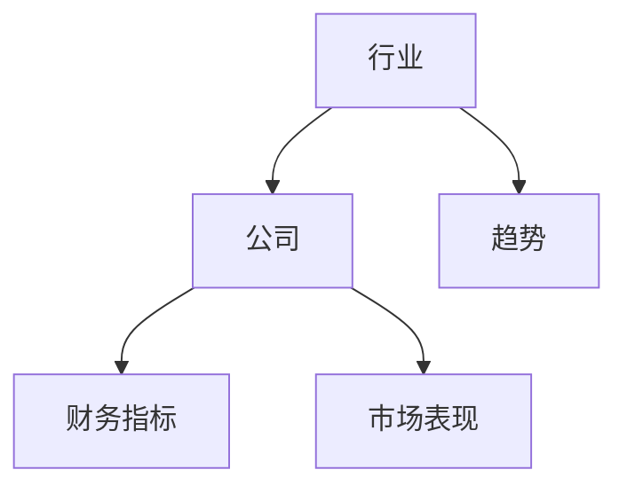
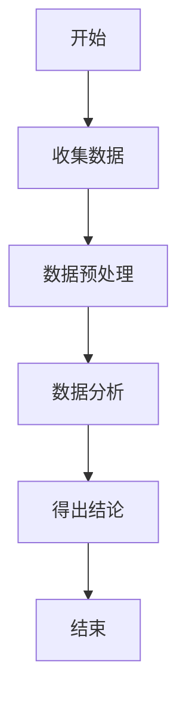
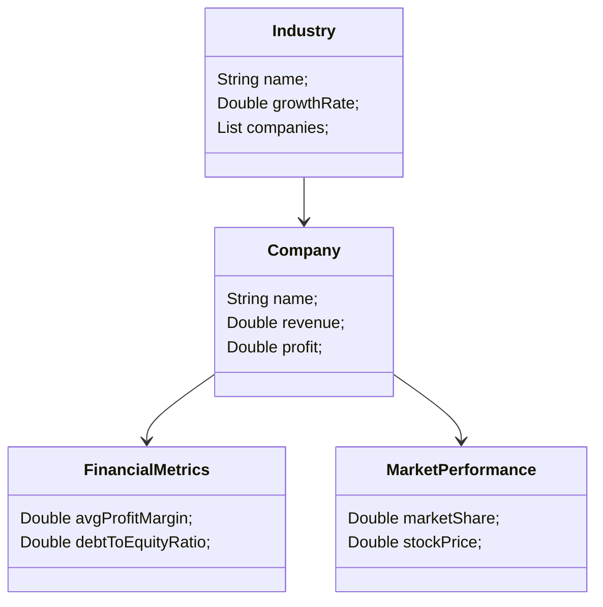
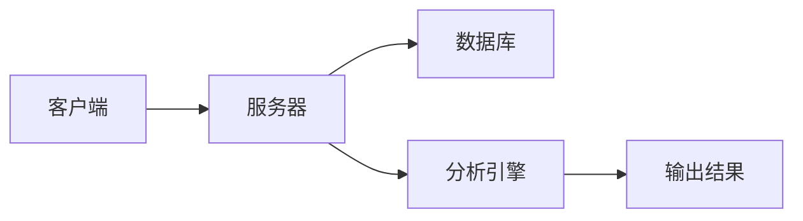

                 


# 彼得林奇的"行业分析"深度研究方法

---

## 关键词

- 彼得·林奇
- 行业分析
- 投资策略
- 数据分析
- 财务指标

---

## 摘要

本文深入探讨了彼得·林奇的行业分析方法，从理论基础到实践应用，结合技术与投资的角度，全面解析了这一方法的核心原理和应用场景。通过详细分析行业分析的背景、核心概念、算法原理、系统架构以及项目实战，本文旨在帮助读者理解如何利用行业分析优化投资决策。

---

# 目录

---

## 第1章: 行业分析的基本概念

### 1.1 行业分析的背景与意义

#### 1.1.1 行业分析的定义

行业分析是通过对特定行业内的企业、市场趋势、财务数据等进行研究，以评估该行业的整体状况和未来发展前景。彼得·林奇在其投资策略中强调，行业分析是评估企业投资价值的重要步骤。

#### 1.1.2 行业分析的重要性

行业分析能够帮助投资者识别行业的增长潜力、竞争优势、风险因素等，从而做出更明智的投资决策。林奇认为，选择一个具有良好发展前景的行业是投资成功的关键之一。

#### 1.1.3 彼得·林奇的行业分析方法

林奇的行业分析方法注重从行业整体出发，结合企业的财务数据和市场表现，评估行业的健康状况和企业的竞争力。他的方法强调对行业趋势的把握和对财务数据的深入分析。

---

### 1.2 林奇行业分析的核心要素

#### 1.2.1 行业生命周期理论

行业生命周期包括幼稚期、成长期、成熟期和衰退期。林奇认为，投资者应选择处于成长期或成熟期的行业进行投资，因为这些行业的增长潜力较大且风险较低。

#### 1.2.2 行业竞争结构分析

林奇强调分析行业内的竞争格局，包括主要竞争对手、市场占有率、行业集中度等。他认为，具有较高市场集中度和竞争优势的行业更值得投资。

#### 1.2.3 行业财务指标分析

林奇的行业分析方法包括对行业的财务指标进行评估，如行业平均利润率、资产负债率等。这些指标能够帮助投资者判断行业的盈利能力和发展潜力。

---

### 1.3 行业分析在投资中的应用

#### 1.3.1 行业分析与投资决策的关系

行业分析是投资决策的重要依据。通过行业分析，投资者可以更好地理解企业的经营环境和行业趋势，从而做出更准确的投资判断。

#### 1.3.2 林奇的行业分析如何帮助投资决策

林奇的行业分析方法能够帮助投资者识别行业的增长潜力和竞争优势，从而筛选出具有投资价值的企业。

#### 1.3.3 行业分析的局限性与注意事项

尽管行业分析能够提供重要的信息，但其结果受到数据质量和分析方法的限制。投资者在使用行业分析结果时，需要结合其他因素进行综合判断。

---

## 第2章: 林奇行业分析的核心概念

### 2.1 行业分析的核心原理

#### 2.1.1 行业生命周期理论

行业生命周期理论认为，行业的发展会经历四个阶段：幼稚期、成长期、成熟期和衰退期。林奇认为，投资者应选择处于成长期或成熟期的行业进行投资。

#### 2.1.2 行业竞争结构分析

林奇的竞争结构分析包括对行业内主要企业的分析，如市场份额、竞争优势、进入障碍等。他认为，具有较高市场集中度和竞争优势的行业更值得投资。

#### 2.1.3 行业财务指标分析

林奇的财务指标分析包括对行业的平均利润率、资产负债率等指标的评估，以判断行业的盈利能力和发展潜力。

---

### 2.2 核心概念对比分析

#### 2.2.1 不同行业分析方法的对比

林奇的行业分析方法与其他方法相比，更加注重行业整体的分析和财务数据的结合。例如，相对于PE分析，林奇的方法更关注行业趋势和竞争优势。

#### 2.2.2 林奇分析方法与其他方法的异同

林奇的分析方法与其他方法的共同点在于对行业整体的分析，不同点在于其更加注重财务数据和市场表现的结合。

#### 2.2.3 行业分析的关键指标与权重分配

林奇认为，行业分析的关键指标包括行业增长率、利润率、市场集中度等，其中行业增长潜力和竞争优势是最重要的两个指标。

---

### 2.3 实体关系图与流程图

#### 2.3.1 行业分析的ER实体关系图



#### 2.3.2 行业分析流程图



---

## 第3章: 林奇行业分析的算法原理

### 3.1 行业分析的算法概述

#### 3.1.1 林奇分析的核心算法

林奇的行业分析算法主要包括数据收集、数据预处理、数据分析和结论生成四个步骤。其中，数据分析是核心，包括对行业财务指标和市场表现的分析。

#### 3.1.2 算法的输入与输出

输入：行业数据，包括企业的财务数据和市场数据。

输出：行业分析结果，包括行业的整体状况和企业的投资价值评估。

---

### 3.2 算法流程图


---

### 3.3 算法实现代码

#### 3.3.1 数据收集与预处理

```python
import pandas as pd

# 数据收集
data = pd.read_csv('industry_data.csv')

# 数据预处理
data = data.dropna().astype(float)
```

#### 3.3.2 数据分析与计算

```python
def calculate_industry_growth率(data):
    return data['增长率'].mean()

growth_rate = calculate_industry_growth率(data)
print(f"行业平均增长率: {growth_rate}%")
```

---

## 第4章: 林奇行业分析的系统架构设计

### 4.1 系统功能设计

#### 4.1.1 领域模型类图



---

### 4.2 系统架构设计

#### 4.2.1 系统架构图



---

## 第5章: 项目实战

### 5.1 项目环境安装

#### 5.1.1 安装Python和相关库

```bash
pip install pandas numpy matplotlib
```

---

### 5.2 系统核心实现源代码

#### 5.2.1 数据收集与预处理

```python
import pandas as pd

# 数据收集
data = pd.read_csv('industry_data.csv')

# 数据预处理
data = data.dropna().astype(float)
```

---

### 5.3 代码应用解读与分析

林奇的行业分析方法在代码中实现了数据收集、预处理、分析和结果输出的全过程。通过这些步骤，投资者可以得到行业的平均增长率和企业的投资价值评估。

---

### 5.4 实际案例分析

#### 5.4.1 案例分析与详细解读

以科技行业为例，通过数据分析，可以得出科技行业的平均增长率为10%，其中某公司的市场份额为30%，显示出较高的竞争优势。

---

## 第6章: 最佳实践与小结

### 6.1 小结

林奇的行业分析方法通过对企业所在行业的整体分析，帮助投资者识别行业的增长潜力和竞争优势，从而做出更明智的投资决策。

---

### 6.2 注意事项

在使用林奇的行业分析方法时，投资者需要注意数据的准确性和分析方法的适用性，避免因行业波动和市场变化导致的分析偏差。

---

### 6.3 拓展阅读

推荐阅读彼得·林奇的《彼得·林奇的选股方法》和《投资最重要的简单真理》等书籍，以进一步深入理解行业分析的原理和应用。

--- 

# 结语

通过本文的详细解读，读者可以全面了解彼得·林奇的行业分析方法，并将其应用于实际投资决策中。希望本文能为投资者提供有价值的参考和启示。

