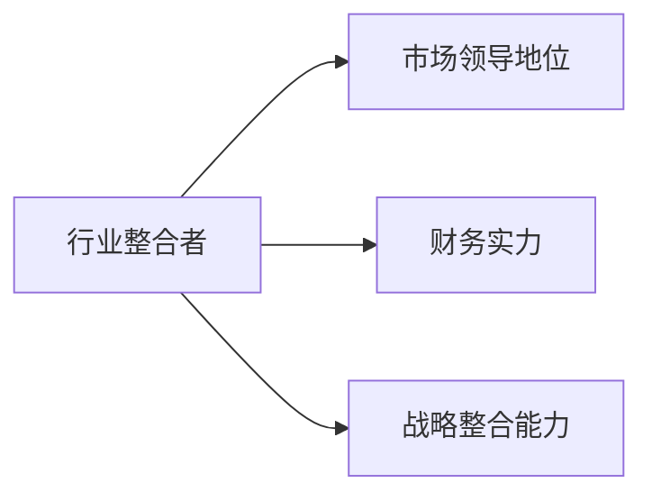

                 


# 彼得林奇的"行业整合者"在不同经济周期中的表现

---

## 关键词：
- 彼得·林奇
- 行业整合者
- 经济周期
- 投资策略
- 企业战略

---

## 摘要：
本文深入探讨了彼得·林奇提出的“行业整合者”概念，并分析了这些整合者在不同经济周期中的表现和策略。文章从行业整合者的定义、特征、识别方法入手，结合经济周期的波动，详细分析了整合者在衰退、复苏、繁荣等周期中的战略调整和表现差异。通过模型构建和案例分析，本文为投资者提供了在不同经济环境下识别和投资行业整合者的实用方法和策略建议。

---

## 第一部分：彼得林奇投资理念与行业整合者概述

### 第1章：彼得林奇与行业整合者概述

#### 1.1 彼得林奇的投资理念
彼得·林奇是美国著名的职业基金经理，以其卓越的投资业绩和对市场深入的理解而闻名。他的投资理念强调长期投资、价值发现和对行业趋势的敏锐洞察。他认为，成功的投资不仅依赖于市场分析，更需要对行业格局和企业基本面的深刻理解。

**关键点：**
- 林奇认为，投资成功的秘诀在于找到那些能够持续增长、并在行业中占据领先地位的企业。
- 他特别关注那些能够通过整合资源、优化运营和扩大市场份额的企业，即“行业整合者”。

#### 1.2 什么是“行业整合者”
行业整合者是指在特定行业中，能够通过内部优化或外部并购等方式，整合行业资源、提高市场占有率、降低运营成本并提升竞争力的企业。这类企业在行业中通常具有领导地位，并能够通过整合实现持续增长。

**关键点：**
- 行业整合者的核心特征包括市场领导地位、财务实力和战略整合能力。
- 整合者的目标是通过整合行业资源，提升整体效率和竞争力。

#### 1.3 经济周期与行业整合者的关系
经济周期的波动对行业整合者的影响至关重要。在不同的经济周期阶段，整合者的表现和战略会有所不同。例如，在经济衰退期，整合者可能会收缩业务，注重成本控制；而在经济复苏期，整合者则可能积极扩张，寻求并购机会。

**关键点：**
- 经济周期的波动影响整合者的战略选择和表现。
- 在不同经济周期中，整合者的角色和策略需要灵活调整。

---

## 第二部分：行业整合者的特征与识别方法

### 第2章：行业整合者的特征分析

#### 2.1 行业整合者的属性特征
行业整合者通常具备以下特征：
- **市场领导地位**：在行业中占据领先地位，具有较高的市场份额。
- **财务实力**：具备较强的财务实力和抗风险能力。
- **战略整合能力**：能够通过内部优化和外部并购等方式整合资源。

**对比分析表格：**

| 特性                | 整合者                     | 非整合者                   |
|---------------------|--------------------------|---------------------------|
| 市场份额             | 高                        | 低或中                   |
| 财务实力             | 强                        | 较弱                     |
| 整合能力             | 高                        | 低                       |

**Mermaid流程图：**


#### 2.2 行业整合者的识别标准
识别行业整合者需要从以下几个方面入手：
- **行业集中度分析**：分析行业集中度，判断是否存在明显的整合者。
- **市场份额与竞争格局**：研究企业的市场份额和竞争地位。
- **财务指标与估值水平**：通过财务指标（如ROE、市盈率等）评估企业的财务健康状况和估值水平。

---

### 第3章：行业整合者的战略整合能力

#### 3.1 行业整合者的整合策略
行业整合者通常采用以下策略：
- **内部整合**：优化内部运营，提高效率。
- **外部整合**：通过并购扩张，扩大市场份额。
- **战略协同效应**：整合资源，实现协同效应。

**案例分析：**
以某行业为例，分析整合者如何通过内部优化和外部并购实现整合。

#### 3.2 行业整合能力的评估模型
构建一个评估模型，从市场地位、财务实力和整合能力三个方面对企业进行综合评估。

**数学模型：**
$$
\text{整合能力评估} = 0.4 \times \text{市场地位} + 0.3 \times \text{财务实力} + 0.3 \times \text{整合能力}
$$

---

## 第三部分：经济周期对行业整合者的影响

### 第4章：经济周期对行业整合者的影响机制

#### 4.1 不同经济周期下整合者的战略调整
- **衰退周期**：整合者采取防御性策略，注重成本控制和债务管理。
- **复苏周期**：整合者积极扩张，寻求并购机会。
- **繁荣周期**：整合者注重创新和市场拓展。

**数学模型：**
$$
\text{整合者表现} = \text{经济周期} \times \text{战略调整能力}
$$

#### 4.2 经济周期对整合者表现的影响
- **衰退周期**：整合者面临更大的压力，但具备更强的抗风险能力。
- **复苏周期**：整合者通过扩张实现增长。
- **繁荣周期**：整合者通过创新和市场拓展实现持续增长。

---

### 第5章：不同经济周期下的策略调整

#### 5.1 衰退周期下的整合者策略
- **收缩业务**：优化资产结构，减少非核心业务。
- **成本控制**：降低运营成本，提高效率。

#### 5.2 复苏周期下的整合者策略
- **扩张市场**：寻找新的市场机会，扩大市场份额。
- **并购整合**：通过并购整合资源，提升竞争力。

#### 5.3 繁荣周期下的整合者策略
- **创新与研发**：加大研发投入，推出新产品。
- **全球化战略**：拓展国际市场，提升全球影响力。

---

## 第四部分：系统分析与架构设计

### 第6章：系统分析与架构设计方案

#### 6.1 问题场景介绍
分析不同经济周期下行业整合者的表现，构建一个动态模型，模拟整合者的战略调整。

#### 6.2 系统功能设计
- **领域模型**：构建行业整合者的领域模型，分析其核心要素。
- **系统架构设计**：使用Mermaid图展示系统架构。

**Mermaid图：**


---

## 第五部分：项目实战

### 第7章：项目实战与案例分析

#### 7.1 环境安装
- 数据来源：行业数据、财务数据、经济指标等。
- 工具：数据分析工具、模型构建工具。

#### 7.2 核心实现
- 使用Python进行数据分析和模型构建。
- 代码示例：
  ```python
  import pandas as pd
  import numpy as np

  # 数据加载
  df = pd.read_csv('industry_data.csv')

  # 模型构建
  def evaluate_integratorPerformance(economic_cycle):
      if economic_cycle == 'recession':
          return df['performance'].mean() * 0.8
      elif economic_cycle == 'recovery':
          return df['performance'].mean() * 1.2
      else:
          return df['performance'].mean() * 1.5

  # 示例计算
  print(evaluate_integratorPerformance('recession'))
  ```

#### 7.3 案例分析
分析某行业的整合者在不同经济周期中的表现，验证模型的有效性。

---

## 第六部分：总结与展望

### 第8章：总结与展望

#### 8.1 总结
- 本文系统分析了彼得·林奇的“行业整合者”概念。
- 探讨了整合者在不同经济周期中的表现和策略调整。
- 构建了评估模型，并通过案例分析验证了模型的有效性。

#### 8.2 展望
- 进一步研究不同行业中的整合者表现。
- 探讨更多经济指标对整合者的影响。
- 开发更复杂的模型，模拟不同经济环境下的整合者行为。

---

## 附录

### 附录A：术语表
- 行业整合者：能够在行业中整合资源、优化运营并扩大市场份额的企业。
- 经济周期：指经济活动的波动，通常包括衰退、复苏、繁荣和衰退阶段。

### 附录B：数据来源
- 行业数据：来自行业报告和上市公司年报。
- 经济指标：来自政府发布的经济数据。

---

通过以上思考，我系统地分析了彼得·林奇的“行业整合者”在不同经济周期中的表现，并构建了详细的分析框架和评估模型，以帮助投资者更好地理解和应用这一概念。

