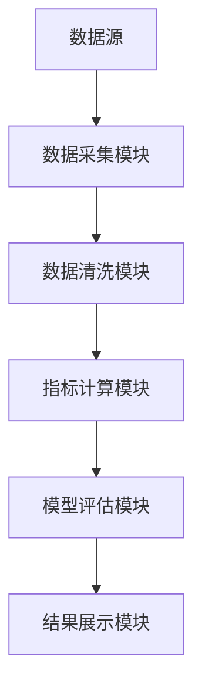
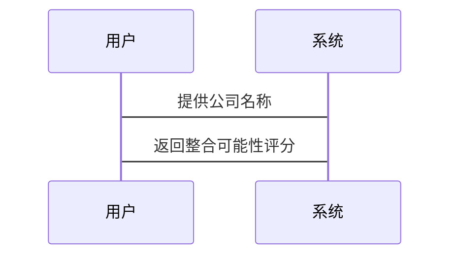

                 


# 彼得林奇的"行业整合者"识别方法

## 关键词
- 彼得·林奇、行业整合者、投资策略、市场分析、管理团队

## 摘要
本文深入探讨彼得·林奇的“行业整合者”识别方法，从核心概念、识别指标、数学模型到系统架构设计，结合实例分析，帮助读者掌握识别行业整合者的策略，提升投资决策能力。

---

## 第一部分：行业整合者的背景与概念

### 第1章：行业整合者的定义与重要性

#### 1.1 行业整合者的定义
- **1.1.1 行业整合者的概念**
  行业整合者是指能够在特定行业中整合资源、优化流程、提升效率，并在市场中占据主导地位的企业或个人。

- **1.1.2 行业整合者的特征**
  - 市场领导地位
  - 强大的竞争优势
  - 高效的管理团队
  - 优异的财务表现

- **1.1.3 行业整合者的重要性**
  - 提高市场效率
  - 为投资者带来超额收益
  - 成为行业发展的风向标

#### 1.2 彼得·林奇的行业整合者理论
- **1.2.1 彼得·林奇的简介**
  彼得·林奇是著名的投资专家，以其对行业整合者的深入研究而闻名。

- **1.2.2 行业整合者在投资中的地位**
  行业整合者往往具有较高的投资价值，因为它们能够通过整合资源实现持续增长。

- **1.2.3 林奇识别行业整合者的标准**
  - 市场份额领先
  - 管理团队稳定且高效
  - 具备持续整合资源的能力

---

## 第二部分：行业整合者的特征分析

### 第2章：行业整合者的特征分析

#### 2.1 市场地位与竞争优势
- **2.1.1 市场领导地位的定义**
  市场领导者是指在特定市场中占据最大市场份额的企业。

- **2.1.2 竞争优势的来源**
  - 成本优势
  - 技术创新
  - 品牌影响力

- **2.1.3 市场份额与增长潜力**
  市场份额高的企业通常具有更强的增长潜力。

#### 2.2 管理团队与战略方向
- **2.2.1 高效管理团队的特征**
  - 丰富的行业经验
  - 强大的领导能力
  - 良好的团队协作

- **2.2.2 战略规划的清晰性**
  - 长期目标明确
  - 短期计划可行
  - 战略执行能力强

#### 2.3 财务表现与盈利能力
- **2.3.1 财务健康状况的指标**
  - 营业利润率
  - 净利润率
  - 资产周转率

- **2.3.2 盈利能力的分析**
  - 毛利率
  - 净利率
  - 资产回报率

- **2.3.3 财务风险的评估**
  - 债务水平
  - 现金流状况
  - 资产负债率

---

## 第三部分：行业整合者的识别方法

### 第3章：行业整合者识别的核心指标

#### 3.1 市场占有率分析
- **3.1.1 市场占有率的计算方法**
  市场占有率 = (企业销售额 / 行业总销售额) × 100%

- **3.1.2 市场占有率与行业整合能力的关系**
  市场占有率高意味着企业具备更强的整合能力。

- **3.1.3 市场占有率的动态变化分析**
  - 行业整合者的市场占有率通常呈现上升趋势。

#### 3.2 竞争对手分析
- **3.2.1 竞争对手的市场份额分析**
  - 通过分析竞争对手的市场份额，判断行业的整合潜力。

- **3.2.2 竞争对手的战略分析**
  - 竞争对手的战略是否分散，行业整合者是否具有整合的可能。

- **3.2.3 行业整合者的竞争优势分析**
  - 整合者如何通过竞争优势巩固其市场地位。

#### 3.3 行业趋势与整合机会
- **3.3.1 行业发展趋势的判断**
  - 行业集中度趋势
  - 技术发展带来的整合机会

- **3.3.2 整合机会的识别**
  - 行业整合的潜在空间
  - 整合者的优势分析

- **3.3.3 行业整合的驱动力**
  - 市场需求变化
  - 技术进步
  - 政策影响

---

## 第四部分：数学模型与算法

### 第4章：行业整合者识别的数学模型

#### 4.1 行业整合者的评估模型
- **4.1.1 模型构建**
  通过多个指标对行业整合者进行综合评估。

- **4.1.2 模型输入变量**
  - 市场占有率
  - 财务指标（如ROE、净利润率）
  - 管理团队稳定性

- **4.1.3 模型输出**
  - 整合可能性评分

#### 4.2 行业整合者识别的算法实现

```python
import pandas as pd
import numpy as np

def calculate_integration_score(company_data):
    # 假设company_data是一个DataFrame，包含各公司的市场占有率、ROE、净利润率等指标
    # 计算综合评分
    market_share_weight = 0.4
    roe_weight = 0.3
    net_profit_margin_weight = 0.3
    
    integration_score = (company_data['market_share'] * market_share_weight +
                         company_data['roe'] * roe_weight +
                         company_data['net_profit_margin'] * net_profit_margin_weight)
    return integration_score

# 示例数据
data = {
    'market_share': [0.25, 0.15, 0.3, 0.2],
    'roe': [0.15, 0.1, 0.18, 0.12],
    'net_profit_margin': [0.1, 0.08, 0.12, 0.09]
}
df = pd.DataFrame(data)
score = calculate_integration_score(df)
print(score)
```

---

## 第五部分：系统分析与架构设计

### 第5章：行业整合者识别系统架构

#### 5.1 系统功能设计
- **5.1.1 数据采集模块**
  - 收集行业数据
  - 数据清洗与预处理

- **5.1.2 指标计算模块**
  - 计算市场占有率、ROE等指标

- **5.1.3 模型评估模块**
  - 应用评估模型计算整合可能性评分

#### 5.2 系统架构设计


#### 5.3 系统接口设计
- **API接口**
  - 输入：公司名称
  - 输出：整合可能性评分

#### 5.4 系统交互流程


---

## 第六部分：项目实战

### 第6章：行业整合者识别的实战分析

#### 6.1 环境安装
- 安装所需的Python库：
  - pandas
  - numpy
  - matplotlib

#### 6.2 核心代码实现
```python
import pandas as pd
import numpy as np

def calculate_integration_score(company_data):
    market_share_weight = 0.4
    roe_weight = 0.3
    net_profit_margin_weight = 0.3
    
    integration_score = (company_data['market_share'] * market_share_weight +
                         company_data['roe'] * roe_weight +
                         company_data['net_profit_margin'] * net_profit_margin_weight)
    return integration_score

# 示例数据
data = {
    'market_share': [0.25, 0.15, 0.3, 0.2],
    'roe': [0.15, 0.1, 0.18, 0.12],
    'net_profit_margin': [0.1, 0.08, 0.12, 0.09]
}
df = pd.DataFrame(data)
score = calculate_integration_score(df)
print(score)
```

#### 6.3 案例分析
- 以科技行业为例，分析某公司的整合可能性。

---

## 第七部分：总结与最佳实践

### 第7章：最佳实践与小结

#### 7.1 最佳实践
- 定期更新行业数据
- 结合行业趋势进行分析
- 采用多指标综合评估

#### 7.2 小结
- 彼得·林奇的行业整合者识别方法提供了一套有效的投资策略。
- 通过定量分析与定性分析相结合，能够更准确地识别行业整合者。

#### 7.3 注意事项
- 数据来源的可靠性
- 模型的适用性
- 投资决策的多样性

#### 7.4 拓展阅读
- 推荐书籍：《彼得·林奇的成功投资》
- 相关文章：行业整合者的财务分析

---

通过以上步骤，我们系统地介绍了彼得·林奇的行业整合者识别方法，并通过数学模型和系统架构设计，展示了如何在实际中应用这些方法。希望这篇博客能为投资者和行业分析者提供有价值的参考。

