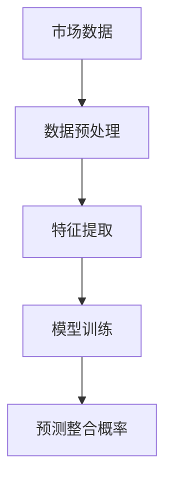
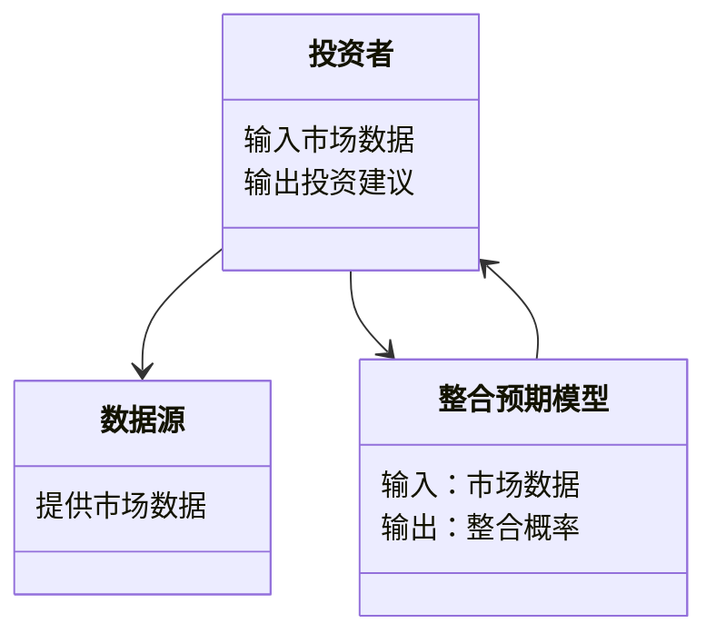
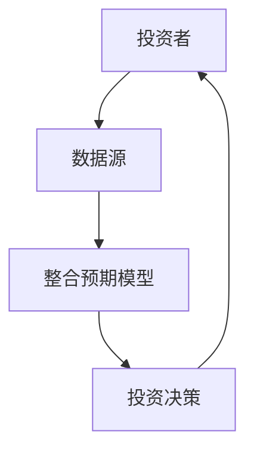

                 

# 彼得林奇的"行业整合预期"投资策略

> 关键词：彼得·林奇，行业整合预期，投资策略，市场分析，企业并购

> 摘要：本文深入分析了彼得·林奇的“行业整合预期”投资策略，从其理论基础、数学模型到实际应用，详细阐述了如何通过行业整合预期进行投资决策。文章结合技术分析方法，展示了该策略在实际投资中的应用价值。

---

## 第一部分：行业整合预期的背景与概念

### 第1章：行业整合预期的定义与背景

#### 1.1 投资策略的背景

- **市场整合的必然性**：随着市场竞争加剧，企业为了生存，往往通过并购实现整合。
- **彼得·林奇的贡献**：林奇通过研究市场整合的规律，提出了基于整合预期的投资策略。

#### 1.2 行业整合预期的定义

- **行业整合**：指同一行业内的企业通过并购、重组等方式，提高市场集中度的过程。
- **整合预期**：投资者对未来可能出现的整合行为的预测。

#### 1.3 行业整合的驱动因素

- **市场竞争压力**：企业为了降低成本，提高效率，选择整合。
- **经济周期**：经济下行时，整合行为增加。
- **政策影响**：行业政策变化推动整合。

---

## 第二部分：行业整合预期的数学模型

### 第2章：整合预期的量化分析

#### 2.1 整合概率的数学模型

$$ P = \frac{N}{M} $$

其中：
- $N$：行业内可能进行整合的企业数量。
- $M$：行业内所有企业数量。

#### 2.2 市场估值与整合预期的关系

- **市场估值模型**：基于整合预期的市场估值公式。
$$ V = P \times E $$

其中：
- $V$：整合后的市场估值。
- $E$：企业的预期收益。

#### 2.3 整合预期的预测算法

---

## 第三部分：彼得·林奇的整合预期策略

### 第3章：策略的核心要素

#### 3.1 投资哲学

- **长期投资**：林奇主张长期持有优质股票。
- **价值投资**：关注企业的内在价值，而非短期市场波动。

#### 3.2 选股方法

- **基本面分析**：通过财务数据评估企业的健康状况。
- **竞争优势评估**：选择具有明显竞争优势的企业。

#### 3.3 投资组合管理

- **分散投资**：避免过度集中，降低风险。
- **定期调整**：根据市场变化，及时调整投资组合。

---

## 第四部分：系统架构设计

### 第4章：系统分析与架构设计

#### 4.1 系统功能设计

#### 4.2 系统架构设计

---

## 第五部分：项目实战与案例分析

### 第5章：实际案例分析

#### 5.1 美国银行业的整合案例

- **背景**：20世纪80年代，美国银行业面临整合压力。
- **分析**：通过整合预期模型，预测整合概率。
- **结果**：投资者在整合预期下获得超额收益。

#### 5.2 案例分析总结

- **经验总结**：整合预期模型的有效性。
- **改进建议**：模型的优化方向。

---

## 第六部分：最佳实践与注意事项

### 第6章：投资策略的注意事项

#### 6.1 风险管理

- **分散投资**：降低单一投资的风险。
- **定期评估**：及时调整投资策略。

#### 6.2 心理因素

- **避免情绪化决策**：保持理性，遵循策略。
- **长期视角**：耐心等待整合预期的实现。

---

## 第七部分：总结与展望

### 第7章：总结与展望

#### 7.1 总结

- 彼得·林奇的整合预期策略是一种有效的投资方法。
- 通过数学模型和系统设计，可以更好地应用这一策略。

#### 7.2 展望

- 结合人工智能技术，进一步优化整合预期模型。
- 开发更多基于整合预期的投资工具。

---

# 结语

彼得·林奇的“行业整合预期”投资策略不仅是一种投资方法，更是一种系统的分析框架。通过本文的详细分析，读者可以更好地理解这一策略，并在实际投资中加以应用。

