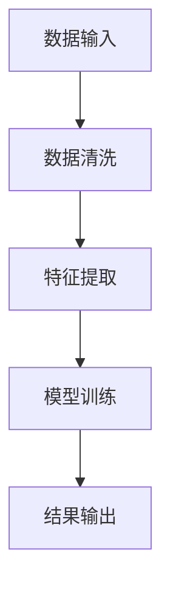
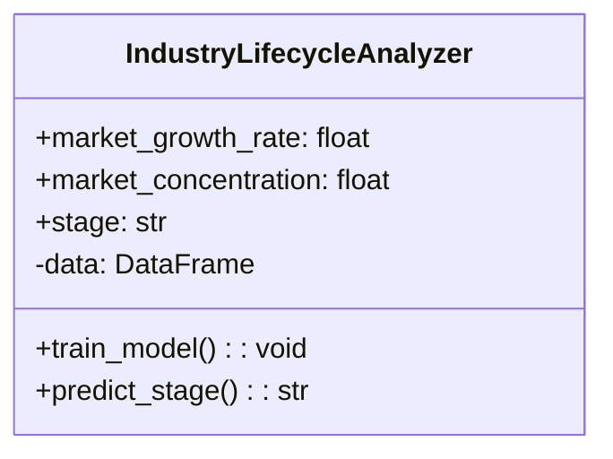

                 


# 彼得林奇的"行业生命周期"分析框架

> 关键词：行业生命周期，彼得林奇，投资分析，行业分析，生命周期框架

> 摘要：本文详细探讨了彼得林奇提出的行业生命周期分析框架，从理论基础、数学模型到实际应用进行了全面分析。通过系统化的框架设计和具体案例研究，揭示了如何利用行业生命周期理论进行投资决策和行业分析，为投资者提供了实用的分析工具和方法。

---

## 第1章：行业生命周期的基本概念

### 1.1 行业生命周期的定义
行业生命周期是指一个行业从诞生到成熟，再到衰退的整个发展过程。它类似于企业生命周期，但更宏观地反映了整个行业的发展阶段。

### 1.2 行业生命周期的阶段划分
行业生命周期通常分为四个阶段：
1. **导入期**：行业刚刚起步，市场需求较低，竞争者较少。
2. **成长期**：市场需求快速增长，行业规模扩大，竞争加剧。
3. **成熟期**：市场需求趋于饱和，行业规模稳定，竞争格局基本确定。
4. **衰退期**：市场需求下降，行业规模缩小，竞争者逐渐退出。

### 1.3 行业生命周期分析的意义
行业生命周期分析能够帮助投资者识别行业所处的发展阶段，从而制定相应的投资策略。例如，在成长期投资高增长行业，在衰退期避免投资夕阳行业。

---

## 第2章：彼得林奇的行业生命周期理论

### 2.1 彼得林奇投资理念概述
彼得林奇是美国著名投资家，他强调通过深入研究行业和公司基本面来做出投资决策。他认为，行业生命周期是影响投资决策的重要因素之一。

### 2.2 行业生命周期在投资分析中的应用
彼得林奇提出，投资者应关注行业所处的生命周期阶段，并结合行业内的竞争格局、财务指标等信息，判断行业的投资价值。

### 2.3 彼得林奇的行业生命周期分析框架
彼得林奇的行业生命周期分析框架包括以下步骤：
1. **确定行业所处的生命周期阶段**。
2. **分析行业内的竞争格局**。
3. **评估行业内的财务指标**。
4. **制定投资策略**。

---

## 第3章：行业生命周期的核心要素

### 3.1 行业生命周期的四个阶段
1. **导入期**：市场需求小，技术不成熟，竞争者少。
2. **成长期**：市场需求快速增长，技术逐步成熟，竞争加剧。
3. **成熟期**：市场需求稳定，技术成熟，竞争格局稳定。
4. **衰退期**：市场需求下降，技术落后，竞争者退出。

### 3.2 每个阶段的核心特征
| 阶段 | 核心特征 |
|------|----------|
| 导入期 | 市场需求小，技术不成熟，竞争者少 |
| 成长期 | 市场需求快速增长，技术逐步成熟，竞争加剧 |
| 成熟期 | 市场需求稳定，技术成熟，竞争格局稳定 |
| 衰退期 | 市场需求下降，技术落后，竞争者退出 |

### 3.3 行业生命周期与企业生命周期的关系
行业生命周期与企业生命周期密切相关。在不同的行业生命周期阶段，企业的生存和发展策略也会有所不同。

---

## 第4章：行业生命周期的数学模型与算法原理

### 4.1 行业生命周期的量化指标
常用量化指标包括：
- 市场增长率（Market Growth Rate）：反映市场需求的变化趋势。
- 行业集中度（Market Concentration）：反映行业竞争格局。
- 利润率（Profitability）：反映行业盈利能力。

### 4.2 行业生命周期的数学模型
$$
\text{市场增长率} = \frac{\text{当年销售额} - \text{前年销售额}}{\text{前年销售额}} \times 100\%
$$

$$
\text{行业集中度} = \frac{\text{前几大企业的市场份额之和}}{\text{行业总市场份额}} \times 100\%
$$

### 4.3 行业生命周期的算法实现
以下是基于市场增长率和行业集中度的行业生命周期判断算法：

```python
def determine_industry_stage(growth_rate, concentration):
    if growth_rate > 20 and concentration < 40:
        return "导入期"
    elif growth_rate > 10 and concentration < 60:
        return "成长期"
    elif growth_rate < 5 and concentration > 60:
        return "成熟期"
    else:
        return "衰退期"
```

---

## 第5章：行业生命周期的系统分析与架构设计

### 5.1 系统架构设计
以下是行业生命周期分析系统的架构设计：



### 5.2 数据分析与建模
以下是行业生命周期预测模型的训练过程：

```python
import pandas as pd
from sklearn.linear_model import LinearRegression

# 数据加载
data = pd.read_csv("industry_data.csv")

# 特征提取
X = data[['market_growth_rate', 'market_concentration']]
y = data['stage']

# 模型训练
model = LinearRegression()
model.fit(X, y)

# 模型预测
predicted_stage = model.predict(X)
```

### 5.3 系统功能模块设计
以下是行业生命周期分析系统的功能模块设计：



---

## 第6章：行业生命周期分析的项目实战

### 6.1 案例背景介绍
以科技行业为例，分析其行业生命周期阶段。

### 6.2 数据收集与分析
以下是科技行业数据的分析结果：

| 年份 | 市场增长率 | 行业集中度 |
|------|------------|------------|
| 2018 | 15%        | 50%        |
| 2019 | 20%        | 55%        |
| 2020 | 10%        | 60%        |
| 2021 | 5%         | 65%        |

### 6.3 行业生命周期的判断与分析
根据数据，科技行业处于成熟期，市场增长率下降，行业集中度较高。

### 6.4 投资决策的制定与实施
在成熟期，投资者应关注行业内的龙头企业，避免投资高风险的新兴企业。

---

## 第7章：行业生命周期分析的总结与展望

### 7.1 本书核心内容回顾
本文详细探讨了彼得林奇的行业生命周期分析框架，从理论到实践进行了全面分析。

### 7.2 行业生命周期分析的未来展望
随着大数据和人工智能技术的发展，行业生命周期分析将更加精准和智能化。

### 7.3 最佳实践 tips
- 投资者应结合行业生命周期阶段和企业基本面进行投资决策。
- 定期更新行业数据，确保分析结果的准确性。

---

通过以上分析，我们可以看到，彼得林奇的行业生命周期分析框架为投资者提供了一个系统化的分析工具，帮助其更好地理解和把握行业的投资机会。

