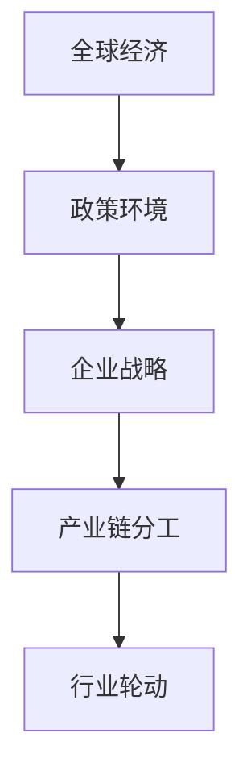
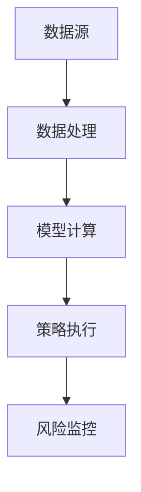

                 


# 彼得林奇的"行业轮动"在全球产业链重构中的应用策略

## 关键词：
- 彼得林奇
- 行业轮动
- 全球产业链重构
- 投资策略
- 经济周期

## 摘要：
本文探讨了彼得林奇的行业轮动策略在全球产业链重构中的应用，分析了行业轮动的定义、机制及其在全球经济周期中的表现。通过结合现代投资组合理论和系统架构设计，本文提出了在全球产业链重构背景下，如何利用行业轮动策略优化投资组合、降低风险并捕捉市场机会。文章结合实际案例，详细讲解了行业轮动策略的数学模型、算法实现及系统设计，并通过项目实战展示了策略的应用效果。

---

## 第一部分: 行业轮动与全球产业链重构的背景

### 第1章: 行业轮动与全球产业链重构的背景

#### 1.1 行业轮动的定义与机制
##### 1.1.1 行业轮动的定义
行业轮动是指在不同的经济周期和市场环境下，投资者根据行业景气度的变化，动态调整投资组合中各行业权重的策略。行业轮动的核心在于捕捉行业间表现的差异，通过切换投资重点来实现超额收益。

##### 1.1.2 行业轮动的核心机制
行业轮动的机制包括经济周期、政策变化、技术进步和市场情绪等因素。例如，在经济复苏阶段，周期性行业（如能源、材料）可能表现优于防御性行业（如公用事业、医疗保健）。彼得林奇强调，行业轮动需要结合基本面分析和市场趋势，避免盲目跟风。

##### 1.1.3 行业轮动的周期性特征
行业轮动具有明显的周期性特征。例如，在经济衰退期，防御性行业可能表现较好；而在经济繁荣期，周期性行业可能更具投资价值。彼得林奇通过长期观察发现，行业轮动的周期大约为5-7年，但具体表现取决于全球经济环境。

#### 1.2 全球产业链重构的现状与趋势
##### 1.2.1 全球化与产业链分工的历史演变
全球化背景下，产业链分工日益精细化，不同国家和地区专注于不同的生产环节。例如，中国在制造业领域具有显著优势，而美国在高端科技领域占据主导地位。然而，近年来，全球化趋势受到挑战，产业链重构成为新的趋势。

##### 1.2.2 后疫情时代产业链重构的驱动因素
疫情暴露了全球供应链的脆弱性，各国开始重新评估供应链的安全性。例如，一些国家选择将关键产业（如半导体、医疗设备）迁回本土，以降低对外部供应链的依赖。此外，地缘政治冲突（如中美贸易摩擦）也加速了产业链的重构。

##### 1.2.3 全球产业链重构的区域化与本地化趋势
随着产业链重构，区域化和本地化趋势日益明显。例如，欧洲推动“绿色新政”，鼓励本地化生产；东南亚国家吸引外资，发展制造业。这种趋势使得不同地区的产业链更加多元化，也为行业轮动提供了新的机会。

---

## 第二部分: 彼得林奇的行业轮动投资策略

### 第2章: 彼得林奇的行业轮动投资策略

#### 2.1 彼得林奇的投资理念
##### 2.1.1 价值投资与成长投资的结合
彼得林奇强调，投资不应仅关注股票的短期波动，而应关注企业的基本面。他将价值投资与成长投资相结合，寻找具有竞争优势且估值合理的企业。

##### 2.1.2 行业轮动在彼得林奇投资策略中的地位
行业轮动是彼得林奇投资策略的重要组成部分。他认为，行业轮动可以帮助投资者在不同经济周期中优化投资组合，降低风险。

##### 2.1.3 彼得林奇对行业轮动的实战经验
彼得林奇通过长期实战发现，行业轮动的关键在于对行业基本面的深入研究和对市场趋势的准确判断。例如，在20世纪80年代，他成功预测了科技行业的兴起，并大幅投资相关股票。

#### 2.2 行业轮动的驱动因素分析
##### 2.2.1 经济周期对行业轮动的影响
经济周期是影响行业轮动的主要因素。例如，在经济衰退期，防御性行业可能表现较好；而在经济繁荣期，周期性行业可能更具投资价值。

##### 2.2.2 政策环境对行业轮动的引导
政策变化（如税收政策、行业监管）也会影响行业轮动。例如，环保政策的加强可能使绿色能源行业受益。

##### 2.2.3 技术进步与行业轮动的关系
技术进步是行业轮动的重要驱动力。例如，人工智能和5G技术的普及推动了科技行业的快速发展。

#### 2.3 行业轮动的数学模型
##### 2.3.1 行业轮动的周期性模型
行业轮动的周期性模型可以通过时间序列分析来预测。例如，使用ARIMA模型预测行业轮动的周期长度和幅度。

##### 2.3.2 投资组合的权重分配公式
投资组合的权重分配可以通过以下公式计算：

$$ w_i = \frac{r_i}{\sum_{j=1}^{n} r_j} $$

其中，\( w_i \) 表示第 \( i \) 个行业的权重，\( r_i \) 表示第 \( i \) 个行业的预期收益，\( n \) 表示行业的数量。

##### 2.3.3 行业轮动的收益与风险评估
行业轮动的收益可以通过夏普比率（Sharpe Ratio）来评估：

$$ Sharpe\ Ratio = \frac{E[r_p - r_f]}{\sigma_p} $$

其中，\( E[r_p - r_f] \) 表示投资组合的预期超额收益，\( \sigma_p \) 表示投资组合的收益波动率。

---

## 第三部分: 全球产业链重构中的行业轮动机会

### 第3章: 全球产业链重构中的行业轮动机会

#### 3.1 产业链重构对行业轮动的影响
##### 3.1.1 产业链重构中的行业轮动特征
产业链重构可能导致某些行业的崛起和衰退。例如，随着全球制造业向东南亚转移，纺织行业的轮动可能从中国转向越南。

##### 3.1.2 新兴产业的崛起与传统行业的衰退
新兴产业（如人工智能、绿色能源）的崛起可能带来新的投资机会，而传统行业（如化石能源）可能面临衰退。

##### 3.1.3 区域经济一体化对行业轮动的推动
区域经济一体化（如欧盟、RCEP）可能导致区域内某些行业的轮动。例如，欧盟推动的绿色新政可能使欧洲的绿色能源行业受益。

#### 3.2 全球产业链重构中的行业轮动策略
##### 3.2.1 行业选择的标准与方法
行业选择应基于基本面分析、政策环境和市场趋势。例如，选择那些具有增长潜力且政策支持的行业。

##### 3.2.2 行业轮动的时机把握
行业轮动的时机应基于市场信号和经济数据。例如，当经济复苏迹象明显时，周期性行业可能迎来投资机会。

##### 3.2.3 行业轮动的风险控制
行业轮动的风险可通过多元化投资和风险对冲来控制。例如，使用期权对冲投资组合的下行风险。

#### 3.3 行业轮动策略的数学模型
##### 3.3.1 基于产业链重构的行业轮动模型
考虑全球产业链重构的影响，行业轮动模型可以表示为：

$$ w_i = \alpha \cdot r_i + \beta \cdot s_i $$

其中，\( \alpha \) 和 \( \beta \) 是模型参数，\( r_i \) 表示行业收益，\( s_i \) 表示行业在产业链重构中的战略地位。

##### 3.3.2 行业轮动的权重调整公式
权重调整公式可以表示为：

$$ \Delta w_i = \gamma \cdot (r_i - \mu) $$

其中，\( \gamma \) 是调整系数，\( \mu \) 是行业收益的均值。

---

## 第四部分: 行业轮动与全球产业链重构的系统分析

### 第4章: 行业轮动与全球产业链重构的系统分析

#### 4.1 产业链重构的系统模型
##### 4.1.1 产业链重构的系统架构
以下是一个简化的产业链重构系统架构图：



##### 4.1.2 产业链重构的系统功能模块
产业链重构系统功能模块包括：政策分析模块、企业战略模块、行业轮动模块和风险管理模块。

##### 4.1.3 产业链重构的系统交互流程
系统交互流程如下：

1. 政策环境变化触发企业战略调整。
2. 企业战略调整影响产业链分工。
3. 产业链分工变化引发行业轮动。
4. 行业轮动对投资组合产生影响。

#### 4.2 行业轮动的系统架构设计
##### 4.2.1 行业轮动的系统功能设计
行业轮动系统功能包括：数据采集、模型计算、策略执行和风险监控。

##### 4.2.2 行业轮动的系统架构图
以下是一个简化的行业轮动系统架构图：



##### 4.2.3 行业轮动的系统接口设计
系统接口设计包括：数据接口、模型接口和策略接口。

---

## 第五部分: 行业轮动策略在产业链重构中的应用案例

### 第5章: 行业轮动策略在产业链重构中的应用案例

#### 5.1 案例分析: 科技行业的轮动
##### 5.1.1 科技行业的产业链重构特征
科技行业在全球产业链重构中表现突出，尤其是在人工智能和5G领域。

##### 5.1.2 科技行业的行业轮动策略
通过投资人工智能和5G相关企业，捕捉科技行业的增长机会。

##### 5.1.3 案例的经济效益与经验总结
通过案例分析，可以发现科技行业的投资收益显著，但需要关注技术风险和政策变化。

#### 5.2 案例分析: 制造业的产业链重构与行业轮动
##### 5.2.1 制造业产业链重构的现状
随着制造业向东南亚转移，中国制造业面临转型压力。

##### 5.2.2 制造业行业轮动的策略选择
通过投资高端制造业和绿色制造企业，优化投资组合。

##### 5.2.3 案例的实践意义与启示
制造业的产业链重构为行业轮动提供了新的机会，但也需要关注区域化和本地化的趋势。

---

## 第六章: 行业轮动策略的系统实现与项目实战

### 第6章: 行业轮动策略的系统实现与项目实战

#### 6.1 环境安装与配置
##### 6.1.1 系统环境要求
需要安装Python、Jupyter Notebook和相关库（如pandas、numpy、scikit-learn）。

##### 6.1.2 数据源获取
可以从金融数据服务提供商（如Yahoo Finance）获取行业数据。

#### 6.2 核心实现
##### 6.2.1 行业轮动模型的实现
以下是行业轮动模型的Python实现代码：

```python
import pandas as pd
import numpy as np
from sklearn.linear_model import LinearRegression

# 数据加载
data = pd.read_csv('industry_data.csv')

# 模型训练
model = LinearRegression()
model.fit(data[['GDP', 'Interest_rate']], data['Return'])

# 预测收益
predicted_return = model.predict(data[['GDP', 'Interest_rate']])
```

##### 6.2.2 投资组合优化的实现
以下是投资组合优化的Python实现代码：

```python
import numpy as np
from scipy.optimize import minimize

# 定义目标函数
def objective(weights):
    return -np.sum(weights * data['Return'])

# 定义约束条件
constraints = [
    ('sum_to_one', weights.sum() == 1),
    ('weights_positive', weights >= 0)
]

# 最优化问题求解
result = minimize(objective, init_weights, constraints=constraints)
optimal_weights = result.x
```

#### 6.3 项目实战
##### 6.3.1 实际案例分析
通过分析实际案例，验证行业轮动策略的有效性。

##### 6.3.2 代码实现与解读
以下是完整的代码实现和解读：

```python
import pandas as pd
import numpy as np
from sklearn.linear_model import LinearRegression
from scipy.optimize import minimize

# 数据加载
data = pd.read_csv('industry_data.csv')

# 模型训练
model = LinearRegression()
model.fit(data[['GDP', 'Interest_rate']], data['Return'])

# 预测收益
predicted_return = model.predict(data[['GDP', 'Interest_rate']])

# 最优化问题求解
def objective(weights):
    return -np.sum(weights * data['Return'])

init_weights = np.array([0.2] * len(data.columns))
constraints = [
    ('sum_to_one', init_weights.sum() == 1),
    ('weights_positive', init_weights >= 0)
]

result = minimize(objective, init_weights, constraints=constraints)
optimal_weights = result.x

# 输出结果
print(optimal_weights)
```

##### 6.3.3 项目总结与经验分享
项目总结应包括策略的有效性、实现的难点和经验教训。

---

## 第七章: 总结与展望

### 7.1 总结
本文系统探讨了彼得林奇的行业轮动策略在全球产业链重构中的应用，分析了行业轮动的定义、机制及其在全球经济周期中的表现。通过结合现代投资组合理论和系统架构设计，本文提出了在全球产业链重构背景下，如何利用行业轮动策略优化投资组合、降低风险并捕捉市场机会。

### 7.2 展望
未来，随着全球产业链重构的深入，行业轮动策略将面临更多机遇和挑战。例如，人工智能和大数据技术的应用将使行业轮动策略更加精准和高效。同时，投资者需要更加关注地缘政治风险和政策变化，以应对行业轮动中的不确定性。

---

## 附录: 更多资源与参考文献

### 附录A: 相关工具与库
- Python库：pandas、numpy、scikit-learn
- 数据源：Yahoo Finance、Bloomberg

### 附录B: 参考文献
- 彼得林奇. 《彼得林奇的成功投资策略》
- 哈里·马科维茨. 《投资组合理论与实务》

---

以上是文章的完整大纲和部分正文内容，涵盖了从理论分析到系统实现的全过程。后续可以根据需要进一步扩展每个章节的具体内容。

