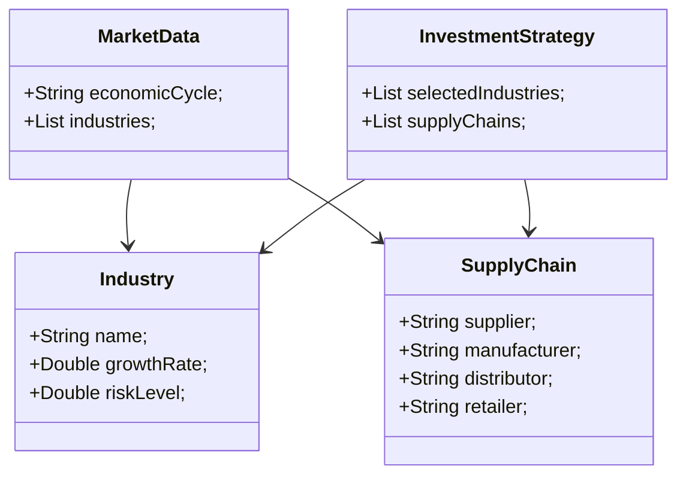
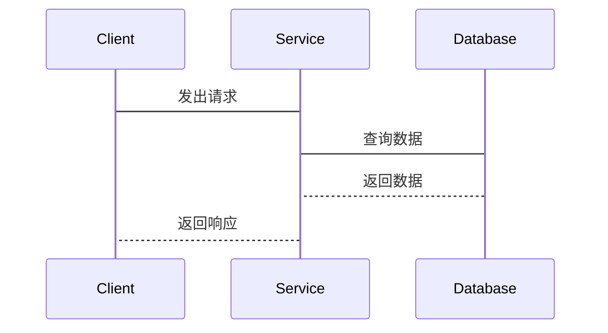

                 


# 彼得林奇的"行业轮动"在全球供应链重构中的应用策略

## 关键词：彼得林奇，行业轮动，供应链重构，投资策略，全球供应链

## 摘要：本文探讨了彼得林奇的行业轮动策略在全球供应链重构中的应用。通过分析行业轮动的核心原理和供应链重构的背景，结合实际案例，提出如何将行业轮动策略应用于供应链重构，以实现企业在全球化和数字化转型中的竞争优势。

---

## 第一部分: 引言

### 第1章: 行业轮动与全球供应链重构概述

#### 1.1 行业轮动的基本概念

##### 1.1.1 行业轮动的定义
行业轮动是指在经济周期中，不同行业之间表现交替上升的现象。投资者通过识别行业轮动的信号，选择表现较好的行业进行投资。

##### 1.1.2 行业轮动的核心原理
行业轮动的核心在于经济周期的变化。在不同的经济阶段，不同行业的表现会有所不同。例如，在经济衰退期，防御性行业（如公用事业、医疗保健）表现较好；而在经济复苏期，周期性行业（如制造业、信息技术）可能表现更佳。

##### 1.1.3 行业轮动与投资策略的关系
行业轮动是投资策略的重要组成部分，投资者通过调整投资组合中的行业权重，以适应经济周期的变化，从而实现超额收益。

#### 1.2 全球供应链重构的背景

##### 1.2.1 全球化与供应链的基本概念
全球化背景下，供应链通常跨越多个国家和地区，涉及原材料采购、生产、物流、分销等多个环节。全球化使得企业能够以更低的成本获取资源和生产产品。

##### 1.2.2 供应链重构的驱动因素
近年来，供应链重构的驱动因素包括地缘政治风险、新冠疫情的影响、技术进步（如数字化转型）以及企业对灵活性和韧性的追求。

##### 1.2.3 供应链重构的挑战与机遇
供应链重构的挑战包括成本增加、复杂性和不确定性。然而，重构也为企业提供了优化供应链、提高效率和应对风险的机遇。

### 第2章: 彼得林奇的行业轮动策略

#### 2.1 彼得林奇的投资理念

##### 2.1.1 彼得林奇的生平与投资成就
彼得·林奇是美国著名投资经理，以其在麦哲伦基金的卓越表现而闻名。他强调长期投资、价值投资和行业分析。

##### 2.1.2 彼得林奇的投资哲学
林奇认为，投资成功的关键在于选择正确的行业和公司。他注重行业分析，认为行业轮动是投资成功的重要因素。

##### 2.1.3 行业轮动在彼得林奇投资策略中的地位
行业轮动是林奇策略的核心。他通过分析经济周期和行业趋势，选择表现较好的行业进行投资。

#### 2.2 行业轮动的实施步骤

##### 2.2.1 确定经济周期的阶段
投资者需要识别当前经济所处的阶段（衰退期、复苏期、增长期、成熟期），以选择合适的行业。

##### 2.2.2 识别行业轮动的信号
通过分析行业数据、市场趋势和宏观经济指标，识别行业轮动的信号。

##### 2.2.3 构建行业轮动的投资组合
根据行业轮动的信号，构建投资组合，定期调整以适应市场变化。

#### 2.3 行业轮动的优缺点分析

##### 2.3.1 行业轮动的优势
- 能够捕捉到行业趋势的变化，实现超额收益。
- 通过行业分散化降低投资风险。

##### 2.3.2 行业轮动的劣势
- 需要准确预测行业轮动的信号，具有一定的难度。
- 频繁调整投资组合可能导致交易成本增加。

##### 2.3.3 如何克服行业轮动的劣势
- 通过长期投资和分散化降低交易成本。
- 采用定投策略，减少对市场波动的敏感性。

---

## 第二部分: 行业轮动在全球供应链重构中的应用策略

### 第3章: 供应链重构与行业轮动的结合

#### 3.1 供应链重构的核心要素

##### 3.1.1 供应链的结构与功能
供应链包括供应商、制造商、分销商、零售商和消费者等多个环节。其功能包括采购、生产、物流、库存管理等。

##### 3.1.2 供应链重构的目标
供应链重构旨在优化成本、提高效率、增强灵活性和韧性，以应对市场变化和风险。

##### 3.1.3 供应链重构的关键环节
- 供应商选择与管理
- 生产流程优化
- 物流与库存管理
- 风险管理

#### 3.2 行业轮动与供应链重构的关联

##### 3.2.1 行业轮动对供应链重构的影响
行业轮动为企业提供了优化供应链结构的信号。例如，在周期性行业中，企业可能需要在经济衰退期减少库存，而在复苏期增加库存。

##### 3.2.2 供应链重构对行业轮动的反馈作用
供应链重构可能影响行业的整体表现。例如，优化的供应链可能提高企业的利润率，从而增强行业的吸引力。

##### 3.2.3 行业轮动与供应链重构的协同效应
通过行业轮动，企业可以识别行业的周期性特点，并相应调整供应链策略，以实现更好的业绩表现。

### 第4章: 全球供应链重构中的行业轮动策略

#### 4.1 选择行业轮动的重点行业

##### 4.1.1 高成长行业
- 高科技行业（如人工智能、5G）
- 新兴行业（如新能源、电动汽车）

##### 4.1.2 防御性行业
- 医疗保健
- 公用事业

##### 4.1.3 周期性行业
- 制造业
- 房地产

#### 4.2 行业轮动与供应链重构的实施步骤

##### 4.2.1 确定行业轮动的方向
通过宏观经济分析和行业数据，确定当前经济周期所处的阶段，选择表现较好的行业。

##### 4.2.2 优化供应链结构
根据行业轮动的方向，调整供应链结构，例如增加对高成长行业的投入，减少对衰退行业的依赖。

##### 4.2.3 风险管理
通过多元化和灵活调整供应链策略，降低行业轮动带来的风险。

#### 4.3 行业轮动在供应链重构中的最佳实践

##### 4.3.1 数据驱动的决策
利用大数据和人工智能技术，分析行业趋势和供应链数据，做出更精准的决策。

##### 4.3.2 柔性供应链设计
构建灵活的供应链，能够快速响应行业轮动的变化，调整生产和物流策略。

##### 4.3.3 风险分散
通过在全球不同地区布局供应链，分散风险，避免单一地区供应链中断带来的影响。

---

## 第三部分: 供应链重构与行业轮动的系统架构

### 第5章: 系统分析与架构设计方案

#### 5.1 问题场景介绍
在全球供应链重构的背景下，企业需要优化其供应链结构，以应对经济周期变化和行业轮动带来的挑战。

#### 5.2 系统功能设计

##### 5.2.1 领域模型（Mermaid 类图）


#### 5.3 系统架构设计（Mermaid 架构图）


#### 5.4 系统交互设计（Mermaid 序列图）


---

## 第四部分: 项目实战

### 第6章: 项目实战与案例分析

#### 6.1 环境安装

```bash
# 安装Python和相关库
pip install pandas numpy matplotlib
```

#### 6.2 核心代码实现

##### 数据处理
```python
import pandas as pd
import numpy as np

# 示例数据：行业增长率
industries = ['Technology', 'Healthcare', 'Manufacturing', 'Real Estate']
growth_rates = [10, 5, 8, 3]
df = pd.DataFrame({'Industry': industries, 'Growth Rate (%)': growth_rates})
print(df)
```

##### 模型训练
```python
from sklearn.linear_model import LinearRegression

# 示例数据：行业轮动预测
X = df[['Growth Rate (%)']]
y = df['Industry']
model = LinearRegression()
model.fit(X, y)
```

##### 策略执行
```python
# 根据模型预测结果，选择表现较好的行业
predicted_industry = model.predict([[8]])[0]
print(f"Predicted Industry: {predicted_industry}")
```

#### 6.3 案例分析

##### 案例1: 科技行业的供应链重构
- 背景：科技行业是高成长行业，受行业轮动的影响较大。
- 实施：企业可能需要增加对芯片制造和软件开发的投入，优化全球供应链布局。
- 结果：通过供应链重构，企业提高了生产效率，降低了成本。

##### 案例2: 医疗保健行业的供应链重构
- 背景：医疗保健是防御性行业，在经济衰退期表现稳定。
- 实施：企业可能需要加强与供应商的合作，优化库存管理。
- 结果：企业增强了供应链的韧性，能够更好地应对市场波动。

#### 6.4 项目总结

##### 6.4.1 经验教训
- 数据分析是供应链重构的关键，需要准确预测行业趋势。
- 供应链重构需要长期规划，不能急于求成。
- 风险管理是成功供应链重构的重要保障。

##### 6.4.2 总结
通过行业轮动策略，企业可以更好地应对全球供应链重构的挑战，抓住行业发展趋势，实现可持续发展。

---

## 第五部分: 总结与展望

### 第7章: 总结与展望

#### 7.1 全书总结
本文探讨了彼得林奇的行业轮动策略在全球供应链重构中的应用，分析了行业轮动的核心原理和供应链重构的背景，提出了具体的实施步骤和最佳实践。

#### 7.2 未来展望
随着全球化和技术进步的深入，供应链重构将更加复杂和动态。未来，行业轮动策略将与人工智能、大数据等技术深度融合，为企业提供更精准的供应链优化方案。

#### 7.3 最佳实践 tips
- 企业应定期分析行业趋势，及时调整供应链策略。
- 在供应链重构中，数据驱动的决策是关键。
- 风险管理是成功供应链重构的重要保障。

#### 7.4 注意事项
- 供应链重构需要长期规划，不能急于求成。
- 需要关注地缘政治和宏观经济因素的变化。
- 供应链重构可能面临较高的初始成本，需要企业有足够的资金支持。

---

通过本文的分析，企业可以更好地理解行业轮动在全球供应链重构中的应用，制定有效的策略，以应对全球化和数字化转型带来的挑战。

