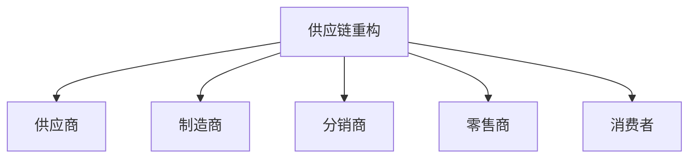

                 

# 彼得林奇的"行业轮动"在全球供应链重构中的投资机会识别

---

## 关键词：行业轮动、供应链重构、投资机会、彼得·林奇、全球经济

---

## 摘要：  
本文深入探讨彼得·林奇的行业轮动理论在全球供应链重构背景下的投资机会识别。通过分析行业轮动的核心原理、供应链重构的驱动因素，以及两者结合的投资策略，为投资者提供一套系统化的分析框架和实战案例。文章结合理论与实践，利用数学模型、系统架构图和实际案例，帮助投资者在全球供应链重构中把握行业轮动带来的投资机遇。

---

## 第一部分：引言

## 第1章：行业轮动与全球供应链重构的背景

### 1.1 行业轮动的基本概念

#### 1.1.1 行业轮动的定义与核心原理  
行业轮动是指在经济周期中，不同行业间收益波动的规律性现象。彼得·林奇在其投资理论中强调，行业轮动的核心在于识别行业周期性变化，抓住高增长行业的投资机会。  

**行业轮动的核心原理：**  
- 经济周期驱动：行业轮动与经济周期密切相关，不同行业在不同经济阶段的表现差异显著。  
- 市场情绪影响：投资者情绪波动会导致行业间资金流动，进而影响行业轮动的节奏。  

#### 1.1.2 行业轮动的历史演变与现状  
行业轮动并非新兴概念，其历史可以追溯到20世纪初。近年来，随着全球经济一体化和科技的进步，行业轮动的复杂性显著增加。  

#### 1.1.3 彼得·林奇的行业轮动投资理论  
彼得·林奇提出，行业轮动的关键在于识别行业周期的拐点。他强调，投资者应关注行业基本面的变化，而非单纯的市场波动。  

### 1.2 全球供应链重构的背景与驱动因素

#### 1.2.1 全球化与供应链的基本概念  
供应链是连接企业上下游的关键链条，全球化使得供应链跨越国界，形成复杂的跨国网络。  

#### 1.2.2 新冠疫情对全球供应链的影响  
疫情暴露了全球供应链的脆弱性，导致许多行业面临供应链中断的风险。  

#### 1.2.3 地缘政治与供应链重构的趋势  
地缘政治冲突（如中美贸易摩擦）推动企业重新审视供应链布局，加速供应链重构。  

#### 1.2.4 数字化转型对供应链重构的推动  
数字化技术（如区块链、人工智能）的应用，使得供应链更加智能化和高效化。  

### 1.3 供应链重构与投资机会的关联

#### 1.3.1 供应链重构对全球经济的影响  
供应链重构将重塑全球经济格局，推动新兴行业崛起和传统产业转型。  

#### 1.3.2 供应链重构与行业轮动的结合  
供应链重构为行业轮动提供了新的驱动力，投资者可以通过关注供应链重构中的行业变化，捕捉投资机会。  

#### 1.3.3 投资者如何利用行业轮动捕捉供应链重构的机会  
投资者应关注供应链重构中的新兴行业和传统行业的转型机会，灵活调整投资组合。  

### 1.4 本章小结  
本章通过分析行业轮动的核心原理和供应链重构的背景，为后续投资机会的识别奠定了基础。

---

## 第二部分：行业轮动的理论与实践

## 第2章：行业轮动的核心理论与分析框架

### 2.1 行业轮动的核心理论

#### 2.1.1 行业周期理论  
行业周期包括衰退期、复苏期、增长期和成熟期，不同阶段的投资策略不同。  

#### 2.1.2 经济周期与行业轮动的关系  
经济周期与行业轮动密切相关，衰退期适合防御性行业，复苏期适合周期性行业。  

#### 2.1.3 彼得·林奇的行业轮动策略  
林奇强调行业基本面分析，建议投资者关注行业盈利能力、市场份额和管理团队。  

### 2.2 行业轮动的分析框架

#### 2.2.1 行业轮动的驱动因素分析  
- 经济指标：GDP、失业率、通胀率等。  
- 行业指标：行业利润率、市场份额、技术创新。  

#### 2.2.2 行业轮动的指标与信号  
- 技术指标：RSI、MACD等。  
- 市场信号：行业指数波动、媒体报道。  

#### 2.2.3 行业轮动的风险与收益平衡  
投资者需在风险可控的前提下，追求最大收益。  

### 2.3 行业轮动的实践案例

#### 2.3.1 美国制造业回流的行业轮动机会  
疫情后，美国制造业回流推动了本土制造业的投资机会。  

#### 2.3.2 新兴产业的行业轮动机会  
人工智能、5G、新能源等新兴产业具有较高的增长潜力。  

#### 2.3.3 传统行业的数字化转型机会  
传统行业通过数字化转型实现竞争力提升，带来投资机会。  

### 2.4 本章小结  
本章通过理论与实践结合，为投资者提供了行业轮动的分析框架和实践案例。

---

## 第三部分：供应链重构中的投资机会识别

## 第3章：供应链重构与行业轮动的结合

### 3.1 供应链重构对行业轮动的影响

#### 3.1.1 供应链重构如何推动行业轮动  
供应链重构可能导致行业间资源重新分配，推动行业轮动。  

#### 3.1.2 供应链重构中的新兴行业机会  
数字化供应链、绿色供应链等领域具有较大的投资潜力。  

#### 3.1.3 供应链重构中的传统行业转型机会  
传统行业通过供应链重构实现转型升级，带来投资机会。  

### 3.2 全球供应链重构中的投资机会识别

#### 3.2.1 新兴供应链模式的投资机会  
- 数字化供应链：区块链、人工智能技术的应用。  
- 绿色供应链：环保材料、可持续生产模式。  

#### 3.2.2 数字化供应链的投资机会  
- 供应链管理软件：SaaS模式的应用。  
- 人工智能在供应链中的应用：预测需求、优化库存。  

#### 3.2.3 区域化供应链的投资机会  
- 本地化供应链：减少运输成本和风险。  
- 区域性产业集群：形成新的经济增长点。  

### 3.3 供应链重构中的行业轮动策略

#### 3.3.1 短期行业轮动策略  
关注短期供应链重构中的市场波动，捕捉短期收益。  

#### 3.3.2 中期行业轮动策略  
基于行业基本面分析，选择具有长期增长潜力的行业。  

#### 3.3.3 长期行业轮动策略  
投资于具有结构性增长潜力的行业，如绿色能源、人工智能等。  

### 3.4 本章小结  
本章结合供应链重构与行业轮动，为投资者提供了新的投资机会识别框架。

---

## 第四部分：供应链重构中的行业轮动策略

## 第4章：供应链重构中的行业轮动策略

### 4.1 供应链重构中的行业轮动策略

#### 4.1.1 短期策略：关注市场波动  
- 投资者应关注短期市场波动，抓住供应链重构中的短期机会。  

#### 4.1.2 中期策略：行业基本面分析  
- 投资者应基于行业基本面分析，选择具有长期增长潜力的行业。  

#### 4.1.3 长期策略：结构性投资机会  
- 投资者应关注具有结构性增长潜力的行业，如绿色能源、人工智能等。  

### 4.2 供应链重构中的风险管理

#### 4.2.1 供应链重构中的风险类型  
- 供应链中断风险  
- 市场波动风险  
- 政策风险  

#### 4.2.2 风险管理策略  
- 多元化投资：分散风险。  
- 灵活调整投资组合：根据市场变化及时调整。  

### 4.3 本章小结  
本章通过分析供应链重构中的行业轮动策略和风险管理，为投资者提供了实践指南。

---

## 结论

全球供应链重构为行业轮动提供了新的投资机会。投资者应结合行业轮动理论和供应链重构的背景，灵活调整投资策略，抓住新兴行业和传统行业的转型机会。通过科学的分析框架和风险管理策略，投资者可以在全球供应链重构中实现稳健的投资收益。

---

## 附录

### 附录A：行业轮动的数学模型

#### 行业轮动的数学模型  
$$ S_i(t+1) = \alpha S_i(t) + \beta R_t + \epsilon $$  
其中，\( S_i(t) \) 表示行业 \( i \) 在时间 \( t \) 的收益，\( R_t \) 表示市场收益，\( \alpha \) 和 \( \beta \) 是模型参数，\( \epsilon \) 是误差项。  

### 附录B：供应链重构的系统架构图

### 附录C：行业轮动的实战案例分析

#### 案例分析：人工智能行业的投资机会  
人工智能行业在全球供应链重构中具有较大的增长潜力。投资者可以通过投资人工智能技术企业，抓住行业轮动的机会。  

---

以上是完整的目录大纲和文章内容，按照逻辑清晰、结构紧凑、简单易懂的原则，结合技术语言和实际案例，为投资者提供了系统的分析和指导。

