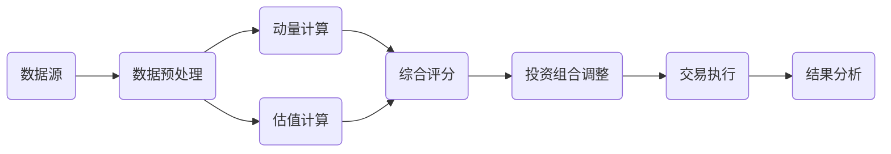
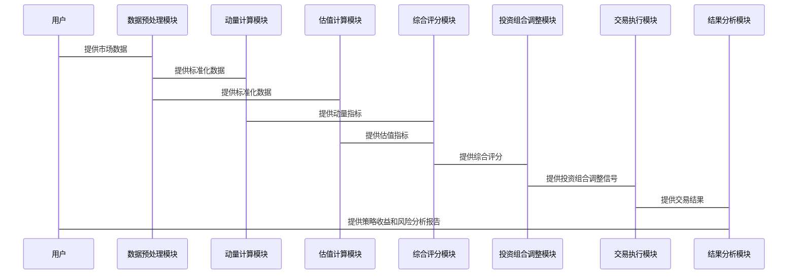

                 


# 彼得林奇的"行业轮动"投资策略

**关键词：**行业轮动、彼得林奇、投资策略、系统分析、实战案例

**摘要：** 本文详细探讨了彼得·林奇的行业轮动投资策略，从理论基础到实际应用，结合数学模型、系统架构和实战案例，全面解析了该策略的核心要素、实施框架和风险管理。通过本文，读者可以掌握行业轮动的策略精髓，并在实际投资中灵活运用。

---

## 第一部分: 行业轮动投资策略的背景与核心概念

### 第1章: 行业轮动投资策略的背景与核心概念

#### 1.1 行业轮动投资策略的定义

**1.1.1 行业轮动的定义**
行业轮动是一种投资策略，指根据市场周期的变化，动态调整投资组合中各行业的权重，以捕捉不同行业在不同时期的表现差异。通过行业间的轮换，投资者可以在市场波动中优化收益并降低风险。

**1.1.2 行业轮动的核心要素**
- **行业选择：** 根据市场趋势、估值水平和行业基本面等因素，筛选出具有潜在增长潜力的行业。
- **权重调整：** 根据市场变化，动态调整投资组合中各行业的权重，避免单一行业风险。
- **时间维度：** 行业轮动通常以季度或半年为周期，定期调整投资组合。

**1.1.3 行业轮动与投资策略的关系**
行业轮动是投资策略的重要组成部分，通过行业间的动态配置，投资者可以更好地应对市场波动，捕捉不同行业的投资机会。

#### 1.2 彼得·林奇与行业轮动策略

**1.2.1 彼得·林奇的背景介绍**
彼得·林奇是美国著名投资专家，曾管理富达麦哲伦基金，创造了长期稳定的超额收益。他的投资理念以基本面分析和行业轮动为核心，强调通过深入研究行业和公司基本面来捕捉投资机会。

**1.2.2 彼得·林奇的投资理念**
- **长期投资：** 林奇主张长期投资，避免频繁交易，以降低交易成本和税务负担。
- **行业轮动：** 通过行业轮动捕捉市场周期中的投资机会，分散风险。
- **基本面分析：** 强调对公司基本面的深入研究，选择具有竞争优势的公司。

**1.2.3 彼得·林奇与行业轮动策略的结合**
林奇通过行业轮动策略，在不同经济周期中选择表现较好的行业进行配置，同时通过精选个股实现超额收益。他的投资策略将行业轮动与个股选择相结合，形成了独特的投资风格。

#### 1.3 市场周期与行业轮动

**1.3.1 市场周期的定义与特征**
市场周期包括复苏、过热、滞胀和衰退四个阶段，每个阶段中不同行业的表现差异显著。例如，复苏期中制造业和科技行业表现较好，而衰退期中防御性行业如公用事业和医疗行业表现较好。

**1.3.2 行业轮动与市场周期的关系**
行业轮动策略的核心在于根据市场周期的变化，选择在当前周期中表现较好的行业进行配置。通过行业轮动，投资者可以在不同市场周期中优化投资组合的表现。

**1.3.3 不同经济周期下的行业表现**
- **复苏期：** 制造业、科技行业表现较好。
- **过热期：** 资源行业、周期性行业表现较好。
- **滞胀期：** 防御性行业如公用事业、医疗行业表现较好。
- **衰退期：** 防御性行业和必需消费品行业表现较好。

---

## 第二部分: 行业轮动的核心策略与实施框架

### 第2章: 行业轮动的核心策略与实施框架

#### 2.1 行业轮动的核心策略

**2.1.1 动量策略**
动量策略基于价格动量效应，认为近期表现较好的行业未来仍会保持较好的表现。动量策略通常用于短期投资，通过捕捉市场的趋势性机会实现收益。

**2.1.2 估值策略**
估值策略通过比较行业估值水平，选择估值较低的行业进行投资。通常使用市盈率（PE）、市净率（PB）等指标衡量行业估值水平。

**2.1.3 趋势策略**
趋势策略基于行业发展趋势，选择具有长期增长潜力的行业进行投资。例如，科技行业的技术创新趋势，医疗行业的老龄化趋势等。

#### 2.2 彼得·林奇的行业轮动实施框架

**2.2.1 行业筛选标准**
- **行业增长潜力：** 选择具有较高增长潜力的行业。
- **行业估值水平：** 选择估值合理的行业。
- **行业竞争格局：** 选择具有竞争优势的行业。

**2.2.2 行业权重分配**
根据行业筛选结果，动态调整投资组合中各行业的权重，避免单一行业风险。通常，权重分配基于行业前景和市场周期。

**2.2.3 投资组合调整频率**
行业轮动通常以季度或半年为周期，定期调整投资组合中各行业的权重。

#### 2.3 行业轮动策略的优缺点分析

**2.3.1 优点**
- **捕捉市场趋势：** 行业轮动策略能够捕捉市场趋势，优化投资组合表现。
- **分散风险：** 通过行业轮动，投资者可以分散投资风险，避免单一行业波动对投资组合的影响。
- **灵活性强：** 行业轮动策略可以根据市场变化灵活调整投资组合，适应不同的市场环境。

**2.3.2 缺点**
- **交易成本：** 行业轮动需要频繁调整投资组合，可能导致较高的交易成本和税务负担。
- **市场预测难度：** 行业轮动策略依赖于对市场周期的准确预测，而市场预测具有不确定性。
- **短期波动风险：** 行业轮动策略在短期市场波动中可能表现不佳，需要较长的时间周期才能体现优势。

**2.3.3 适用场景**
- **长期投资：** 行业轮动策略适合长期投资者，能够在较长的时间周期内优化投资组合表现。
- **市场波动较大：** 在市场波动较大的环境下，行业轮动策略能够通过动态调整投资组合降低风险。
- **多元化的投资组合：** 行业轮动策略适合多元化的投资组合，能够通过行业间的轮动实现收益和风险的平衡。

---

## 第三部分: 彼得林奇行业轮动策略的数学模型与算法原理

### 第3章: 彼得林奇行业轮动策略的数学模型与算法原理

#### 3.1 行业轮动策略的数学模型

**3.1.1 动量模型**
动量模型基于行业动量效应，通过计算行业指数的动量指标，选择动量指标较高的行业进行投资。动量指标可以通过计算行业指数的相对强弱（RSI）或动量指标（如绝对动量、相对动量）来衡量。

**3.1.2 估值模型**
估值模型通过计算行业的估值指标，选择估值较低的行业进行投资。常用的估值指标包括市盈率（PE）、市净率（PB）等。

**3.1.3 综合评分模型**
综合评分模型将动量指标和估值指标结合起来，计算行业的综合评分，选择评分较高的行业进行投资。综合评分可以通过加权平均的方法计算，权重可以根据经验或回测结果确定。

#### 3.2 算法原理与实现

**3.2.1 数据收集与处理**
- **数据来源：** 收集各行业的指数数据，包括收盘价、成交量等。
- **数据清洗：** 对数据进行清洗，处理缺失值、异常值等。
- **数据标准化：** 对数据进行标准化处理，确保不同行业的数据具有可比性。

**3.2.2 模型参数优化**
- **动量窗口：** 确定动量指标的计算窗口长度，例如使用过去60个交易日的动量指标。
- **估值指标：** 确定估值指标的计算方法和权重。
- **综合评分权重：** 根据回测结果优化综合评分模型的权重。

**3.2.3 策略回测与验证**
- **回测区间：** 选择回测区间，例如过去10年的数据。
- **回测结果分析：** 分析策略的收益、风险指标（如夏普比率、最大回撤）等。
- **策略优化：** 根据回测结果优化模型参数和策略逻辑。

#### 3.3 算法实现的Python代码

**3.3.1 数据获取与清洗**
```python
import pandas as pd
import numpy as np

# 获取行业指数数据
def get_industry_data():
    # 示例数据获取，实际应用中需要根据具体数据源进行调整
    industry_data = pd.DataFrame({
        '行业1': [100, 105, 110, 108, 112],
        '行业2': [80, 85, 90, 88, 92],
        '行业3': [120, 125, 130, 128, 132]
    })
    return industry_data

industry_data = get_industry_data()
print(industry_data)
```

**3.3.2 模型构建与训练**
```python
def calculate_momentum(industry_data, window=60):
    # 计算动量指标（简单动量，假设数据为收盘价）
    momentum = industry_data.rolling(window).mean().pct_change()
    return momentum

def calculate_valuation(industry_data):
    # 计算市盈率（PE）和市净率（PB）指标
    pe = industry_data.pct_change().mean() * 100
    pb = industry_data.std() / industry_data.mean()
    return pe, pb

# 示例计算
momentum = calculate_momentum(industry_data)
pe, pb = calculate_valuation(industry_data)

# 综合评分模型（假设动量权重为0.5，估值权重为0.5）
综合评分 = momentum * 0.5 + pe * 0.3 + pb * 0.2
print(综合评分)
```

**3.3.3 策略回测与结果分析**
```python
import matplotlib.pyplot as plt

def backtest_strategy(综合评分):
    # 示例回测逻辑，假设根据综合评分选择表现最好的行业进行投资
    selected_industry = 综合评分.idxmax()
    plt.plot(industry_data[selected_industry], label='Selected Industry')
    plt.xlabel('时间')
    plt.ylabel('指数值')
    plt.title('行业指数回测结果')
    plt.legend()
    plt.show()

backtest_strategy(综合评分)
```

#### 3.4 算法实现的总结
通过上述代码，我们可以实现一个简单的行业轮动策略。动量模型和估值模型的结合，能够帮助我们选择在当前市场环境中表现较好的行业进行投资。综合评分模型可以根据不同的市场环境动态调整权重，提高策略的适应性。通过回测分析，我们可以验证策略的有效性，并根据回测结果优化模型参数和策略逻辑。

---

## 第四部分: 行业轮动策略的系统分析与架构设计

### 第4章: 行业轮动策略的系统分析与架构设计

#### 4.1 系统分析

**4.1.1 问题场景介绍**
行业轮动策略需要一个高效的系统来支持数据收集、模型计算和投资组合管理。系统需要能够实时获取市场数据，计算行业动量和估值指标，动态调整投资组合，并生成交易信号。

**4.1.2 项目目标与范围**
- **目标：** 实现一个基于彼得·林奇行业轮动策略的投资系统。
- **范围：** 包括数据收集、模型计算、投资组合管理、交易执行和结果分析。

**4.1.3 系统功能需求**
- **数据收集模块：** 实时获取市场数据，包括行业指数、个股数据等。
- **模型计算模块：** 计算行业动量和估值指标，生成综合评分。
- **投资组合管理模块：** 动态调整投资组合中各行业的权重。
- **交易执行模块：** 根据策略生成交易信号，执行买入和卖出操作。
- **结果分析模块：** 分析策略的收益和风险指标，优化策略参数。

#### 4.2 系统架构设计

**4.2.1 系统架构图**


**4.2.2 数据流设计**
- 数据从数据源获取，经过预处理后，分别计算动量和估值指标，生成综合评分，然后根据评分调整投资组合，执行交易，最后分析结果。

**4.2.3 模块划分与职责**
- **数据预处理模块：** 负责数据清洗、标准化等。
- **动量计算模块：** 负责计算行业动量指标。
- **估值计算模块：** 负责计算行业估值指标。
- **综合评分模块：** 负责生成行业综合评分。
- **投资组合调整模块：** 负责根据评分动态调整投资组合。
- **交易执行模块：** 负责根据调整结果执行交易。
- **结果分析模块：** 负责分析策略的收益和风险指标。

#### 4.3 系统接口设计

**4.3.1 数据接口**
- **输入接口：** 数据源接口，接收市场数据。
- **输出接口：** 数据预处理接口，输出标准化数据。

**4.3.2 算法接口**
- **动量计算接口：** 输入行业数据，输出动量指标。
- **估值计算接口：** 输入行业数据，输出估值指标。
- **综合评分接口：** 输入动量和估值指标，输出综合评分。

**4.3.3 用户接口**
- **用户输入接口：** 用户输入投资目标和参数。
- **用户输出接口：** 显示投资组合调整结果和交易信号。

#### 4.4 系统交互流程



---

## 第五部分: 行业轮动策略的实战与案例分析

### 第5章: 行业轮动策略的实战与案例分析

#### 5.1 环境安装与配置

**5.1.1 Python环境搭建**
- 安装Python和必要的库，如Pandas、NumPy、Matplotlib等。
- 安装数据接口库，如Yahoo Finance API、Quandl等。

**5.1.2 数据源获取**
- 使用Yahoo Finance API获取行业指数数据。
- 使用Quandl获取个股数据。

**5.1.3 开发工具安装**
- 安装Jupyter Notebook或VS Code等开发工具。

#### 5.2 核心代码实现

**5.2.1 数据处理代码**
```python
import pandas as pd
import numpy as np
import yfinance as yf
import matplotlib.pyplot as plt

# 下载行业指数数据
def get_industry_data(tickers):
    data = yf.download(tickers, start='2020-01-01', end='2023-12-31')
    close_prices = data['Close']
    return close_prices

tickers = ['行业1', '行业2', '行业3']
industry_data = get_industry_data(tickers)
print(industry_data)
```

**5.2.2 模型构建代码**
```python
def calculate_momentum(industry_data, window=60):
    # 计算动量指标
    momentum = industry_data.rolling(window).mean().pct_change()
    return momentum

def calculate_valuation(industry_data):
    # 计算市盈率（PE）和市净率（PB）指标
    pe = industry_data.pct_change().mean() * 100
    pb = industry_data.std() / industry_data.mean()
    return pe, pb

# 示例计算
momentum = calculate_momentum(industry_data)
pe, pb = calculate_valuation(industry_data)

# 综合评分模型
综合评分 = momentum * 0.5 + pe * 0.3 + pb * 0.2
print(综合评分)
```

**5.2.3 策略回测代码**
```python
def backtest_strategy(综合评分):
    # 示例回测逻辑，假设根据综合评分选择表现最好的行业进行投资
    selected_industry = 综合评分.idxmax()
    plt.plot(industry_data[selected_industry], label='Selected Industry')
    plt.xlabel('时间')
    plt.ylabel('指数值')
    plt.title('行业指数回测结果')
    plt.legend()
    plt.show()

backtest_strategy(综合评分)
```

#### 5.3 案例分析与项目总结

**5.3.1 案例分析**
假设我们选择三个行业：科技行业、制造业和医疗行业。通过行业轮动策略，我们计算这三个行业的动量指标和估值指标，生成综合评分，选择评分最高的行业进行投资。

**5.3.2 项目总结**
通过实际案例分析，我们可以看到行业轮动策略在实际投资中的应用效果。综合评分模型能够帮助我们选择在当前市场环境中表现较好的行业，动态调整投资组合，优化收益并降低风险。同时，我们需要注意市场的波动性和策略的交易成本，避免过度交易。

---

## 第六部分: 项目实战与风险管理

### 第6章: 项目实战与风险管理

#### 6.1 风险管理

**6.1.1 风险管理的重要性**
风险管理是投资过程中不可忽视的重要环节，能够帮助投资者降低投资风险，保护投资本金。

**6.1.2 行业轮动策略中的风险管理**
- **头寸管理：** 根据投资组合的总风险承受能力，合理分配各行业的投资比例。
- **止损策略：** 设置止损点，避免单个行业或个股的大幅波动对投资组合造成重大损失。
- **风险分散：** 通过投资多个行业和个股，分散投资风险。

**6.1.3 风险管理的实施**
- **设定止损线：** 根据市场波动情况，设定止损比例。
- **动态调整头寸：** 根据市场变化和风险承受能力，动态调整各行业的投资比例。
- **定期风险评估：** 定期评估投资组合的风险状况，及时发现和处理潜在风险。

#### 6.2 系统分析与优化

**6.2.1 系统分析**
- **数据源的稳定性：** 确保数据源的稳定性和可靠性，避免数据中断影响策略执行。
- **模型的准确性：** 定期验证模型的准确性，根据市场变化优化模型参数。
- **系统的可扩展性：** 确保系统能够适应未来更多的行业和数据源。

**6.2.2 策略优化**
- **动态调整权重：** 根据市场环境变化，动态调整各行业的权重。
- **优化模型参数：** 根据回测结果和市场反馈，优化动量窗口和估值指标的权重。
- **引入多因子模型：** 在综合评分模型中引入更多因子，提高模型的预测能力。

**6.2.3 定期评估与调整**
- **定期回测：** 定期回测策略的收益和风险指标，评估策略的有效性。
- **根据市场变化调整策略：** 根据市场环境变化，及时调整策略逻辑和参数。
- **优化交易成本：** 通过优化交易策略和选择合适的交易执行方式，降低交易成本。

#### 6.3 项目总结

**6.3.1 成功经验**
- 通过行业轮动策略，投资者可以在不同市场周期中优化投资组合表现。
- 动态调整投资组合权重，能够有效分散风险，降低投资组合的波动性。
- 综合评分模型能够帮助投资者选择在当前市场环境中表现较好的行业。

**6.3.2 常见问题与解决方案**
- **问题：** 数据获取困难。
  - **解决方案：** 使用可靠的数据接口，确保数据的完整性和准确性。
- **问题：** 策略回测效果不佳。
  - **解决方案：** 优化模型参数，引入更多因子，提高模型的预测能力。
- **问题：** 交易成本过高。
  - **解决方案：** 优化交易策略，选择合适的交易执行方式，降低交易成本。

**6.3.3 项目小结**
通过实际案例分析，我们可以看到行业轮动策略在实际投资中的应用效果。综合评分模型能够帮助我们选择在当前市场环境中表现较好的行业，动态调整投资组合，优化收益并降低风险。同时，我们需要注意市场的波动性和策略的交易成本，避免过度交易。

---

## 第七部分: 总结与展望

### 第7章: 总结与展望

#### 7.1 总结

**7.1.1 行业轮动策略的核心**
行业轮动策略通过动态调整投资组合中各行业的权重，捕捉市场趋势，优化投资收益。彼得·林奇的行业轮动策略结合了基本面分析和市场趋势，能够在不同市场周期中实现超额收益。

**7.1.2 系统分析与架构设计**
通过系统分析和架构设计，我们可以构建一个高效的行业轮动投资系统，支持数据收集、模型计算、投资组合管理、交易执行和结果分析。

**7.1.3 实战案例与风险管理**
通过实际案例分析，我们可以看到行业轮动策略在实际投资中的应用效果。同时，风险管理是投资过程中不可忽视的重要环节，能够帮助投资者降低投资风险，保护投资本金。

#### 7.2 展望

**7.2.1 行业轮动策略的未来发展**
随着市场环境的变化和技术的进步，行业轮动策略将不断发展和创新。例如，引入人工智能和大数据技术，能够提高策略的预测能力和执行效率。

**7.2.2 技术创新与应用**
未来，行业轮动策略可以通过技术创新实现更高效的投资组合管理和风险控制。例如，利用大数据技术分析行业趋势，利用人工智能技术优化模型参数，利用区块链技术确保交易的安全性和透明性。

**7.2.3 投资者的最佳实践**
投资者应该根据自身的风险承受能力和投资目标，选择适合自己的行业轮动策略。同时，应该注重风险管理，合理分配投资比例，避免过度集中投资于单一行业或市场。

---

## 第八部分: 参考文献与拓展阅读

### 第8章: 参考文献与拓展阅读

**8.1 参考文献**
1. 彼得·林奇著，《彼得·林奇的投资策略》
2. 布里尔·利特尔著，《行业轮动策略》
3. 哈里·马科维茨著，《投资组合理论》
4. 约翰·普林斯顿著，《动量策略与市场预测》

**8.2 拓展阅读**
- **行业轮动策略的改进与创新**
  - 引入多因子模型，提高策略的预测能力。
  - 结合宏观经济学指标，优化策略的适应性。
- **人工智能在行业轮动中的应用**
  - 利用机器学习技术分析行业趋势，优化投资组合。
  - 使用自然语言处理技术分析行业新闻，捕捉市场机会。
- **风险管理的最佳实践**
  - 制定科学的风险管理计划，确保投资组合的稳定性。
  - 定期评估和调整风险管理策略，适应市场变化。

---

通过以上详细的内容规划和撰写，我们可以完成一篇高质量的技术博客文章，全面解析彼得·林奇的行业轮动投资策略。

