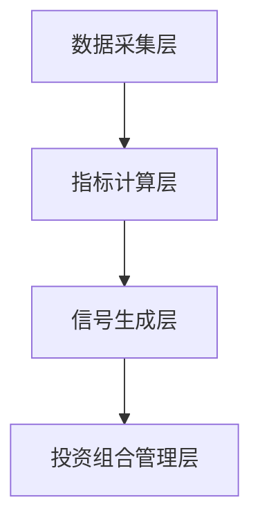
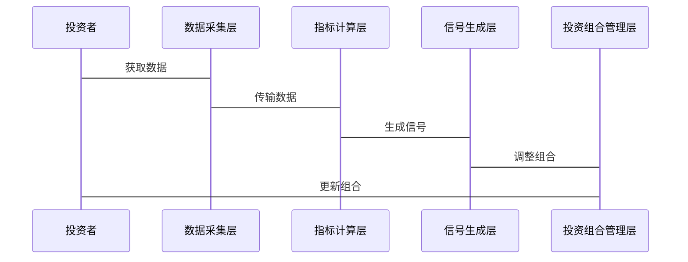

                 


# 彼得林奇的行业轮动策略

---

## 关键词  
- 彼得林奇  
- 行业轮动策略  
- 投资策略  
- 金融市场分析  
- 数学模型  

---

## 摘要  
彼得林奇是全球闻名的价值投资者，他的行业轮动策略在投资界备受推崇。本文将详细分析彼得林奇的行业轮动策略的核心思想、实施方法、数学模型以及实际应用。通过结合理论与实践，探讨如何利用行业轮动策略在金融市场中捕捉投资机会，同时结合现代技术手段优化投资决策。  

---

# 第一部分: 彼得林奇的行业轮动策略概述  

## 第1章: 彼得林奇与行业轮动策略概述  

### 1.1 彼得林奇的生平与投资理念  
彼得林奇（Peter Lynch）是全球最著名的投资经理之一，他在任职富达麦哲伦基金期间创造了卓越的投资业绩。他的投资理念强调长期持有优质股票，同时注重对行业趋势的深入研究。行业轮动策略是其投资哲学的重要组成部分，旨在通过行业周期性波动捕捉投资机会。  

#### 1.1.1 彼得林奇的生平简介  
彼得林奇于1940年出生于美国波士顿，毕业于波士顿大学，并在哈佛商学院完成MBA学位。他于1971年开始管理富达麦哲伦基金，任职期间基金规模从2000万美元增长至140亿美元，年平均收益率超过29%。  

#### 1.1.2 彼得林奇的投资理念  
彼得林奇强调“烟蒂投资”，即寻找被市场低估的优质企业进行投资。他认为，成功的投资需要对行业趋势、公司基本面以及市场周期有深刻的理解。行业轮动策略是他在实践中总结出的一种有效方法，用于在不同市场环境下优化投资组合。  

#### 1.1.3 行业轮动策略的核心思想  
行业轮动策略的核心思想是根据行业周期性波动，动态调整投资组合中各行业的权重。通过分析宏观经济指标、行业基本面数据以及市场情绪，彼得林奇能够准确判断行业的轮动趋势，并在合适的时机进行资产配置。  

### 1.2 行业轮动策略的定义与特点  
行业轮动策略是一种动态调整投资组合中行业权重的策略。通过分析行业周期、经济环境和市场趋势，投资者可以在不同行业之间切换，以捕捉收益最大化的机会。  

#### 1.2.1 行业轮动策略的定义  
行业轮动策略是指根据市场环境的变化，定期或不定期调整投资组合中各行业的权重，以适应市场趋势的变化。  

#### 1.2.2 行业轮动策略的核心特点  
- **周期性**：行业轮动与经济周期密切相关，不同行业在不同经济阶段表现各异。  
- **动态性**：行业轮动策略需要根据市场变化不断调整，具有较强的灵活性。  
- **分散性**：通过行业轮动，投资者可以分散投资风险，避免过度集中于某一行业。  

#### 1.2.3 行业轮动策略与其他投资策略的区别  
与被动投资策略不同，行业轮动策略强调主动管理；与个股选择策略不同，行业轮动策略更关注行业层面的变化，注重行业间的相对表现。  

### 1.3 行业轮动策略的应用场景  
行业轮动策略适用于多种市场环境，尤其在经济周期波动较大的情况下表现尤为突出。  

#### 1.3.1 行业轮动策略的适用市场环境  
- **经济衰退期**：防御性行业（如公用事业、医疗保健）表现较好。  
- **经济复苏期**：周期性行业（如材料、工业）可能走强。  
- **经济繁荣期**：成长性行业（如科技、消费）可能表现优异。  

#### 1.3.2 行业轮动策略的投资者类型  
- **机构投资者**：通过行业轮动优化投资组合的收益与风险。  
- **个人投资者**：个人投资者可以通过行业轮动策略在不同市场环境下分散风险，提高收益。  

#### 1.3.3 行业轮动策略的局限性  
- **市场预测的不确定性**：行业轮动策略依赖于对市场趋势的准确预测，但市场波动具有不确定性。  
- **交易成本**：频繁调整行业权重可能增加交易成本和税务负担。  
- **短期波动影响**：行业轮动策略可能受到短期市场波动的影响，导致投资收益不稳定。  

### 1.4 本章小结  
本章介绍了彼得林奇的生平及其投资理念，重点阐述了行业轮动策略的定义、特点和应用场景。通过分析行业轮动策略的核心思想，为后续章节的深入探讨奠定了基础。  

---

## 第2章: 行业轮动策略的核心概念  

### 2.1 行业轮动的驱动因素  
行业轮动的驱动因素主要包括经济周期、行业生命周期以及宏观经济指标等。  

#### 2.1.1 经济周期与行业轮动  
经济周期对行业轮动有着重要影响。在不同的经济周期阶段，不同行业的表现会有显著差异。  

- **衰退阶段**：防御性行业（如公用事业、医疗保健）表现较好。  
- **复苏阶段**：周期性行业（如材料、工业）可能走强。  
- **繁荣阶段**：成长性行业（如科技、消费）可能表现优异。  
- **萧条阶段**：大多数行业可能表现不佳，防御性行业依然具有吸引力。  

#### 2.1.2 行业生命周期与轮动  
行业生命周期包括导入期、成长期、成熟期和衰退期。在不同的生命周期阶段，行业的投资价值也会有所不同。  

- **导入期**：行业规模小，增长潜力大，适合风险偏好较高的投资者。  
- **成长期**：行业规模快速扩大，适合追求高增长的投资者。  
- **成熟期**：行业增长稳定，适合追求稳定收益的投资者。  
- **衰退期**：行业增长放缓，适合规避风险的投资者。  

#### 2.1.3 宏观经济指标对行业轮动的影响  
宏观经济指标（如GDP增长率、通胀率、利率等）对行业轮动有着重要影响。例如，低利率环境通常有利于周期性行业（如房地产、汽车）的表现。  

### 2.2 行业轮动的指标与模型  
行业轮动策略需要借助一系列指标和模型来量化行业表现，为投资决策提供支持。  

#### 2.2.1 行业轮动的关键指标  
- **行业相对强度**：衡量某行业相对于市场整体的表现。  
- **行业估值指标**：如市盈率、市净率等，用于判断行业是否被高估或低估。  
- **行业增长指标**：如收入增长率、利润增长率等，用于判断行业的成长性。  

#### 2.2.2 行业轮动模型的构建  
行业轮动模型通常包括以下几个步骤：  
1. **数据收集**：收集各行业的历史数据，包括价格、成交量、财务指标等。  
2. **指标计算**：计算行业相对强度、估值指标等关键指标。  
3. **模型优化**：通过回归分析等方法优化模型，提高预测准确性。  

#### 2.2.3 行业轮动模型的优缺点  
- **优点**：量化分析提高了投资决策的科学性；模型可以自动化运行，节省时间和成本。  
- **缺点**：模型依赖于历史数据，可能存在过拟合问题；市场环境变化可能导致模型失效。  

### 2.3 行业轮动的数学模型  

#### 2.3.1 行业轮动的回归模型  
回归模型是一种常用的行业轮动预测方法。以下是一个简单的线性回归模型：  

$$ y = \beta_0 + \beta_1x + \epsilon $$  

其中，$y$ 表示行业表现，$x$ 表示宏观经济指标，$\beta_0$ 和 $\beta_1$ 是回归系数，$\epsilon$ 是误差项。  

#### 2.3.2 行业轮动的时间序列模型  
时间序列模型常用于分析行业表现的动态变化。例如，ARIMA模型可以用于预测行业未来的走势。  

#### 2.3.3 行业轮动的机器学习模型  
机器学习模型（如随机森林、支持向量机）可以用于分类和回归问题，帮助投资者更好地预测行业轮动趋势。  

### 2.4 本章小结  
本章详细分析了行业轮动的驱动因素，并介绍了几种常用的行业轮动模型。通过数学模型的构建，为后续章节的策略实施提供了理论基础。  

---

## 第3章: 行业轮动策略的实施步骤  

### 3.1 确定行业轮动的周期  
行业轮动的周期包括短期、中期和长期三种类型。  

#### 3.1.1 短期行业轮动  
短期行业轮动适用于市场波动较大的环境，通常基于技术指标进行判断。  

#### 3.1.2 中期行业轮动  
中期行业轮动注重行业基本面的分析，适用于经济周期变化较大的环境。  

#### 3.1.3 长期行业轮动  
长期行业轮动强调行业长期趋势的判断，适用于市场环境相对稳定的环境。  

### 3.2 行业筛选与权重分配  
行业筛选是行业轮动策略的核心步骤，权重分配则是根据筛选结果调整各行业的投资比例。  

#### 3.2.1 行业筛选的标准  
- **相对强度**：选择表现优于市场的行业。  
- **估值水平**：选择估值合理的行业。  
- **成长性**：选择具有较高增长潜力的行业。  

#### 3.2.2 行业权重的计算  
行业权重通常基于行业的相对强度、估值水平和成长性指标进行计算。  

#### 3.2.3 行业权重的动态调整  
根据市场环境的变化，定期或不定期调整各行业的权重，以优化投资组合的表现。  

### 3.3 行业轮动的组合管理  

#### 3.3.1 行业轮动组合的构建  
根据筛选结果和权重分配，构建行业轮动投资组合。  

#### 3.3.2 行业轮动组合的风险管理  
通过分散投资、设置止损等方法，降低投资组合的风险。  

#### 3.3.3 行业轮动组合的绩效评估  
定期评估投资组合的绩效，分析其收益和风险表现。  

### 3.4 本章小结  
本章详细介绍了行业轮动策略的实施步骤，包括周期确定、行业筛选、权重分配以及组合管理等内容。通过科学的实施步骤，投资者可以更好地应用行业轮动策略进行投资决策。  

---

## 第4章: 行业轮动策略的数学模型与算法  

### 4.1 行业轮动的数学模型  

#### 4.1.1 行业轮动的回归模型  
回归模型是行业轮动预测的重要工具。以下是一个多元回归模型的示例：  

$$ y = \beta_0 + \beta_1x_1 + \beta_2x_2 + \epsilon $$  

其中，$y$ 是行业表现，$x_1$ 和 $x_2$ 是宏观经济指标，$\beta_0$、$\beta_1$、$\beta_2$ 是回归系数，$\epsilon$ 是误差项。  

#### 4.1.2 行业轮动的时间序列模型  
时间序列模型常用于分析行业表现的动态变化。例如，ARIMA模型可以用于预测行业未来的走势。  

#### 4.1.3 行业轮动的机器学习模型  
机器学习模型（如随机森林、支持向量机）可以用于分类和回归问题，帮助投资者更好地预测行业轮动趋势。  

### 4.2 行业轮动的算法实现  

#### 4.2.1 数据预处理  
- **数据清洗**：处理缺失值、异常值等。  
- **数据标准化**：对数据进行标准化处理，便于模型训练。  

#### 4.2.2 模型训练  
- **特征选择**：选择对行业轮动影响较大的特征变量。  
- **模型训练**：使用训练数据训练模型，调整模型参数。  

#### 4.2.3 模型评估  
- **性能指标**：如准确率、召回率、F1分数等。  
- **交叉验证**：通过交叉验证评估模型的泛化能力。  

### 4.3 本章小结  
本章通过数学模型和算法实现，详细介绍了行业轮动策略的量化分析方法。通过回归模型、时间序列模型和机器学习模型的构建，为投资者提供了科学的投资决策工具。  

---

## 第5章: 行业轮动策略的系统设计  

### 5.1 系统功能设计  
行业轮动监测系统需要具备数据采集、指标计算、信号生成和投资组合管理等功能。  

#### 5.1.1 数据采集模块  
- **数据源**：包括历史价格数据、财务数据、宏观经济指标等。  
- **数据接口**：通过API接口获取实时数据。  

#### 5.1.2 指标计算模块  
- **相对强度指标**：计算行业相对于市场的表现。  
- **估值指标**：计算行业的市盈率、市净率等。  
- **成长性指标**：计算行业的收入增长率、利润增长率等。  

#### 5.1.3 信号生成模块  
- **信号规则**：根据指标计算结果生成买入、卖出信号。  
- **信号输出**：将信号输出至投资组合管理系统。  

#### 5.1.4 投资组合管理模块  
- **资产分配**：根据信号调整投资组合中各行业的权重。  
- **风险控制**：设置止损、止盈等风险控制规则。  
- **绩效评估**：定期评估投资组合的收益与风险表现。  

### 5.2 系统架构设计  
行业轮动监测系统的架构设计包括数据采集层、指标计算层、信号生成层和投资组合管理层。  

#### 5.2.1 系统架构图  



#### 5.2.2 系统交互流程图  



### 5.3 本章小结  
本章通过系统设计的方法，详细介绍了行业轮动监测系统的功能和架构。通过模块化设计和流程优化，投资者可以更高效地实施行业轮动策略。  

---

## 第6章: 行业轮动策略的项目实战  

### 6.1 项目环境与工具安装  
- **编程语言**：Python  
- **库的安装**：numpy、pandas、scikit-learn、matplotlib  

#### 代码示例  

```python
import numpy as np
import pandas as pd
from sklearn.linear_model import LinearRegression
from sklearn.metrics import mean_squared_error

# 数据加载
data = pd.read_csv('industry_data.csv')

# 特征与目标变量分离
X = data.drop('industry_return', axis=1)
y = data['industry_return']

# 模型训练
model = LinearRegression()
model.fit(X, y)

# 模型预测
y_pred = model.predict(X)

# 模型评估
mse = mean_squared_error(y, y_pred)
print(f"均方误差: {mse}")
```

### 6.2 项目核心实现  

#### 6.2.1 数据预处理  
- **数据清洗**：处理缺失值、异常值等。  
- **数据标准化**：对数据进行标准化处理，便于模型训练。  

#### 6.2.2 模型训练  
- **特征选择**：选择对行业轮动影响较大的特征变量。  
- **模型训练**：使用训练数据训练模型，调整模型参数。  

#### 6.2.3 信号生成  
- **信号规则**：根据指标计算结果生成买入、卖出信号。  
- **信号输出**：将信号输出至投资组合管理系统。  

### 6.3 实际案例分析  
通过实际案例分析，验证行业轮动策略的有效性。例如，使用历史数据对某行业进行预测，验证模型的准确性。  

#### 6.3.1 数据分析  
- **数据可视化**：使用matplotlib绘制行业表现趋势图。  

#### 6.3.2 投资组合管理  
- **资产分配**：根据信号调整投资组合中各行业的权重。  
- **风险控制**：设置止损、止盈等风险控制规则。  

### 6.4 本章小结  
本章通过项目实战的方式，详细介绍了行业轮动策略的具体实现过程。通过代码示例和实际案例分析，帮助读者更好地理解和应用行业轮动策略。  

---

## 第7章: 总结与展望  

### 7.1 本章总结  
本文详细介绍了彼得林奇的行业轮动策略，从理论到实践，全面分析了行业轮动策略的核心思想、实施方法、数学模型以及系统设计。通过结合理论与实践，为投资者提供了一套科学的投资决策工具。  

### 7.2 未来展望  
未来，随着人工智能和大数据技术的发展，行业轮动策略将更加智能化和自动化。投资者可以通过更复杂的模型和算法，进一步优化投资组合的表现。同时，行业轮动策略在量化投资、风险管理等领域也有广阔的应用前景。  

### 7.3 最佳实践 Tips  
- **持续学习**：关注市场动态和行业趋势，不断优化投资策略。  
- **风险管理**：设置止损、止盈等机制，控制投资风险。  
- **系统化投资**：通过系统化的方法进行投资决策，减少人为情绪的干扰。  

### 7.4 本章小结  
本章总结了全文的核心内容，并对未来的研究方向提出了展望。通过最佳实践 Tips，为投资者提供了实用的建议。  

---

## 关键词  
- 彼得林奇  
- 行业轮动策略  
- 投资策略  
- 金融市场分析  
- 数学模型  

---

## 摘要  
彼得林奇的行业轮动策略是一种动态调整投资组合中行业权重的方法，旨在通过行业周期性波动捕捉投资机会。本文从彼得林奇的投资理念出发，详细分析了行业轮动策略的核心思想、实施方法、数学模型以及系统设计，并通过项目实战验证了策略的有效性。未来，随着技术的进步，行业轮动策略将更加智能化和自动化，为投资者提供更高效的投资决策工具。

