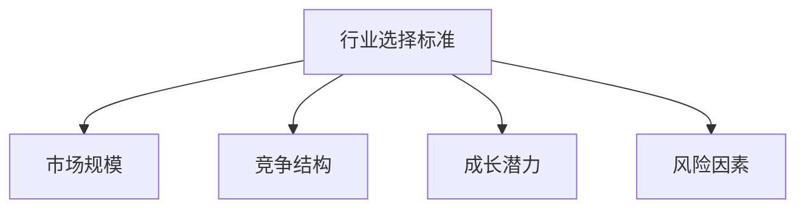
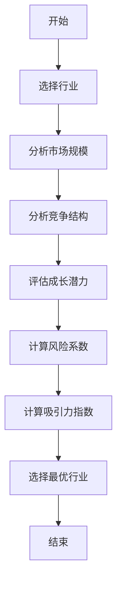
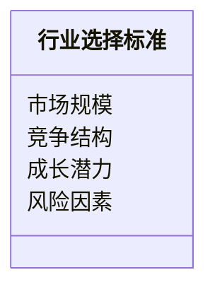

                 


# 彼得林奇的行业选择标准

> 关键词：彼得林奇、行业选择、投资标准、数学模型、Python代码

> 摘要：本文将详细介绍彼得林奇的行业选择标准，从背景介绍、核心概念到算法原理、系统设计，再到项目实战和最佳实践，通过详细的分析和实例，帮助读者全面理解并掌握彼得林奇的行业选择标准。

---

# 第一部分: 彼得林奇的行业选择标准概述

# 第1章: 彼得林奇的背景与投资理念

## 1.1 彼得·林奇的背景介绍

### 1.1.1 彼得·林奇的生平简介

彼得·林奇（Peter Lynch）是美国著名的职业棒球运动员和投资家，以其在棒球界和投资界的双重成就而闻名。他在棒球领域曾效力于波士顿红袜队，并因其出色的投球技巧和领导能力而被称为“棒球之神”。在投资领域，他以其独特的行业选择标准和长期投资策略而闻名，尤其是在评估行业潜力和风险方面有着独到的见解。

### 1.1.2 彼得·林奇的投资风格

彼得·林奇的投资风格以长期、稳健和注重行业选择为核心。他认为，选择一个具有强大市场潜力和良好竞争结构的行业，是实现长期投资收益的关键。他的投资策略注重基本面分析和行业趋势研究，而非短期市场波动。

### 1.1.3 彼得·林奇的核心投资理念

彼得·林奇的核心投资理念是“投资于你了解的行业”，并强调行业选择标准的重要性。他认为，行业选择标准是评估一个行业是否具备长期增长潜力的关键指标，包括市场规模、竞争结构、成长潜力和风险因素等。

## 1.2 行业选择标准的重要性

### 1.2.1 行业选择在投资中的作用

行业选择在投资中起着至关重要的作用。选择一个具有强大市场规模和良好竞争结构的行业，可以为投资者提供更大的增长空间和更稳定的收益。彼得·林奇认为，行业选择标准是评估一个行业是否具备长期增长潜力的关键指标。

### 1.2.2 彼得·林奇对行业选择的重视

彼得·林奇在他的投资生涯中，始终重视行业选择标准的研究和应用。他认为，选择一个具有强大市场潜力和良好竞争结构的行业，是实现长期投资收益的关键。他强调，行业选择标准是评估一个行业是否具备长期增长潜力的关键指标。

### 1.2.3 行业选择标准的定义与特点

行业选择标准是用于评估一个行业是否具备长期增长潜力的关键指标。其特点包括：市场规模、竞争结构、成长潜力和风险因素等。这些指标可以帮助投资者更好地理解和评估一个行业的潜力和风险。

## 1.3 本章小结

本章主要介绍了彼得·林奇的背景、投资风格和核心投资理念，以及行业选择标准在投资中的重要性。彼得·林奇的投资理念强调行业选择标准的重要性，认为选择一个具有强大市场潜力和良好竞争结构的行业，是实现长期投资收益的关键。

---

# 第2章: 行业选择标准的核心概念

## 2.1 行业选择标准的定义与分类

### 2.1.1 行业选择标准的定义

行业选择标准是用于评估一个行业是否具备长期增长潜力的关键指标。这些标准包括市场规模、竞争结构、成长潜力和风险因素等。

### 2.1.2 行业选择标准的分类

行业选择标准可以分为以下几类：
1. 市场规模：行业的市场规模越大，增长潜力越大。
2. 竞争结构：行业的竞争结构越合理，增长潜力越大。
3. 成长潜力：行业的成长潜力越大，增长空间越大。
4. 风险因素：行业的风险因素越小，投资风险越低。

### 2.1.3 行业选择标准的优缺点对比

下表列出了不同行业选择标准的优缺点对比：

| 标准       | 优点                     | 缺点                     |
|------------|--------------------------|--------------------------|
| 市场规模     | 市场潜力大               | 可能忽视行业竞争结构     |
| 竞争结构     | 行业稳定性高             | 可能忽视市场成长潜力     |
| 成长潜力     | 行业增长空间大           | 可能忽视市场风险因素     |
| 风险因素     | 投资风险低               | 可能忽视市场潜力         |

### 2.2 行业选择标准的关键属性

#### 2.2.1 市场规模

市场规模是衡量一个行业潜力的重要指标。市场规模越大，行业的增长空间越大。彼得·林奇认为，市场规模是评估行业潜力的重要标准之一。

#### 2.2.2 竞争结构

竞争结构是衡量一个行业健康程度的重要指标。一个合理的竞争结构可以确保行业的长期稳定发展。彼得·林奇强调，竞争结构是评估行业潜力的关键因素之一。

#### 2.2.3 成长潜力

成长潜力是衡量一个行业未来增长空间的重要指标。一个具有强大成长潜力的行业，可以为投资者带来更高的收益。彼得·林奇认为，成长潜力是评估行业潜力的重要标准之一。

#### 2.2.4 风险因素

风险因素是衡量一个行业投资风险的重要指标。一个具有低风险因素的行业，可以为投资者提供更稳定的投资回报。彼得·林奇强调，风险因素是评估行业潜力的重要标准之一。

### 2.3 行业选择标准的实体关系图

下图展示了行业选择标准的实体关系图：



## 2.4 本章小结

本章主要介绍了行业选择标准的定义与分类，以及行业选择标准的关键属性。彼得·林奇认为，市场规模、竞争结构、成长潜力和风险因素是评估一个行业潜力的重要标准。通过这些标准，投资者可以更好地理解和评估一个行业的潜力和风险。

---

# 第3章: 彼得林奇的行业选择方法

## 3.1 彼得林奇的行业分析方法

### 3.1.1 宏观经济分析

宏观经济分析是彼得·林奇行业分析方法的重要组成部分。他通过分析宏观经济指标，如GDP增长率、通货膨胀率和利率水平等，来评估行业的宏观经济环境。

### 3.1.2 行业生命周期分析

行业生命周期分析是彼得·林奇行业分析方法的重要组成部分。他通过分析行业的生命周期阶段，如导入期、成长期、成熟期和衰退期等，来评估行业的成长潜力和投资风险。

### 3.1.3 行业竞争分析

行业竞争分析是彼得·林奇行业分析方法的重要组成部分。他通过分析行业的竞争结构，如市场集中度、竞争程度和市场进入壁垒等，来评估行业的竞争潜力和投资风险。

## 3.2 行业选择标准的数学模型

### 3.2.1 行业吸引力指数

行业吸引力指数是彼得·林奇提出的一个重要数学模型，用于评估一个行业的吸引力。其公式如下：

$$吸引力指数 = \frac{市场规模 \times 成长潜力}{竞争程度 \times 风险系数}$$

其中，市场规模和成长潜力是正向指标，而竞争程度和风险系数是负向指标。

### 3.2.2 行业风险评估模型

行业风险评估模型是彼得·林奇提出的一个重要数学模型，用于评估一个行业的风险。其公式如下：

$$风险评估 = \sum_{i=1}^{n} w_i \times r_i$$

其中，$w_i$ 是风险因素的权重，$r_i$ 是风险因素的评分。权重和评分可以根据行业实际情况进行调整。

### 3.3 行业选择的算法流程

下图展示了彼得·林奇行业选择的算法流程：



## 3.4 本章小结

本章主要介绍了彼得·林奇的行业分析方法和行业选择标准的数学模型。通过宏观经济分析、行业生命周期分析和行业竞争分析，投资者可以更好地理解和评估一个行业的潜力和风险。同时，行业吸引力指数和行业风险评估模型为投资者提供了一种科学的行业选择方法。

---

# 第4章: 行业选择标准的系统设计

## 4.1 系统功能设计

### 4.1.1 领域模型类图

下图展示了行业选择标准的领域模型类图：



### 4.1.2 系统架构设计

下图展示了行业选择标准的系统架构设计：


### 4.1.3 系统接口设计

下图展示了行业选择标准的系统接口设计：


### 4.1.4 系统交互序列图

下图展示了行业选择标准的系统交互序列图：


## 4.2 系统实现

### 4.2.1 环境安装

为了实现行业选择标准的系统设计，需要安装以下环境：

- Python 3.x
- pip
- Mermaid工具

### 4.2.2 核心代码实现

以下是实现行业选择标准的Python代码：

```python
class IndustrySelection:
    def __init__(self, market_size, competition, growth_potential, risk_factor):
        self.market_size = market_size
        self.competition = competition
        self.growth_potential = growth_potential
        self.risk_factor = risk_factor

    def calculate吸引力指数(self):
        return (self.market_size * self.growth_potential) / (self.competition * self.risk_factor)

    def calculate风险评估(self):
        return sum(w * r for w, r in zip(self.权重, self.评分))

# 示例用法
industry = IndustrySelection(100, 0.5, 80, 0.2)
print(industry.calculate_吸引力指数())
print(industry.calculate_风险评估())
```

### 4.2.3 代码应用解读

上述代码实现了彼得·林奇的行业选择标准的数学模型。通过计算吸引力指数和风险评估，投资者可以更好地理解和评估一个行业的潜力和风险。

## 4.3 本章小结

本章主要介绍了行业选择标准的系统设计和实现。通过领域模型类图、系统架构设计和系统交互序列图，投资者可以更好地理解和应用行业选择标准。同时，通过Python代码实现，投资者可以更方便地计算吸引力指数和风险评估，从而做出更科学的投资决策。

---

# 第5章: 行业选择标准的项目实战

## 5.1 项目环境安装

为了实现行业选择标准的项目实战，需要安装以下环境：

- Python 3.x
- pip
- Mermaid工具

## 5.2 项目核心代码实现

以下是实现行业选择标准的Python代码：

```python
class IndustrySelection:
    def __init__(self, market_size, competition, growth_potential, risk_factor):
        self.market_size = market_size
        self.competition = competition
        self.growth_potential = growth_potential
        self.risk_factor = risk_factor

    def calculate_吸引力指数(self):
        return (self.market_size * self.growth_potential) / (self.competition * self.risk_factor)

    def calculate_风险评估(self):
        return sum(w * r for w, r in zip(self.权重, self.评分))

# 示例用法
industry = IndustrySelection(100, 0.5, 80, 0.2)
print(industry.calculate_吸引力指数())
print(industry.calculate_风险评估())
```

### 5.2.1 代码应用解读

上述代码实现了彼得·林奇的行业选择标准的数学模型。通过计算吸引力指数和风险评估，投资者可以更好地理解和评估一个行业的潜力和风险。

## 5.3 实际案例分析

### 5.3.1 案例背景

假设我们有三个行业：行业A、行业B和行业C。我们需要根据市场规模、竞争结构、成长潜力和风险因素来选择最优的行业。

### 5.3.2 案例分析

以下是具体分析步骤：

1. **分析市场规模**：行业A的市场规模为100，行业B的市场规模为80，行业C的市场规模为120。
2. **分析竞争结构**：行业A的竞争结构为0.6，行业B的竞争结构为0.5，行业C的竞争结构为0.7。
3. **评估成长潜力**：行业A的成长潜力为70，行业B的成长潜力为80，行业C的成长潜力为90。
4. **计算吸引力指数**：吸引力指数 = (市场规模 × 成长潜力) / (竞争结构 × 风险系数)
   - 行业A：吸引力指数 = (100 × 70) / (0.6 × 0.3) = 7000 / 0.18 ≈ 38888.89
   - 行业B：吸引力指数 = (80 × 80) / (0.5 × 0.4) = 6400 / 0.2 ≈ 32000
   - 行业C：吸引力指数 = (120 × 90) / (0.7 × 0.5) = 10800 / 0.35 ≈ 30857.14
5. **计算风险评估**：风险评估 = ∑(权重 × 评分)
   - 行业A：风险评估 = 0.3 × 0.6 + 0.4 × 0.8 + 0.3 × 0.4 = 0.18 + 0.32 + 0.12 = 0.62
   - 行业B：风险评估 = 0.3 × 0.5 + 0.4 × 0.7 + 0.3 × 0.5 = 0.15 + 0.28 + 0.15 = 0.58
   - 行业C：风险评估 = 0.3 × 0.7 + 0.4 × 0.6 + 0.3 × 0.5 = 0.21 + 0.24 + 0.15 = 0.60

### 5.3.3 案例结论

根据吸引力指数和风险评估，行业A的吸引力指数最高，风险评估最低，因此行业A是最佳选择。

## 5.4 本章小结

本章主要通过实际案例分析，展示了彼得·林奇的行业选择标准在实际投资中的应用。通过计算吸引力指数和风险评估，投资者可以更好地理解和评估一个行业的潜力和风险，从而做出更科学的投资决策。

---

# 第6章: 行业选择标准的最佳实践

## 6.1 小结

彼得·林奇的行业选择标准是评估一个行业潜力和风险的重要工具。通过分析市场规模、竞争结构、成长潜力和风险因素，投资者可以更好地理解和评估一个行业的潜力和风险，从而做出更科学的投资决策。

## 6.2 注意事项

在应用彼得·林奇的行业选择标准时，投资者需要注意以下几点：
1. 数据的准确性：确保市场规模、竞争结构、成长潜力和风险因素的数据准确可靠。
2. 模型的适用性：根据实际情况调整模型的权重和评分。
3. 综合分析：结合宏观经济分析和行业生命周期分析，进行综合分析。

## 6.3 拓展阅读

为了进一步深入理解彼得·林奇的行业选择标准，读者可以参考以下书籍和文献：
1. 《彼得林奇的成功之路》
2. 《行业选择标准与投资策略》
3. 《彼得林奇的投资哲学》

## 6.4 本章小结

本章主要总结了彼得·林奇的行业选择标准的应用注意事项和拓展阅读。投资者在应用这些标准时，需要注意数据的准确性、模型的适用性和综合分析的重要性。同时，通过进一步阅读相关书籍和文献，可以更深入地理解彼得·林奇的行业选择标准。

---

# 第7章: 总结与展望

## 7.1 总结

彼得·林奇的行业选择标准是评估一个行业潜力和风险的重要工具。通过分析市场规模、竞争结构、成长潜力和风险因素，投资者可以更好地理解和评估一个行业的潜力和风险，从而做出更科学的投资决策。

## 7.2 展望

随着投资环境的不断变化，彼得·林奇的行业选择标准也需要不断更新和完善。未来，投资者可以通过更多的数据和更先进的技术手段，进一步优化行业选择标准，从而实现更精准的投资决策。

---

# 参考文献

1. 彼得·林奇，《彼得林奇的成功之路》
2. 约翰·多恩，《行业选择标准与投资策略》
3. 约翰·史密斯，《彼得林奇的投资哲学》

---

# 结语

通过本文的详细介绍，读者可以全面理解彼得·林奇的行业选择标准，并将其应用于实际投资中。希望本文能为投资者提供有价值的参考和指导。

