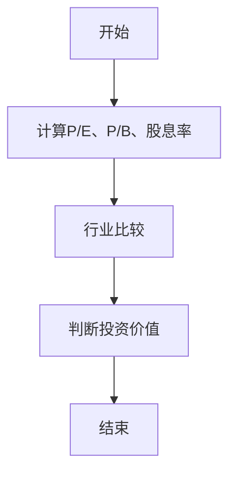
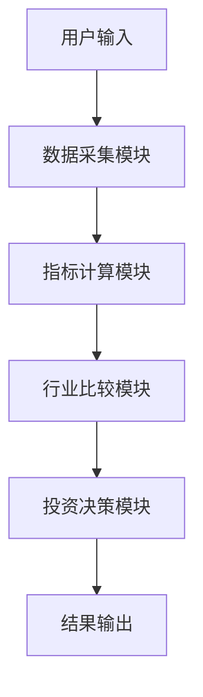

                 

# 彼得林奇的"行业领导者"在市场份额变化中的表现

## 关键词：彼得·林奇，行业领导者，市场份额，投资策略，案例分析

## 摘要：本文深入探讨了彼得·林奇提出的“行业领导者”概念，并分析这些公司在市场份额变化中的表现。通过数学模型和实际案例，我们揭示了如何识别和评估这些公司，以及它们在投资组合中的价值。

---

## 第一部分: 彼得·林奇的“行业领导者”概述

### 第1章: 彼得·林奇和他的投资理念

#### 1.1 彼得·林奇的背景与投资风格
彼得·林奇是美国著名的投资专家，以其在麦哲伦基金的卓越表现闻名。他的投资理念强调长期价值和公司基本面分析。林奇认为，行业领导者是指那些在行业中占据主导地位，并能够持续增长的公司。

#### 1.2 林奇的投资哲学与方法
林奇主张投资于具有强大竞争优势和良好管理的公司。他认为，投资者应关注公司的财务健康、市场份额和创新能力。此外，林奇强调长期投资，避免短期市场波动的干扰。

#### 1.3 林奇对“行业领导者”的定义
行业领导者是在其行业内占据领先地位，能够持续增长并提高市场份额的公司。这些公司通常具有强大的品牌、高效的管理和创新的能力。

---

### 第2章: 行业领导者的定义与特征

#### 2.1 行业领导者的定义
行业领导者是指在特定行业中占据主导地位，能够影响市场趋势和竞争格局的公司。这些公司通常具有较高的市场份额、品牌影响力和客户忠诚度。

#### 2.2 行业领导者的核心特征
| 特征             | 描述                                         |
|------------------|--------------------------------------------|
| 市场份额          | 在行业中占据领先地位，通常超过30%         |
| 盈利能力          | 高净利润率，ROE（净资产收益率）较高         |
| 竞争优势          | 拥有独特的技术和竞争优势，难以被替代       |
| 管理能力          | 高效的管理层和明确的战略规划               |

#### 2.3 行业领导者的市场地位
行业领导者通常在市场中具有定价权，能够影响行业趋势，并在变化的市场环境中保持竞争力。

---

## 第二部分: 市场份额变化的分析

### 第3章: 彼得·林奇投资策略的数学模型

#### 3.1 投资价值评估模型
林奇使用多种财务指标来评估公司的投资价值，包括市盈率（P/E）、市净率（P/B）和股息率（Dividend Yield）。

##### 市盈率（P/E）公式
$$ P/E = \frac{\text{股价}}{\text{每股收益}} $$

##### 市净率（P/B）公式
$$ P/B = \frac{\text{股价}}{\text{每股净资产}} $$

##### 股息率公式
$$ \text{股息率} = \frac{\text{每股股息}}{\text{股价}} \times 100\% $$

#### 3.2 评估过程
1. **计算财务指标**：计算公司的P/E、P/B和股息率。
2. **行业比较**：将公司的指标与行业平均水平进行比较。
3. **判断投资价值**：如果公司的P/E低于行业平均水平，且股息率较高，可能具有投资价值。

##### 评估过程流程图

---

### 第4章: 实际案例分析

#### 4.1 美国运通的市场份额变化
美国运通是一家信用卡公司，在金融行业中占据重要地位。以下是其市场份额变化的分析：

##### 美国运通市场份额变化图

##### 投资策略的应用
美国运通在2010年至2025年间市场份额稳步增长，P/E和P/B均低于行业平均水平，显示出较高的投资价值。

---

### 第5章: 投资策略的系统架构设计

#### 5.1 系统功能模块
1. **数据采集**：收集目标公司的财务数据和市场信息。
2. **指标计算**：计算P/E、P/B等财务指标。
3. **行业比较**：将公司的指标与行业平均水平进行比较。
4. **投资决策**：基于比较结果，判断投资价值。

#### 5.2 系统架构设计

---

### 第6章: 总结与未来展望

#### 6.1 总结
彼得·林奇的“行业领导者”策略强调长期投资和基本面分析。通过识别具有强大竞争优势和市场份额增长潜力的公司，投资者可以在市场中获得超额收益。

#### 6.2 未来展望
随着市场的变化，投资者需要不断更新分析模型，以适应新的市场环境。未来，人工智能和大数据技术将在投资分析中发挥更大作用，帮助投资者更好地识别行业领导者。

---

### 第7章: 最佳实践与小结

#### 7.1 最佳实践
- **持续学习**：关注行业动态，更新分析模型。
- **风险管理**：分散投资，避免过度集中。
- **长期视角**：耐心持有优质资产，避免短期波动干扰。

#### 7.2 小结
彼得·林奇的“行业领导者”策略为投资者提供了一种系统化的分析方法。通过深入分析公司的财务数据和市场表现，投资者可以更好地识别具有投资价值的行业领导者。

---

## 结语
彼得·林奇的投资理念为现代投资理论提供了宝贵的见解。通过系统的分析和持续的学习，投资者可以在变化的市场中找到成功的投资策略。

