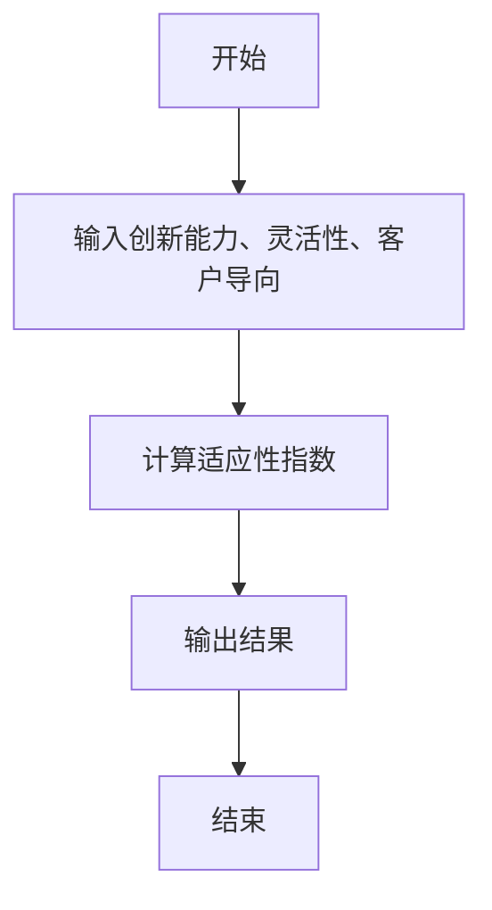
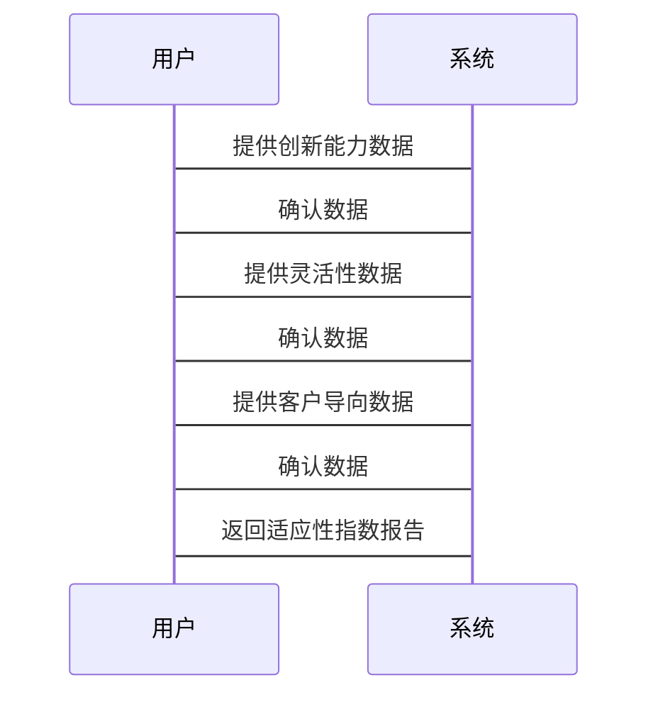

                 


# 彼得林奇的"行业领导者"在技术变革中的适应性

## 关键词：彼得林奇，行业领导者，技术变革，适应性，创新能力，灵活性，客户导向

## 摘要：  
本文探讨了彼得林奇的适应性理论在技术变革中的应用，重点分析了行业领导者如何通过创新能力、灵活性和客户导向适应快速变化的技术环境。通过数学模型、算法和实际案例的分析，深入剖析了适应性理论的核心要素及其在系统架构设计中的应用。

---

## 第一部分: 适应性理论的背景与核心概念

### 第1章: 适应性理论的背景

#### 1.1 行业领导者的定义
行业领导者是指在特定领域内具有显著市场地位和影响力的企业。这些企业在行业中占据领先地位，通常在技术创新、市场份额、品牌影响力等方面具有优势。

#### 1.2 技术变革的背景
技术变革是指技术进步和创新对企业运营方式、商业模式和行业格局产生深远影响的过程。随着科技的快速发展，技术变革对企业生存和发展的影响日益显著。

#### 1.3 彼得林奇的适应性理论
彼得林奇的适应性理论强调企业在面对技术变革时需要具备灵活的调整能力，以快速响应市场变化和技术进步。该理论认为，行业领导者应通过创新能力、灵活性和客户导向来适应技术变革。

---

### 第2章: 适应性理论的核心概念

#### 2.1 适应性理论的核心要素
适应性理论的核心要素包括创新能力、灵活性和客户导向。这些要素相互作用，共同帮助企业应对技术变革带来的挑战。

#### 2.2 核心要素的对比分析
以下是核心要素的对比表格：

| 要素       | 定义与特征                     | 关键作用                           |
|------------|--------------------------------|------------------------------------|
| 创新能力   | 企业的创新能力，包括技术创新和商业模式创新 | 提升企业核心竞争力，抓住技术变革机会 |
| 灵活性     | 企业在市场变化中的调整能力   | 快速响应技术变革，保持竞争优势     |
| 客户导向   | 以客户需求为导向的经营策略     | 提高客户满意度，增强客户粘性       |

#### 2.3 实体关系图
以下是适应性理论的核心要素的ER图：

```mermaid
erd
  title 适应性理论的核心要素
  entity 创新能力 {
    <--- 关系 创新能力 -> 灵活性
    <--- 关系 灵活性 -> 客户导向
    <--- 关系 创新能力 -> 客户导向
  }
```

---

### 第3章: 适应性理论的数学模型与算法

#### 3.1 适应性指数的计算
适应性指数是用来衡量企业适应能力的指标。公式如下：

$$
\text{适应性指数} = \frac{\text{创新能力} + \text{灵活性} + \text{客户导向}}{3}
$$

其中，创新能力、灵活性和客户导向的权重均为1。

#### 3.2 适应性指数的算法实现
以下是计算适应性指数的Python代码：

```python
def adaptability_index(innovation, flexibility, customer_orientation):
    return (innovation + flexibility + customer_orientation) / 3

# 示例数据
innovation = 80
flexibility = 75
customer_orientation = 85

index = adaptability_index(innovation, flexibility, customer_orientation)
print(f"适应性指数为：{index}")
```

#### 3.3 算法流程图
以下是适应性指数计算的流程图：



---

### 第4章: 适应性理论的系统架构设计

#### 4.1 系统架构概述
适应性系统的架构包括数据采集模块、数据分析模块和反馈模块。

#### 4.2 系统架构图
以下是系统架构图：


#### 4.3 系统接口设计
以下是系统的主要接口：

- 数据采集接口：用于采集企业创新能力、灵活性和客户导向的数据。
- 数据分析接口：用于计算适应性指数并生成报告。
- 反馈接口：用于将适应性指数反馈给企业，指导调整策略。

#### 4.4 交互流程图
以下是系统交互流程图：



---

### 第5章: 项目实战

#### 5.1 项目背景
某科技公司希望提升其在技术变革中的适应能力，选择彼得林奇的适应性理论作为指导。

#### 5.2 项目环境
- 操作系统：Linux
- 编程语言：Python
- 工具：Jupyter Notebook

#### 5.3 核心代码实现
以下是实现适应性指数计算的代码：

```python
def calculate_adaptability_index(innovation, flexibility, customer_orientation):
    return (innovation + flexibility + customer_orientation) / 3

# 示例计算
innovation_score = 85
flexibility_score = 78
customer_orientation_score = 82

index = calculate_adaptability_index(innovation_score, flexibility_score, customer_orientation_score)
print(f"适应性指数：{index}")
```

#### 5.4 案例分析
通过上述代码，我们可以计算出适应性指数为83.33。该指数表明该科技公司在技术变革中的适应能力较强，但仍需进一步提升灵活性。

---

## 第6章: 最佳实践与小结

### 6.1 最佳实践
- 制定适应性战略，明确创新方向。
- 建立灵活的组织结构，快速响应市场变化。
- 以客户为中心，提升客户满意度。

### 6.2 小结
彼得林奇的适应性理论为行业领导者在技术变革中的适应提供了有力指导。通过创新能力、灵活性和客户导向的综合提升，企业可以在技术变革中立于不败之地。

### 6.3 注意事项
- 适应性指数仅为参考指标，需结合实际情况进行调整。
- 在实际应用中，应注重数据的准确性和模型的适用性。

### 6.4 拓展阅读
- 彼得林奇的其他著作。
- 技术变革领域的最新研究。

---

## 结语
技术变革对企业的影响日益显著，彼得林奇的适应性理论为企业提供了重要的指导。通过本文的分析和实践，企业可以更好地应对技术变革，保持行业领先地位。

