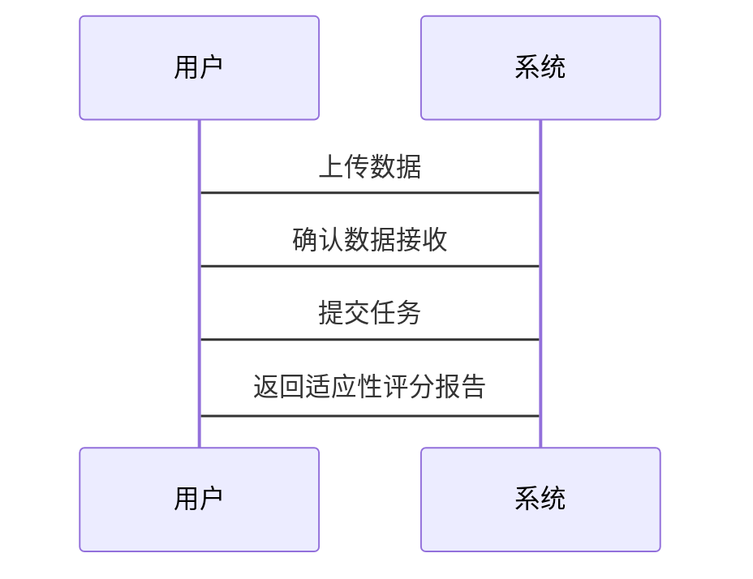

                 


# 彼得林奇的"行业领导者"在技术变革中的适应性评分模型

## 关键词：
- 彼得林奇
- 技术变革
- 行业领导者
- 适应性评分模型
- 企业评估
- 技术创新
- 市场响应

## 摘要：
本文详细探讨了彼得林奇提出的“行业领导者”在技术变革中的适应性评分模型。通过分析技术变革对企业的影响，提出了一种基于技术创新能力、市场响应速度和组织灵活性的评分体系。文章结合理论与实践，给出了模型的算法原理、系统架构设计及实际案例分析，帮助企业更好地评估和提升在技术变革中的适应能力。

---

# 第一章: 适应性评分模型的背景与核心概念

## 1.1 技术变革对企业的影响

### 1.1.1 技术变革的定义与分类
- 技术变革的定义
- 技术变革的分类：技术推动型、需求拉动型、竞争驱动型
- 技术变革对企业的影响：竞争优势、运营效率、市场响应

### 1.1.2 企业适应性的重要性
- 适应性在企业生存与发展中的作用
- 技术变革对企业领导者的挑战
- 适应性不足可能导致的后果

### 1.1.3 彼得林奇模型的提出背景
- 彼得林奇投资理论的核心思想
- 技术变革对企业领导者的启示
- 模型提出的初衷与目标

## 1.2 行业领导者适应性评分模型的定义

### 1.2.1 模型的核心概念
- 适应性评分模型的定义
- 模型的目标：评估企业领导者的适应能力
- 模型的适用范围：适用于技术驱动的行业

### 1.2.2 模型的评估标准
- 技术创新能力
- 市场响应速度
- 组织灵活性

### 1.2.3 模型的数学表达式
$$ \text{适应性评分} = w_1 \times T + w_2 \times M + w_3 \times O $$
其中：
- $T$ 表示技术创新能力
- $M$ 表示市场响应速度
- $O$ 表示组织灵活性
- $w_1, w_2, w_3$ 为各维度的权重，满足 $w_1 + w_2 + w_3 = 1$

## 1.3 模型的核心要素与关系

### 1.3.1 适应性评分的核心要素
- 技术创新能力：企业的研发能力、技术储备、创新文化
- 市场响应速度：企业对市场变化的感知能力、决策速度和执行效率
- 组织灵活性：组织结构的 agility、内部沟通效率、员工适应能力

### 1.3.2 要素之间的关系
- 技术创新与市场响应的相互作用
- 市场响应与组织灵活性的协同效应
- 组织灵活性对技术创新的支撑作用

### 1.3.3 模型的评估维度
- 技术创新能力：研发投入占比、专利数量、新产品推出频率
- 市场响应速度：市场反馈周期、客户满意度、市场份额变化
- 组织灵活性：组织结构调整频率、员工培训投入、文化适应性

---

# 第二章: 适应性评分模型的核心原理

## 2.1 模型的理论基础

### 2.1.1 技术变革周期理论
- 技术变革的生命周期：引入期、发展期、成熟期、衰退期
- 不同阶段对行业领导者的适应性要求
- 技术变革周期对企业战略的影响

### 2.1.2 企业适应性理论
- 企业适应性的定义：企业在面对外部变化时的调整和应对能力
- 适应性的三个维度：技术创新能力、市场响应速度、组织灵活性
- 适应性与企业绩效的关系

### 2.1.3 彼得林奇投资理论
- 彼得林奇的投资策略：选择具有持续竞争优势的企业
- 技术变革对企业竞争优势的影响
- 适应性评分模型在投资决策中的应用

## 2.2 模型的评分标准与权重分配

### 2.2.1 评分维度的确定
- 技术创新能力、市场响应速度、组织灵活性的确定依据
- 评分维度的选择标准：相关性、可衡量性、影响力

### 2.2.2 各维度的权重分配
- 权重分配的原则：基于行业特点和企业战略目标
- 技术创新能力的权重：取决于行业的技术密集程度
- 市场响应速度的权重：取决于市场的竞争程度
- 组织灵活性的权重：取决于企业的组织结构复杂度

### 2.2.3 权重分配的数学公式
$$ w_1 = \frac{\text{技术创新能力的重要性}}{\text{总重要性}} $$
$$ w_2 = \frac{\text{市场响应速度的重要性}}{\text{总重要性}} $$
$$ w_3 = \frac{\text{组织灵活性的重要性}}{\text{总重要性}} $$

## 2.3 模型的评估维度

### 2.3.1 技术创新能力
- 技术创新能力的评估指标：研发投入占比、专利数量、新产品推出频率
- 技术创新能力的评估方法：对比分析、趋势分析
- 技术创新能力的影响因素：研发投入、人才储备、创新文化

### 2.3.2 市场响应速度
- 市场响应速度的评估指标：市场反馈周期、客户满意度、市场份额变化
- 市场响应速度的评估方法：实时监测、客户调研
- 市场响应速度的影响因素：市场洞察力、决策效率、执行能力

### 2.3.3 组织灵活性
- 组织灵活性的评估指标：组织结构调整频率、员工培训投入、文化适应性
- 组织灵活性的评估方法：内部审计、员工满意度调查
- 组织灵活性的影响因素：组织结构、文化氛围、领导风格

---

# 第三章: 适应性评分模型的算法原理

## 3.1 数据收集与预处理

### 3.1.1 数据来源
- 数据来源：企业内部数据、行业报告、市场调研
- 数据类型：定量数据（市场份额、研发投入）与定性数据（文化适应性）

### 3.1.2 数据清洗
- 数据清洗的目标：去除重复数据、处理缺失值、纠正异常值
- 数据清洗的方法：使用Python的pandas库进行数据清洗

### 3.1.3 数据标准化
- 数据标准化的必要性：确保各维度数据的可比性
- 数据标准化的方法：归一化、标准化

## 3.2 特征提取与维度降维

### 3.2.1 特征选择
- 特征选择的目标：筛选出对适应性评分影响最大的特征
- 特征选择的方法：基于相关性分析、基于模型重要性

### 3.2.2 主成分分析
- 主成分分析（PCA）的基本原理
- PCA的应用：降低数据维度、提高计算效率

### 3.2.3 线性判别分析
- 线性判别分析（LDA）的基本原理
- LDA的应用：区分不同类别的数据

## 3.3 模型训练与评估

### 3.3.1 算法选择
- 算法选择的原则：基于数据特征和业务需求
- 常用算法：线性回归、决策树、随机森林

### 3.3.2 训练过程
- 训练过程的步骤：数据分割、模型训练、模型评估
- 训练过程中的注意事项：过拟合与欠拟合的平衡

### 3.3.3 模型评估
- 模型评估的指标：准确率、召回率、F1分数
- 模型评估的方法：交叉验证、ROC曲线

---

# 第四章: 适应性评分模型的系统架构设计

## 4.1 系统功能设计

### 4.1.1 数据输入模块
- 数据输入模块的功能：接收企业数据、行业报告等
- 数据输入的方式：文件上传、数据库连接

### 4.1.2 模型计算模块
- 模型计算模块的功能：数据预处理、特征提取、模型训练
- 模型计算模块的实现：基于Python的机器学习库（如Scikit-learn）

### 4.1.3 结果输出模块
- 结果输出模块的功能：生成适应性评分报告、可视化图表
- 结果输出的形式：PDF报告、仪表盘

## 4.2 系统架构图

### 4.2.1 系统架构设计


### 4.2.2 系统交互流程


## 4.3 系统接口设计

### 4.3.1 API接口定义
- API接口的功能：数据上传、模型调用、结果获取
- API接口的格式：RESTful API

### 4.3.2 接口调用流程
- 调用流程：发送请求、处理请求、返回响应
- 调用工具：Postman、curl

### 4.3.3 接口安全设计
- 接口安全措施：SSL加密、身份验证、访问控制
- 安全设计的目的：防止数据泄露、保证系统安全

---

# 第五章: 适应性评分模型的项目实战

## 5.1 环境安装与配置

### 5.1.1 开发环境搭建
- 开发环境的选择：Windows、MacOS、Linux
- 开发工具的安装：Python、Jupyter Notebook、VS Code

### 5.1.2 依赖库安装
- 依赖库的安装：使用pip安装numpy、pandas、scikit-learn
```bash
pip install numpy pandas scikit-learn
```

### 5.1.3 数据集准备
- 数据集的获取：通过市场调研、企业内部数据
- 数据格式：CSV、Excel、数据库

## 5.2 核心代码实现

### 5.2.1 数据预处理代码
```python
import pandas as pd
from sklearn.preprocessing import StandardScaler

# 读取数据
data = pd.read_csv('input.csv')

# 数据清洗
data.dropna(inplace=True)
data = data.drop_duplicates()

# 数据标准化
scaler = StandardScaler()
data_scaled = scaler.fit_transform(data)
```

### 5.2.2 模型训练代码
```python
from sklearn.ensemble import RandomForestRegressor
from sklearn.metrics import mean_squared_error

# 特征选择
features = data_scaled[:, :-1]
labels = data_scaled[:, -1]

# 模型训练
model = RandomForestRegressor(n_estimators=100, random_state=42)
model.fit(features, labels)

# 模型评估
预测值 = model.predict(features)
mse = mean_squared_error(预测值, labels)
print('均方误差:', mse)
```

### 5.2.3 结果输出代码
```python
import matplotlib.pyplot as plt

# 绘制适应性评分分布图
plt.hist(预测值, bins=10)
plt.xlabel('适应性评分')
plt.ylabel('频率')
plt.title('适应性评分分布图')
plt.show()
```

## 5.3 实际案例分析

### 5.3.1 案例背景
- 案例企业：某科技公司
- 案例行业：信息技术行业

### 5.3.2 数据分析
- 数据分析结果：技术创新能力得分为0.85，市场响应速度得分为0.75，组织灵活性得分为0.65
- 综合适应性评分：0.75

### 5.3.3 模型应用
- 模型应用的结果：适应性评分为中等水平
- 改进建议：加强组织灵活性建设，提升市场响应速度

## 5.4 项目小结

### 5.4.1 项目总结
- 项目完成情况：成功构建适应性评分模型
- 项目成果：提供了一套评估行业领导者适应能力的方法论

### 5.4.2 项目经验
- 项目经验：数据质量对模型准确性的影响
- 项目经验：模型调参对结果的重要作用

### 5.4.3 项目不足
- 项目不足：模型的泛化能力有待提升
- 项目不足：需要更多的行业数据支持

---

# 第六章: 最佳实践与小结

## 6.1 最佳实践 tips

### 6.1.1 数据收集
- 数据收集的建议：多来源、多维度
- 数据收集的工具：网络爬虫、API接口

### 6.1.2 模型调优
- 模型调优的技巧：网格搜索、交叉验证
- 模型调优的注意事项：避免过拟合

### 6.1.3 系统部署
- 系统部署的建议：云部署、微服务架构
- 系统部署的工具：Docker、Kubernetes

## 6.2 小结

### 6.2.1 模型的核心价值
- 模型的核心价值：帮助企业识别技术变革中的适应性问题
- 模型的核心价值：为企业的战略决策提供数据支持

### 6.2.2 模型的局限性
- 模型的局限性：适用于技术驱动的行业，其他行业的适用性有限
- 模型的局限性：依赖于高质量的数据输入

## 6.3 注意事项

### 6.3.1 模型的适用性
- 模型的适用性：行业领导者、技术创新型企业
- 模型的适用性：中短期技术变革预测

### 6.3.2 数据的敏感性
- 数据的敏感性：企业内部数据的保密性
- 数据的敏感性：数据使用的合规性

## 6.4 拓展阅读

### 6.4.1 相关书籍
- 《彼得林奇选股术》
- 《技术变革与企业战略》

### 6.4.2 相关论文
- "技术创新对企业适应性的影响"
- "技术变革中的领导力研究"

### 6.4.3 相关网站
- 官方文档：适应性评分模型
- 在线社区：技术变革与企业战略讨论

---

# 附录: 代码实现细节

## 附录A: 数据预处理代码
```python
import pandas as pd
from sklearn.preprocessing import StandardScaler

# 读取数据
data = pd.read_csv('input.csv')

# 数据清洗
data.dropna(inplace=True)
data = data.drop_duplicates()

# 数据标准化
scaler = StandardScaler()
data_scaled = scaler.fit_transform(data)
```

## 附录B: 模型训练代码
```python
from sklearn.ensemble import RandomForestRegressor
from sklearn.metrics import mean_squared_error

# 特征选择
features = data_scaled[:, :-1]
labels = data_scaled[:, -1]

# 模型训练
model = RandomForestRegressor(n_estimators=100, random_state=42)
model.fit(features, labels)

# 模型评估
预测值 = model.predict(features)
mse = mean_squared_error(预测值, labels)
print('均方误差:', mse)
```

## 附录C: 结果输出代码
```python
import matplotlib.pyplot as plt

# 绘制适应性评分分布图
plt.hist(预测值, bins=10)
plt.xlabel('适应性评分')
plt.ylabel('频率')
plt.title('适应性评分分布图')
plt.show()
```

---

# 结语

通过本文的详细讲解，读者可以全面了解彼得林奇的“行业领导者”在技术变革中的适应性评分模型。从模型的背景与核心概念，到算法原理与系统架构设计，再到实际项目实战，我们深入探讨了模型的构建与应用。希望本文能够为企业在技术变革中的适应性评估提供有价值的参考和指导。

