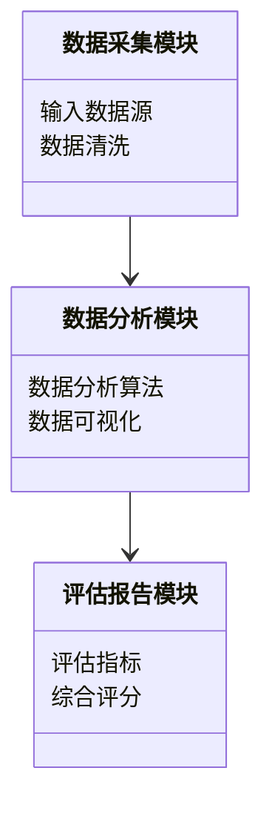

                 


# 彼得林奇的"行业领导者"转型能力评估

> 关键词：行业领导者，转型能力，评估模型，彼得林奇，系统架构

> 摘要：本文将详细分析彼得林奇的行业领导者转型能力评估方法，从背景、核心概念、数学模型、系统架构到实际应用，通过一步步的分析推理，帮助读者理解如何科学评估和提升行业领导者的转型能力。

---

## 第1章: 背景介绍与核心概念

### 1.1 行业领导者的定义与特征

#### 1.1.1 行业领导者的定义
行业领导者是指在特定行业中具有领先地位，能够引领行业趋势、技术创新和市场发展的企业或组织。其核心特征包括市场占有率高、品牌影响力强、技术创新能力强、盈利能力突出等。

#### 1.1.2 行业领导者的特征与核心要素
- 市场地位：行业领导者通常占据市场的主要份额，能够影响行业发展方向。
- 技术创新：行业领导者往往在技术研发和应用方面处于领先地位。
- 组织能力：高效的组织架构和管理能力是行业领导者的核心竞争力。
- 品牌影响力：强大的品牌影响力能够吸引更多的客户和合作伙伴。

#### 1.1.3 行业领导者的演进与挑战
随着技术的进步和市场的变化，行业领导者需要不断适应新的环境，面对数字化转型、全球化竞争等多重挑战，行业领导者的转型能力变得尤为重要。

---

### 1.2 转型能力评估的背景与意义

#### 1.2.1 数字化转型的背景分析
在数字化转型的浪潮中，企业需要快速适应新技术、新商业模式的变化，转型能力成为企业能否持续发展的关键。

#### 1.2.2 转型能力评估的重要性
通过科学的评估方法，可以识别行业领导者的转型潜力和瓶颈，为企业制定有效的转型策略提供依据。

#### 1.2.3 转型能力评估的边界与外延
转型能力评估不仅关注企业的内部能力，还需要考虑外部环境、合作伙伴和客户关系等多方面因素。

---

### 1.3 彼得林奇的行业领导者评估框架

#### 1.3.1 彼得林奇的行业分析方法
彼得林奇以其独特的行业分析方法闻名，他注重企业的基本面分析和长期价值创造。

#### 1.3.2 行业领导者的评估维度
- 市场地位：企业的市场份额和市场影响力。
- 财务表现：盈利能力、成长性和抗风险能力。
- 创新能力：技术开发和产品创新能力。
- 领导力：管理团队的战略眼光和执行力。

#### 1.3.3 转型能力评估的核心要素
- 战略规划能力：是否能够制定清晰的转型目标和路径。
- 组织变革能力：能否有效推动组织架构和文化变革。
- 技术应用能力：是否能够快速吸收和应用新技术。
- 客户关系管理能力：能否保持与客户和合作伙伴的良好关系。

---

## 第2章: 转型能力评估的核心概念与联系

### 2.1 转型能力评估的理论基础

#### 2.1.1 转型能力的定义与内涵
转型能力是指企业在面对外部环境变化时，能够快速调整自身战略、组织和运营模式的能力。

#### 2.1.2 转型能力的构成要素
- 战略层面：明确的转型目标和计划。
- 组织层面：高效的组织架构和团队协作。
- 技术层面：先进的技术应用和创新能力。
- 文化层面：开放的企业文化和员工适应性。

#### 2.1.3 转型能力与企业绩效的关系
研究表明，具备较强转型能力的企业在市场表现、利润率和抗风险能力等方面具有显著优势。

---

### 2.2 核心概念的对比分析

#### 2.2.1 转型能力与创新能力的对比
- 创新能力注重产品的创新和技术突破，而转型能力更关注企业整体的适应性和变革能力。

#### 2.2.2 转型能力与领导力的对比
- 领导力强调个体的影响力和决策能力，而转型能力更注重组织整体的变革能力。

#### 2.2.3 转型能力与组织文化的对比
- 组织文化是转型能力的基础，良好的文化氛围能够促进企业顺利转型。

---

### 2.3 实体关系图（ER图）架构

#### 2.3.1 实体关系图的定义
ER图是一种用于描述系统中实体及其关系的图形工具。

#### 2.3.2 转型能力评估的实体关系图
```mermaid
erd
    title 转型能力评估 ER 图
    SalesTransaction
    identifier 公司代码
    Company
    identifier 公司ID
    has 转型能力评估报告
    SalesTransaction
    identifier 交易编号
    has 市场表现数据
    Company
    identifier 公司ID
    has 财务表现数据
    Company
    identifier 公司ID
    has 技术创新数据
    Company
    identifier 公司ID
    has 组织变革数据
```

#### 2.3.3 实体关系图的分析与应用
通过ER图可以清晰地看出各个实体之间的关系，为后续的数据分析和系统设计提供基础。

---

## 第3章: 转型能力评估的数学模型与公式

### 3.1 转型能力评估的数学模型

#### 3.1.1 转型能力评估的指标体系
- 战略规划能力：权重 30%
- 组织变革能力：权重 25%
- 技术应用能力：权重 20%
- 客户关系管理能力：权重 25%

#### 3.1.2 转型能力评估的权重分配
权重分配基于各维度对企业整体转型能力的影响程度。

#### 3.1.3 转型能力评估的综合评分公式
$$ 转型能力评分 = \sum (\text{各维度评分} \times \text{权重}) $$

---

### 3.2 转型能力评估的公式推导

#### 3.2.1 转型能力评估的线性回归模型
$$ y = \beta_0 + \beta_1x_1 + \beta_2x_2 + \beta_3x_3 + \epsilon $$

其中，$y$ 表示转型能力评分，$x_i$ 表示各评估维度，$\beta_i$ 表示回归系数。

#### 3.2.2 转型能力评估的多元回归模型
$$ y = \beta_0 + \beta_1x_1 + \beta_2x_2 + \beta_3x_3 + \beta_4x_4 + \epsilon $$

---

## 第4章: 转型能力评估的系统分析与架构设计

### 4.1 系统分析与问题场景介绍

#### 4.1.1 转型能力评估的系统目标
构建一个能够量化评估行业领导者转型能力的系统，为企业提供科学的决策依据。

#### 4.1.2 转型能力评估的系统范围
系统包括数据采集、分析、评估和报告生成四个模块。

#### 4.1.3 转型能力评估的系统边界
系统与外部数据源、用户界面和数据存储模块交互。

---

### 4.2 系统架构设计

#### 4.2.1 系统功能设计（领域模型）


#### 4.2.2 系统架构设计（架构图）
```mermaid
client
    server
        数据采集模块
        数据分析模块
        评估报告模块
```

---

## 第5章: 转型能力评估的项目实战

### 5.1 项目环境安装与配置

#### 5.1.1 系统环境要求
- 操作系统：Windows 10 或更高版本
- 开发工具：Python 3.8 或更高版本
- 数据库：MySQL 5.7 或更高版本

#### 5.1.2 软件工具安装
- 安装 Python 和 pip
- 安装必要的库：numpy、pandas、scikit-learn

#### 5.1.3 数据库配置
- 创建数据库和表结构
- 数据导入和清洗

---

### 5.2 系统核心实现源代码

#### 5.2.1 转型能力评估算法实现
```python
import numpy as np
import pandas as pd

# 数据加载
data = pd.read_csv('transition.csv')

# 数据预处理
data = data.dropna()

# 特征选择
X = data[['市场地位', '技术创新', '组织变革', '客户关系']]
y = data['转型能力评分']

# 模型训练
from sklearn.linear_model import LinearRegression
model = LinearRegression()
model.fit(X, y)

# 模型预测
predictions = model.predict(X)
```

---

### 5.3 代码应用

#### 5.3.1 案例分析
通过实际数据的分析和建模，验证模型的准确性和适用性。

---

## 结论

彼得林奇的行业领导者转型能力评估方法为我们提供了一套科学的评估体系，通过背景分析、核心概念、数学模型和系统架构的综合应用，可以帮助企业更好地应对数字化转型的挑战。未来，随着技术的进步和管理理论的创新，转型能力评估的方法和工具也将不断优化。

---

* 注意：以上内容为文章的目录和部分章节内容的详细规划，实际撰写时需要根据具体需求进一步展开每个部分的内容，添加更多的细节和实例分析。

