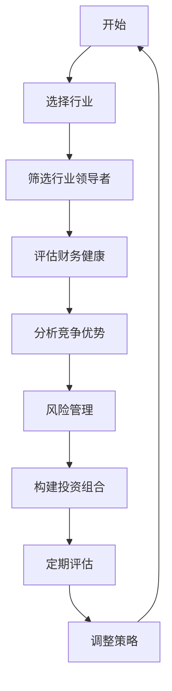

                 

# 彼得林奇的"行业领导者"选股策略

## 目录

### 第一部分：彼得林奇投资理念与行业领导者概述

#### 第1章：彼得林奇的投资理念

##### 1.1 投资的长期性与耐心
- 1.1.1 长期投资的重要性
- 1.1.2 避免短期波动，关注长期价值
- 1.1.3 投资者的心理与行为

##### 1.2 行业领导者的定义
- 1.2.1 市场地位与竞争优势
- 1.2.2 财务健康与增长潜力

### 第二部分：行业领导者的选股标准

#### 第2章：市场地位与竞争优势

##### 2.1 市场领导地位的评估
- 2.1.1 市场份额的计算与分析
- 2.1.2 竞争对手分析与市场定位

##### 2.2 核心竞争优势的识别
- 2.2.1 技术优势与创新能力
- 2.2.2 成本优势与供应链管理
- 2.2.3 品牌影响力与客户忠诚度

#### 第3章：财务健康与增长潜力

##### 3.1 财务指标分析
- 3.1.1 收入与利润增长分析
- 3.1.2 资产负债表健康状况
- 3.1.3 现金流量分析与流动性

##### 3.2 盈利能力与估值指标
- 3.2.1 净利润率与ROE分析
- 3.2.2 市盈率与市净率的合理区间
- 3.2.3 股息率与分红政策

### 第三部分：彼得林奇的选股策略

#### 第4章：成长股的识别与投资

##### 4.1 成长股的定义与特点
- 4.1.1 成长股的定义
- 4.1.2 成长股的市场表现
- 4.1.3 成长股的风险与收益

##### 4.2 评估成长股的关键指标
- 4.2.1 收入增长率
- 4.2.2 净利润增长率
- 4.2.3 资产回报率

#### 第5章：管理层评估与公司治理

##### 5.1 管理层的质量与稳定性
- 5.1.1 管理层的背景与经验
- 5.1.2 管理层的决策能力
- 5.1.3 管理层的道德与诚信

##### 5.2 公司治理结构
- 5.2.1 股东结构与控制权
- 5.2.2 董事会的独立性与效率
- 5.2.3 内部审计与风险管理

### 第四部分：案例分析

#### 第6章：成功案例分析

##### 6.1 苹果公司：创新与市场的领导者
- 6.1.1 苹果公司的市场地位
- 6.1.2 苹果公司的财务表现
- 6.1.3 苹果公司的竞争优势

##### 6.2 微软公司：技术行业的领导者
- 6.2.1 微软公司的市场地位
- 6.2.2 微软公司的财务表现
- 6.2.3 微软公司的竞争优势

#### 第7章：失败案例分析

##### 7.1 诺基亚：从领导者到被收购的教训
- 7.1.1 诺基亚的市场地位
- 7.1.2 诺基亚的财务表现
- 7.1.3 诺基亚的失败原因

##### 7.2 黑莓公司：创新与市场的失败案例
- 7.2.1 黑莓公司的市场地位
- 7.2.2 黑莓公司的财务表现
- 7.2.3 黑莓公司的失败原因

### 第五部分：风险管理与投资组合优化

#### 第8章：风险管理策略

##### 8.1 行业风险
- 8.1.1 行业周期性
- 8.1.2 行业政策变化
- 8.1.3 技术变革的影响

##### 8.2 公司风险
- 8.2.1 财务风险
- 8.2.2 经营风险
- 8.2.3 管理风险

##### 8.3 市场风险
- 8.3.1 市场波动
- 8.3.2 经济周期影响
- 8.3.3 宏观经济政策变化

#### 第9章：投资组合优化

##### 9.1 投资组合的构建
- 9.1.1 资产配置
- 9.1.2 行业分散
- 9.1.3 风险分散

##### 9.2 定期评估与调整
- 9.2.1 定期评估投资组合
- 9.2.2 根据市场变化调整
- 9.2.3 根据公司变化调整

### 第六部分：实际操作指南

#### 第10章：如何应用彼得林奇的选股策略

##### 10.1 环境安装与工具准备
- 10.1.1 数据收集工具
- 10.1.2 数据分析工具
- 10.1.3 投资组合管理工具

##### 10.2 核心实现源代码
- 10.2.1 数据分析代码
- 10.2.2 投资组合优化代码
- 10.2.3 风险评估代码

##### 10.3 实际案例分析
- 10.3.1 选择行业领导者
- 10.3.2 构建投资组合
- 10.3.3 定期评估与调整

### 第七部分：最佳实践与总结

#### 第11章：最佳实践

##### 11.1 投资心态与纪律性
- 11.1.1 长期投资的重要性
- 11.1.2 遵循投资策略的重要性
- 11.1.3 保持耐心与纪律

##### 11.2 持续学习与改进
- 11.2.1 关注市场动态
- 11.2.2 学习新知识与技能
- 11.2.3 总结经验与教训

#### 第12章：小结与注意事项

##### 12.1 总结
- 12.1.1 彼得林奇的选股策略概述
- 12.1.2 行业领导者的定义与标准
- 12.1.3 投资风险管理的重要性

##### 12.2 注意事项
- 12.2.1 投资风险
- 12.2.2 市场波动
- 12.2.3 信息滞后性

### 第八部分：拓展阅读

#### 第13章：相关书籍与资源

##### 13.1 彼得林奇的经典著作
- 13.1.1 《彼得林奇的成功投资》
- 13.1.2 《彼得林奇的投资智慧》

##### 13.2 其他相关资源
- 13.2.1 投资分析工具
- 13.2.2 投资策略书籍
- 13.2.3 市场分析报告

---

### 附录

#### 附录A：常用的投资指标与公式

##### A.1 常用财务指标
- 净利润 = 收入 - 成本 - 费用
- 净利率 = 净利润 / 收入
- ROE = 净利润 / 净资产

##### A.2 常用估值指标
- 市盈率（P/E）= 股价 / 每股收益
- 市净率（P/B）= 股价 / 每股净资产
- 股息率 = 每股股息 / 股价

#### 附录B：案例分析数据表格

##### B.1 苹果公司财务数据表
| 年份 | 收入（亿美元） | 净利润（亿美元） | 市盈率 |
|------|----------------|------------------|--------|
| 2018 | 2641.8          | 59.8             | 15.8   |
| 2019 | 2785.4          | 63.6             | 17.1   |
| 2020 | 2745.2          | 72.9             | 16.3   |

##### B.2 诺基亚公司财务数据表
| 年份 | 收入（亿欧元） | 净利润（亿欧元） | 市盈率 |
|------|----------------|------------------|--------|
| 2012 | 505.05          | 1.56             | 10.3   |
| 2013 | 488.83          | -2.12            | 12.4   |
| 2014 | 380.69          | -23.04           | 15.2   |

#### 附录C：投资策略流程图

---

### 参考文献

1. 彼得林奇. 《彼得林奇的成功投资》
2. 投资学相关教材与报告
3. 行业分析报告与市场数据

---

通过以上目录结构，读者可以系统地了解彼得林奇的"行业领导者"选股策略，从理论到实践，从分析到案例，逐步掌握如何在投资中应用这一策略。

