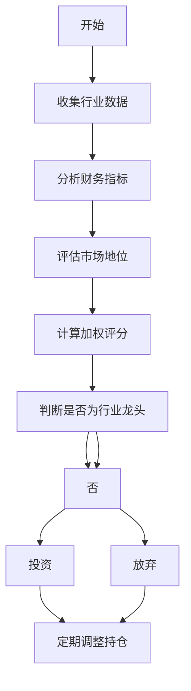
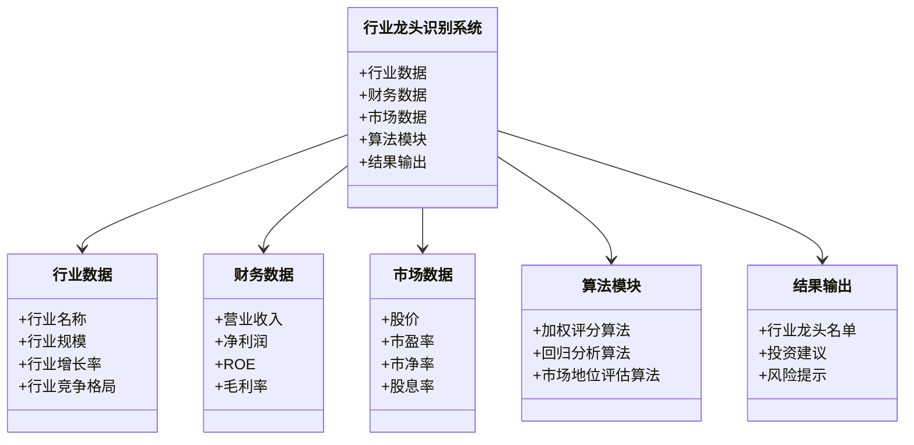
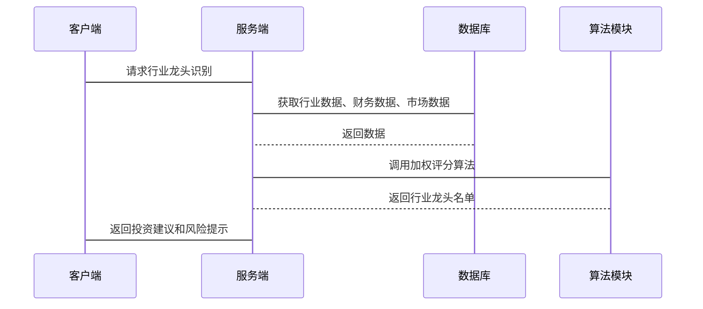

                 


# 彼得林奇的"行业龙头"识别方法

> 关键词：彼得林奇，投资策略，行业龙头，财务分析，选股模型，风险管理，投资组合

> 摘要：本文深入探讨了彼得·林奇的行业龙头识别方法，从投资理念、识别标准、选股策略到实际应用案例，结合技术分析和数学模型，为投资者提供系统化的行业龙头识别框架和实战指导。

---

## 第一部分: 彼得·林奇投资理念与行业龙头的定义

### 第1章: 彼得·林奇投资理念与行业龙头的定义

#### 1.1 彼得·林奇投资理念的核心思想

##### 1.1.1 彼得·林奇的生平与投资成就
彼得·林奇（Peter Lynch）是美国著名的共同基金经理，以其卓越的投资业绩闻名。他在任职麦哲伦基金期间，创造了年均29%的复合回报率，远超市场平均水平。林奇的成功不仅在于其投资技巧，还在于他对市场的深刻理解以及对行业龙头企业的敏锐洞察。

##### 1.1.2 林奇的投资哲学与方法论
林奇的投资哲学强调长期持有优质企业股票，通过深入分析企业的财务状况、行业地位和竞争优势，寻找那些能够在行业中长期表现优异的企业。他认为，投资成功的秘诀在于选择那些“脚能踩到”的公司，即那些投资者可以通过研究和理解的公司。

##### 1.1.3 什么是行业龙头：定义与特征
行业龙头是指在特定行业中占据领先地位，具有强大的市场影响力、较高的市场份额和持续盈利能力的企业。行业龙头通常具有以下特征：
- **市场地位**：在行业中占据领先地位，具有较高的品牌知名度和市场影响力。
- **财务表现**：盈利能力强，财务状况健康，具有持续增长的潜力。
- **竞争优势**：具备独特的竞争优势，如技术优势、成本优势或商业模式创新。

#### 1.2 行业龙头的识别标准

##### 1.2.1 市场地位与竞争优势
- 市场地位：企业的市场份额、行业排名以及市场影响力。
- 竞争优势：企业的核心竞争力，如技术壁垒、成本优势、品牌影响力等。

##### 1.2.2 财务表现与盈利能力
- 财务指标：如净利润率、ROE（净资产收益率）、毛利率等。
- 财务健康度：企业的资产负债表健康，现金流充足。

##### 1.2.3 行业周期与成长潜力
- 行业周期：行业的生命周期阶段（如成长期、成熟期、衰退期）。
- 成长潜力：企业的未来增长空间和行业发展趋势。

---

## 第二部分: 行业龙头的识别方法与框架

### 第2章: 林奇的行业分析方法

#### 2.1 林奇的行业分析方法

##### 2.1.1 行业分析的步骤与流程
1. **行业背景分析**：了解行业的基本状况、市场规模、增长潜力和竞争格局。
2. **行业生命周期分析**：判断行业所处的生命周期阶段（成长期、成熟期、衰退期）。
3. **行业龙头筛选**：根据市场地位、财务表现和竞争优势，筛选出行业龙头候选企业。

##### 2.1.2 行业生命周期与投资机会
- **成长期行业**：市场规模快速扩大，企业盈利能力强。
- **成熟期行业**：市场规模稳定，企业竞争激烈，龙头企业的优势更加明显。
- **衰退期行业**：市场规模缩小，企业盈利能力下降，龙头企业的竞争优势可能减弱。

##### 2.1.3 行业龙头的筛选标准
- 市场地位：行业排名靠前，市场份额较高。
- 财务表现：盈利能力强，财务状况健康。
- 竞争优势：具备独特的竞争优势，能够在行业中持续发展。

#### 2.2 公司基本面分析

##### 2.2.1 财务报表分析的核心指标
- **收入与利润**：营业收入、净利润。
- **盈利能力**：净利率、ROE（净资产收益率）。
- **财务健康度**：资产负债率、现金流情况。

##### 2.2.2 资产负债表与利润表的关键数据
- 资产负债表：资产总额、负债总额、股东权益。
- 利润表：营业收入、净利润、毛利率。

##### 2.2.3 现金流量表与企业现金流健康度
- 现金流量表：经营活动现金流、投资活动现金流、筹资活动现金流。
- 现金流健康度：企业是否具备稳定的现金流来源。

### 第3章: 林奇的选股策略与投资组合管理

#### 3.1 林奇的选股模型

##### 3.1.1 选股模型的核心要素
- 市盈率（P/E）：市盈率越低，可能意味着投资价值越高。
- 市净率（P/B）：市净率越低，可能意味着企业估值越合理。
- 股息率：股息率高，可能意味着企业盈利稳定，愿意回馈股东。

##### 3.1.2 市盈率与成长性的回归分析
- 市盈率（P/E）：企业的股价与每股净利润的比率。
- 成长性：企业的收入和利润增长潜力。
- 回归分析：通过统计方法，分析市盈率与成长性之间的关系。

##### 3.1.3 股息率与成长性的平衡
- 股息率：企业的股息支付率与股价的比率。
- 成长性：企业的收入和利润增长潜力。
- 平衡：在股息率和成长性之间找到平衡点，选择那些既有稳定的股息收入，又有较高的成长潜力的企业。

#### 3.2 投资组合管理与风险控制

##### 3.2.1 投资组合的构建原则
- 分散投资：避免过度集中于某一只股票或行业。
- 长期持有：长期持有优质企业股票，避免频繁交易。
- 定期调整：定期审视投资组合，根据市场变化和企业基本面调整持仓。

##### 3.2.2 风险管理与止损策略
- 风险管理：设定止损点，避免单次投资的亏损超过可承受范围。
- 止损策略：当股价下跌至一定幅度时，立即止损。

##### 3.2.3 行业龙头投资的长期与短期策略
- 长期策略：长期持有行业龙头股票，享受企业成长带来的股价上涨。
- 短期策略：根据市场波动，进行短期买卖操作，获取超额收益。

### 第4章: 林奇方法的实际应用与案例分析

#### 4.1 行业龙头案例分析

##### 4.1.1 美国运通的案例研究
- 美国运通（American Express）是一家全球性的信用卡公司，具有强大的市场地位和竞争优势。
- 财务表现：净利润率稳定，ROE较高。
- 投资价值：市盈率合理，股息率较高。

##### 4.1.2 沃尔玛的案例研究
- 沃尔玛（Walmart）是全球最大的零售企业之一，具有强大的市场地位和竞争优势。
- 财务表现：净利润率稳定，现金流充裕。
- 投资价值：市净率较低，股息率较高。

##### 4.1.3 苹果的案例研究
- 苹果（Apple）是全球最具创新力的科技公司之一，具有强大的市场地位和竞争优势。
- 财务表现：净利润率高，ROE较高。
- 投资价值：市盈率合理，股息率较高。

#### 4.2 林奇方法在不同行业的应用

##### 4.2.1 高科技行业的龙头识别
- 高科技行业：如苹果、微软、谷歌等。
- 识别标准：技术创新能力强，市场地位高，财务表现优异。

##### 4.2.2 消费品行业的龙头识别
- 消费品行业：如可口可乐、宝洁、联合利华等。
- 识别标准：品牌影响力大，市场份额高，财务表现稳定。

##### 4.2.3 金融行业的龙头识别
- 金融行业：如摩根大通、花旗银行、富国银行等。
- 识别标准：资本实力强，风险管理能力高，财务表现稳定。

### 第5章: 林奇方法的数学模型与算法原理

#### 5.1 行业龙头识别的数学模型

##### 5.1.1 财务指标的加权评分模型
- 指标权重：根据不同的行业和市场环境，赋予不同的财务指标不同的权重。
- 评分计算：根据每个财务指标的表现，进行评分，并根据权重计算综合得分。

##### 5.1.2 市盈率与成长性的回归分析
- 回归分析：通过统计方法，分析市盈率与成长性之间的关系。
- 模型建立：建立市盈率与成长性的回归模型，预测企业的投资价值。

##### 5.1.3 市场地位与竞争优势的量化评估
- 市场地位：市场份额、行业排名等。
- 竞争优势：技术壁垒、成本优势等。
- 量化评估：根据市场地位和竞争优势，进行量化评估，选择行业龙头。

#### 5.2 算法原理与流程图

##### 5.2.1 算法流程图（Mermaid）


##### 5.2.2 算法实现（Python代码示例）
```python
import pandas as pd
import numpy as np

# 示例数据：行业龙头筛选
data = {
    '公司名称': ['公司A', '公司B', '公司C', '公司D'],
    '市盈率': [15, 20, 25, 18],
    'ROE': [15, 20, 18, 22],
    '市场份额': [30, 25, 20, 25],
    '股息率': [2, 3, 1.5, 2.5]
}

df = pd.DataFrame(data)

# 筛选标准：市盈率 < 20，ROE > 18，市场份额 > 20，股息率 > 2
selected = df[(df['市盈率'] < 20) & (df['ROE'] > 18) & (df['市场份额'] > 20) & (df['股息率'] > 2)]

print(selected)
```

##### 5.2.3 算法原理的数学模型
- 财务指标加权评分模型：
  $$
  综合得分 = \sum_{i=1}^{n} (w_i \times score_i)
  $$
  其中，$w_i$ 是第i个指标的权重，$score_i$ 是第i个指标的评分。

- 市盈率与成长性的回归模型：
  $$
  \text{市盈率} = a \times \text{成长性} + b
  $$
  其中，$a$ 是回归系数，$b$ 是截距。

---

## 第三部分: 林奇方法的系统分析与架构设计方案

### 第6章: 林奇方法的系统分析与架构设计方案

#### 6.1 问题场景介绍
- 投资者需要通过行业分析和企业基本面分析，筛选出行业龙头股票，构建投资组合。

#### 6.2 系统功能设计（领域模型）

##### 6.2.1 领域模型（Mermaid 类图）


#### 6.3 系统架构设计（Mermaid 架构图）


#### 6.4 系统接口设计

##### 6.4.1 接口1：数据接口
- 输入：行业数据、财务数据、市场数据。
- 输出：数据清洗和预处理后的数据。

##### 6.4.2 接口2：算法接口
- 输入：预处理后的数据。
- 输出：行业龙头名单。

##### 6.4.3 接口3：结果接口
- 输入：行业龙头名单。
- 输出：投资建议和风险提示。

#### 6.5 系统交互（Mermaid 序列图）



---

## 第四部分: 项目实战

### 第7章: 项目实战与经验总结

#### 7.1 环境安装

##### 7.1.1 安装Python和Pandas库
```bash
pip install pandas
```

#### 7.2 系统核心实现源代码

##### 7.2.1 数据预处理
```python
import pandas as pd

# 读取数据
df = pd.read_csv('industry_data.csv')

# 数据清洗
df.dropna(inplace=True)
df = df.drop_duplicates()
```

##### 7.2.2 行业龙头筛选
```python
# 筛选标准：市盈率 < 20，ROE > 18，市场份额 > 20，股息率 > 2
selected = df[(df['市盈率'] < 20) & (df['ROE'] > 18) & (df['市场份额'] > 20) & (df['股息率'] > 2)]

# 输出结果
print(selected)
```

##### 7.2.3 投资组合管理
```python
import pandas as pd
import numpy as np

# 示例数据：投资组合管理
data = {
    '公司名称': ['公司A', '公司B', '公司C', '公司D'],
    '持股数量': [100, 200, 150, 50],
    '股价': [50, 30, 40, 20],
    '市值': [5000, 6000, 6000, 1000]
}

df = pd.DataFrame(data)

# 计算总市值
total_market_value = df['市值'].sum()

# 计算权重
df['权重'] = df['市值'] / total_market_value

# 输出结果
print(df)
```

#### 7.3 代码应用解读与分析

##### 7.3.1 数据预处理
- 数据清洗：删除缺失值和重复值。
- 数据转换：对数据进行标准化或归一化处理。

##### 7.3.2 行业龙头筛选
- 根据筛选标准，从数据中筛选出符合条件的行业龙头。
- 筛选标准：市盈率 < 20，ROE > 18，市场份额 > 20，股息率 > 2。

##### 7.3.3 投资组合管理
- 计算投资组合的总市值和各股票的权重。
- 根据权重调整持仓，确保投资组合的风险可控。

#### 7.4 实际案例分析与详细解读

##### 7.4.1 案例分析：假设我们有一个包含4只股票的投资组合，具体数据如下：
- 公司A：持股数量100，股价50，市值5000。
- 公司B：持股数量200，股价30，市值6000。
- 公司C：持股数量150，股价40，市值6000。
- 公司D：持股数量50，股价20，市值1000。

##### 7.4.2 投资组合计算
- 总市值 = 5000 + 6000 + 6000 + 1000 = 18000。
- 公司A的权重 = 5000 / 18000 ≈ 27.78%。
- 公司B的权重 = 6000 / 18000 ≈ 33.33%。
- 公司C的权重 = 6000 / 18000 ≈ 33.33%。
- 公司D的权重 = 1000 / 18000 ≈ 5.56%。

##### 7.4.3 投资组合分析
- 从权重分布来看，公司B和公司C占据了较大的权重，说明这两家公司在投资组合中占据了重要地位。
- 公司D的权重较低，说明其在投资组合中的风险较小，但潜在回报也较低。

#### 7.5 项目小结

##### 7.5.1 小结
- 通过林奇的行业龙头识别方法，我们可以筛选出具有强大市场地位和竞争优势的企业。
- 结合投资组合管理，我们可以有效控制风险，实现长期稳定的收益。

##### 7.5.2 投资组合优化建议
- 定期审视投资组合，根据市场变化和企业基本面调整持仓。
- 保持投资组合的分散性，避免过度集中于某一只股票或行业。

##### 7.5.3 风险提示
- 市场风险：市场波动可能对投资组合造成影响。
- 企业风险：企业经营状况的变化可能影响股价。
- 利率风险：利率变化可能影响股票估值。

---

## 第五部分: 最佳实践与总结

### 第8章: 最佳实践与总结

#### 8.1 最佳实践

##### 8.1.1 小结
- 彼得·林奇的行业龙头识别方法是一种系统化、科学化的投资方法。
- 通过行业分析和企业基本面分析，我们可以筛选出具有强大市场地位和竞争优势的企业。

##### 8.1.2 注意事项
- 投资有风险，入市需谨慎。
- 投资者应根据自身的风险承受能力和投资目标，选择合适的投资策略。
- 定期审视投资组合，根据市场变化和企业基本面调整持仓。

##### 8.1.3 拓展阅读
- 《彼得·林奇的投资哲学》
- 《价值投资：如何通过基本面分析选择优质企业》
- 《投资组合管理：理论与实践》

#### 8.2 总结
- 彼得·林奇的行业龙头识别方法为我们提供了一种系统化、科学化的投资方法。
- 通过行业分析和企业基本面分析，我们可以筛选出具有强大市场地位和竞争优势的企业。
- 投资者应根据自身的风险承受能力和投资目标，选择合适的投资策略，并定期审视投资组合，根据市场变化和企业基本面调整持仓。

---

# 结语
通过本文的详细讲解，我们深入探讨了彼得·林奇的行业龙头识别方法，从投资理念、识别标准、选股策略到实际应用案例，结合技术分析和数学模型，为投资者提供系统化的行业龙头识别框架和实战指导。希望本文能为投资者在选择行业龙头股票时提供有价值的参考和启发。

