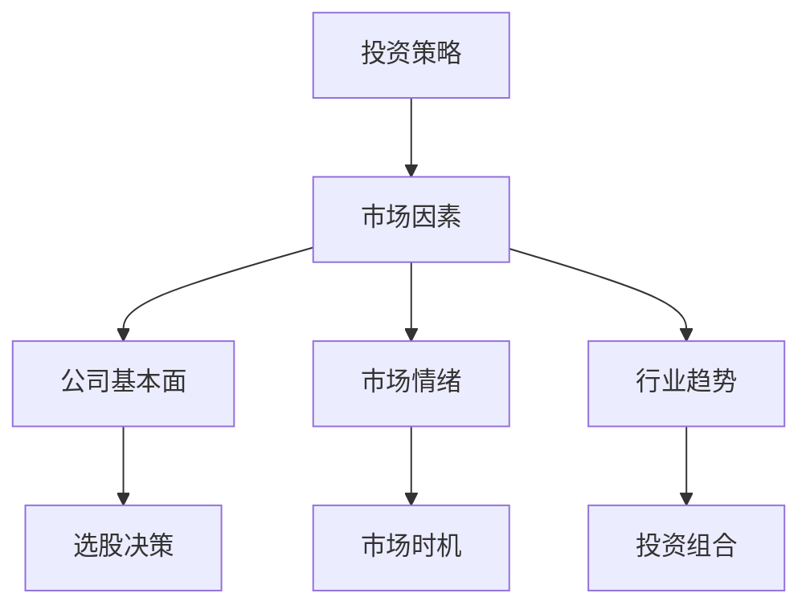
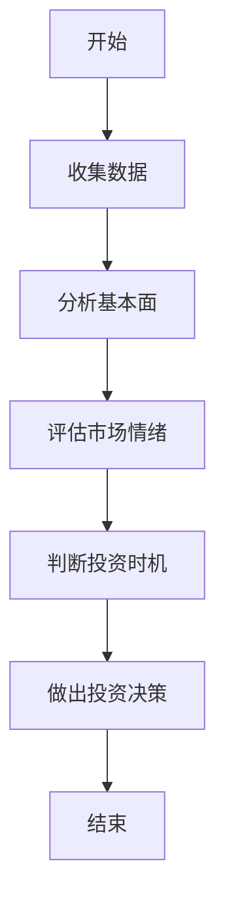

                 


# 彼得林奇的"街头智慧"在投资中的运用

## 关键词
- 彼得林奇
- 投资策略
- 街头智慧
- 投资分析
- 价值投资

## 摘要
本文深入探讨了彼得·林奇的“街头智慧”在投资中的应用。通过分析他的投资哲学、核心概念、算法原理、数学模型、系统架构设计和实战案例，本文为读者提供了全面的视角，帮助他们在投资决策中更好地应用这些智慧。文章结合理论与实践，辅以详细的Mermaid图表和Python代码示例，详细解读了如何利用基本面分析、市场情绪和风险管理来优化投资策略。

---

## 第1章：彼得林奇及其投资哲学

### 1.1 彼得林奇的背景与成就

#### 1.1.1 彼得林奇的生平简介
彼得·林奇（Peter Lynch）是美国著名的投资专家，被誉为“股神”之一。他在富达投资集团（Fidelity）管理麦哲伦基金期间，取得了令人瞩目的成绩，使该基金在13年内实现了年均29%的回报率。林奇的投资风格以基本面分析和长期价值投资闻名。

#### 1.1.2 他的投资哲学与风格
林奇的投资哲学的核心是“购买并持有”，他主张投资于自己理解的公司，并长期持有。他认为，市场短期波动不可预测，但长期趋势可以通过分析公司基本面来把握。他的“街头智慧”来源于他对市场的深刻理解和对投资者心理的洞察。

---

### 1.2 "街头智慧"的定义与特点

#### 1.2.1 街头智慧的来源
“街头智慧”是指那些在实际投资中总结出的经验和策略，通常来源于对市场、公司和投资者行为的观察。与学术化的投资理论不同，街头智慧更加注重实践和直觉。

#### 1.2.2 街头智慧与传统投资理论的对比
传统投资理论（如有效市场假说）认为市场是理性的，价格反映了所有信息。而街头智慧则更注重市场的非理性部分，强调情绪、心理和市场行为在投资中的作用。

| 对比维度       | 传统投资理论               | 街头智慧                   |
|----------------|--------------------------|--------------------------|
| 核心假设       | 市场是理性的               | 市场存在非理性             |
| 分析方法       | 侧重于数学模型和公式       | 侧重于经验观察和直觉       |
| 投资策略       | 追求超额收益               | 更注重风险管理             |

---

### 1.3 街头智慧在投资中的应用领域

#### 1.3.1 选股策略
- 侧重于公司基本面分析，如市盈率（P/E）、市净率（P/B）等。
- 寻找那些被市场低估的公司。

#### 1.3.2 市场分析
- 观察市场情绪，避免在市场高估时投资。
- 通过分析投资者行为预测市场趋势。

#### 1.3.3 风险管理
- 采用分散投资策略，降低风险。
- 定期评估投资组合，及时调整。

---

## 第2章：街头智慧的核心概念与联系

### 2.1 街头智慧的核心要素

#### 2.1.1 基本面分析
基本面分析是街头智慧的核心，包括对公司财务状况、行业地位和管理团队的分析。林奇认为，只有通过基本面分析才能找到真正具有投资价值的公司。

#### 2.1.2 市场情绪分析
市场情绪分析是通过观察投资者行为和市场趋势来判断市场的非理性部分。林奇强调，市场情绪往往会导致价格偏离基本面。

#### 2.1.3 价值投资
价值投资是街头智慧的重要组成部分，强调以低于内在价值的价格买入优质资产。

---

### 2.2 核心概念对比表格

表2-1：街头智慧与其他投资策略的对比

| 比较维度       | 价值投资               | 股票投资               | 技术分析               |
|----------------|-----------------------|-----------------------|-----------------------|
| 核心理念       | 寻找被低估的股票       | 通过技术指标预测价格走势 |
| 分析方法       | 基本面分析             | 价格趋势和成交量分析   |
| 投资策略       | 长期持有               | 短期交易               |

---

### 2.3 ER实体关系图

图2-1：投资策略与市场因素的实体关系图



---

## 第3章：算法原理与流程图

### 3.1 街头智慧投资模型的算法流程

图3-1：投资决策流程图



### 3.2 算法实现代码

代码3-1：Python实现的市场情绪分析代码

```python
import pandas as pd
import numpy as np

def calculate_sentiment(tweets):
    positive_tweets = sum(1 for tweet in tweets if 'bullish' in tweet)
    negative_tweets = sum(1 for tweet in tweets if 'bearish' in tweet)
    total_tweets = len(tweets)
    sentiment = (positive_tweets - negative_tweets) / total_tweets
    return sentiment

tweets = [
    "Bullish on tech stocks",
    "Bearish on oil prices",
    "Neutral",
    "Bullish on gold"
]
sentiment = calculate_sentiment(tweets)
print(f"Market sentiment: {sentiment}")
```

---

## 第4章：数学模型与公式

### 4.1 基本面分析的数学模型

公式4-1：市盈率计算公式

$$ P/E = \frac{\text{股价}}{\text{每股收益}} $$

### 4.2 投资组合优化的数学模型

公式4-2：夏普比率计算公式

$$ \text{夏普比率} = \frac{E[R_p] - R_f}{\sigma_p} $$

其中，\( E[R_p] \) 是投资组合的期望回报率，\( R_f \) 是无风险利率，\( \sigma_p \) 是投资组合的收益标准差。

---

## 第5章：系统分析与架构设计方案

### 5.1 问题场景介绍

为了应用彼得林奇的街头智慧，我们构建一个投资管理系统，帮助投资者进行基本面分析、市场情绪分析和投资决策。

### 5.2 系统功能设计

#### 5.2.1 领域模型（Mermaid类图）


### 5.3 系统架构设计（Mermaid架构图）


---

## 第6章：项目实战

### 6.1 环境安装

- 安装Python和相关库（如pandas、numpy、matplotlib）
- 安装Jupyter Notebook

### 6.2 核心实现源代码

代码6-1：基本面分析代码

```python
import pandas as pd

# 模拟数据
data = {
    '股票代码': ['AAPL', 'MSFT', 'GOOGL'],
    '公司名称': ['苹果', '微软', '谷歌'],
    '市盈率': [15, 18, 25],
    '市净率': [3, 4, 5]
}
df = pd.DataFrame(data)
print(df)
```

---

## 第7章：最佳实践与小结

### 7.1 小结

彼得林奇的“街头智慧”为我们提供了独特的投资视角，强调基本面分析和市场情绪的重要性。通过结合理论与实践，我们可以更好地应用这些智慧，制定更有效的投资策略。

### 7.2 注意事项

- 投资有风险，需谨慎。
- 定期评估和调整投资组合。
- 学习市场动态，保持对经济环境的敏感性。

### 7.3 拓展阅读

- 《彼得·林奇的投资智慧》
- 《价值投资入门》

---

通过本文的详细分析和实战案例，我们希望读者能够更好地理解并应用彼得林奇的“街头智慧”，在投资领域取得更好的成绩。

