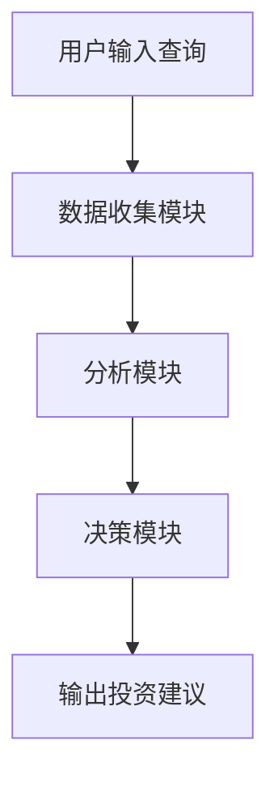

                 


# 彼得林奇的"街头智慧"在新兴市场的应用

> **关键词**: 彼得林奇，街头智慧，新兴市场，投资策略，风险管理

> **摘要**: 本文探讨了彼得林奇的“街头智慧”投资理念在新兴市场的应用。通过分析其核心概念、算法原理和系统架构，结合实际案例，展示了如何将这些策略转化为有效的投资方法。文章还提出了优化建议和最佳实践，为投资者提供了实用的指导。

---

## 第1章: 彼得林奇的"街头智慧"概述

### 1.1 彼得林奇的背景与投资理念

彼得·林奇是全球著名的职业基金经理，以其在富达麦哲伦基金的卓越表现而闻名。他的“街头智慧”投资理念强调深入研究公司基本面，关注市场情绪，并利用市场波动寻找投资机会。这种策略基于以下核心思想：

- **价值投资**：寻找被市场低估的公司。
- **深入研究**：通过分析财务报表和管理层决策，评估公司的潜在价值。
- **逆向思维**：在市场恐慌时寻找机会，在市场狂热时保持警惕。

### 1.2 街头智慧在新兴市场的应用背景

新兴市场通常具有高增长潜力，但也伴随着更高的风险和不确定性。彼得林奇的策略在新兴市场的应用需要考虑以下因素：

- **市场波动性**：新兴市场波动较大，情绪驱动更强。
- **信息不对称**：公司治理和信息披露可能不如成熟市场透明。
- **行业特点**：新兴市场的优势行业可能与成熟市场不同。

---

## 第2章: 街头智慧的核心概念与新兴市场的结合

### 2.1 街头智慧的核心要素

1. **市场情绪分析**：通过观察市场参与者的心理和行为，识别市场的过度反应。
2. **公司基本面分析**：深入研究公司的财务状况、盈利能力和发展潜力。
3. **投资组合管理**：根据市场变化动态调整投资组合，分散风险。

### 2.2 新兴市场中的独特挑战

1. **高波动性**：新兴市场的股价波动较大，容易受外部因素影响。
2. **信息不透明**：部分公司可能隐瞒负面信息，增加投资风险。
3. **政策风险**：新兴市场可能面临政策变化和监管不确定性。

### 2.3 街头智慧在新兴市场的优化策略

1. **关注行业龙头**：选择在新兴市场中具有竞争优势的行业领导者。
2. **分散投资**：避免集中投资于单一行业或公司，降低风险。
3. **长期视角**：新兴市场的增长潜力通常需要较长时间才能体现。

---

## 第3章: 街头智慧的数学模型与算法原理

### 3.1 市场情绪指数模型

市场情绪指数（Market Sentiment Index, MSI）用于衡量市场的乐观或悲观程度，公式如下：

$$ MSI = \frac{\text{上涨股票数量} - \text{下跌股票数量}}{\text{总股票数量}} $$

当MSI > 0时，市场情绪乐观；当MSI < 0时，市场情绪悲观。

### 3.2 公司基本面评估模型

彼得林奇强调对公司基本面的深入分析，常用以下指标：

1. **市盈率（P/E）**：用于评估股票的相对价值。
2. **ROE（净资产收益率）**：衡量公司的盈利能力。
3. **债务与 equity ratio**：评估公司的财务杠杆风险。

---

## 第4章: 系统架构与实现

### 4.1 投资决策支持系统的架构设计

- **数据收集模块**：收集市场数据、公司财报等。
- **分析模块**：应用市场情绪指数和基本面评估模型进行分析。
- **决策模块**：根据分析结果生成投资建议。

### 4.2 系统交互流程图



---

## 第5章: 项目实战与案例分析

### 5.1 项目背景

选择印度市场作为案例，分析其科技行业的投资机会。

### 5.2 投资策略实现

1. **数据收集**：获取科技行业的公司财报和市场数据。
2. **模型分析**：计算市场情绪指数和公司基本面指标。
3. **投资决策**：根据分析结果构建投资组合。

### 5.3 Python代码实现

```python
import pandas as pd

def calculate_msi(data):
    up = data['收盘价'] > data['开盘价']
    down = data['收盘价'] < data['开盘价']
    return (up.sum() - down.sum()) / len(data)

# 示例数据
data = pd.DataFrame({
    '开盘价': [100, 98, 102, 95],
    '收盘价': [110, 90, 105, 98]
})

msi = calculate_msi(data)
print(f"Market Sentiment Index: {msi}")
```

---

## 第6章: 最佳实践与小结

### 6.1 投资建议

1. **保持学习**：持续关注新兴市场的动态和变化。
2. **风险管理**：合理配置资产，避免过度集中。
3. **长期视角**：耐心持有优质资产，避免短期波动影响决策。

### 6.2 小结

彼得林奇的“街头智慧”在新兴市场的应用需要结合市场特点进行优化。通过系统化的分析和实践，投资者可以在新兴市场中找到潜在机会，实现稳健的投资回报。

---

## 第7章: 注意事项与拓展阅读

### 7.1 注意事项

- **数据质量**：确保数据来源可靠，避免误导性分析。
- **模型局限性**：认识到数学模型的局限性，结合实际市场情况灵活调整。

### 7.2 拓展阅读

- 《彼得·林奇的成功投资》
- 《新兴市场投资指南》

---

通过以上分析，我们可以看到，彼得林奇的“街头智慧”在新兴市场的应用需要结合市场特点和投资者的具体情况，采用系统化的分析方法，才能取得长期稳定的收益。

